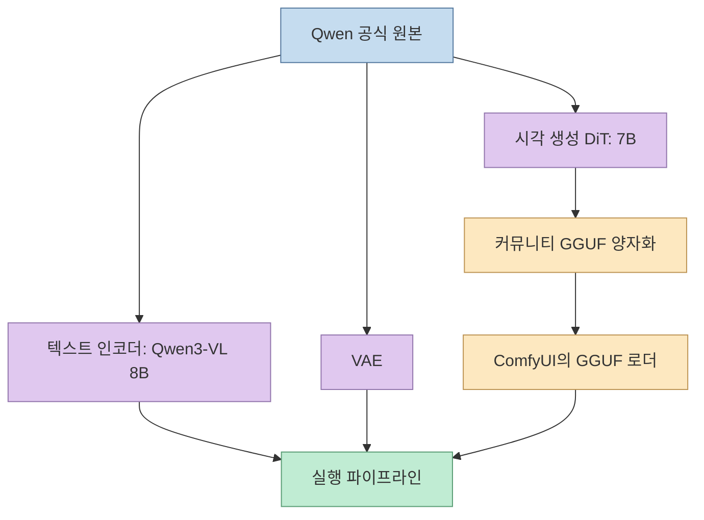
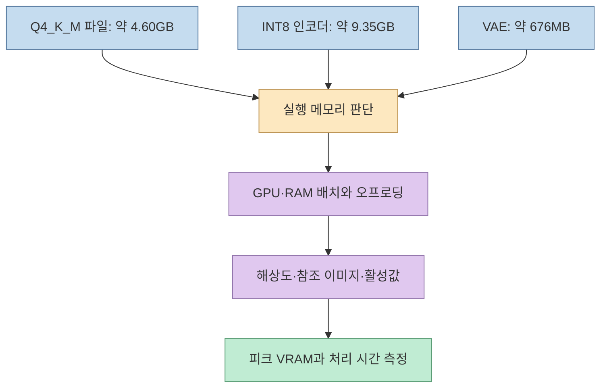
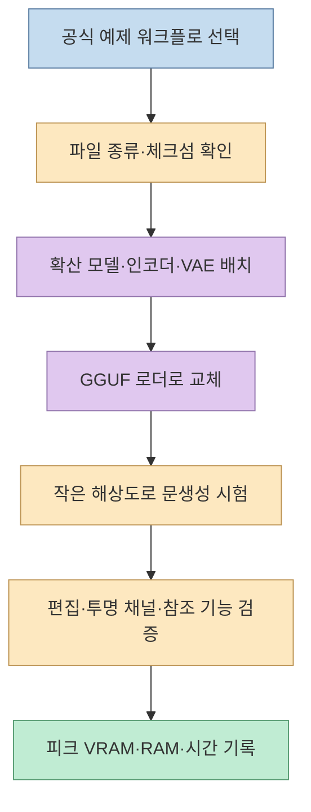
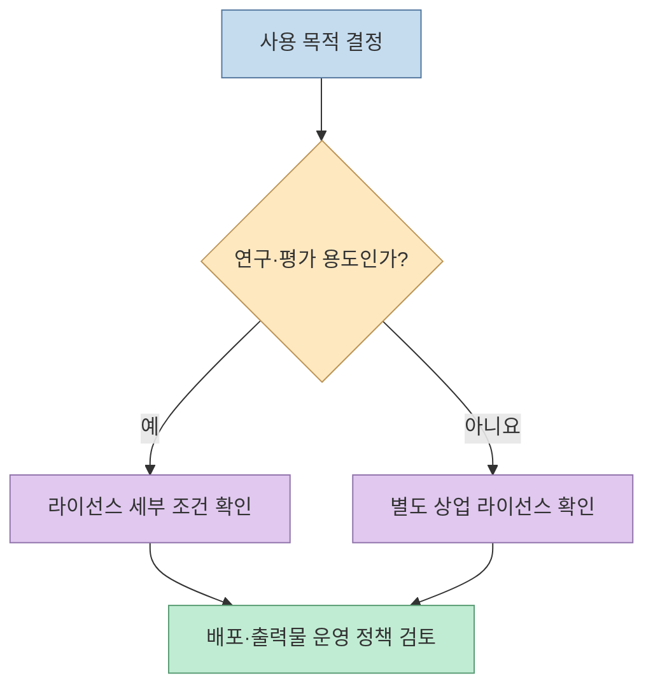

[X 게시글](https://x.com/NFT_Chen/status/2106703506795295198)은 Qwen-Image 2.1의 커뮤니티 GGUF 변형을 소개하며, 4.6GB짜리 Q4_K_M 파일로 6GB GPU에서도 로컬 이미지 생성·편집을 시도할 수 있다고 말한다. 소개된 모델의 기능 자체는 매력적이지만, **파일 크기와 전체 실행 메모리**, **공식 모델의 기능과 커뮤니티 변형의 검증 범위**, **로컬 실행과 사용 허가**는 각각 다른 문제다. 이 글은 그 경계를 공식 저장소와 배포 모델 카드에 맞춰 구분한다.

<!--more-->

## Sources

- [원문 X 게시글](https://x.com/NFT_Chen/status/2106703506795295198) — GGUF 변형, Q4_K_M 용량, 6GB GPU 가능성, ComfyUI 절차와 라이선스에 대한 소개
- [Qwen-Image 2.1 공식 저장소](https://github.com/QwenLM/Qwen-Image-2.1) · [Qwen Research License](https://github.com/QwenLM/Qwen-Image-2.1/blob/main/LICENSE) — 모델 구성, 기능, 사용 조건
- [abenzerps의 커뮤니티 GGUF 모델 카드](https://huggingface.co/abenzerps/Qwen-Image-2.1-Uncensored-GGUF) — 변환 파일, 보조 구성요소, ComfyUI 설정, 배포자의 설명
- [leejet/ComfyUI-GGUF](https://github.com/leejet/ComfyUI-GGUF) — 모델 카드가 권장하는 GGUF 로더 구현

**검증 범위:** 원문의 실행 결과를 같은 GPU에서 재현하거나 생성물의 안전성·품질을 독립 시험한 자료는 없다. 아래에서 "가능하다"와 "보장된다"를 구분하는 이유다. 커뮤니티 모델 카드의 설치 안내는 배포자 설명이며, 공식 Qwen 저장소의 보증으로 읽어서는 안 된다.

## 1. 공식 Qwen-Image 2.1과 커뮤니티 GGUF는 무엇이 다른가

공식 Qwen 저장소는 Qwen-Image 2.1을 이미지 **생성·편집 통합 모델**로 소개한다. 여기서 **7B는 시각 생성용 DiT 구성요소의 규모**다. 전체 파이프라인에는 별도의 **Qwen3-VL 8B 텍스트 인코더**와 **VAE**도 필요하다. 따라서 "7B 모델"이라는 문구를 실행에 필요한 모든 가중치가 7B 규모라는 뜻으로 받아들이면 설치 용량과 메모리를 과소평가하게 된다. [공식 저장소](https://github.com/QwenLM/Qwen-Image-2.1)

공식 문서가 설명하는 기능에는 **RGBA 투명 채널**, **최대 10장의 참조 이미지**, **원·마스크 등을 사용한 국소 편집**과 정체성 보존 지향 편집이 포함된다. 다만 이것은 원본 모델의 지원 범위다. 특정 GGUF 파일과 ComfyUI 워크플로가 해당 기능을 모두 노출하는지, 인물 얼굴을 얼마나 안정적으로 유지하는지는 **그 조합으로 직접 확인해야 한다**. "얼굴 보존"도 실패가 없는 보증이 아니라 모델이 지향하는 편집 특성이다. [공식 저장소](https://github.com/QwenLM/Qwen-Image-2.1)

`abenzerps`의 배포물은 Qwen 공식 릴리스가 아니라, 원본 가중치를 바탕으로 만든 **커뮤니티 GGUF 양자화 파일 모음**이다. 모델 카드에는 일반 양자화 파일과 이름에 `UC`가 붙은 파일이 함께 있다. 어떤 파일을 받았는지 구별하지 않고 저장소 전체를 하나의 "무검열 모델"로 부르는 것은 부정확하다. [커뮤니티 모델 카드](https://huggingface.co/abenzerps/Qwen-Image-2.1-Uncensored-GGUF)

## 2. Q4_K_M 4.6GB는 왜 6GB VRAM 보증이 아닌가

커뮤니티 저장소의 **Q4_K_M GGUF는 약 4.60GB**다. 그러나 이는 **양자화된 확산 모델 파일 하나의 디스크 크기**이지, 전체 파이프라인의 피크 VRAM이 아니다. 같은 배포 페이지에는 **INT8 텍스트 인코더 약 9.35GB**, **BF16 VAE 약 676MB**도 별도로 제시돼 있다. 파일 크기를 단순 합산해 VRAM 사용량을 계산하는 것 역시 틀리다. 로딩 위치가 GPU인지 시스템 RAM인지, 중간 활성값·이미지 해상도·오프로딩·ComfyUI 설정이 무엇인지에 따라 달라지기 때문이다. [커뮤니티 모델 카드](https://huggingface.co/abenzerps/Qwen-Image-2.1-Uncensored-GGUF)

배포자는 GGUF 확산 모델을 GPU VRAM에 두고, 텍스트 인코더는 시스템 RAM과 오프로딩을 활용하는 구성을 안내한다. 메모리 부족 시 `--lowvram`을 제안한다. 이로부터 **6GB 카드로 시도할 여지는 있다**고 해석할 수 있지만, **6GB VRAM만 있으면 모든 작업이 돌아간다**는 성능 보증은 아니다. RAM 용량, 해상도, 참조 이미지 수, 사용 노드에 따라 로드 실패·메모리 부족·느린 생성이 생길 수 있다. "6GB 카드 가능"은 이 게시글과 배포 안내에 근거한 **조건부 주장**이며, 재현 벤치마크로 검증된 보편적 최소 사양은 아니다. [원문](https://x.com/NFT_Chen/status/2106703506795295198), [커뮤니티 모델 카드](https://huggingface.co/abenzerps/Qwen-Image-2.1-Uncensored-GGUF)

## 3. ComfyUI에서 무엇을 바꾸고 검증해야 하나

원문은 ComfyUI를 업데이트하고 GGUF 노드를 설치한 뒤, Q4_K_M 확산 모델·INT8 텍스트 인코더·VAE를 각각 넣으라고 요약한다. 커뮤니티 모델 카드는 GGUF 파일을 `models/diffusion_models/`, 인코더를 `models/text_encoders/`, VAE를 `models/vae/`에 배치하고, 기본 `UNETLoader`를 **`Unet Loader (GGUF)`**로 바꾸도록 안내한다. 텍스트 인코더 로더의 유형은 `qwen_image`로 맞춘다. 모델 카드는 Qwen-Image 2.1 호환성을 위해 [leejet의 ComfyUI-GGUF 포크](https://github.com/leejet/ComfyUI-GGUF)를 권하며, 오래된 다른 포크에서는 아키텍처 인식 오류가 날 수 있다고 경고한다. [커뮤니티 모델 카드](https://huggingface.co/abenzerps/Qwen-Image-2.1-Uncensored-GGUF)

여기서 **로더만 교체하면 모든 편집 기능이 자동 완성되는 것은 아니다**. 먼저 공식 저장소가 안내하는 [ComfyUI 호환 가중치·예제 워크플로](https://github.com/QwenLM/Qwen-Image-2.1)를 기준으로 문생성과 이미지 편집을 구분하고, 양자화 변형을 연결할 때 해당 워크플로가 요구하는 입력 노드와 모델 파일이 맞는지 확인해야 한다. 다운로드한 가중치의 출처와 체크섬도 확인한다. 커뮤니티 저장소는 `SHA256SUMS`를 제공한다. [커뮤니티 모델 카드](https://huggingface.co/abenzerps/Qwen-Image-2.1-Uncensored-GGUF)

## 4. "무검열"과 "데이터가 밖으로 나가지 않는다"의 조건

모델 카드에서 "Uncensored"는 **이 로컬 배포 파이프라인에 내장 안전 검사기·콘텐츠 필터가 없다는 배포자의 설명**이다. 이를 "모델 내부의 모든 안전 관련 성향이 제거됐다", "어떤 프롬프트든 반드시 그대로 나온다"로 확장할 근거는 제시되지 않았다. 실제 출력은 가중치, 프롬프트, 워크플로와 샘플링 설정에 영향을 받는다. 안전 검사가 없다면 사용자는 입력·출력 검토, 초상권·동의, 공개 서비스의 악용 대응을 스스로 설계해야 한다. [커뮤니티 모델 카드](https://huggingface.co/abenzerps/Qwen-Image-2.1-Uncensored-GGUF)

로컬 추론은 이미지를 외부 생성 API에 전송하지 않는 구성을 **가능하게** 한다. 하지만 "로컬"이라는 말만으로 데이터가 절대 밖으로 나가지 않는다고 단정할 수 없다. 연결한 ComfyUI 커스텀 노드, 원격 저장·공유 워크플로, 다운로드와 업데이트 경로가 네트워크를 사용하는지 확인해야 한다. 이는 특정 노드가 정보를 유출한다는 주장이 아니라, **개인정보 보호 여부는 실행 환경까지 포함해 판단해야 한다**는 운영상 추론이다.

## 5. 연구 라이선스는 로컬 실행과 별개다

공식 가중치에는 **Qwen Research License**가 적용되고, 커뮤니티 모델 카드 역시 라이선스를 `qwen-research`로 표시한다. 공식 라이선스는 비상업적 연구·평가 사용을 허용하며, **상업적 이용은 별도 라이선스가 필요하다**고 명시한다. GGUF로 변환하거나 로컬에서 실행한다고 상업적 사용 허가가 새로 생기지 않는다. 팀 내부 평가, 제품 기능 탑재, 고객에게 생성 결과 제공처럼 목적이 달라질 때는 적용 조건을 원문으로 확인해야 한다. [공식 라이선스](https://github.com/QwenLM/Qwen-Image-2.1/blob/main/LICENSE), [커뮤니티 모델 카드](https://huggingface.co/abenzerps/Qwen-Image-2.1-Uncensored-GGUF)

## 실전 적용 포인트

1. **대상을 정확히 기록한다.** 공식 원본인지, 커뮤니티 GGUF인지, 일반 파일인지 `UC` 파일인지와 리비전을 남긴다. 파일 체크섬도 대조한다.
2. **메모리와 성능을 따로 잰다.** 디스크 용량, GPU VRAM, 시스템 RAM, 첫 로딩 시간, 생성 시간을 구분한다. 6GB 카드라면 작은 해상도에서 시작하고 오프로딩·`--lowvram`의 속도 비용을 측정한다.
3. **기능별로 성공을 확인한다.** 문생성 한 장의 성공을 투명 채널·10장 참조·국소 편집까지 검증했다는 뜻으로 해석하지 않는다. 필요한 워크플로마다 결과를 확인한다.
4. **배포 전 조건을 점검한다.** 안전 필터 부재의 운영 책임, 연결 노드의 네트워크 동작, Qwen Research License의 상업 이용 제한을 각각 검토한다.

## 핵심 요약

- **7B는 시각 생성 구성요소의 규모**이며, 텍스트 인코더와 VAE가 별도로 필요하다.
- **Q4_K_M 약 4.60GB는 파일 크기**다. 6GB VRAM에서의 성공 여부는 RAM·오프로딩·해상도·워크플로에 달렸다.
- **"Uncensored"는 배포자가 설명한 내장 필터 부재**를 뜻하며, 모든 출력의 무제한 성공이나 안전성 보증이 아니다.
- **공식 Qwen 기능과 커뮤니티 GGUF의 실제 동작은 구분**해야 한다. 연구 라이선스의 상업 이용 제한도 그대로 확인해야 한다.

## 결론

이 GGUF 변형은 Qwen-Image 2.1을 더 작은 확산 모델 파일로 로컬에서 시험할 경로를 제공한다. 그러나 **4.6GB 다운로드 파일을 전체 실행 비용으로, 로컬 실행을 무제한 사용 허가로 바꾸어 읽어서는 안 된다.** 보조 모델·오프로딩·워크플로·라이선스를 분리해 검증하면 원문의 유용한 설치 힌트를 재현 가능한 선택으로 바꿀 수 있다.
