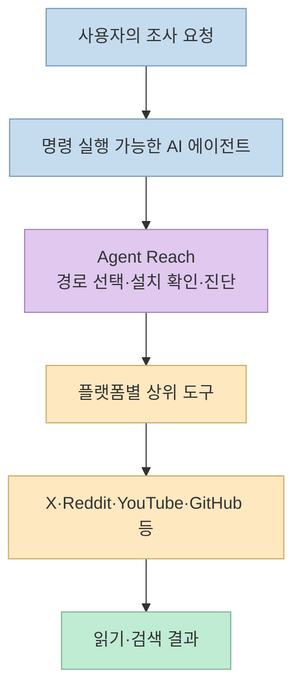
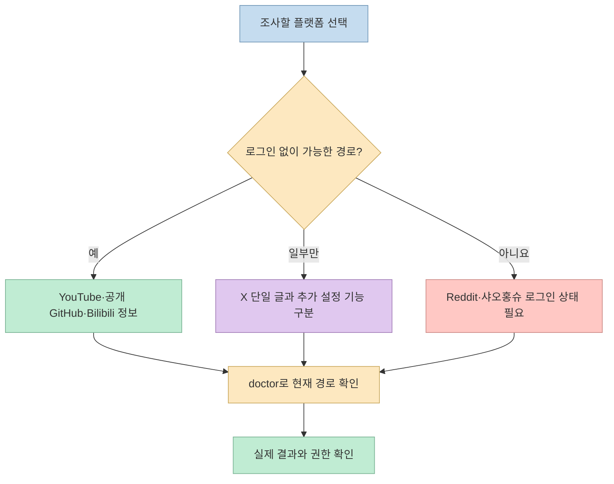
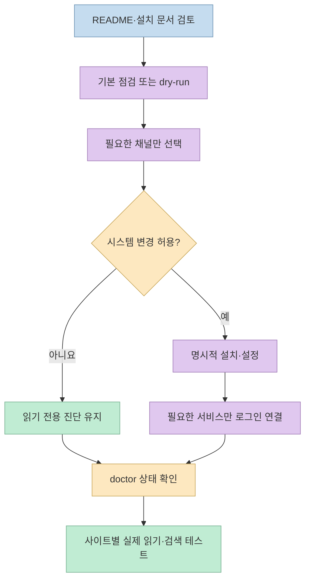

"AI 에이전트에게 인터넷 눈을 달아준다"는 설명은 매력적이다. 공유된 Threads 글은 [Agent Reach](https://github.com/Panniantong/Agent-Reach)가 X, Reddit, YouTube, GitHub, 샤오홍슈, Bilibili를 무료 도구 중심으로 읽고 검색하게 만든다고 소개한다. 핵심 방향은 맞지만, **무료**, **설치 직후 사용 가능**, **로그인 필요**, **항상 접근 가능**은 서로 다른 주장이다. 이번 글에서는 이미 알려진 기능 소개를 반복하기보다, 현재 공식 문서가 실제로 어디에 선을 긋는지 살펴본다.

<!--more-->

## Sources

- [원본 Threads 공유 링크](https://www.threads.com/share/BAD0yJ1dh2/) — [작성자 게시물](https://www.threads.com/@h2smusic/post/DeJjSQak98y)
- [Agent Reach 공식 저장소와 최신 채널 안내](https://github.com/Panniantong/Agent-Reach)
- [Agent Reach 영어 문서](https://github.com/Panniantong/Agent-Reach/blob/main/docs/README_en.md)
- [설치 절차](https://github.com/Panniantong/Agent-Reach/blob/main/docs/install.md)
- [Exa 검색 연동 안내](https://github.com/Panniantong/Agent-Reach/blob/main/agent_reach/guides/setup-exa.md)
- [Exa 공식 MCP 안내](https://exa.ai/mcp)

## Agent Reach가 하는 일: 통합 리더가 아니라 접근 경로 선택

Agent Reach는 모든 사이트를 자체 크롤러 하나로 읽는 서비스가 아니다. 공식 README는 이를 **capability layer**, 즉 플랫폼별로 적절한 상위 도구를 고르고 설치 상태를 점검하며 사용할 경로를 알려주는 계층으로 설명한다. 실제 읽기와 검색은 에이전트가 `yt-dlp`, GitHub CLI, Jina Reader, OpenCLI, `bili-cli` 같은 **상위 도구를 직접 호출**해 수행한다. 플랫폼별로 후보 경로가 여러 개라면 순서대로 검사하고, `agent-reach doctor`로 현재 어떤 경로가 준비됐는지 확인할 수 있다. [공식 설계 설명](https://github.com/Panniantong/Agent-Reach#%E8%AE%BE%E8%AE%A1%E7%90%86%E5%BF%B5).

따라서 "막힌 사이트를 한 번에 뚫는다"는 문구는 **접근 수단의 설치·설정을 줄인다**는 뜻으로 읽어야 한다. 사이트의 로그인 요건, 네트워크 차단, 서비스 정책이나 상위 도구의 장애까지 없애 준다는 보장은 아니다. 이는 [README의 채널별 설정 표](https://github.com/Panniantong/Agent-Reach)에서 바로 확인된다.

## 여섯 플랫폼은 같은 조건으로 동작하지 않는다

공식 README의 현재 지원 범위를 원본 게시물이 언급한 플랫폼에 맞춰 다시 묶으면 다음과 같다. 여기서 **무설정**은 필요한 도구가 준비된 뒤 별도의 사이트 로그인을 요구하지 않는 경로를 뜻하며, 컴퓨터에 필요한 모든 의존성이 처음부터 있다는 뜻은 아니다.

- **YouTube:** `yt-dlp`로 자막 추출과 영상 검색을 다룬다. 별도 사이트 로그인 없이 시작하는 채널로 분류돼 있다. 다만 특정 영상에 자막이 없거나 접근 제한이 있으면 해당 작업의 결과는 달라질 수 있다. [공식 채널 안내](https://github.com/Panniantong/Agent-Reach).
- **GitHub:** 공개 저장소 읽기·검색은 기본 경로이고, 비공개 저장소나 이슈·PR 작성 같은 권한 작업에는 `gh` 인증이 필요하다. 읽기와 쓰기 권한을 같은 "GitHub 지원"으로 묶으면 안 된다. [공식 채널 안내](https://github.com/Panniantong/Agent-Reach).
- **Bilibili:** 현재 기본 경로는 `bili-cli`를 통한 **검색과 영상 정보**다. 자막까지 같은 수준으로 무설정 제공되는 것은 아니며, 공식 문서는 자막을 OpenCLI 경로로 구분한다. `yt-dlp`가 Bilibili에서 차단돼 기본 경로에서 빠졌다는 설명도 있다. [공식 채널 안내](https://github.com/Panniantong/Agent-Reach).
- **X:** 기본적으로 단일 공개 게시물 읽기를 안내하지만, **검색·타임라인·긴 글**은 쿠키 등 추가 설정이 필요하다. 공식 문서는 저장된 X 쿠키가 `doctor`의 구성 검사에 쓰이고, 직접 `twitter` 명령을 실행할 때는 해당 프로세스에 인증 환경변수를 따로 전달해야 한다고 적는다. [공식 README](https://github.com/Panniantong/Agent-Reach).
- **Reddit:** 공식 문서가 **무설정 경로가 없다고 명시**한다. 검색과 본문·댓글을 읽으려면 데스크톱의 브라우저 로그인 세션을 쓰는 OpenCLI 또는 쿠키를 설정한 `rdt-cli`가 필요하다. [공식 README](https://github.com/Panniantong/Agent-Reach).
- **샤오홍슈:** 검색·읽기·댓글은 별도 설정 뒤 가능한 범위다. OpenCLI는 사용자가 이미 관리하는 Chrome 로그인 세션을 이용하며, 다른 경로는 쿠키를 사용자가 직접 내보내 설정해야 한다. Agent Reach가 사용자를 대신 로그인시키거나 기존 브라우저 쿠키를 몰래 읽는 방식으로 설명돼 있지 않다. [공식 README](https://github.com/Panniantong/Agent-Reach).

## "유료 검색 API가 없다"는 말의 정확한 범위

공식 문서는 검색에 **Exa MCP 공개 엔드포인트**를 연동하는 경로를 제시한다. [Agent Reach의 Exa 설정 안내](https://github.com/Panniantong/Agent-Reach/blob/main/agent_reach/guides/setup-exa.md)와 [Exa 공식 MCP 페이지](https://exa.ai/mcp) 모두 이 경로가 API 키 없이 시작할 수 있다고 설명한다. 따라서 **별도 유료 검색 API 키를 구매하지 않고 시작할 수 있다**는 주장은 현재 자료와 맞는다.

하지만 이것이 **모든 사용량·모든 네트워크 환경·모든 상위 서비스가 영구히 무료**라는 보증은 아니다. 공식 README도 서버 환경에서는 프록시 비용이 생길 수 있다고 구분한다. 또 로그인 채널의 인증과 운영 제한은 검색 API 비용과 별개의 문제다. Exa의 일반 [API 요금제](https://exa.ai/pricing)는 무료 크레딧과 사용량 기반 유료 계층을 함께 안내하므로, **API 키를 쓰는 일반 API**와 **키 없이 연결하는 공개 MCP 경로**를 혼동하지 말아야 한다. [Agent Reach README](https://github.com/Panniantong/Agent-Reach), [Exa MCP](https://exa.ai/mcp).

영어 README의 예시 출력에는 "검색을 위해 무료 Exa 키를 등록하라"는 문구도 남아 있어, 같은 저장소의 [현재 Exa 설정 가이드](https://github.com/Panniantong/Agent-Reach/blob/main/agent_reach/guides/setup-exa.md) 및 Exa MCP 페이지와 표현이 어긋난다. 따라서 실제 설치 환경에서는 문장 하나만 믿기보다 `agent-reach doctor` 결과와 현재 MCP 연결 상태를 확인해야 한다. [영어 README](https://github.com/Panniantong/Agent-Reach/blob/main/docs/README_en.md).

## 설치와 계정 연결은 분리해서 승인해야 한다

현재 [공식 설치 문서](https://github.com/Panniantong/Agent-Reach/blob/main/docs/install.md)는 기본 `agent-reach install`을 **환경 점검 중심**으로 설명한다. 외부 시스템 도구 설치나 에이전트 스킬 디렉터리 변경은 `--system`을 명시적으로 주는 단계로 구분한다. `--dry-run`으로 예정 작업을 볼 수 있고, 설치 후 `agent-reach doctor`가 준비 상태를 알려준다. 이는 구버전 안내를 읽고 "설치 명령 한 번으로 모든 도구·로그인이 완료된다"고 기대하는 것보다 안전한 이해다.

쿠키는 계정 권한에 가까운 민감한 정보다. 저장소 자체도 로그인 기반 접근이 계정 제한·차단 위험을 만들 수 있으므로 주 계정보다 별도 계정을 고려하라고 경고한다. "무료 도구"라는 이유로 로그인 정보를 광범위하게 건네거나 서비스 이용 정책을 무시해도 된다는 뜻은 아니다. [공식 보안 안내](https://github.com/Panniantong/Agent-Reach#%E5%AE%89%E5%85%A8%E6%80%A7).

## 실전 적용 포인트

1. **먼저 작업을 구분한다.** "GitHub 공개 저장소 읽기"와 "비공개 이슈 생성", "X 단일 글 읽기"와 "X 전체 검색"은 다른 권한·설정이 필요하다.
2. **무설정 채널부터 확인한다.** YouTube 자막이나 공개 GitHub 저장소처럼 비교적 단순한 경로를 먼저 시험하고, 결과가 필요한 품질인지 확인한다.
3. **`doctor`의 준비 상태를 실제 성공과 구별한다.** 도구가 설치돼 있어도 개별 영상의 자막 부재, 로그인 만료, 차단 등으로 작업이 실패할 수 있다. 이는 채널별 제약에서 도출한 운영상 주의점이다.
4. **로그인 채널은 최소한으로 연다.** Reddit·샤오홍슈·X 검색이 정말 필요한지 결정한 다음, 각 도구가 요구하는 세션과 자격 증명 전달 방식을 읽고 승인한다.

## 핵심 요약

- Agent Reach는 플랫폼 접근을 직접 모두 구현하는 리더가 아니라 **상위 도구의 선택·설치·진단 계층**이다.
- YouTube·공개 GitHub·Bilibili 정보는 비교적 바로 시작하지만, **Reddit과 샤오홍슈는 로그인 경로가 필요**하다. X도 단일 글과 검색·타임라인의 조건이 다르다.
- Exa의 공개 MCP 경로는 현재 API 키 없이 시작할 수 있으나, 이를 모든 채널의 무제한·무조건 무료 보장으로 확대하면 안 된다.
- 기본 설치 점검, 명시적 시스템 변경, 서비스별 계정 연결을 나눠 진행해야 한다.

## 결론

Threads의 "인터넷 눈" 비유는 Agent Reach의 방향을 잘 전하지만, 실제 운영에서는 **사이트마다 다른 접근 권한과 실패 조건**이 핵심이다. 무료라는 말보다 현재 필요한 채널이 무설정으로 가능한지, 어떤 로그인 정보가 쓰이는지, `doctor`와 실제 조회 결과가 일치하는지를 확인하는 편이 실용적이다.
