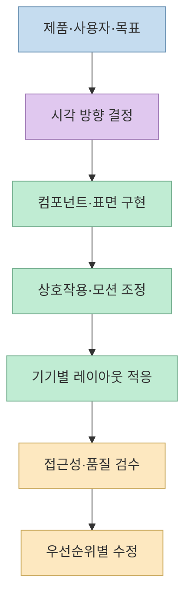
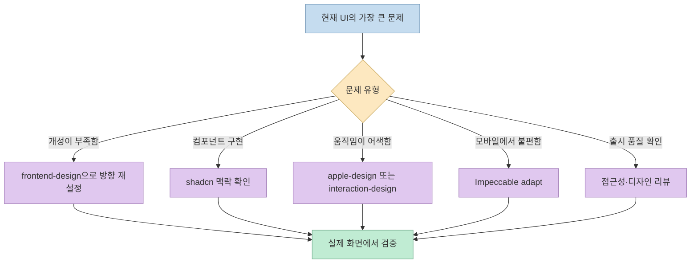

AI로 만든 화면이 자꾸 비슷해 보일 때, 스킬을 많이 설치하는 것보다 **어느 단계의 판단이 부족한지** 먼저 찾는 편이 낫다. Threads 게시물은 UI 제작에 도움이 되는 스킬 10개를 추천한다. 원본 저장소를 확인해 보니 이들은 같은 종류의 도구가 아니다. 화면의 방향을 잡는 지침, 특정 CSS 효과, 컴포넌트 제작 도구, 접근성 점검, 디자인 리뷰가 섞여 있다.

<!--more-->

## Sources

- [원본 Threads 공유 링크](https://www.threads.com/share/BBLdm_7CQl/) — [1~5번 게시물](https://www.threads.com/@vibe.itji/post/DeHl8Y4j6w4), [6~10번 이어지는 게시물](https://www.threads.com/@vibe.itji/post/DeHl8Xtj2Pz)
- [Anthropic `frontend-design`](https://github.com/anthropics/skills/blob/main/skills/frontend-design/SKILL.md)
- [Emil Kowalski `apple-design`](https://github.com/emilkowalski/skills/blob/main/skills/apple-design/SKILL.md), [`emil-design-eng`](https://github.com/emilkowalski/skills/blob/main/skills/emil-design-eng/SKILL.md)
- [MengTo `beautiful-shadows`](https://github.com/MengTo/Skills/blob/main/agent-skills/web-design/beautiful-shadows/SKILL.md)
- [Addy Osmani `accessibility`](https://github.com/addyosmani/web-quality-skills/blob/main/skills/accessibility/SKILL.md)
- [Superfuture `design-review`](https://github.com/Superfuture/design-review/blob/main/design-review/skills/design-review/SKILL.md)
- [shadcn/ui `shadcn`](https://github.com/shadcn-ui/ui/blob/main/skills/shadcn/SKILL.md)
- [Impeccable `/impeccable adapt`](https://github.com/pbakaus/impeccable/blob/main/skill/reference/adapt.md)
- [Jakub Krehel `better-interface`](https://github.com/jakubkrehel/skills/blob/main/skills/better-interface/SKILL.md)
- [wshobson `interaction-design`](https://github.com/wshobson/agents/blob/main/plugins/ui-design/skills/interaction-design/SKILL.md)

## 먼저 분류하기: 취향, 구현, 검수는 다른 문제

게시물의 10개 항목은 "더 좋은 UI"라는 한 가지 목표를 향하지만 개입 지점이 다르다. **시각적 방향**을 정하는 지침은 초기 생성 때, **컴포넌트·그림자·모션** 지침은 구현 중에, **접근성·디자인 리뷰**는 실제 화면이 나온 뒤에 효과적이다. 이 순서는 저장소들이 공유하는 공식 설치 순서가 아니라, 각 스킬의 역할을 바탕으로 정리한 **실무적 적용 순서**다.

## 10개 항목을 원본 저장소와 대조하면

### 시각적 방향과 모션 감각

1. **[`frontend-design`](https://github.com/anthropics/skills/blob/main/skills/frontend-design/SKILL.md) — 화면 전체의 방향.** Anthropic 스킬은 제품의 주제에 맞는 고유한 팔레트·타이포그래피·레이아웃을 의도적으로 선택하라고 안내한다. "남들과 다른 디자인"이라는 막연한 주문을 구체적인 시각 결정으로 바꾸는 데 적합하다. 반면 실행 중인 UI의 접근성 합격을 자동 보증하는 도구는 아니다.
2. **[`apple-design`](https://github.com/emilkowalski/skills/blob/main/skills/apple-design/SKILL.md) — Apple식 상호작용을 웹에 적용하는 지침.** 원본 설명은 제스처, 스프링 애니메이션, 드래그·스와이프, 깊이·반투명 재질, 타이포그래피와 `reduced-motion`까지 다룬다. 게시물의 "Apple식 모션"보다 범위가 넓다. 특정 플랫폼 UI를 그대로 복제하라는 뜻보다는 물리감과 일관된 피드백을 판단하는 기준으로 읽는 편이 정확하다.
3. **[`emil-design-eng`](https://github.com/emilkowalski/skills/blob/main/skills/emil-design-eng/SKILL.md) — 디테일과 디자인 엔지니어링.** `apple-design`과 **같은 저장소**에 있지만 별도 스킬이다. 애니메이션 선택뿐 아니라 컴포넌트 설계와 작은 시각적 판단을 다루는 폭넓은 지침이다. 두 항목을 설치 출처가 다르다고 생각할 필요는 없다. [저장소 README](https://github.com/emilkowalski/skills).
4. **[`interaction-design`](https://github.com/wshobson/agents/blob/main/plugins/ui-design/skills/interaction-design/SKILL.md) — 조작에 대한 피드백.** 마이크로 인터랙션, 로딩 상태, 전환, 드래그·드롭, hover·focus 등을 다룬다. 움직임을 장식이 아니라 **사용자 행동의 결과를 알려주는 신호**로 설계하는 데 초점이 있다.

### 구현과 화면별 적응

5. **[`beautiful-shadows`](https://github.com/MengTo/Skills/blob/main/agent-skills/web-design/beautiful-shadows/SKILL.md) — 좁고 구체적인 CSS 처방.** 카드·팝오버·컨트롤 등에 쓰는 **Tailwind 임의값 그림자 유틸리티**를 제시한다. 게시물의 "그림자"라는 요약은 맞지만, 이 스킬 하나가 전체 디자인 시스템을 만드는 것은 아니다. Tailwind를 쓰지 않는 프로젝트라면 값을 CSS로 옮길지 별도 판단해야 한다.
6. **[`shadcn`](https://github.com/shadcn-ui/ui/blob/main/skills/shadcn/SKILL.md) — 컴포넌트 작업 보조.** `shadcn-ui/ui`는 컴포넌트 프로젝트이고, 그 안에 실제 `skills/shadcn/SKILL.md`가 있다. 스킬은 컴포넌트 검색·추가·수정·스타일링과 `components.json`이 있는 프로젝트 맥락을 다룬다. 따라서 "shadcn 저장소 전체 = 단일 스킬"이라기보다 **라이브러리와 그 작업을 돕는 스킬**을 구분해야 한다.
7. **[`adapt`](https://github.com/pbakaus/impeccable/blob/main/skill/reference/adapt.md) — 화면 크기별 재설계.** 이 항목은 독립된 `adapt/SKILL.md`가 아니다. Impeccable의 **`/impeccable adapt` 명령과 참조 지침**이며, 단순 축소가 아니라 입력 방식·화면 공간·사용 맥락에 맞게 경험을 다시 생각하라고 안내한다. [Impeccable README](https://github.com/pbakaus/impeccable)는 이를 기기별 적응 명령으로 소개한다. 웹 지침과 네이티브 지침의 경계도 따로 둔다.

### 접근성과 리뷰

8. **[`accessibility`](https://github.com/addyosmani/web-quality-skills/blob/main/skills/accessibility/SKILL.md) — 사용 가능성 검증.** WCAG 2.2를 기준으로 키보드 탐색, 스크린리더, 대비 등 접근성 문제를 다룬다. 실행 중인 페이지가 있으면 Lighthouse 같은 실제 측정 근거를 우선하고, 자동 검사와 수동 확인을 구분한다. [프로젝트 README](https://github.com/addyosmani/web-quality-skills)도 측정 점수만으로 접근성을 증명할 수 없다고 설명한다.
9. **[`design-review`](https://github.com/Superfuture/design-review/blob/main/design-review/skills/design-review/SKILL.md) — 출시 전 우선순위 있는 비평.** URL·스크린샷·컴포넌트 파일을 받아 시각적 위계, 글자, 간격, 대비, 모션, 상태, 반응형, 접근성 등을 검토하고 문제의 심각도와 수정안을 제시한다. [저장소 README](https://github.com/Superfuture/design-review)는 무료 스킬과 별도 Pro 티어를 구분하며, 리뷰 시작 시 익명 사용 이벤트를 보내는 동작과 삭제를 통한 비활성화 방법도 명시한다. 설치 전 이런 부가 동작을 확인하는 편이 좋다.
10. **[`better-interface`](https://github.com/jakubkrehel/skills/blob/main/skills/better-interface/SKILL.md) — 여러 관점의 종합 검토.** 접근성·레이아웃·문구·타이포그래피·색·시각 완성도를 각각의 `better-*` 스킬에 맡기고 결과를 하나의 우선순위 있는 판정으로 합친다. 즉, 모든 규칙을 한 문서에 중복해 담은 스킬이 아니라 **다른 전문 스킬을 조율하는 리뷰 스킬**이다.

여기까지의 번호는 역할별 설명을 위해 재배치한 것이다. 원본 게시물의 1~10번 순서는 Sources의 두 Threads 링크에서 확인할 수 있다. **서로 다른 저장소는 아홉 곳**이며, Emil Kowalski 저장소가 두 번 등장한다.

## "10개 모두 설치"보다 충돌을 줄이는 방법

디자인 지침은 서로 중복되거나 충돌할 수 있다. 예컨대 `frontend-design`은 제품만의 개성을 우선하고, `apple-design`은 특정한 모션·재질 철학을 참조한다. `design-review`와 `better-interface`는 둘 다 리뷰를 수행하지만 평가 범위와 진행 방식이 다르다. 이것은 어느 쪽이 우월하다는 뜻이 아니라 **같은 단계에 여러 일반 지침을 한꺼번에 넣으면 무엇을 기준으로 판단할지 흐려질 수 있다**는 실무적 추론이다. [Anthropic 스킬](https://github.com/anthropics/skills/blob/main/skills/frontend-design/SKILL.md), [Emil 스킬](https://github.com/emilkowalski/skills/blob/main/skills/apple-design/SKILL.md), [두 리뷰 스킬](https://github.com/jakubkrehel/skills/blob/main/skills/better-interface/SKILL.md).

**설치 단위도 다르다.** 독립된 `SKILL.md`, 스킬 모음 저장소, 컴포넌트 라이브러리 내부 스킬, Impeccable의 명령이 섞여 있으므로 동일한 설치 명령을 열 항목에 일괄 적용해서는 안 된다. 각 저장소 README와 실제 파일 경로를 확인하고 필요한 항목만 선택해야 한다. 이 글은 스킬을 소개·검증하는 글이지, 저장소에 스킬을 설치하거나 실행한 기록이 아니다.

## 실전 적용 포인트

1. **문제 한 가지를 적는다.** "AI 티가 난다"보다 "모든 화면이 같은 카드·그림자·간격을 쓴다"처럼 관찰 가능한 현상을 정한다.
2. **처음에는 한 단계당 하나만 고른다.** 방향 설정용 하나, 구현용 하나, 최종 리뷰용 하나부터 시작하면 피드백의 출처가 분명하다.
3. **완성된 화면에서 확인한다.** 키보드 탐색, 작은 화면, 글자 잘림, 로딩·오류 상태까지 확인해야 스킬의 제안이 실제 품질로 이어졌는지 알 수 있다.
4. **설치 전 코드를 검토한다.** 특히 외부 스킬의 셸 명령, 네트워크 호출, 의존성, 상용 기능과 라이선스는 README와 스킬 본문을 확인한다. `design-review`의 사용 이벤트나 Impeccable의 설치 구조처럼 이름만 봐서는 드러나지 않는 조건이 있다. [design-review README](https://github.com/Superfuture/design-review), [Impeccable README](https://github.com/pbakaus/impeccable).

## 핵심 요약

- Threads의 10개 추천은 실제로 **시각 방향·구현·반응형·접근성·리뷰**에 걸친 서로 다른 도구다.
- `shadcn`은 컴포넌트 프로젝트 속 스킬이고, `adapt`는 Impeccable의 명령·참조 지침이다.
- Emil Kowalski의 두 스킬은 같은 저장소에서 제공되므로, 목록의 저장소는 10개가 아닌 9개다.
- 많이 설치하는 것보다 현재 UI의 병목에 맞게 선택하고, 실제 화면에서 검증하는 것이 중요하다.

## 결론

AI UI의 획일성을 줄이려면 스킬 이름을 수집하는 데서 끝나면 안 된다. **제품의 정체성을 먼저 정의하고, 필요한 부분을 구현한 뒤, 접근성과 디자인을 실제 화면에서 검수하는 순서**가 더 유용하다. 이 10개는 그 과정에서 선택할 수 있는 도구 상자이지, 한꺼번에 적용할 정답 목록은 아니다.
