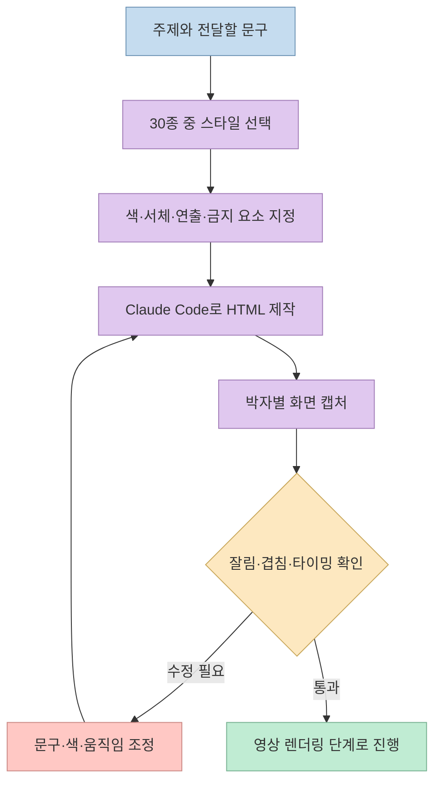
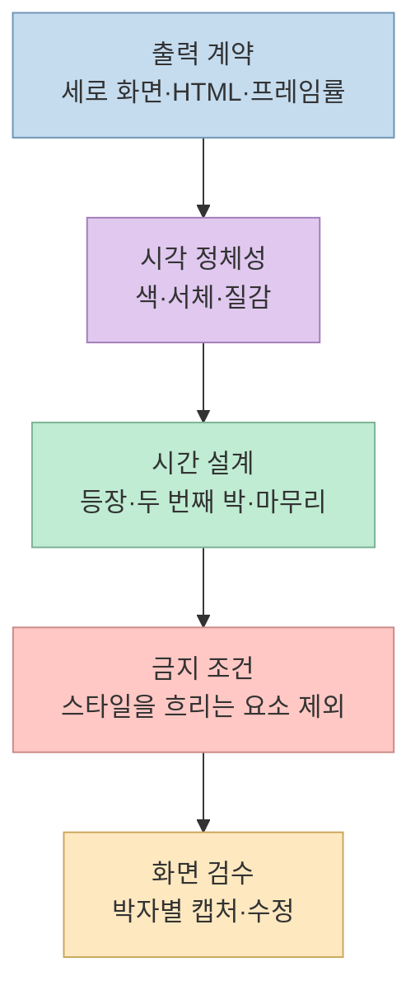
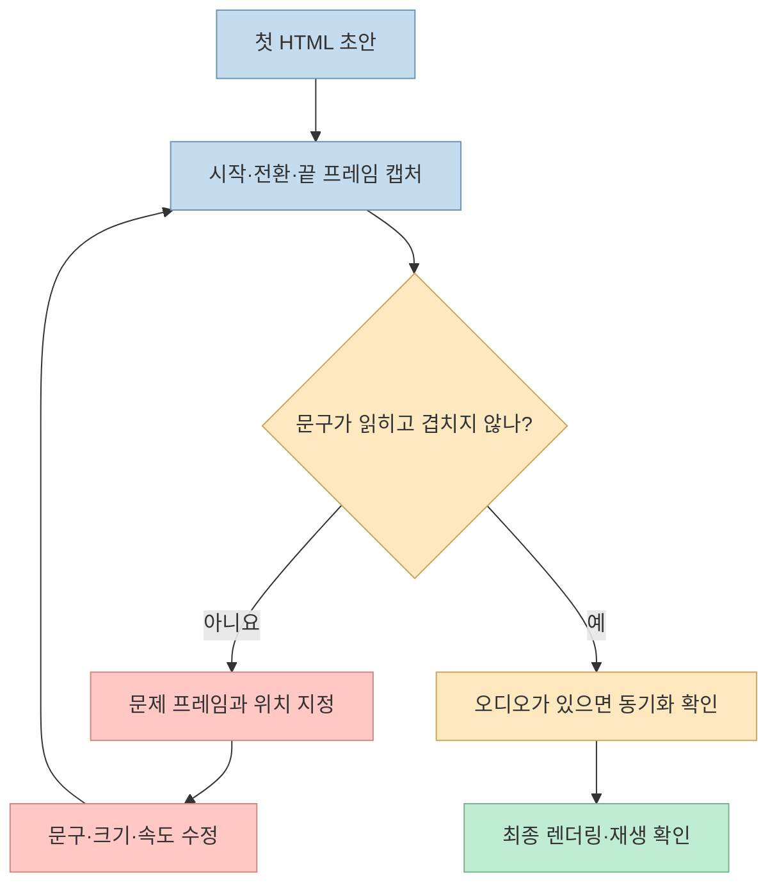

Threads 작성자 [@rneayan_official](https://www.threads.com/@rneayan_official/post/DeJJYcRDZqi)은 **Claude Code로 제작한 41초 모션그래픽 영상**과 스타일별 프롬프트 30개를 공개했다. 네온·수묵·클레이 3D·8비트처럼 결과의 인상이 크게 다른 스타일들이지만, 프롬프트를 뜯어보면 공통적인 제작 계약이 있다. 화면 규격을 고정하고, 색·서체·움직임·금지 요소를 분리하며, 박자마다 화면을 확인하라는 것이다.

<!--more-->

## Sources

- [원본 Threads 공유 링크](https://www.threads.com/share/_k6Pm8yZR/) — [작성자 원문](https://www.threads.com/@rneayan_official/post/DeJJYcRDZqi)
- [작성자의 사용 안내](https://www.threads.com/@rneayan_official/post/DeJKeVxEujN)
- [스타일 프롬프트 01~30: 첫 게시물](https://www.threads.com/@rneayan_official/post/DeJKe09EmIg) — 각 스타일 항목에서 해당 원문으로 연결

## 무엇이 공개됐고, 무엇은 확인되지 않았나

작성자는 After Effects 없이 Claude Code로 코드를 작성해 41초 영상을 만들었고, 여러 차례 수정하며 품질을 다듬었다고 설명한다. 이어지는 게시물에는 **01/30부터 30/30까지 프롬프트가 실제로 모두 게시돼 있다.** 다만 공개된 문장만으로는 최종 영상의 코드 저장소, 프레임 렌더러, 오디오 동기화 방식, 인코딩 명령, 제작 시간을 재현할 수 없다. 따라서 이 글은 **공개 프롬프트의 설계와 활용법**을 분석하지, 41초 영상의 전체 제작 파이프라인이 검증됐다고 주장하지 않는다. [원문](https://www.threads.com/@rneayan_official/post/DeJJYcRDZqi), [사용 안내](https://www.threads.com/@rneayan_official/post/DeJKeVxEujN).

작성자의 안내는 간단하다. 원하는 스타일을 고르고 `{주제}`를 자신의 내용으로 바꾼 뒤 Claude Code에 넣는다. 나온 결과의 문구·색·움직임을 다시 다듬고, 잘림·겹침이 있으면 구체적으로 짚어 수정한다. **27번 오디오 웨이브폼에는 실제 음원도 함께 제공하라**고 별도로 명시한다. [작성자 안내](https://www.threads.com/@rneayan_official/post/DeJKeVxEujN).



위 도식의 마지막 **영상 렌더링**은 코드 화면을 영상 파일로 만들 때 필요한 후속 작업이라는 실무적 추론이다. 공개 프롬프트 자체가 특정 렌더링 도구를 지정하지는 않는다.

## 30종 스타일을 용도별로 고르기

아래 분류는 선택을 쉽게 하기 위한 **이 글의 재구성**이다. 스타일명, 추천 용도와 핵심 시각 요소는 작성자의 개별 프롬프트를 바탕으로 압축했다. 전체 문구는 각 링크에서 확인할 수 있다.

### 타이포그래피·편집 디자인

1. [**키네틱 타이포그래피**](https://www.threads.com/@rneayan_official/post/DeJKe09EmIg): 광고 첫 장면과 가사 영상용. 화면을 채우는 짧은 문구가 서로 반대 방향에서 들어온다.
2. [**스위스 그리드**](https://www.threads.com/@rneayan_official/post/DeJKfqSkr6G): 기업·리포트용. 12단 그리드, 좌측 정렬 제목, 빨간 원 등 제한된 편집 요소가 핵심이다.
3. [**브루탈리즘**](https://www.threads.com/@rneayan_official/post/DeJKsiAku2K): 패션·아트·웹 런칭용. 커다란 제목을 페이드 없이 놓고 강한 대비의 세로 띠와 링크 형태를 쓴다.
4. [**구성주의 포스터**](https://www.threads.com/@rneayan_official/post/DeJK3wBEk0R): 캠페인·선언용. 대각선의 붉은 띠, 굵은 구호와 원형 몽타주가 중심이다.
5. [**필름 그레인 에디토리얼**](https://www.threads.com/@rneayan_official/post/DeJK4fZEmpG): 잡지·전시·브랜드 필름용. 큰 세리프 글자, 가는 편집선과 필름 질감을 결합한다.

### 발광·복고·디지털 인터페이스

6. [**네온사인**](https://www.threads.com/@rneayan_official/post/DeJKgr3kgYW): 공연·야간 이벤트용. 튜브 글자가 단계적으로 켜지고 빛 번짐과 바닥 반사를 더한다.
7. [**글리치 VHS**](https://www.threads.com/@rneayan_official/post/DeJKinOEvj8): 테크·게임·힙합용. RGB 채널 분리와 스캔라인을 쓰되, 큰 찢김은 박자 순간에 집중한다.
8. [**아스키 터미널**](https://www.threads.com/@rneayan_official/post/DeJKkbNElNj): 개발자 제품·AI 도구용. 문자로 그린 회전 도넛, 타이핑되는 명령과 제목이 주인공이다.
9. [**신스웨이브**](https://www.threads.com/@rneayan_official/post/DeJKoNqEsWX): 레트로 게임·전자음악용. 줄무늬 태양과 원근 그리드, 크롬 제목을 조합한다.
10. [**LED 도트 매트릭스**](https://www.threads.com/@rneayan_official/post/DeJKptWksxM): 스포츠·교통·카운트다운용. 켜진 점과 꺼진 점을 함께 드러내는 전광판 표현이다.
11. [**Y2K 크롬**](https://www.threads.com/@rneayan_official/post/DeJKtcSEpe8): 뷰티·패션·K-POP용. 금속 글자와 링에 반사광을 움직여 2000년대 감성을 낸다.
12. [**레트로 OS**](https://www.threads.com/@rneayan_official/post/DeJKxW1kl2P): 서비스 업데이트·밈 광고용. 창, 진행 막대와 알림창을 화면 전개 요소로 쓴다.
13. [**스플릿 플랩**](https://www.threads.com/@rneayan_official/post/DeJKzPlkmvt): 여행·항공·발표 공개용. 출발 안내판의 글자판이 차례로 넘어가 최종 문구에 멈춘다.

### 손맛·인쇄·아날로그 질감

14. [**멤피스**](https://www.threads.com/@rneayan_official/post/DeJKjexEqzT): 키즈·패션·팝업용. 단순 도형과 외곽선·하드섀도를 가진 스티커 같은 제목이 움직인다.
15. [**코믹 하프톤**](https://www.threads.com/@rneayan_official/post/DeJKlTukn0x): 예능·이벤트용. 만화 패널, 망점, 집중선과 말풍선을 박자에 맞춰 전환한다.
16. [**리소그래프**](https://www.threads.com/@rneayan_official/post/DeJKnKHEseq): 독립 출판·전시용. 색판이 조금 어긋난 인쇄 질감과 입자감을 활용한다.
17. [**페이퍼 크래프트**](https://www.threads.com/@rneayan_official/post/DeJKo_Bkolv): 친환경·키즈·여행용. 그림자 있는 여러 겹의 종이 능선과 오려 붙인 글자가 등장한다.
18. [**손그림 두들**](https://www.threads.com/@rneayan_official/post/DeJKqqUkgc9): 강의·튜토리얼용. 떨리는 낙서선과 손글씨, 동그라미·화살표·형광펜 표시를 사용한다.
19. [**수묵 붓터치**](https://www.threads.com/@rneayan_official/post/DeJKyTqktBN): 전통문화·차·한식용. 마른 붓의 갈라짐, 번진 산과 붉은 낙관을 중심에 둔다.
20. [**컷아웃 콜라주**](https://www.threads.com/@rneayan_official/post/DeJK0VmkgBg): 매거진·인디 음악용. 찢긴 종이와 각기 다른 글자 조각을 붙여 화면을 구성한다.
21. [**노티컬 차트**](https://www.threads.com/@rneayan_official/post/DeJK5MhEk1x): 여행·탐험·연혁용. 해도 눈금, 등고선, 나침반과 점선 항로로 이야기를 진행한다.

### 공간·재질·형태 변형

22. [**바우하우스**](https://www.threads.com/@rneayan_official/post/DeJKhqYEsNV): 전시·디자인 행사용. 기하학 타일의 회전과 재배치가 주요 움직임이다.
23. [**8비트 픽셀**](https://www.threads.com/@rneayan_official/post/DeJKrfXklV9): 게임·레벨업용. 저해상도 장면을 보간 없이 확대하고 블록·코인 같은 요소를 움직인다.
24. [**옵아트**](https://www.threads.com/@rneayan_official/post/DeJKve0Ev4E): 전시·뮤직비디오용. 동심원 줄무늬를 파형처럼 흔들어 착시를 만든다.
25. [**클레이 3D**](https://www.threads.com/@rneayan_official/post/DeJKwX_Ekdy): 친근한 앱·키즈 광고용. 말랑한 공·캡슐·도넛의 낙하와 찌그러짐을 표현한다.
26. [**아이소메트릭**](https://www.threads.com/@rneayan_official/post/DeJK2OokmEC): 도시·물류·서비스 구조 설명용. 등각 바닥 위 건물과 나무가 순서대로 솟는다.

### 정보·기능 중심 표현

27. [**블루프린트**](https://www.threads.com/@rneayan_official/post/DeJKmLykhzH): 제품 구조·공정 소개용. 모눈 위 도면 선과 치수 표시, 표제란으로 기술적인 인상을 만든다.
28. [**플랫 인포그래픽**](https://www.threads.com/@rneayan_official/post/DeJKulpkpOj): 데이터·IR·뉴스용. 숫자 증가, 막대·도넛 차트와 요약 카드를 단계적으로 보여준다.
29. [**글래스모피즘**](https://www.threads.com/@rneayan_official/post/DeJK1IKEu2N): 앱·SaaS 소개용. 흐릿한 유리 카드와 진행 표시, 뒤를 지나가는 구체로 깊이를 만든다.
30. [**오디오 웨이브폼**](https://www.threads.com/@rneayan_official/post/DeJK3DFEvQQ): 음악·팟캐스트용. 실제 음원의 주파수 대역값을 읽어 원형 막대를 움직이는 구상이며, 임의의 가짜 파형은 피하도록 적혀 있다.

30종은 화면 효과의 카탈로그라기보다 **콘텐츠에 어울리는 시각 문법을 고르는 메뉴**로 보는 편이 유용하다. 예를 들어 앱 기능 설명에 수묵을 고를 수도 있지만, 카드·수치·상태 변화가 중요한 내용이라면 인포그래픽이나 글래스모피즘이 메시지를 더 직접적으로 전달할 수 있다. 이는 스타일의 우열이 아니라 전달 목표에 관한 판단이다.

## 프롬프트의 공통 구조: 미학과 검사 조건을 함께 적는다

작성자가 공개한 30개 항목은 대부분 **HTML 한 파일, 1080×1920, 30fps**라는 동일한 출력 조건을 사용한다. 그 위에 스타일명, 추천 용도, 색상, 서체, 연출과 "피할 것"을 붙인다. 마지막에는 등장 동작을 장면 앞쪽 35% 이내에 마치고, 박자마다 스크린샷을 확인해 잘림·겹침을 수정하라는 검수 요청이 반복된다. [01번 프롬프트](https://www.threads.com/@rneayan_official/post/DeJKe09EmIg), [27번 프롬프트](https://www.threads.com/@rneayan_official/post/DeJK3DFEvQQ), [30번 프롬프트](https://www.threads.com/@rneayan_official/post/DeJK5MhEk1x).



여기서 **30fps는 프롬프트가 요구하는 목표 출력 사양**이지, 공개된 41초 영상의 실제 인코딩 정보를 별도로 검증했다는 뜻은 아니다. 마찬가지로 "박자마다 캡처"는 품질 관리 요청이며, Claude Code가 어떤 브라우저·스크린샷 도구를 사용했는지는 게시물만으로 알 수 없다.

아래는 공개 패턴을 바탕으로 **이 글에서 재구성한 짧은 템플릿**이다. 원문의 30개 프롬프트를 그대로 복제한 것은 아니다.

```text
주제: {한 문장으로 설명할 내용}
형식: 세로 화면 1080×1920, 30fps를 목표로 하는 단일 HTML
선택 스타일: {30종 중 하나}
핵심 문구: {화면에 반드시 보일 짧은 문장}
색과 서체: {스타일에 맞는 제한된 팔레트와 글꼴}
동작 순서: 첫 박의 등장 → 두 번째 박의 변화 → 읽을 시간 확보
피할 것: {해당 스타일을 망치는 요소}
검수: 주요 박자의 화면을 캡처해 글자 잘림·겹침·대비를 확인하고 수정
추가 입력: 오디오 반응형이라면 실제 음원 파일 제공
```

## 왜 한 번에 끝내지 않고 반복 수정해야 하나

모션그래픽은 정지 화면이 예쁘더라도 **움직이는 중간 프레임에서 글자가 겹치거나**, 모바일에서 너무 빨리 지나가면 실패한다. 원문 작성자도 결과가 한 번에 나오지 않았고 여러 차례 수정했다고 적었다. 30개 프롬프트가 색과 연출뿐 아니라 금지 조건·박자별 화면 검사를 반복하는 이유를 여기서 읽을 수 있다. 이 해석은 프롬프트의 공통 패턴에서 도출한 것이다. [원문](https://www.threads.com/@rneayan_official/post/DeJJYcRDZqi), [작성자 안내](https://www.threads.com/@rneayan_official/post/DeJKeVxEujN).



오디오 웨이브폼은 특히 구분해야 한다. 화면에 그럴듯한 막대를 **무작위로 흔드는 것**과 **실제 음원 데이터를 반영하는 것**은 다른 구현이다. 27번 프롬프트는 음원 대역값을 읽으라고 요구하고, 작성자도 음원을 함께 넣으라고 강조한다. 음원이 없다면 원본 설계의 핵심 조건을 만족했는지 확인할 수 없다. [27번 프롬프트](https://www.threads.com/@rneayan_official/post/DeJK3DFEvQQ), [작성자 안내](https://www.threads.com/@rneayan_official/post/DeJKeVxEujN).

## 실전 적용 포인트

1. **목적을 먼저 정한다.** 후킹에는 키네틱 타이포그래피, 수치 설명에는 플랫 인포그래픽처럼 내용과 스타일을 연결한다.
2. **스타일 하나만 먼저 시험한다.** 30개를 한꺼번에 합치기보다 동일한 문구로 2~3개 후보를 비교한 뒤 선택한다. 이는 이 글의 실무 제안이다.
3. **수정 요청은 프레임 기준으로 쓴다.** "더 멋지게"보다 "두 번째 박에서 제목 하단이 카드와 겹친다"가 고치기 쉽다. 작성자의 캡처·겹침 점검 요청을 구체화한 방법이다.
4. **완성 영상과 프롬프트를 혼동하지 않는다.** 게시물은 좋은 출발점이지만, 영상 파일을 만드는 렌더링·인코딩 절차까지 제공하지는 않는다.

## 핵심 요약

- 작성자는 Claude Code로 만든 41초 모션그래픽을 소개하고 **스타일별 프롬프트 30개를 실제로 공개**했다.
- 공통 틀은 단일 HTML·세로 1080×1920·30fps 목표와 색·서체·연출·금지 요소·박자별 화면 검수다.
- 30종은 타이포그래피, 디지털 UI, 아날로그 질감, 공간 표현, 정보 전달 등 목적에 따라 고를 수 있다.
- 실제 영상의 전체 렌더링 파이프라인과 재현성은 게시물만으로 확인할 수 없다.

## 결론

이 자료의 실용성은 "30개 스타일 이름" 자체보다 **미학적 지시와 검수 조건을 한 프롬프트에 함께 넣었다는 점**에 있다. 원하는 스타일을 하나 골라 자신의 메시지로 바꾸고, 움직이는 각 시점의 화면을 확인하며 수정하는 방식으로 활용하는 것이 좋다.
