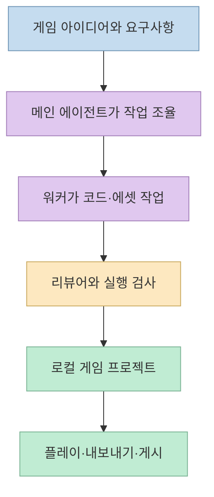
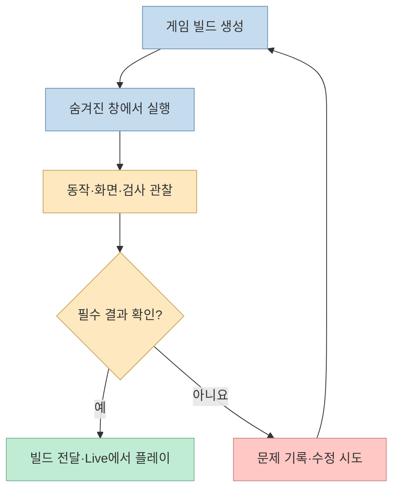
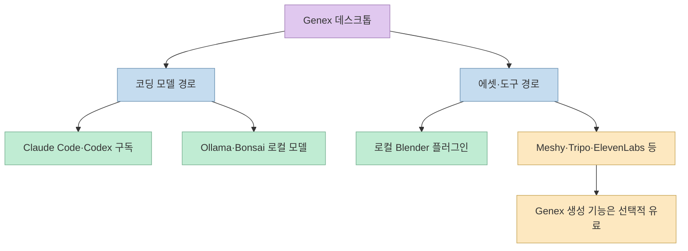
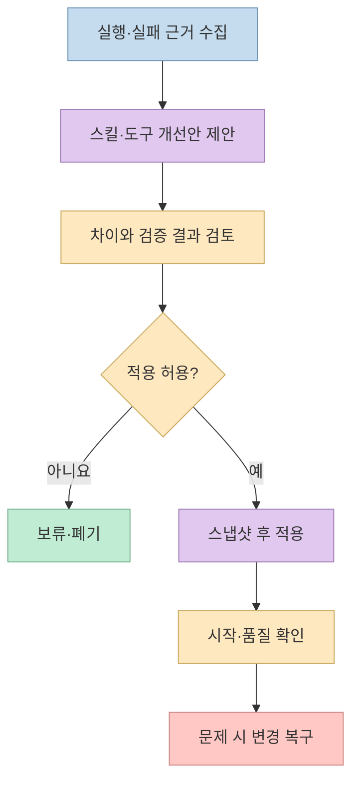

게임 개발용 AI 에이전트 앱 **Genex**가 공개됐다. 자연어로 게임을 설명하면 에이전트가 코드와 에셋을 만들고, 실행 결과를 확인하며 수정하는 흐름을 한 앱에 묶는다. 다만 소개 글의 인상과 실제 지원 범위는 구분해야 한다. 지금 바로 만들 수 있는 것은 주로 **브라우저에서 실행되는 Three.js 게임**이고, 다른 엔진 지원과 에이전트의 자기 개선에는 각각 별도의 조건이 있다.

<!--more-->

## Sources

- [원본 Threads 게시물](https://www.threads.com/share/_nZz4RmtS/) — [작성자 게시물](https://www.threads.com/@choi.openai/post/DeJhUltiP4G)
- [Genex 데스크톱 공식 소개](https://genex.games/desktop)
- [Genex 데스크톱 GitHub 저장소](https://github.com/genex-games/genex-desktop)
- [빌드와 실시간 게임 화면 문서](https://github.com/genex-games/genex-desktop/blob/dev/docs/product/builds-live.md)
- [에셋과 플러그인 문서](https://github.com/genex-games/genex-desktop/blob/dev/docs/product/assets-plugins.md)
- [학습과 개선 문서](https://github.com/genex-games/genex-desktop/blob/dev/docs/product/studio-learning.md)

## 무엇을 공개했나: 에디터보다 게임 제작 워크플로

Genex는 MIT 라이선스로 공개된 데스크톱 앱이다. 사용자가 게임 또는 변경 사항을 설명하면 메인 에이전트가 작업을 이끌고, 필요할 때 여러 워커와 리뷰어가 역할을 나눈다. 결과물은 앱 안에만 남는 대화가 아니라 **로컬의 실제 게임 프로젝트**다. 앱은 이를 실행해 확인하고 정적 웹 번들로 내보내거나 Genex를 통해 게시할 수 있다고 설명한다. [공식 소개](https://genex.games/desktop)와 [제품 개요 문서](https://github.com/genex-games/genex-desktop/blob/dev/docs/agent/context.md)가 공통으로 설명하는 범위다.

앱에는 게임별 대화, 플레이 가능한 **Live** 화면, 작업 과정을 보여주는 **Builds**, 생성 파일을 살펴보는 **Assets** 영역이 있다. 빌드가 끝났다는 것과 실제로 실행·검증됐다는 것을 별개 상태로 표시한다. 따라서 "에이전트가 완료했다고 말했다"는 이유만으로 게임이 플레이 가능하다고 간주하지 않는 설계다. [빌드와 Live 문서](https://github.com/genex-games/genex-desktop/blob/dev/docs/product/builds-live.md)는 워커 완료, 검사 통과, 통합, Live 반영을 서로 다른 사실로 다룬다.

## 플레이테스트와 되돌리기는 어떻게 다를까

원문은 결과를 플레이테스트한 뒤 유지하거나 되돌린다고 소개한다. 공식 구현 문서에 따르면 에이전트는 사용자에게 보이는 Live 화면이 아니라 **숨겨진 게임 창**에서 게임을 테스트한다. 워커 화면과 동작, 리뷰어가 본 노트, 실행 검사와 실패도 빌드 화면에 남는다. 사용자는 기존 빌드를 다시 열거나 새 빌드를 Live로 가져올 수 있다. 이는 단순 스크린샷 평가를 넘어 실행 중인 게임을 관찰하는 흐름이지만, 자동 검사가 모든 재미·조작성 문제를 검증한다는 뜻은 아니다. [빌드와 Live 문서](https://github.com/genex-games/genex-desktop/blob/dev/docs/product/builds-live.md)가 말하는 검증 범위에 맞춰 이해해야 한다.

여기서 **게임 작업의 되돌리기**와 **에이전트 자체의 개선을 되돌리기**는 다른 기능이다. 제품 문서는 전자에 대해 체크포인트·이전 빌드·되감기 흐름을 설명한다. 후자는 아래의 실험적 자기 개선 기능에서 스냅샷과 복구를 사용한다. 둘을 하나의 자동 롤백 기능으로 뭉뚱그리면 실제 동작을 오해하기 쉽다. [빌드 문서](https://github.com/genex-games/genex-desktop/blob/dev/docs/product/builds-live.md), [공식 FAQ](https://genex.games/desktop).

## 코딩 모델과 에셋 제작 도구를 분리해서 보기

코드 작성에는 기존 **Claude Code 구독**, **ChatGPT 구독을 사용하는 Codex**, 또는 Ollama·Bonsai를 통한 로컬 모델을 선택할 수 있다. 계획·제작·평가 작업마다 모델을 선택하는 방식이다. 공식 FAQ가 말하는 "API 키 불필요"는 Claude Code와 Codex의 **기존 로그인으로 코딩 모델을 쓰는 경로**에 관한 설명이다. 각 서비스의 구독 사용 한도는 그대로 적용되고, 앱이 한도를 넘었을 때 유료 API 호출로 자동 전환하지도 않는다고 한다. [공식 FAQ](https://genex.games/desktop), [GitHub README](https://github.com/genex-games/genex-desktop).

에셋 제작은 별도다. 설치된 Blender를 쓰는 로컬 플러그인과 Meshy·Tripo·ElevenLabs 등 외부 도구를 연결하는 Genex 도구 라우터가 소개돼 있다. 게임을 빌드·미리보기·내보내는 데 플러그인이 필수는 아니지만, **Genex 플러그인을 통한 선택적 에셋 생성은 유료**다. "앱이 MIT 오픈소스"라는 사실이 모든 외부 생성 서비스와 생성 비용까지 무료라는 의미는 아니다. [공식 소개](https://genex.games/desktop), [에셋·플러그인 문서](https://github.com/genex-games/genex-desktop/blob/dev/docs/product/assets-plugins.md).

플러그인 설치 시에는 게시자와 기능 권한을 확인해야 한다. 공식 문서는 플러그인 프로세스를 분리하더라도 **네이티브 코드를 완전하게 샌드박싱하지는 않는다**고 명시한다. 따라서 커뮤니티 플러그인은 출처·요청 권한·외부 전송 범위를 확인하고 설치하는 편이 안전하다. [플러그인 권한 문서](https://github.com/genex-games/genex-desktop/blob/dev/docs/product/assets-plugins.md).

## 실패 기록으로 에이전트가 바뀌는 조건

Genex의 차별점으로 제시된 자기 개선은 "모든 실패가 자동으로 다음 버전의 능력이 된다"는 단순한 구조가 아니다. 공식 소개는 도구·스킬·프롬프트를 Git 저장소에서 수정하고, 변경 전 스냅샷을 만들며, 블라인드 평가와 시작 실패 시 복구를 거치는 **실험적 기능**이라고 설명한다. 기본적으로 사용자가 켜기 전까지 비활성이라고 명시한다. [공식 FAQ](https://genex.games/desktop).

제품 내부 문서는 한 단계 더 구분한다. **학습 기록과 제안 생성은 기본적으로 켜져 있지만**, 제안의 **자동 적용은 새 설치에서 꺼져 있다**. 사용자는 제안을 검토해 적용·폐기하거나 개별 변경을 되돌릴 수 있다. 학습 횟수는 게임 품질 향상을 입증하는 지표가 아니며, 코드 변경은 먼저 복사본에서 타입 검사와 시작 검사를 받는다. 따라서 "기록한다 → 제안한다 → 검증한다 → 사람이 적용하거나 자동 적용을 허용한다"가 더 정확한 이해다. [Studio와 학습 문서](https://github.com/genex-games/genex-desktop/blob/dev/docs/product/studio-learning.md).

## 지금 지원하는 플랫폼과 엔진

공식 저장소의 다운로드 안내는 **macOS Apple Silicon**과 **Linux x64**를 제공하고, Windows는 "곧 제공"이라고 적는다. 현재 게임 제작 대상은 브라우저에서 실행하는 **Three.js**다. Unity·Unreal 플러그인은 준비 중이라고 안내한다. 원본 Threads는 Roblox Studio·Godot도 거론하지만, 확인한 [공식 제품 페이지](https://genex.games/desktop)와 [데스크톱 저장소 README](https://github.com/genex-games/genex-desktop)에서는 그 두 엔진의 제공 시점이나 구체적 지원 범위를 확인할 수 없었다. 따라서 이들을 지금 사용 가능한 기능으로 소개해서는 안 된다.

## 실전 적용 포인트

1. **작은 Three.js 프로토타입으로 시작한다.** 조작, 승패 조건, 화면에 보여야 할 요소를 짧고 관찰 가능한 조건으로 적으면 빌드 평가 결과를 확인하기 쉽다. 이는 현재 공식 지원 범위를 기준으로 한 적용 제안이다.
2. **코딩 비용과 에셋 비용을 따로 확인한다.** 구독 로그인 경로는 별도 API 키가 필요 없지만 플랜 사용 한도가 있고, 선택적 Genex 에셋 생성에는 비용이 들 수 있다. [공식 FAQ](https://genex.games/desktop).
3. **Live 화면에서 직접 플레이한다.** 에이전트의 검사 통과와 실제 재미·조작성 평가는 다르다. 빌드 이력과 실패 노트를 검토한 다음 사람이 주요 플레이 경로를 확인하는 것이 안전하다. [빌드 문서](https://github.com/genex-games/genex-desktop/blob/dev/docs/product/builds-live.md).
4. **자기 개선과 플러그인은 점진적으로 켠다.** 먼저 제안과 변경 차이를 검토하고, 자동 적용과 커뮤니티 네이티브 플러그인에는 별도 신뢰 판단을 둔다. [학습 문서](https://github.com/genex-games/genex-desktop/blob/dev/docs/product/studio-learning.md), [플러그인 문서](https://github.com/genex-games/genex-desktop/blob/dev/docs/product/assets-plugins.md).

## 핵심 요약

- Genex는 로컬 브라우저 게임 프로젝트를 만드는 MIT 라이선스 데스크톱 앱이다.
- 메인 에이전트·워커·리뷰어가 제작과 실행 검사를 나누고, 빌드 완료와 실제 검증을 구분한다.
- Claude Code·Codex 구독 또는 로컬 모델을 쓸 수 있지만, 선택적 에셋 생성 비용은 별개다.
- 자기 개선은 제안·검증·복구 절차를 가지며, 자동 적용은 기본값이 아니다.
- 현재 중심 대상은 Three.js이며, 다른 엔진 지원은 공식 발표와 실제 릴리스를 따로 확인해야 한다.

## 결론

Genex에서 주목할 부분은 "프롬프트로 게임 생성" 자체보다 **제작, 실행 관찰, 검증, 수정 이력을 하나의 워크플로로 연결한 점**이다. 다만 실제 프로젝트에 쓰기 전에는 현재 엔진 범위, 구독 한도, 외부 에셋 비용, 플러그인 권한, 자동 개선의 적용 조건을 나눠 확인해야 한다.
