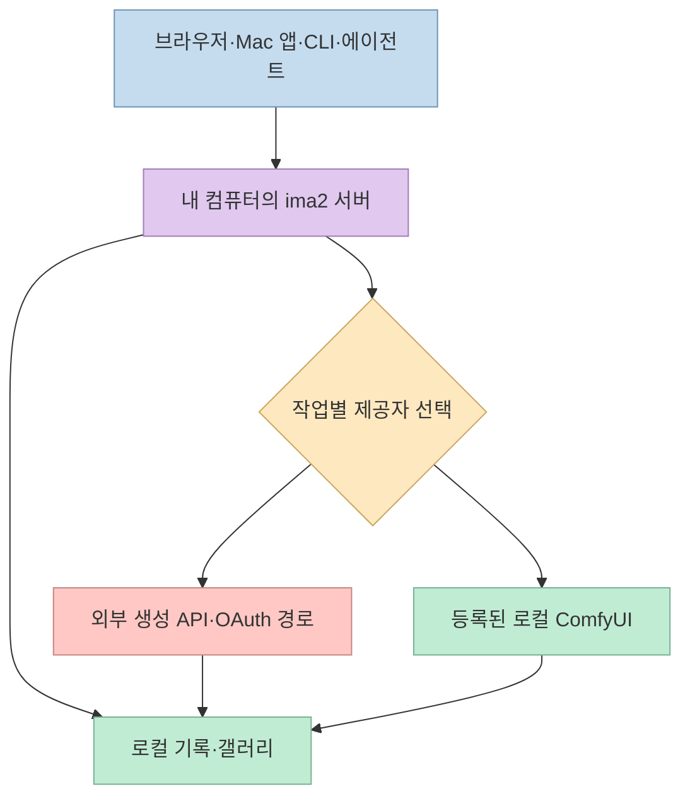
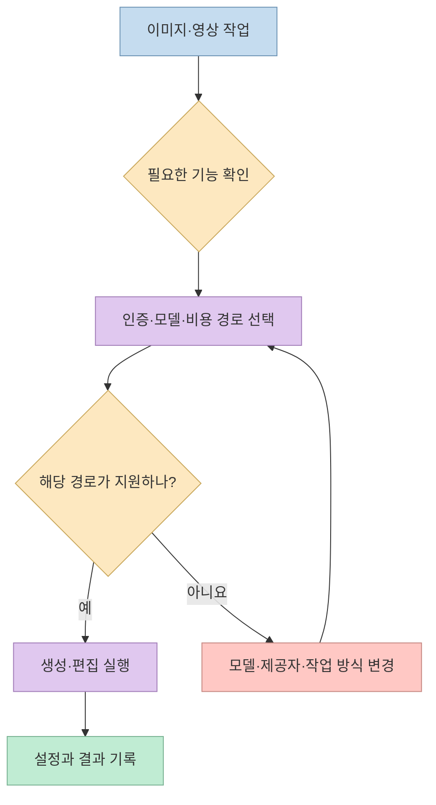
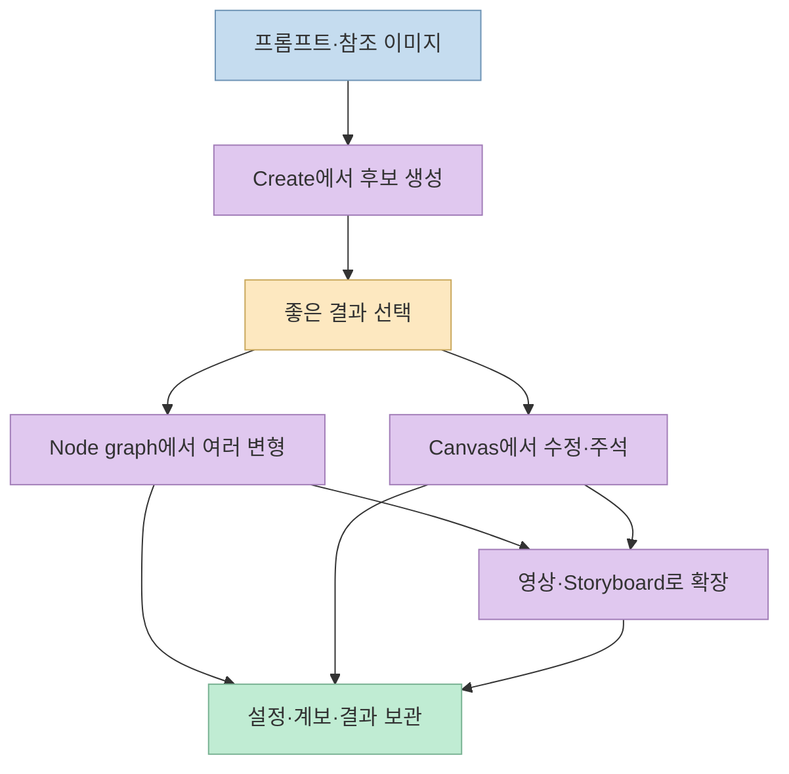

이미지 생성 서비스마다 프롬프트와 결과물이 흩어지면, 좋은 시안을 찾은 다음 다른 모델로 변형하거나 영상으로 이어가기 어렵다. [ima2-gen](https://github.com/lidge-ai/ima2-gen)은 이 과정을 한곳에 모으는 **로컬 우선 시각 생성 스튜디오**다. 브라우저·Mac 앱·CLI에서 같은 작업 공간을 사용하고, 생성 기록을 남기며, 코딩 에이전트에도 이미지·영상 작업을 맡길 수 있다. 다만 **로컬에서 실행되는 스튜디오**와 **로컬에서만 실행되는 생성 모델**은 다르다.

<!--more-->

## Sources

- [ima2-gen 공식 GitHub 저장소](https://github.com/lidge-ai/ima2-gen)
- [공식 CLI 문서](https://github.com/lidge-ai/ima2-gen/blob/main/docs/CLI.md)
- [공식 라이선스](https://github.com/lidge-ai/ima2-gen/blob/main/LICENSE)

## 로컬 우선의 의미: 작업 공간은 내 컴퓨터, 생성은 선택한 경로

공식 README는 ima2-gen을 **로컬 서버와 스튜디오**로 설명한다. 서버가 실행되는 컴퓨터의 `~/.ima2/generated`에 결과물을 저장하고, 세션별 갤러리와 프롬프트·설정·생성 시간을 연결한다. 브라우저 UI 외에도 CLI와 Apple Silicon용 Mac 앱에서 같은 서버를 이용한다. 즉 여러 제공자의 웹사이트를 오가며 파일을 수동으로 모으는 대신, 작업 이력을 한 로컬 작업 공간에서 추적하려는 설계다. [공식 README](https://github.com/lidge-ai/ima2-gen).

그러나 이미지 생성 요청은 **선택한 제공자에게 전송**된다. GPT OAuth·OpenAI API·xAI·Gemini·NovelAI처럼 외부 서비스를 고르면 프롬프트와 참조 이미지가 해당 경로로 간다. 반대로 등록된 ComfyUI 워크플로를 로컬에서 실행하는 경우에는 로컬 모델 경로가 된다. README의 표현도 "프롬프트와 참조는 각 작업에서 고른 제공자에게만 간다"는 취지다. 따라서 **로컬 우선은 무조건 오프라인이라는 뜻이 아니다.** [공식 README의 데이터 경계와 제공자 목록](https://github.com/lidge-ai/ima2-gen).



## 하나의 화면에 모였어도 제공자 기능은 같지 않다

README의 제공자 표에는 GPT OAuth, OpenAI API, Grok OAuth·API, Gemini API, Antigravity CLI, NovelAI, ComfyUI, AtlasCloud, MiniMax 등이 나온다. Runway와 Higgsfield는 기본 생성 경로에 섞인 것이 아니라 **별도 MCP 연동**으로 설명한다. 모든 경로가 이미지·영상·마스크 편집을 똑같이 지원하는 것도 아니다. 예를 들어 문서는 NovelAI 경로를 텍스트→이미지로 한정하고 참조 이미지·편집·마스크 요청은 조용히 무시하지 않고 거절한다고 적는다. Grok과 등록된 ComfyUI 워크플로에는 영상 경로가 있다. [공식 제공자·모델 안내](https://github.com/lidge-ai/ima2-gen).

이 차이를 감추지 않는 것이 중요하다. 사용자는 **모델 이름뿐 아니라 인증 방식과 작업 종류**를 함께 골라야 한다. README에 따르면 GPT OAuth는 ChatGPT 로그인 경로를, OpenAI API는 별도 API 키를 사용한다. API 키가 필요한 작업을 OAuth 로그인만으로 동일하게 처리할 수 있다고 가정하면 안 된다. 또 Grok OAuth 이미지·영상 요청은 프로젝트가 직접 **문서화되지 않은 xAI 경로**라고 경고한다. 장기 자동화에는 변경 위험을 고려하고, 공식 API 키 경로가 필요한지 검토해야 한다. [제공자별 세부 설명](https://github.com/lidge-ai/ima2-gen).



## 생성 결과를 다음 작업으로 잇는 세 가지 방식

**Create·Node graph·Canvas Mode**는 단순히 화면만 다른 것이 아니다. Create에서는 프롬프트와 참조 이미지를 입력하고 모델을 선택해 후보를 만든다. Node graph에서는 괜찮은 결과를 부모 노드로 삼아 여러 방향으로 분기한다. 분기마다 부모와 설정을 기록하므로 원본을 덮어쓰지 않고 변형을 비교할 수 있다. Canvas Mode에서는 주석·지우개·배경 제거 같은 편집을 하고, 다시 참조 이미지로 활용한다. README는 캔버스 버전을 일반 갤러리와 분리해 보관하며 재열기와 후속 참조를 지원한다고 설명한다. [작업 모드 설명](https://github.com/lidge-ai/ima2-gen).

영상은 텍스트→영상, 이미지→영상, 여러 참조 이미지를 이용하는 경로를 제공한다. Storyboard 모드는 장면 사이의 캐릭터·환경 조건을 유지하도록 키프레임을 구성하는 작업 흐름으로 소개된다. 이는 **일관성을 보조하는 기능 설명**이지, 모든 영상 결과에서 동일한 인물이 완벽하게 보존된다는 독립 검증 결과는 아니다. [영상·Storyboard 설명](https://github.com/lidge-ai/ima2-gen).



README는 코딩 에이전트용 **Core·Frontend·UI/UX Design 스킬**도 제공한다. `ima2 skill`과 `ima2 skill front`, `ima2 skill uiux`로 작업별 참고 지침을 볼 수 있다. 이는 에이전트가 이미지 생성 명령과 디자인 절차를 읽을 수 있게 한 구성이지, 설치만으로 에이전트가 사용자 계정의 모든 제공자를 자동으로 사용할 수 있다는 뜻은 아니다. [Agent skills 안내](https://github.com/lidge-ai/ima2-gen).

## CLI는 생성 대상을 명시하게 한다

CLI를 쓰려면 서버를 실행하고 모델·제공자 상태를 확인한 뒤 이미지와 영상의 기본 대상을 각각 지정할 수 있다. 다음은 README에 나온 기본 흐름을 간추린 예다. 선택한 경로의 인증이 먼저 준비돼 있어야 실제 생성이 가능하다. [Quick start와 CLI 문서](https://github.com/lidge-ai/ima2-gen), [CLI 전체 안내](https://github.com/lidge-ai/ima2-gen/blob/main/docs/CLI.md).

```bash
npm install -g ima2-gen
ima2 setup
ima2 serve

ima2 models
ima2 defaults set image oauth/gpt-6-luna
ima2 gen "a clean product photo of a red guitar pedal"
```

README에 따르면 `ima2 gen`과 생성 모드의 `ima2 video`는 **저장된 기본 대상이나 명시적인 `--model`·`--provider`가 없으면** `NO_DEFAULT_MODEL`로 실패한다. 새 버전에서 모델·과금 경로가 몰래 바뀌지 않도록 한 안전장치다. 이는 모든 명령에 기본값이 전혀 없다는 뜻은 아니다. UI·서버에는 각 경로의 기본 모델과 설정이 별도로 설명돼 있다. 자동화 스크립트에서는 `--model <lane>/<model>`을 명시하면 어떤 경로로 생성하는지 더 선명해진다. [CLI 모델 선택 규칙](https://github.com/lidge-ai/ima2-gen).

설치 형태도 구분해야 한다. 공식 문서는 **Apple Silicon용 서명·공증된 Mac 앱**을 배포하며, Windows·Linux·Intel Mac은 npm 또는 설치 스크립트 경로를 안내한다. 웹 서버의 기본 주소는 `127.0.0.1:3333`이고, 포트가 이미 사용 중이면 `ima2 serve`가 다음 사용 가능한 포트를 택해 `~/.ima2/server.json`에 기록한다. CLI의 `ima2 open`은 그 주소를 찾는다. [설치와 설정 안내](https://github.com/lidge-ai/ima2-gen).

## 개인정보·비용·호환성의 경계

로컬 갤러리를 쓴다고 해서 **입력 자료가 외부로 전혀 나가지 않는 것은 아니다.** 외부 제공자를 선택하면 요청에 포함된 프롬프트와 참조 이미지가 그 제공자에게 간다. 민감한 원본을 다룰 때는 **작업마다 선택한 경로**를 확인하고, 서비스의 보관·이용 정책을 별도로 검토해야 한다. ComfyUI처럼 로컬 경로를 선택할 수 있지만, 그 경로의 모델과 워크플로를 직접 준비해야 한다. [공식 데이터 경계](https://github.com/lidge-ai/ima2-gen).

또한 ima2-gen의 [MIT 라이선스](https://github.com/lidge-ai/ima2-gen/blob/main/LICENSE)는 **이 프로그램의 코드**에 대한 것이다. 외부 생성 서비스의 요금, 계정 권한, 출력물 이용 조건까지 MIT로 통일하는 것은 아니다. 제공자 목록과 모델 ID도 빠르게 바뀔 수 있으므로 사용 전 `ima2 models`로 현재 연결 상태와 기능을 확인하는 편이 안전하다. README는 참조 이미지가 너무 크면 업로드 전에 압축한다고 명시하므로, 원본과 정확히 같은 바이트가 제공자에게 전달된다고 가정해서도 안 된다. [제공자·참조 이미지 안내](https://github.com/lidge-ai/ima2-gen).

## 실전 적용 포인트

1. **먼저 작업 유형을 정한다.** 정지 이미지, 편집, 마스크, 영상, 로컬 ComfyUI 중 필요한 기능을 고른 뒤 해당 제공자가 실제로 지원하는지 확인한다.
2. **민감도에 따라 경로를 고른다.** 외부 API·OAuth 경로라면 프롬프트와 참조 자료의 전송을 전제하고, 완전한 로컬 처리가 필요하면 등록된 로컬 워크플로를 검토한다.
3. **자동화에는 모델을 고정한다.** `ima2 models`로 준비 상태를 확인한 뒤 `--model <lane>/<model>` 또는 이미지·영상별 기본 대상을 명시한다.
4. **좋은 시안의 계보를 보존한다.** Create에서 후보를 고르고 Node graph로 분기한 뒤 Canvas에서 수정하며, 후속 영상의 참조로 연결한다.
5. **결과물 검수와 권리 확인은 별도다.** 저장된 설정과 계보는 재현을 돕지만 품질 보증이나 제공자별 라이선스 검토를 대신하지 않는다.

## 핵심 요약

- ima2-gen은 로컬 서버·갤러리에 여러 이미지·영상 제공자를 연결하는 작업 공간이다.
- "로컬 우선"은 **모든 모델의 오프라인 실행**을 뜻하지 않는다. 프롬프트와 참조 이미지는 선택한 외부 제공자에게 전달될 수 있다.
- Create, Node graph, Canvas Mode, Storyboard가 생성→분기→수정→영상화 흐름을 이룬다.
- CLI 생성 명령은 기본 대상이나 명시적 모델·제공자가 없으면 실패하도록 설계돼 있다.
- MIT 라이선스는 ima2-gen 코드에 대한 것이며 외부 모델·서비스 조건은 별도로 확인해야 한다.

## 결론

ima2-gen의 가치는 "최고의 모델 하나"보다 **여러 생성 경로를 선택하고 결과물의 맥락을 잃지 않게 하는 작업 흐름**에 있다. 사용 전에 작업별 기능·인증·데이터 전송·비용 경계를 구분하면, 브라우저에서 시작한 시안을 에이전트와 CLI, 그래프와 캔버스를 거쳐 영상까지 이어가는 데 활용할 수 있다.
