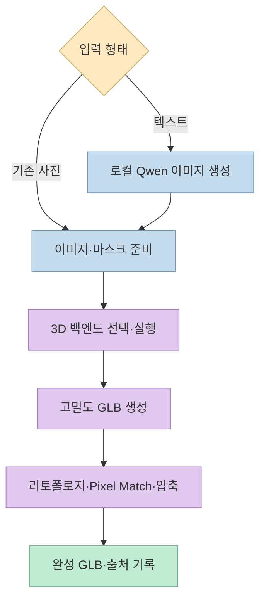
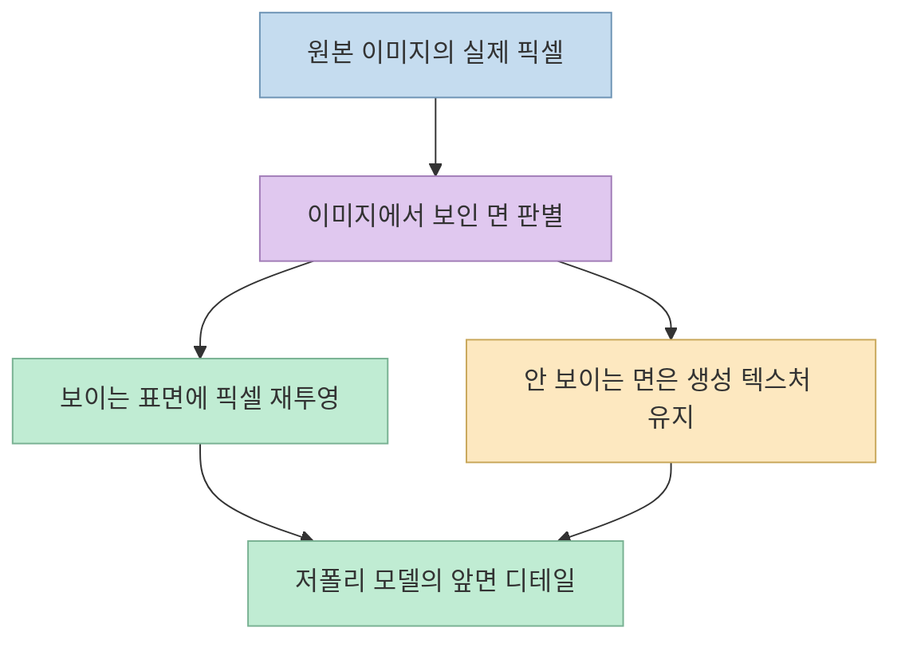
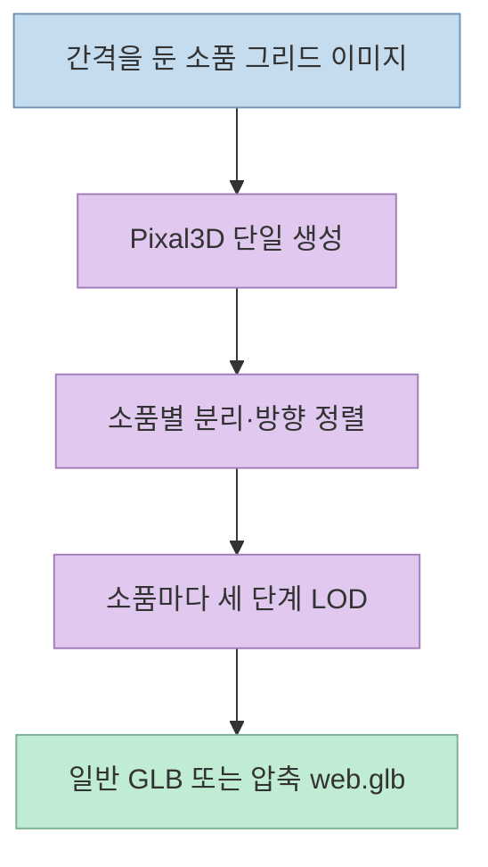

사진 한 장으로 게임용 3D 에셋을 만들되 클라우드 업로드는 피하고 싶다면 [Image to 3D Lab](https://github.com/Bingeljell/image-to-3dlab)이 흥미로운 선택지다. Threads 소개처럼 Apple Silicon Mac이나 NVIDIA GPU가 있는 Linux에서 이미지→텍스처가 있는 `.glb` 모델을 만드는 **로컬 워크벤치**다. 다만 "사진이나 텍스트만 넣으면 바로 게임에 쓰는 3D"라는 인상보다 실제 파이프라인은 길고, **백엔드·후처리·모델 라이선스별 조건**도 다르다.

<!--more-->

## Sources

- [원본 Threads 공유 링크](https://www.threads.com/share/BAaUdBmytp/) — [작성자 게시물](https://www.threads.com/@aiwire_kr/post/DeIFfbzk89F)
- [Image to 3D Lab 공식 저장소](https://github.com/Bingeljell/image-to-3dlab)
- [프롭 시트 제작과 LOD 문서](https://github.com/Bingeljell/image-to-3dlab/blob/main/docs/prop-sheets.md)
- [백엔드와 라이선스 출처 문서](https://github.com/Bingeljell/image-to-3dlab/blob/main/docs/info_and_credits.md)
- [Tencent Hunyuan3D-2.1 공식 라이선스](https://huggingface.co/tencent/Hunyuan3D-2.1/blob/main/LICENSE)

## 무엇을 로컬에서 처리하나

프로젝트는 이미지 한 장을 입력받아 여러 생성 백엔드 중 하나로 3D 메시와 텍스처를 만들고, 웹 뷰어 또는 CLI에서 확인·후처리·내보내는 도구다. 공식 README는 로컬 PC에서 작업할 때 입력 이미지가 클라우드 서비스로 업로드되지 않는다고 설명한다. 설치 프로그램 자체는 모델 가중치를 모두 한꺼번에 받지 않는다. 사용자가 **Setup & Status**에서 필요한 백엔드를 고르면 크기와 라이선스를 보여주고 다운로드를 요청한다. [공식 README](https://github.com/Bingeljell/image-to-3dlab).

**텍스트→3D**는 텍스트로 곧바로 메시를 생성한다는 뜻이 아니다. 이미지가 없다면 **Generate Image 탭**에서 Qwen-Image 2.1로 로컬 원본 이미지를 만든 뒤, 그 이미지를 **Generate 3D**에 넘기는 두 단계다. 따라서 텍스트 입력 경로의 결과에는 이미지 생성 모델의 조건도 추가된다. 저장소는 Qwen 이미지 모델의 상업적 사용 조건이 모호하다고 별도로 경고하며, 사용자는 해당 모델 라이선스를 직접 검토해야 한다고 적는다. [공식 README](https://github.com/Bingeljell/image-to-3dlab).

저장소의 "로컬" 설명은 **자기 컴퓨터에서 백엔드를 실행하는 사용 방식**을 기준으로 이해해야 한다. README는 RunPod 같은 원격 GPU 환경의 접속 방법도 안내하므로, 그런 구성에서는 네트워크를 통해 원격 머신에 파일을 전달하는지 별도로 확인해야 한다. 이는 배포 형태를 구분한 해석이지, 기본 로컬 실행에서 업로드가 일어난다는 주장이 아니다. [설치 안내](https://github.com/Bingeljell/image-to-3dlab).

## 네 가지 모델 이름, 실제로는 여섯 가지 백엔드 경로

원본 Threads는 Pixal3D·TRELLIS.2·Hunyuan3D·Stable Fast 3D라는 **모델 계열 네 가지**를 열거한다. 공식 README의 선택 목록은 Hunyuan3D 구현 경로를 세 가지로 나누어 **총 여섯 백엔드 경로**를 설명한다. 따라서 "네 가지"와 "여섯 가지"는 서로 모순이라기보다 **계열과 실행 경로의 계산 단위가 다른 것**이다. [백엔드 안내](https://github.com/Bingeljell/image-to-3dlab).

- **Pixal3D:** Mac·NVIDIA 환경에서 실행한다. 저장소가 기본 시작점으로 권장하고, 평평한 색과 선명한 외형을 한 번에 내는 데 강점이 있다고 설명한다. 가중치 다운로드는 약 8.4GB로 안내한다.
- **Hunyuan3D-MLX:** Mac용 로컬 포트에 두 가지 조합이 있다. 저장소에 포함된 Xiong 전체 파이프라인과, 별도 코드 준비가 필요한 dgrauet 형상 + Xiong 페인트 조합이다.
- **Hunyuan3D-2.1:** Linux+NVIDIA 경로이며, 공식 README는 24GB 이상 GPU 메모리와 CUDA 도구를 안내한다. 이 NVIDIA 경로는 README에 **실제 하드웨어 테스트가 아직 충분하지 않다**고 적혀 있다.
- **TRELLIS.2:** Mac과 Linux+NVIDIA 경로가 있으나 무거운 모델 다운로드·초기 설치가 필요하다. DINOv3 인코더 접근도 별도 승인 대상이다. Linux+NVIDIA 경로는 README에서 새 경로로 표시하고 실제 하드웨어 테스트의 한계를 밝힌다.
- **Stable Fast 3D:** Mac 경로로 소개되며 속도는 빠르지만 상대적으로 충실도가 낮다고 저장소가 평가한다. 가중치 접근과 별도 라이선스 수락이 필요하다.

위 성능·품질 평가는 **프로젝트 작성자의 설명**이다. 모든 플랫폼에서 같은 장면을 독립적으로 비교한 벤치마크로 확대해서는 안 된다. Windows는 설치 스크립트가 있지만 제한적으로 시험한 상태이며, 각 백엔드가 Windows에서 동일하게 지원된다는 뜻은 아니다. [백엔드 표와 요구사항](https://github.com/Bingeljell/image-to-3dlab).

## Pixel Match가 선명하게 만드는 범위

일반적인 이미지→3D 과정은 원본 그림의 글자·로고·얼굴을 모델이 다시 그리면서 흐리게 만들 수 있다. **Pixel Match**는 Finish 단계에서 **원본 이미지에서 보이는 표면**에 원본 픽셀을 다시 투영한다. 이를 통해 면 수를 대략 **5천 수준**으로 줄인 결과에서도 앞면 글자·로고의 시각적 충실도를 유지하려는 기능이다. 다만 원본에서 보이지 않는 뒷면까지 복원하는 것은 아니며, 그 표면에는 생성 백엔드의 텍스처가 남는다. [Finish 설명](https://github.com/Bingeljell/image-to-3dlab).

또한 현재 **Pixal3D로 Lab 안에서 만든 모델에 기본 적용**되며, 다른 백엔드로 확대하는 것은 README에서 앞으로의 작업으로 적혀 있다. 따라서 "어떤 백엔드든 모든 면의 텍스트가 보존된다"고 이해하면 잘못이다. CLI에서는 카메라 뷰 정보(`.svviews`)를 넘기거나 별도 `photo_paint.py` 경로를 사용할 수 있다고 문서가 설명한다. [공식 README](https://github.com/Bingeljell/image-to-3dlab).

## 한 장의 그리드에서 여러 게임 프롭으로

**Prop sheets**는 한 이미지에 여러 소품을 격자로 배치하고 **Pixal3D 한 번의 생성**으로 모두 3D화한 뒤, **Props 탭**에서 소품별 모델로 분리하는 기능이다. 공식 예시는 3×3 그리드의 소품 아홉 개지만, 핵심은 "그리드 하나를 개별 프롭으로 나눈다"는 파이프라인이다. 각 출력에는 이름과 바닥 중심 원점을 붙이고, **5,000·2,500·1,000 삼각형**의 세 LOD를 만든다고 문서화돼 있다. [프롭 시트 문서](https://github.com/Bingeljell/image-to-3dlab/blob/main/docs/prop-sheets.md).

압축 `.web.glb`는 선택적 `gltfpack`을 사용하며, 대상 엔진이 `EXT_meshopt_compression`과 `EXT_texture_webp`를 읽을 수 있는지 확인해야 한다. 또한 아홉 개가 생성 실행 한 번을 공유하므로 **각 소품에 한 번씩 생성할 때보다 디테일이 낮을 수 있고**, 서로 맞닿은 소품은 분리 실패 가능성이 있다. 주인공 캐릭터처럼 세부 묘사가 중요한 대상은 독립 생성이 더 적합하다고 문서가 권한다. [프롭 시트 제한 사항](https://github.com/Bingeljell/image-to-3dlab/blob/main/docs/prop-sheets.md).

## Apache-2.0은 앱 코드의 라이선스다

원본 Threads의 "Apache-2.0"은 **이 저장소 자체의 코드**를 가리킨다. 공식 README는 백엔드 가중치와 이미지 인코더, 이미지 생성 모델에 각각 다른 조건이 붙는다고 별도로 명시한다. 생성 결과에는 사용한 구성요소와 설정·라이선스 분류를 담은 `.provenance.json` 기록을 남긴다. 하지만 이 기록이 **자동으로 모든 상업적 사용을 허락한다는 뜻은 아니다.** [라이선스·출처 설명](https://github.com/Bingeljell/image-to-3dlab), [기술별 출처 문서](https://github.com/Bingeljell/image-to-3dlab/blob/main/docs/info_and_credits.md).

특히 **대한민국에서 주의할 부분은 Hunyuan3D**다. 저장소는 Hunyuan3D-2/2.1 가중치에 Tencent Community License가 적용되고 **한국·EU·영국이 라이선스 적용 지역에서 제외**된다고 안내한다. [Tencent의 Hunyuan3D-2.1 라이선스 원문](https://huggingface.co/tencent/Hunyuan3D-2.1/blob/main/LICENSE)도 대한민국을 명시적으로 제외한다. 한국 사용자라면 이를 단순한 "오픈소스 모델 옵션"으로 취급하지 말고, 해당 사용에 필요한 별도 권한이 있는지 확인하기 전에는 이용을 전제하지 않는 편이 안전하다. 이는 법률 자문이 아니라 라이선스 문구를 바탕으로 한 주의사항이다.

Pixal3D의 모델·코드는 MIT 요소가 있으나 묶인 DINOv3 인코더는 별도 라이선스다. TRELLIS.2도 DINOv3 조건을 포함한다. Stable Fast 3D에는 Stability AI Community License가 적용된다. 텍스트 입력에서 원본 이미지를 생성하는 Qwen 경로는 저장소 스스로 상업 이용 조건에 불확실성을 표시한다. 따라서 **앱 코드, 모델 가중치, 입력 이미지, 출력 에셋**의 권리를 각각 따로 확인해야 한다. [공식 라이선스 안내](https://github.com/Bingeljell/image-to-3dlab).

## 실전 적용 포인트

1. **먼저 내 컴퓨터와 백엔드를 맞춘다.** Apple Silicon은 메모리, 전체 Xcode, Blender 등의 요구사항을 보고, Linux는 NVIDIA VRAM·드라이버·CUDA 요구를 확인한다. 특히 Hunyuan3D-2.1은 24GB 이상 GPU 메모리 조건이 있다. [요구사항](https://github.com/Bingeljell/image-to-3dlab).
2. **민감한 이미지는 로컬 실행 경로를 확인한다.** 원격 GPU나 외부 이미지 생성 서비스를 섞으면 "내 PC에서만 처리"라는 전제와 달라질 수 있다.
3. **글자·로고가 중요한 프롭은 Pixal3D와 Pixel Match를 시험한다.** 정면과 뒷면을 모두 회전시켜 확인하고, 원본 이미지에서 보이지 않는 표면은 별도로 검수한다.
4. **프롭 시트는 중복 소품 제작에 쓴다.** 간격과 크기가 비슷한 배럴·상자류에 적합하지만, 영웅 캐릭터처럼 디테일이 중요한 에셋까지 한 장에 몰지 않는다. [프롭 시트 문서](https://github.com/Bingeljell/image-to-3dlab/blob/main/docs/prop-sheets.md).
5. **배포 전 출처 기록을 확인한다.** `.provenance.json`을 남기되, 그 내용과 실제 모델 라이선스·사용 지역·입력 이미지의 권리를 함께 검토한다.

## 핵심 요약

- Image to 3D Lab은 로컬에서 이미지→텍스처 GLB를 만들고 후처리하는 웹 뷰어·CLI 워크벤치다.
- 네 모델 계열을 소개하지만, Hunyuan3D의 실행 조합까지 세면 README의 백엔드 경로는 여섯 가지다.
- Pixel Match는 **현재 Pixal3D 결과의 원본 이미지에서 보이는 표면**에 초점이 있다. 5천 면에서도 모든 방향의 글자가 보존된다는 보장은 아니다.
- 프롭 시트는 한 번의 생성에서 소품을 분리하고 세 단계 LOD를 만드는 기능이며, 개별 생성보다 디테일이 낮을 수 있다.
- Apache-2.0은 저장소 코드에 대한 표기다. **Hunyuan3D 라이선스는 대한민국을 적용 지역에서 제외**하므로 백엔드 선택 시 별도 검토가 필수다.

## 결론

이 프로젝트의 장점은 여러 로컬 3D 생성기를 하나의 작업 흐름으로 묶고, **게임용 후처리와 라이선스 출처 기록까지 연결한다는 점**이다. 동시에 "로컬"과 "오픈소스"라는 단어만으로 하드웨어 비용, 보이지 않는 표면의 품질, 각 모델의 사용권 문제가 사라지지는 않는다. 실제 프로젝트에서는 입력 이미지, 백엔드, 후처리 결과, 최종 라이선스를 한 묶음으로 검증해야 한다.
