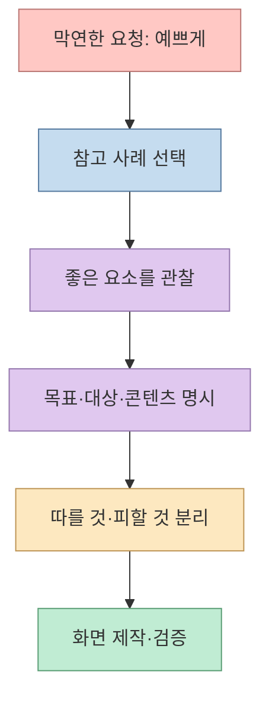
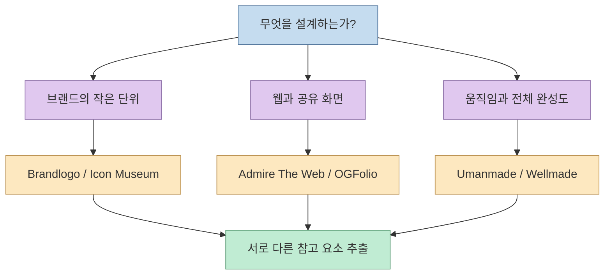
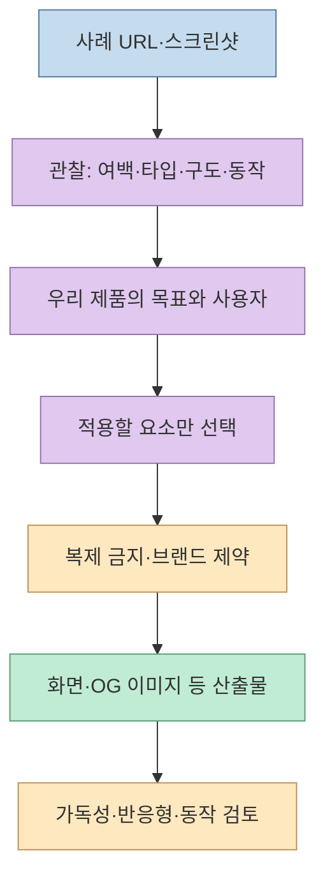
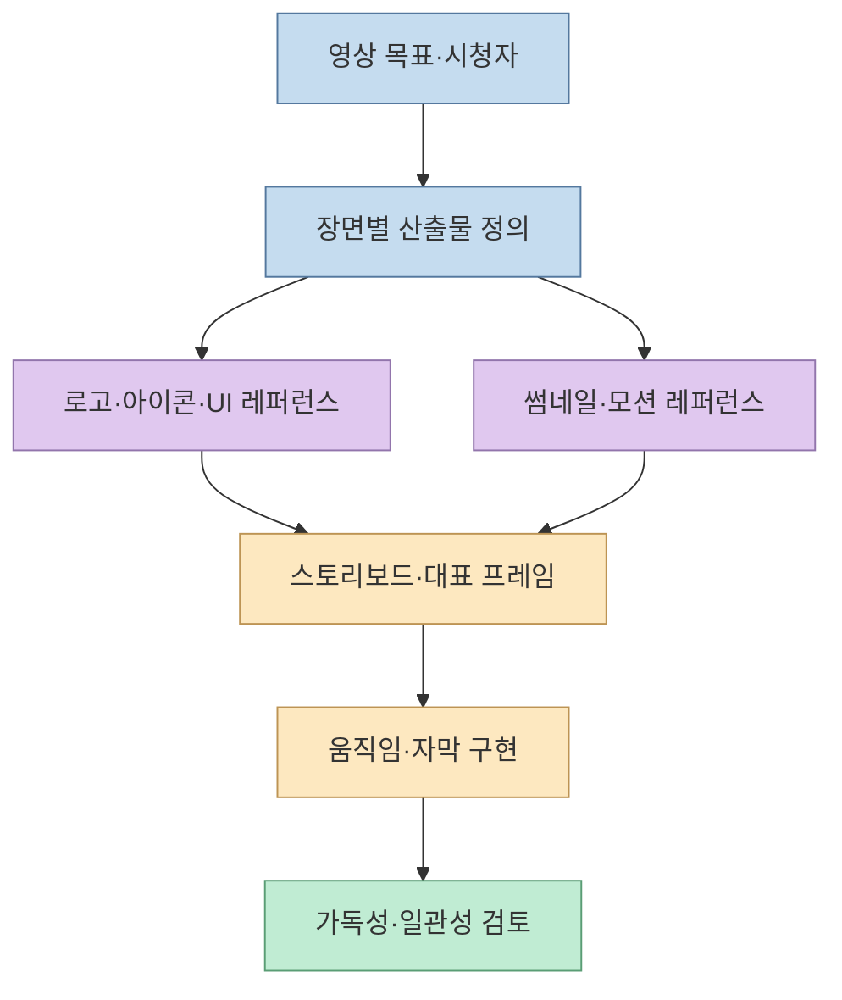

[Threads 게시물](https://www.threads.com/share/BAYmYn2mv4/)은 Claude Opus 5.5로 영상을 만들 때 "그냥 예쁘게 해줘"라고 말하는 것보다 **좋은 사례를 보여주라**고 권한다. 첨부 영상에는 로고, 앱 아이콘, 웹사이트, 링크 미리보기 이미지, 모션, 창작물의 참고 사이트 여섯 곳이 나온다. 이 사이트들이 영상 제작 도구라는 뜻은 아니다. **장면 안에 쓰일 그래픽과 움직임의 방향을 구체화할 시각 레퍼런스**로 쓰자는 제안에 가깝다.

<!--more-->

## Sources

- [원문 Threads 공유 링크](https://www.threads.com/share/BAYmYn2mv4/) · [실제 게시물](https://www.threads.com/@naminsoo__ai/post/DeG5YnKgTE9) — 본문과 첨부 영상의 여섯 사이트 목록
- [Brandlogo](https://brandlogo.co/) · [Icon Museum](https://icon.museum/) — 로고·앱 아이콘 사례
- [Admire The Web](https://admiretheweb.com/) · [OGFolio](https://ogfolio.com/) — 웹사이트·Open Graph 이미지 사례
- [Umanmade](https://umanmade.com/) · [Wellmade](https://wellmade.fyi/) — 인터랙션을 포함한 디지털 작업·창작물 사례
- [Anthropic의 Opus 5.5 프롬프트 안내](https://platform.claude.com/docs/en/build-with-claude/prompt-engineering/prompting-claude-opus-5-5) · [Claude Design 시작 안내](https://support.claude.com/en/articles/14604416-get-started-with-claude-design) — 시각 자료와 구체적 디자인 지시의 공식 근거

**확인 방법:** Threads 공유 URL의 공개 페이지를 읽어 실제 게시물로 이동했고, 첨부된 **42초 영상의 프레임**에서 여섯 사이트의 이름과 원문 작성자가 적은 용도를 확인했다. 여섯 사이트의 현재 소개 문구도 각각 대조했다. "10배"는 게시물의 강조 표현일 뿐, 비교 기준·실험 결과가 제시된 성능 수치가 아니다.

## 1. 막연한 형용사를 관찰 가능한 디자인 조건으로 바꾼다

"예쁘게"는 색상, 타이포그래피, 정보 구조, 움직임, 화면 크기 중 무엇을 바꾸라는 말인지 불명확하다. 레퍼런스는 이 모호함을 줄인다. 단, URL만 붙이며 "이렇게 만들어 줘"라고 하는 것도 충분하지 않다. **참고 대상의 요소**, **우리 제품의 목적**, **따르지 않을 요소**를 함께 적어야 디자인 제약이 된다. Anthropic의 [Claude Design 안내](https://support.claude.com/en/articles/14604416-get-started-with-claude-design)도 목표·레이아웃·콘텐츠·대상을 포함한 구체적 프롬프트와 스크린샷·기존 에셋 첨부를 권한다.

Anthropic의 [Opus 5.5 전용 안내](https://platform.claude.com/docs/en/build-with-claude/prompt-engineering/prompting-claude-opus-5-5)는 프런트엔드 작업에서 디자인 방향이 없으면 흔한 기본 스타일로 수렴할 수 있다고 설명한다. 이 모델은 스크린샷을 읽는 능력도 강조하지만, **이미지나 URL을 제공하지 않았는데 그 내용을 본 것처럼 가정하게 해서는 안 된다**. 실제로 확인한 화면을 스크린샷으로 첨부하고, 필요한 경우 원본 URL을 출처로 병기하는 방법이 더 재현 가능하다. [Anthropic의 시각 자료 안내](https://platform.claude.com/docs/en/build-with-claude/vision)

## 2. 영상의 여섯 사이트는 서로 다른 질문에 답한다

### 로고와 앱 아이콘: 브랜드의 작은 단위

1. **[Brandlogo](https://brandlogo.co/)** — 영상은 "로고 만들 때" 열어볼 곳으로 소개한다. 실제 사이트는 브랜드 로고를 모아 **업종, 글자 형태, 태그, 색상, 디자이너** 등으로 탐색하게 한다. 완성된 로고를 그대로 가져오기보다, 워드마크와 심벌의 관계, 획 굵기, 여백, 단색에서도 식별되는 형태를 관찰할 때 유용하다. [Brandlogo](https://brandlogo.co/)
2. **[Icon Museum](https://icon.museum/)** — 영상의 "앱 아이콘 만들 때"에 해당한다. 사이트는 iOS·macOS 앱 아이콘을 큐레이션한다고 설명한다. 작은 크기에서 형태가 유지되는지, 배경과 심벌의 대비가 어떤지, 브랜드 로고와 앱 아이콘이 어디서 달라지는지 비교할 수 있다. 다만 갤러리에 보인다는 이유만으로 에셋을 자유롭게 재사용할 수 있다고 가정하지 않는다. [Icon Museum](https://icon.museum/)

### 웹 화면과 공유 이미지: 서로 다른 출력 맥락

3. **[Admire The Web](https://admiretheweb.com/)** — 영상에서는 "홈페이지 만들 때"로 분류한다. 실제 갤러리에는 랜딩, 포트폴리오, 제품, 블로그 같은 **사이트 유형과 필터**가 있다. 히어로의 시선 흐름, 정보 밀도, 섹션 순서, 모바일에서의 재배치를 참고하기 좋다. 한 장의 스크린샷만으로 동작·접근성까지 평가할 수는 없으므로 실제 페이지도 확인해야 한다. [Admire The Web](https://admiretheweb.com/)
4. **[OGFolio](https://ogfolio.com/)** — 영상의 "링크 썸네일 만들 때"에 해당한다. 이곳은 **Open Graph 이미지** 사례 갤러리다. 웹 페이지 전체가 아니라 링크를 공유했을 때 보이는 작은 미리보기 이미지이므로, 제목 길이, 대비, 한눈에 읽히는 중심 메시지 같은 별도 조건으로 참고해야 한다. [OGFolio](https://ogfolio.com/)

### 움직임과 완성도: 정지 화면만으로 부족한 것

5. **[Umanmade](https://umanmade.com/)** — 영상은 "모션·인터랙션 참고할 때"로 제안한다. 사이트 자체는 사람이 만든 디지털 작업의 큐레이션이며, **Motion·Micro interaction**뿐 아니라 웹 디자인, UI, 3D, 브랜드 디자인 등도 분류한다. 따라서 모션 전용 라이브러리로 보기보다, 특정 전환·호버·스크롤 반응을 골라 관찰할 곳으로 쓰는 편이 정확하다. [Umanmade](https://umanmade.com/)
6. **[Wellmade](https://wellmade.fyi/)** — 영상은 "뭐든 잘 만든 걸 볼 때"로 정리한다. 사이트의 자체 설명은 제작자를 표기한 창작물 큐레이션이다. 용도를 특정 컴포넌트보다 **전체 작업의 인상과 완성도**를 탐색하는 넓은 영감의 출발점으로 보는 것이 적절하다. [Wellmade](https://wellmade.fyi/)

## 3. 레퍼런스 보드를 구현 가능한 요구사항으로 번역한다

여섯 사이트를 한꺼번에 AI에게 던지는 것보다 **이번 산출물에 필요한 사례 2~3개만 고르는 편**이 유용하다. 다음은 게시물의 제안을 실제 작업 지시로 바꾼 예시다. 출처의 디자인을 복제하라는 프롬프트가 아니라, 관찰한 원리를 우리 콘텐츠에 맞게 적용하도록 한다.

> **목표:** 모바일에서도 읽기 쉬운 SaaS 출시 페이지를 만든다. 대상은 기술 팀장이고, 주 행동은 데모 신청이다. 
> **참고 1:** Admire The Web에서 고른 페이지의 큰 제목과 짧은 설명 문장 사이의 정보 계층을 참고한다. 정확한 색상·문구·구성요소는 복제하지 않는다. 
> **참고 2:** OGFolio에서 고른 사례처럼 공유 이미지에는 제품 이름과 한 문장 가치 제안을 크게 놓는다. 실제 Open Graph 이미지 비율과 작은 미리보기에서의 가독성을 검증한다. 
> **제약:** 기존 브랜드 색과 로고를 사용하고, 모바일 가로 스크롤 없이 구현한다. 결과를 낸 뒤 어떤 레퍼런스에서 어떤 원리만 가져왔는지 설명한다.

이처럼 레퍼런스를 **출처 → 관찰 요소 → 적용 범위 → 금지할 복제 → 검증 기준**으로 분해하면 서로 다른 사이트의 장점을 무작정 섞는 문제를 줄인다. 화면 하나에 로고 갤러리의 스타일, 포트폴리오의 화려한 모션, OG 이미지의 타이포그래피를 모두 넣으라는 지시는 목적이 충돌하기 쉽다. 적용 대상을 로고·본문 UI·공유 이미지처럼 분리하는 것이 좋다. [Claude Design의 프롬프트 안내](https://support.claude.com/en/articles/14604416-get-started-with-claude-design)

## 4. 영상 제작이라면 레퍼런스를 장면별 산출물에 연결한다

원문의 목표가 영상이라면 여섯 사이트의 역할을 **영상의 어느 부분에 적용할지** 다시 정해야 한다. 예를 들어 Brandlogo와 Icon Museum은 인트로의 브랜드 표시·앱 데모 아이콘, Admire The Web은 화면 녹화에 들어갈 웹 UI, OGFolio는 배포할 영상 링크의 썸네일, Umanmade는 장면 전환과 미세 인터랙션, Wellmade는 전체 톤의 비교 기준으로 삼을 수 있다. 이것은 각 사이트가 해당 영상을 직접 만들어 준다는 뜻이 아니라, **영상의 시각 요소를 설계할 때 참고 대상을 분리하는 작업 방식**이다. [원문 영상](https://www.threads.com/@naminsoo__ai/post/DeG5YnKgTE9), [각 사이트의 설명](https://umanmade.com/)

따라서 AI에 요청할 때는 "이 사이트처럼 영상 만들어 줘"보다 **영상 길이, 화면 비율, 장면별 목적, 화면에 나타날 문자·제품, 전환 속도, 최종 전달 매체**를 적는 편이 낫다. 1차 결과에서는 먼저 스토리보드나 대표 프레임을 검토하고, 그다음 움직임을 추가해 글자 가독성과 브랜드 일관성을 확인한다. 이는 원문이 제공하는 측정된 제작법이 아니라 **레퍼런스 기반 제작을 재현 가능하게 만드는 실무 제안**이다.

## 5. "10배"보다 재현 가능한 검토 기준이 중요하다

원문 제목의 "10배"에는 **무엇을, 어떤 기준으로, 몇 번 비교했는지**가 제시되지 않는다. 결과가 10배 좋아진다는 사실로 읽기보다 "막연한 요청 대신 근거 있는 사례를 제공하자"는 수사적 강조로 이해해야 한다. Anthropic 문서도 프런트엔드 기본 스타일에서 벗어나려면 막연한 미감 지시보다 구체적인 방향과 피할 패턴을 명시하고 **실제 결과를 반복 검토**하라고 권한다. [Opus 5.5 프롬프트 안내](https://platform.claude.com/docs/en/build-with-claude/prompt-engineering/prompting-claude-opus-5-5)

검토할 때는 "멋져 보인다"만 묻지 말고 **로고의 축소 가독성, 아이콘의 식별성, 웹의 정보 우선순위와 모바일 배치, OG 이미지의 축소 가독성, 모션의 목적과 과도함, 영상 자막의 가독성**을 나눠 본다. 큐레이션 사이트는 좋은 사례를 찾는 도구이지, 해당 사례의 이미지·폰트·코드를 그대로 사용할 권한이나 모든 화면에서의 접근성을 보증하는 도구는 아니다. 필요한 에셋의 사용 조건과 실제 동작을 별도로 확인해야 한다.

## 실전 적용 포인트

1. **산출물부터 정한다.** 로고, 앱 아이콘, 랜딩 페이지, 링크 미리보기, 인터랙션 중 무엇이 필요한지 먼저 고른다.
2. **맞는 갤러리만 연다.** 여섯 곳을 모두 방문하되 실제 프롬프트에는 목적에 맞는 2~3개 사례만 넣는다.
3. **URL과 스크린샷을 함께 준비한다.** AI가 해당 URL의 현재 화면을 실제로 열람할 수 있는지 확인하고, 중요한 시각 요소는 이미지로 제공한다.
4. **참고 이유를 문장으로 쓴다.** "이 스타일"이 아니라 "본문보다 제목의 대비가 크다", "호버는 상태 변화만 전달한다"처럼 관찰 가능한 속성으로 설명한다.
5. **복제와 검증을 분리한다.** 고유한 문구·이미지·로고는 베끼지 말고, 브랜드 적합성·모바일·가독성·권한을 확인한다.

## 핵심 요약

- 영상의 여섯 사이트는 **Brandlogo, Icon Museum, Admire The Web, OGFolio, Umanmade, Wellmade**다.
- 레퍼런스의 가치는 링크 개수가 아니라 **무엇을 참고하고 무엇은 복제하지 않을지** 명확하게 만드는 데 있다.
- **"10배"는 검증된 개선 수치가 아니다.** 실제 결과는 산출물별 기준으로 비교해야 한다.
- Opus 5.5에 디자인 방향을 전달할 때는 **목표·사용자·콘텐츠·스크린샷·제약·검증 기준**을 함께 제공하는 것이 재현 가능하다.

## 결론

"예쁘게 만들어 줘"를 "이 사례의 정보 계층은 참고하되 우리 브랜드와 사용자 흐름에 맞게 다시 설계해 줘"로 바꾸는 것이 원문의 실용적인 메시지다. 여섯 사이트를 **용도별 관찰 도구**로 쓰고, AI가 볼 수 있는 자료와 평가 기준까지 제공하면 취향에 기대던 디자인 대화를 검증 가능한 작업으로 바꿀 수 있다.
