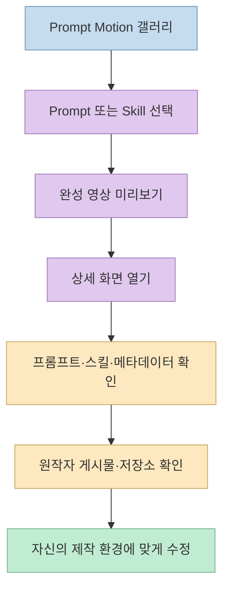
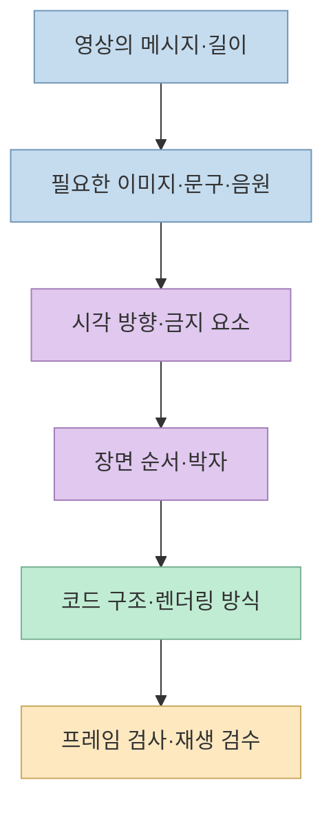
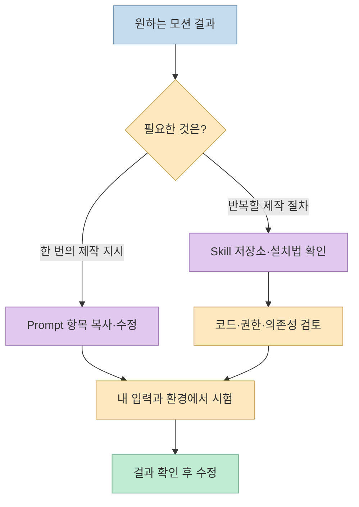

모션그래픽을 코드로 만들어 보고 싶지만 어디서 시작해야 할지 막막하다면, 완성 영상과 제작 지시를 나란히 볼 수 있는 자료가 도움이 된다. Threads에서 소개한 [Prompt Motion](https://www.prompt-motion.com/)은 이런 사례를 모은 갤러리다. 다만 **프롬프트를 복사하는 것**과 **같은 영상을 재현하는 것**은 다르다. 실제로 사이트에는 한 줄짜리 아이디어도 있고, 구현·렌더링·검수까지 지정한 긴 지시도 있다.

<!--more-->

## Sources

- [원본 Threads 공유 링크](https://www.threads.com/share/BBtQBgGWPc/) — [작성자 원문](https://www.threads.com/@openerai_lab/post/DeIh7bwn4hI)
- [Prompt Motion 갤러리](https://www.prompt-motion.com/)
- [짧은 쇼릴 프롬프트 사례](https://www.prompt-motion.com/stephanlivera-df17a2)
- [상세한 UI 모핑 프롬프트 사례](https://www.prompt-motion.com/twoclipping-5cba86)
- [Manim·음성 도구를 명시한 사례](https://www.prompt-motion.com/linearuncle-5d2bae)
- [Cinetic 스킬 사례](https://www.prompt-motion.com/lexnlin-6161a6)
- [Remotion 기반 제품 영상 스킬 사례](https://www.prompt-motion.com/anthonyriera-9b1b2a)

## Prompt Motion은 생성기가 아니라 사례집

원본 Threads는 "클로드나 ChatGPT로 모션그래픽을 시작할 때 참고할 프롬프트 모음"으로 사이트를 소개한다. 실제 [사이트 첫 화면](https://www.prompt-motion.com/)은 **Claude Opus 5.5로 만든 모션 영상과 그 뒤의 프롬프트·스킬을 모은 컬렉션**이라고 설명한다. 미리보기를 훑고 **Prompt** 또는 **Skill**로 필터링한 다음, 항목을 열어 제작자의 원문 링크와 공개된 지시를 살펴보는 구조다. 사이트 자체가 채팅창이나 영상 생성 버튼을 제공하는 제작 도구는 아니다.

2026년 10월 6일 확인 시점에는 목록에서 **229개 항목**을 확인했고, 링크의 분류는 **Prompt 225개·Skill 4개**였다. 이 숫자는 사이트가 업데이트되면 달라질 수 있다. 카드나 상세 화면에는 작성자, 원본 게시물, 복사할 수 있는 프롬프트 또는 스킬 안내, 모델과 경우에 따라 작업 강도·반복 횟수·기술 스택이 표시된다. 모든 항목에 동일한 메타데이터가 있는 것은 아니다. [갤러리](https://www.prompt-motion.com/), [짧은 사례](https://www.prompt-motion.com/stephanlivera-df17a2), [스킬 사례](https://www.prompt-motion.com/anthonyriera-9b1b2a).

여기서 **"ChatGPT로도 시작할 수 있다"는 원본 게시물의 제안**과 **사이트의 실제 사례가 Claude Opus 5.5로 표시된다는 사실**을 구분해야 한다. 프롬프트를 다른 코딩 모델에 가져가 시도할 수는 있지만, 같은 결과가 ChatGPT에서 검증됐다고 사이트가 말하는 것은 아니다. [원본 Threads](https://www.threads.com/@openerai_lab/post/DeIh7bwn4hI), [갤러리 설명](https://www.prompt-motion.com/).

## 프롬프트 길이보다 중요한 것은 실행 조건

갤러리에는 정보량이 크게 다른 항목이 함께 있다. [쇼릴 사례](https://www.prompt-motion.com/stephanlivera-df17a2)는 약 15초의 역동적인 모션 디자이너 쇼릴을 만들어 달라는 **짧은 방향 제시**에 가깝다. 반면 [UI 상태 모핑 사례](https://www.prompt-motion.com/twoclipping-5cba86)는 필요한 입력, 디자인 방향, 음악의 박자, UI 전환 순서, 금지할 효과, 코드와 렌더링 조건, 품질 확인 항목까지 상세히 적는다. 둘 다 공개 사례지만, 후자가 재현을 위해 모델에 전달하는 정보는 훨씬 많다.

UI 모핑 사례를 조금 더 구체적으로 보면, 하나의 도형이 여러 UI 상태로 바뀌는 장면을 구상하고 **상태별로 화면을 끊지 않도록** 요구한다. 구현 지시에는 `seek(t)`에서 시간으로 화면 상태를 계산하는 단일 HTML, 오디오 박자 분석, Playwright 프레임 렌더링, ffmpeg를 이용한 모션 블러와 박자별 프레임 검수가 들어 있다. 이는 **해당 사례 작성자의 프롬프트에 적힌 목표 구현**이지, 갤러리 전체가 이 렌더링 스택을 내장했다는 의미는 아니다. [UI 모핑 사례](https://www.prompt-motion.com/twoclipping-5cba86).

더 길게 쓰는 것이 언제나 정답은 아니다. **짧은 프롬프트는 창의적 탐색**, **상세한 프롬프트는 특정 결과를 재현하거나 반복 제작할 때** 유리하다는 것이 두 사례를 비교한 실무적 해석이다. 다만 어느 쪽도 모델 설정, 입력 에셋, 사용 도구와 반복 수정 과정을 생략한 채 "복사 한 번이면 동일 결과"를 보장하지는 않는다.

## Prompt와 Skill은 어떻게 다른가

갤러리의 **Prompt** 항목은 특정 제작 요청의 문장이다. **Skill** 항목은 코딩 에이전트에 설치해 재사용하는 작업 절차나 도구 묶음을 소개한다. 예를 들어 [Cinetic 사례](https://www.prompt-motion.com/lexnlin-6161a6)는 영상을 기획하고 렌더링하는 에이전트 스킬과 설치 명령을 연결한다. [제품 영상 스킬 사례](https://www.prompt-motion.com/anthonyriera-9b1b2a)는 제품의 디자인 시스템을 살피고 사용자에게 영상 방향을 물은 뒤, 실제 컴포넌트와 로고·음악을 이용해 Remotion으로 영상을 제작하는 흐름을 설명한다. 두 사례 모두 상세 페이지에서 원본 게시물과 저장소로 이동할 수 있다.

스킬 항목의 설치 명령은 단순 텍스트 참고와 달리 **외부 코드를 실행 환경에 추가**한다. 따라서 복사 버튼이 보인다는 이유만으로 설치하지 말고, 연결된 저장소의 코드·권한·의존성과 적용 범위를 먼저 확인해야 한다. 이는 갤러리가 명시한 보증이 아니라 외부 도구를 도입할 때의 일반적인 안전 원칙이다.

## 사례에서 배울 수 있는 선택 기준

- **아이디어만 필요하다면 짧은 프롬프트부터:** [쇼릴 사례](https://www.prompt-motion.com/stephanlivera-df17a2)처럼 결과의 목적과 길이만 제시하고, 나온 초안을 바탕으로 시각 언어를 구체화한다.
- **정확한 장면 전환이 중요하다면 상세 지시를 참고:** [UI 모핑 사례](https://www.prompt-motion.com/twoclipping-5cba86)는 입력→디자인→박자→구현→검수의 순서를 나눠 적어 제작자가 확인할 지점을 만든다.
- **특정 분야의 도구를 확인:** [수학 개념 영상](https://www.prompt-motion.com/linearuncle-5d2bae)은 Manim과 edge-tts를 기술 스택으로 표기한다. 프롬프트만 복사해서는 도구 설치나 실제 환경 준비가 끝나지 않는다.
- **반복 제작에는 스킬을 검토:** [Cinetic](https://www.prompt-motion.com/lexnlin-6161a6)이나 [제품 영상 스킬](https://www.prompt-motion.com/anthonyriera-9b1b2a)처럼 정해진 제작 절차가 필요한지 판단한다.
- **원작자의 게시물까지 확인:** 상세 항목의 **View post**는 원본 맥락을 확인하는 통로다. 사이트 하단도 영상과 프롬프트의 권리가 각 제작자에게 있음을 밝힌다. 따라서 공개 사례라고 해서 영상·음악·브랜드 자산의 사용권까지 자동으로 주어지는 것은 아니다. [갤러리](https://www.prompt-motion.com/).

## 실전 적용 포인트

1. 갤러리에서 **자신이 만들 영상과 목적이 비슷한 예시**를 먼저 찾는다. 시각적으로만 멋진 예시보다 전달할 메시지와 길이가 비슷한 것이 출발점으로 유용하다.
2. 상세 페이지에서 프롬프트와 함께 **모델, 스택, 반복 횟수**가 표시되는지 확인한다. 빈칸은 추정하지 말고 "공개되지 않음"으로 취급한다.
3. 복사한 지시에서 **주제·문구·화면 비율·색·입력 자료·사용 도구**를 자신의 프로젝트에 맞게 바꾼다. 단순 치환으로 끝내지 않는다.
4. 첫 결과물을 기준으로 **시작·장면 전환·끝 프레임**, 글자 가독성, 오디오 동기화와 반복 재생 시 끊김을 확인한다. 이는 [상세 UI 모핑 프롬프트](https://www.prompt-motion.com/twoclipping-5cba86)의 검수 항목을 일반화한 절차다.
5. 출판·상업적 사용이라면 원본 게시물과 사용한 에셋의 권리를 별도로 확인한다. 사이트의 "Copy"는 프롬프트를 복사하는 UI이지 타인의 결과물에 대한 포괄적 라이선스 표시가 아니다. [갤러리 저작권 안내](https://www.prompt-motion.com/).

## 핵심 요약

- Prompt Motion은 Claude Opus 5.5 모션 영상의 **프롬프트·스킬·원본 출처를 연결한 갤러리**다.
- 원본 Threads가 ChatGPT 활용 가능성을 언급해도, 갤러리의 사례를 ChatGPT에서 동일하게 재현했다고 볼 근거는 없다.
- 예시마다 정보량이 다르다. 짧은 지시는 아이디어 탐색에, 상세 지시는 구현·검수 조건을 파악하는 데 더 도움이 된다.
- Skill 항목은 외부 코드와 저장소를 확인해야 하며, 원본 영상·에셋의 사용권은 별도 문제다.

## 결론

Prompt Motion을 가장 잘 쓰는 방법은 **완성 영상만 따라 하기보다, 그 뒤의 프롬프트가 어떤 입력과 검증 조건을 요구하는지 읽는 것**이다. 마음에 드는 사례를 출발점으로 삼되 자신의 도구·에셋·목적에 맞게 바꾸고, 결과 화면을 직접 검수해야 한다.
