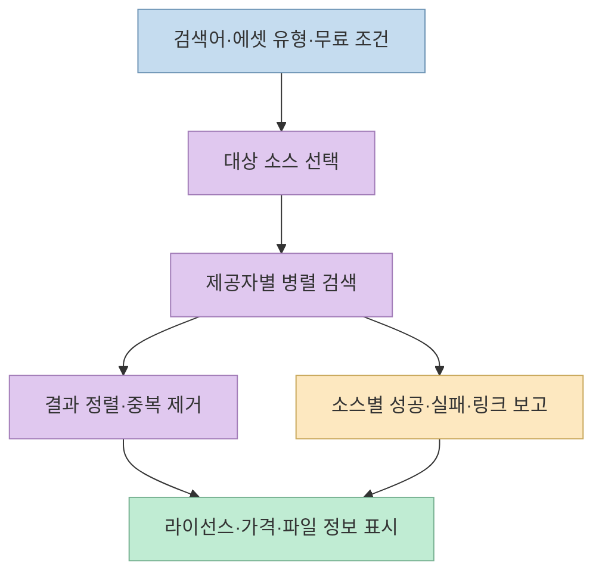
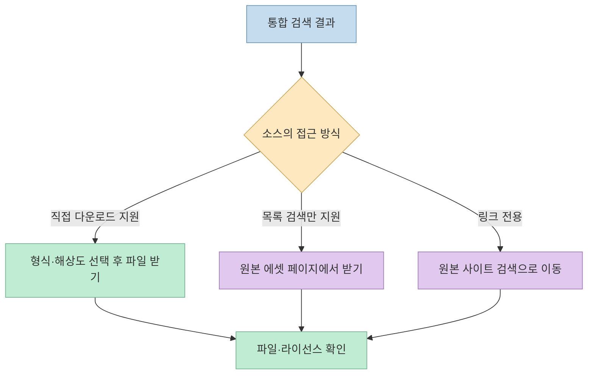
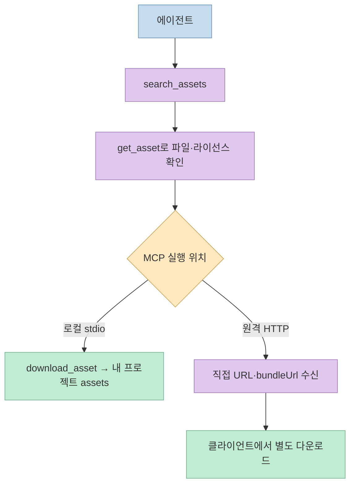

게임이나 웹 장면에 쓸 3D 모델·PBR 재질·HDRI를 찾을 때마다 사이트를 바꿔 검색하고 파일을 다시 정리해야 한다면, [3d-asset-server](https://github.com/arielshad/3d-asset-server)가 그 과정을 묶어준다. [Threads 소개](https://www.threads.com/share/BAWzTBy_G8/)처럼 여러 에셋 소스를 한곳에서 찾고 웹 UI·HTTP API·CLI·MCP에서 사용할 수 있다. 다만 **17개 소스 검색**과 **17개 소스에서 자동 다운로드**는 다른 이야기다.

<!--more-->

## Sources

- [원본 Threads 공유 링크](https://www.threads.com/share/BAWzTBy_G8/) — [작성자 게시물](https://www.threads.com/@geumverse_ai/post/DeJJg-EEyxt)
- [3d-asset-server 공식 저장소 및 README](https://github.com/arielshad/3d-asset-server)
- [공식 소스·라이선스 안내](https://github.com/arielshad/3d-asset-server#sources)
- [공식 설정·다운로드 안전장치](https://github.com/arielshad/3d-asset-server#downloads)

## 하나의 검색창이 하는 일

공식 README에 따르면 3d-asset-server는 **17개 제공자**를 대상으로 모델·재질·텍스처·HDRI·게임 에셋을 찾는다. 웹 UI, REST API, CLI, MCP 도구가 같은 검색 서비스를 호출한다. 서비스는 요청 유형과 무료 조건에 맞는 제공자를 고르고, 각 제공자에 병렬 요청을 보낸 뒤 결과를 점수화·중복 제거한다. 느리거나 막힌 제공자 하나 때문에 전체 검색을 실패시키는 대신 `ok`, `timeout`, `error`, `skipped`, `link` 같은 **소스별 상태**를 돌려준다. [공식 작동 방식](https://github.com/arielshad/3d-asset-server#how-it-works).

결과에는 에셋 종류, 제공자, 원본 페이지, 무료 여부, 라이선스·저작자 표시 필요 여부, 직접 다운로드 가능 여부가 붙는다. 검색 결과 순위는 제목·태그·설명과 원본 사이트 순위, API/스크래핑 경로, 무료·직접 다운로드 여부 등을 고려한다. 이는 **검색을 정리하는 기준**이지 저작권이나 품질을 독립적으로 보증하는 점수가 아니다. [공식 검색·API 설명](https://github.com/arielshad/3d-asset-server#how-it-works), [응답 예시](https://github.com/arielshad/3d-asset-server#http-api).



## 17개 소스 가운데 직접 받을 수 있는 곳은 일부다

원본 게시물은 Poly Haven·ambientCG·Kenney·BlenderKit 등을 예로 들지만, 공식 README의 **소스 표**는 검색과 다운로드를 별도 열로 구분한다. 현재 표에서 직접 다운로드를 안내하는 경로는 **Poly Haven, ambientCG, 무료 BlenderKit 에셋, Kenney, TextureCan, 무료 HDRMaps HDRI**다. 반면 CGBookcase·ShareTextures·Quaternius·3DTextures.me·Textures.com·HDRI Hub·CGTrader·itch.io는 검색 결과와 원본 페이지 연결이 중심이다. Fab·Poliigon·TurboSquid는 봇 차단 등의 이유로 사이트 내부 검색 링크만 제공한다. [공식 소스별 기능 표](https://github.com/arielshad/3d-asset-server#sources).

예컨대 **무료 검색 결과**라도 `downloadable`이 참인 것은 아니다. 무료 에셋을 찾았지만 로그인·결제 흐름 또는 핫링크 제한이 있다면 원본 사이트에서 받아야 한다. README는 ShareTextures의 이용 약관이 자동 다운로드를 금지한다고 적고, 유료·로그인 필요·핫링크 보호 콘텐츠를 우회하지 않는다고 명시한다. 따라서 "17개 사이트에서 모두 자동으로 가져온다"고 이해하면 잘못이다. [소스별 제한](https://github.com/arielshad/3d-asset-server#sources), [이용 원칙](https://github.com/arielshad/3d-asset-server#licences--etiquette).



## 에이전트의 `search → get → download`와 원격 MCP의 차이

MCP에는 `search_assets`, `get_asset`, `download_asset`, `list_providers` 도구가 있다. 에이전트는 먼저 검색하고, 후보의 라이선스·형식·해상도·예상 파일 목록을 `get_asset`으로 확인한 뒤 받을 수 있는 에셋을 다운로드할 수 있다. `download_asset`은 기본적으로 `./assets` 아래의 제공자별 폴더에 저장하고, 압축 팩을 풀며, 크레딧이 필요한 경우 표기 문구도 반환한다. [공식 MCP 도구 설명](https://github.com/arielshad/3d-asset-server#mcp-use-it-from-an-ai-assistant).

여기에는 중요한 **실행 위치의 차이**가 있다. 로컬에서 stdio MCP를 실행하면 다운로드된 파일을 로컬 프로젝트 경로로 보낼 수 있다. 반면 **원격 HTTP MCP**에서 `download_asset`은 기본적으로 꺼져 있다. 켜더라도 파일은 원격 **서버의 디스크**에 쓰이지, 사용자의 PC나 현재 프로젝트에 바로 쓰이는 것이 아니다. 원격에서는 `get_asset`이 제공하는 직접 파일 URL이나 `bundleUrl`을 받아 클라이언트 쪽에서 내려받는 흐름을 써야 한다. Threads의 "Claude나 Cursor가 프로젝트에 넣어준다"는 설명은 **로컬 MCP와 쓰기 대상 경로를 올바르게 설정한 경우**로 한정해 이해해야 한다. [공식 원격 MCP 주의사항](https://github.com/arielshad/3d-asset-server#mcp-use-it-from-an-ai-assistant).



HTTP API의 `GET /v1/search`는 검색 결과와 소스별 상태를, `GET /v1/assets/{provider}:{id}`는 에셋 상세를 제공한다. CLI에서도 `search`를 실행할 수 있다. 따라서 MCP를 쓰지 않아도 자체 검색 화면이나 파이프라인과 연결할 수 있다. [공식 HTTP API·CLI 안내](https://github.com/arielshad/3d-asset-server#http-api).

## 파일은 어떻게 정리되고 무엇을 검수해야 하나

README는 기본 다운로드 선택에서 모델은 `glb → gltf → fbx → obj → blend`, HDRI는 `hdr → exr` 순으로 선호하고, 가능한 경우 약 2K 해상도에 가까운 파일을 택한다고 설명한다. glTF의 경우 `.gltf`만 따로 저장하지 않고 `.bin`과 텍스처의 상대 경로를 함께 유지한다. PBR 맵과 압축 에셋 팩도 가능한 제공자에서 받아 정리한다. 하지만 원본에 없는 형식으로 **자동 변환한다는 뜻은 아니다.** 결과 상세에서 실제 제공 파일과 해상도를 먼저 확인해야 한다. [공식 다운로드 규칙](https://github.com/arielshad/3d-asset-server#downloads).

다운로드 코드에는 공개 `http(s)` 호스트만 허용, 사설·루프백 주소 거부, 압축 파일의 상위 경로 탈출 방지, 기본 **파일당 2GiB 크기 제한**이 문서화돼 있다. 이는 외부 URL과 압축 파일을 다루는 서버에 필요한 방어선이지만, 받은 에셋의 렌더링 품질·악성 콘텐츠 부재·프로젝트 호환성을 전부 보증하지는 않는다. 게임 엔진에서 메시·재질·텍스처를 직접 열어 검수하는 단계가 남는다. [공식 안전장치](https://github.com/arielshad/3d-asset-server#downloads).

**라이선스 표시는 이용 허가의 최종 판정이 아니다.** 결과의 `license`, `commercialUse`, `attributionRequired`는 출처 판단에 도움이 되지만, 에셋의 실제 권리는 각 제공자와 개별 등록 항목에 달려 있다. 서버 코드의 [Apache-2.0 라이선스](https://github.com/arielshad/3d-asset-server/blob/main/LICENSE)가 검색된 에셋에 자동으로 적용되는 것도 아니다. 배포 전에는 원본 페이지의 최신 조건과 저작자 표기 요구를 다시 확인해야 한다. [공식 라이선스 원칙](https://github.com/arielshad/3d-asset-server#licences--etiquette).

## 로컬 실행과 노출 범위를 구분하기

공식 빠른 시작은 Node.js 20 이상에서 저장소를 설치·빌드한 다음 서버를 실행한다. `npm start`는 웹 UI·HTTP API·HTTP MCP를 `8787` 포트에 띄우고, `node dist/cli.js mcp`는 stdio MCP를 실행한다. 로컬 MCP에서 프로젝트 다운로드 경로를 고를 때는 `ASSET_DOWNLOAD_DIR`을 지정할 수 있다. [공식 빠른 시작](https://github.com/arielshad/3d-asset-server#quick-start), [MCP 설정 예시](https://github.com/arielshad/3d-asset-server#mcp-use-it-from-an-ai-assistant).

```bash
git clone https://github.com/arielshad/3d-asset-server.git
cd 3d-asset-server
npm install
npm run build
npm start
```

주의할 점은 기본 `HOST` 값이 **`0.0.0.0`** 이라는 것이다. 이는 단순히 자기 PC의 루프백 주소에만 묶는 설정이 아니다. 개발용으로 자기 기기에서만 접근하려면 `HOST=127.0.0.1`처럼 바인딩 주소를 명시하고, 네트워크에 공개한다면 `ASSET_SERVER_API_KEY`, 방화벽·프록시 등 접근 통제를 함께 검토해야 한다. HTTP MCP의 디스크 쓰기를 켜는 `ASSET_SERVER_HTTP_DOWNLOADS=true`는 저장 위치와 권한을 이해한 경우에만 사용해야 한다. [공식 설정값](https://github.com/arielshad/3d-asset-server#configuration).

## 실전 적용 포인트

1. **검색과 다운로드를 분리한다.** 먼저 `free`와 `downloadable`을 구분해 필터링하고, 검색만 가능한 후보는 원본 페이지에서 받는다.
2. **에이전트에는 로컬 stdio MCP를 우선 고려한다.** 프로젝트 폴더에 바로 넣어야 한다면 실행 위치와 `ASSET_DOWNLOAD_DIR`을 맞춘다. 원격 HTTP MCP의 다운로드는 같은 동작이 아니다.
3. **검색 실패 상태도 읽는다.** 소스별 `timeout`·`link`를 "에셋 없음"으로 오해하지 말고 필요하면 원본 사이트 검색을 이어간다.
4. **에셋 단위로 권리를 확인한다.** 서버가 표시한 라이선스와 원본 항목의 조건을 대조하고, 필요한 크레딧을 프로젝트에 남긴다.
5. **셀프호스팅의 노출 범위를 설정한다.** 기본 바인딩 주소를 확인하고, 외부 접근이 불필요하면 루프백으로 제한한다.

## 핵심 요약

- 3d-asset-server는 17개 소스를 **한 번에 검색**하지만, 직접 다운로드를 지원하는 곳은 일부다.
- 검색 결과에는 라이선스·무료 여부·다운로드 가능 여부와 소스별 상태가 함께 제공된다.
- MCP의 로컬 stdio와 원격 HTTP는 **파일이 저장되는 위치**가 다르다. 원격 HTTP의 `download_asset`은 기본적으로 꺼져 있다.
- glTF의 `.bin`·텍스처와 PBR 파일을 함께 정리하지만, 최종 품질과 이용 조건은 별도 검수가 필요하다.
- 서버의 Apache-2.0은 프로그램 코드의 라이선스이지 검색된 에셋의 일괄 이용 허가가 아니다.

## 결론

3d-asset-server는 에셋 사이트를 **탐색하는 시간**을 줄이고, 검색 결과에서 실제 파일 준비까지 이어 주는 도구다. 가장 유용한 사용법은 "모든 소스에서 자동으로 내려받는 검색 엔진"으로 보는 대신, **소스별 접근 방식·라이선스·MCP 실행 위치를 명확히 구분하는 에셋 작업 파이프라인**으로 다루는 것이다.
