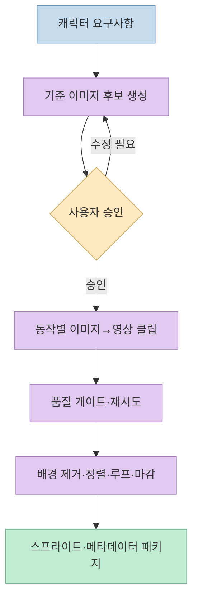
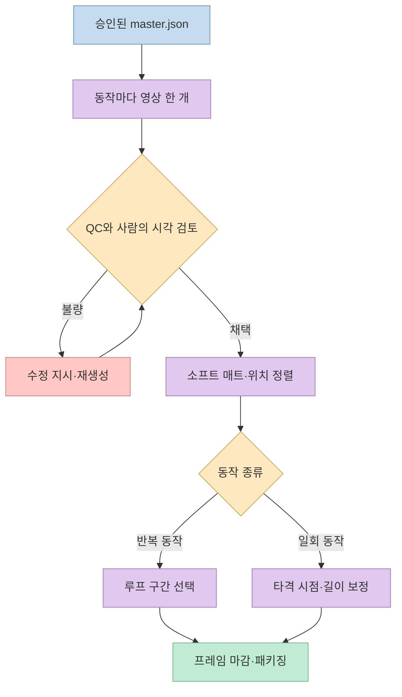
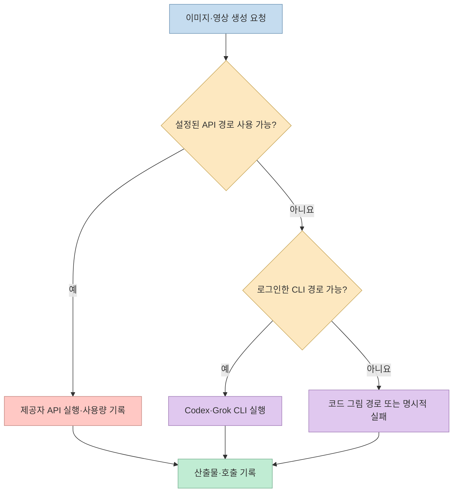
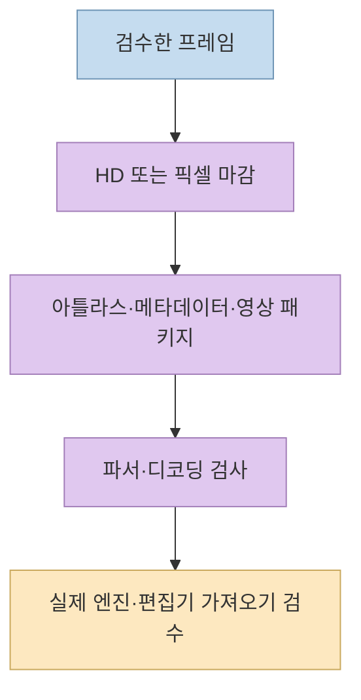
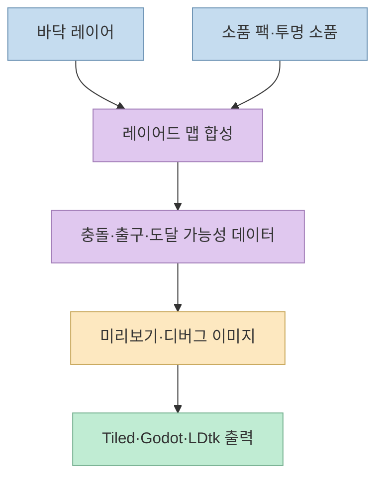

캐릭터 정지 이미지 한 장을 얻는 일과 **게임에 넣을 수 있는 애니메이션 세트**를 만드는 일은 다르다. 여러 동작에서 얼굴·의상·체형을 유지하고, 배경을 제거하며, 보행 루프와 공격 타이밍을 맞춘 뒤 엔진이 읽을 형식으로 묶어야 한다. [Agent Sprite Forge](https://github.com/0x0funky/agent-sprite-forge) 0.4는 이 과정을 에이전트 스킬과 로컬 후처리 도구로 연결한다. 하지만 "한 장만 넣으면 모든 동작이 자동으로 완성된다"는 뜻은 아니다. **기준 이미지 승인과 결과 검수**가 파이프라인의 일부다.

<!--more-->

## Sources

- [Agent Sprite Forge 공식 저장소](https://github.com/0x0funky/agent-sprite-forge)
- [0.4 검증 기록](https://github.com/0x0funky/agent-sprite-forge/blob/main/docs/validation-2026-10-06.md)
- [0.4 알려진 한계](https://github.com/0x0funky/agent-sprite-forge/blob/main/docs/known-limitations.md)
- [한국어 README](https://github.com/0x0funky/agent-sprite-forge/blob/main/README.ko.md)

## 이 도구가 해결하려는 문제

공식 README는 0.4 이전의 캐릭터 애니메이션 방식을 **이미지 생성 스프라이트 시트에서 프레임을 잘라내거나, 단일 영상 클립을 수작업으로 키잉하는 흐름**으로 설명한다. 이 방식은 첫 결과가 그럴듯해도 동작별 외형과 발 위치가 흔들리기 쉽다. 0.4는 먼저 캐릭터의 **기준 이미지(master still)**를 승인하고, 그 이미지를 출발점으로 idle·walk·run·attack 같은 **동작마다 이미지→영상 클립 하나씩** 만든다. 이후 Python 도구가 품질 검사, 배경 제거, 위치 정렬, 루프 선택, 타이밍 보정, 프레임 마감과 내보내기를 맡는다. [공식 README의 0.4 설명](https://github.com/0x0funky/agent-sprite-forge#whats-new-in-04--the-big-upgrade).

이 설계의 핵심은 **이미지·영상 생성과 결정론적 후처리의 역할 분리**다. 생성 모델은 원본 비주얼과 움직임을 제안하지만, 프레임 정렬이나 팔레트 제한처럼 규칙으로 검사할 수 있는 부분은 스크립트가 처리한다. 그래도 수치 검사만으로 무기 모양, 얼굴 정체성, 해부학이나 움직임의 매력을 판정할 수 없어서 에이전트의 리뷰 시트 확인과 사용자의 기준 이미지 승인이 남는다. [파이프라인 설명](https://github.com/0x0funky/agent-sprite-forge#pipeline-master--set--finish--export), [검증되지 않는 항목](https://github.com/0x0funky/agent-sprite-forge/blob/main/docs/known-limitations.md).

## 기준 이미지에서 동작 세트까지: 단계별 역할

첫 단계의 `master_still.py`는 이미지 후보를 만들고 필요하면 가까운 결과를 편집한 다음 **승인한 한 장**을 `master.json`에 기록한다. 동작 프롬프트가 이 기준의 정체성 정보를 다시 사용한다. 이어 `sprite_set.py`가 동작별 클립을 만들고 면적, 발 위치, 정체성, 확대·회전, 프레임 가장자리, 배경, 추가 물체, 움직임, 마지막 자세, 색 번짐과 타이밍을 검사한다. 문제를 발견하면 수정 조건을 붙여 다시 생성한다. README에 따르면 `run`은 중단 지점에서 재개하며 이미 만든 클립을 반복 생성하지 않는다. [공식 Quickstart](https://github.com/0x0funky/agent-sprite-forge#quickstart), [파이프라인 표](https://github.com/0x0funky/agent-sprite-forge#pipeline-master--set--finish--export).

검사 뒤에는 **소프트 매트 키잉**으로 배경을 제거하고 캐릭터 위치와 크기를 맞춘다. walk·run·idle에는 반복할 구간을 고르고, attack·jump·hurt처럼 한 번 실행되는 동작에는 게임에 맞는 길이로 **리타이밍**한다. 마지막으로 HD 또는 픽셀 마감을 적용하고 출력 파일을 패키징한다. 저장소가 제시한 공격 동작의 `4.1초 → 0.7초` 예시는 **해당 데모에서 측정한 사례**이지, 모든 공격 영상이 같은 길이로 바뀐다는 보장은 아니다. [공식 파이프라인](https://github.com/0x0funky/agent-sprite-forge#pipeline-master--set--finish--export), [0.4 검증 기록](https://github.com/0x0funky/agent-sprite-forge/blob/main/docs/validation-2026-10-06.md).

프로젝트가 보여 주는 여섯 동작의 Aria 데모와 48×64 픽셀 여우 사례는 **실제 실행 결과라고 저장소가 기록한 예시**다. 수치와 품질 주장은 저장소의 자체 검증 자료에 기반하므로, 다른 캐릭터·모델·운영체제에서 같은 성공률이 나올 것으로 일반화해서는 안 된다. [0.4 검증 기록](https://github.com/0x0funky/agent-sprite-forge/blob/main/docs/validation-2026-10-06.md), [알려진 한계](https://github.com/0x0funky/agent-sprite-forge/blob/main/docs/known-limitations.md).

## 생성 경로와 비용: API가 없으면 무엇을 쓰나

이미지와 영상 요청은 `route_media.py`가 경로를 결정한다. README 기준 순서는 **설정한 제공자 API 키 → 로그인한 Codex·Grok 로컬 CLI → 코드로 그리는 `codeart2d`**다. OpenAI·Gemini·xAI·BytePlus·fal.ai 등은 지원 작업이 다르고, 로컬 CLI 역시 이미 로그인돼 있으며 해당 이미지·영상 기능을 쓸 수 있어야 한다. **API 키가 없다고 무료로 모델을 무제한 사용하는 구조는 아니다.** CLI 경로는 사용자 구독·계정의 이용 가능량을 소모할 수 있다. [경로와 제공자 안내](https://github.com/0x0funky/agent-sprite-forge#routes-and-providers).

README는 제공자 요청이 거절되거나 **비용이 발생했을 가능성이 있는 결과**를 무심코 다른 경로에서 재시도하지 않는다고 설명한다. 모든 호출은 프로젝트의 `.forge/ledger.jsonl`에 추정 비용, 제공자 작업 ID, 산출물 해시 등을 남긴다. 별도 설정이 없으면 자동 지출 상한이 생기는 것은 아니므로 `--budget-usd`, `--max-calls` 같은 한도를 먼저 정하는 편이 안전하다. `codeart2d`는 다른 생성 경로가 없거나 명시적으로 코드 그림을 요청했을 때의 대안이며, AI 이미지 생성과 같은 결과라고 위장하지 않는다. [경로 정책·지출 기록](https://github.com/0x0funky/agent-sprite-forge#routes-and-providers).

## 출력물은 어디까지 게임 준비가 됐나

마감은 **HD가 기본**이고 픽셀 아트 마감을 요청할 수도 있다. HD 경로는 기준 이미지에 맞춘 몸 크기와 색상 잠금을 적용한다. 픽셀 경로는 선명한 축소, 제한된 공유 팔레트, 선택적 외곽선과 이진 알파를 사용한다. 패키지는 프레임 메타데이터와 PNG 아틀라스, 비디오 형식 등을 만들고 디코딩 검사를 수행한다. Godot `SpriteFrames`, Aseprite JSON, 웹용 아틀라스 등의 내보내기도 문서화돼 있다. `packed-alpha MP4`는 투명도를 별도 채널처럼 포장한 형식이지 **일반 투명 MP4**라고 이해하면 안 된다. [공식 마감·출력 설명](https://github.com/0x0funky/agent-sprite-forge#pipeline-master--set--finish--export), [플레이어 제한](https://github.com/0x0funky/agent-sprite-forge/blob/main/docs/known-limitations.md).

한편 **파서 수준의 파일 검증**과 **실제 편집기에서 가져오기 성공**은 다르다. 저장소는 0.4의 Godot·LDtk·Aseprite 등 출력물이 아직 각 편집기에서 직접 열어 검증되지 않았다고 밝힌다. 웹 재생도 헤드리스 브라우저의 SwiftShader 범위에 그치고 실제 GPU·Safari·iPhone에서 확인한 것은 아니다. 따라서 "Godot에 바로 넣으면 반드시 동작한다"는 식으로 표현할 수 없다. 최종 게임 엔진에서 프레임 순서, 피벗, 애니메이션 이벤트, 투명도와 재생 속도를 직접 테스트해야 한다. [공식 알려진 한계](https://github.com/0x0funky/agent-sprite-forge/blob/main/docs/known-limitations.md).

## 스프라이트뿐 아니라 맵과 코드 그림도 포함한다

저장소의 스킬은 캐릭터 동작 세트만 다루지 않는다. `generate2dmap`은 바닥 이미지, 장식된 참조 장면, 소품 팩, 투명 소품을 나눠 레이어드 맵을 만들고 충돌·도달 가능성·출구 정보를 데이터로 관리한다. Tiled·Godot·LDtk용 출력과 이동 가능한 HTML 미리보기를 설명한다. `generate2dsprite`는 효과·아이콘·소품처럼 시트 방식이 맞는 작업에도 남아 있으며, `codeart2d`는 모델 생성이 아니라 명세와 코드로 픽셀·벡터·효과 자산을 그리는 대안이다. [맵과 관련 스킬 안내](https://github.com/0x0funky/agent-sprite-forge#maps), [저장소 구성](https://github.com/0x0funky/agent-sprite-forge).

맵 검사도 만능은 아니다. `map_nav.py`는 **위에서 내려다보는 이동**을 확인할 뿐 점프 궤적은 검증하지 않으며, 충돌 데이터가 실제 그림과 일치하는지 자동으로 비교하지 않는다. 미리보기와 `nav-debug.png`를 사람 눈으로 확인해야 한다. [맵 관련 알려진 한계](https://github.com/0x0funky/agent-sprite-forge/blob/main/docs/known-limitations.md).

## 도입 전에 알아둘 검증·라이선스 경계

저장소의 0.4 검증 기록은 Windows 11 환경에서 Python·JavaScript 테스트와 일부 실제 생성 사례를 보고한다. 반면 [알려진 한계 문서](https://github.com/0x0funky/agent-sprite-forge/blob/main/docs/known-limitations.md)는 Linux·macOS와 여러 라이브러리 최소 버전 조합을 실행 검증하지 않았고, 숫자 기반 QC가 캐릭터 해부학·정체성·움직임의 매력을 보증하지 않는다고 명시한다. 빠른 동작과 점프에서는 영상 모델의 캐릭터 변형으로 **재생성**이 필요할 수 있다. 이는 프로젝트가 공개한 자체 검증 범위이며, 독립적인 전 플랫폼 벤치마크가 아니다. [0.4 검증 기록](https://github.com/0x0funky/agent-sprite-forge/blob/main/docs/validation-2026-10-06.md).

저장소의 [MIT 라이선스](https://github.com/0x0funky/agent-sprite-forge/blob/main/LICENSE)는 **코드와 문서**에 적용된다. 생성 이미지·영상의 이용 조건까지 MIT로 통일하지 않는다. 프로젝트는 모델 제공자별 약관을 확인하고, 상업 게임에는 권리를 보유한 원본 캐릭터를 쓰라고 권한다. 데모의 수치를 보고 동일 품질·비용·권리를 보장받는다고 생각하지 않는 편이 안전하다. [저장소의 생성 자산·라이선스 설명](https://github.com/0x0funky/agent-sprite-forge).

## 실전 적용 포인트

1. **작은 캐릭터 한 명으로 시작한다.** 먼저 기준 이미지를 승인하고 idle·walk처럼 검수하기 쉬운 두 동작만 만들어 전체 파이프라인을 확인한다.
2. **생성 경로와 한도를 먼저 확인한다.** API 키와 로그인한 CLI의 사용 가능 여부를 점검하고, 필요하면 예산·호출 상한을 지정한다.
3. **QC를 사람의 검수로 마무리한다.** 발 위치와 루프 수치뿐 아니라 얼굴·무기·의상, 공격 순간과 프레임 사이의 일관성을 본다.
4. **실제 엔진에서 가져오기 테스트를 한다.** 파일이 파싱된다는 사실만으로 Godot·Aseprite·웹 플레이어에서 원하는 대로 재생된다고 가정하지 않는다.
5. **생성 자산의 권리를 분리해 검토한다.** 저장소의 MIT와 사용한 이미지·영상 모델의 서비스 약관은 서로 다르다.

## 핵심 요약

- Agent Sprite Forge 0.4는 승인한 **기준 이미지 한 장**을 바탕으로 동작별 영상 클립을 만들고, 로컬 도구로 스프라이트를 정리한다.
- 생성 모델이 비주얼을 제안하고 스크립트가 키잉·정렬·루프·타이밍·마감·패키징을 맡지만, 최종 시각 검수는 남는다.
- 제공자 API, 로그인한 CLI, 코드 그림은 **서로 다른 경로와 비용·품질 조건**을 가진다.
- Godot·Aseprite 등 내보내기는 문서화돼 있지만 0.4 출력물의 실제 편집기 가져오기는 아직 검증되지 않았다.
- 자체 데모의 성과를 모든 캐릭터·플랫폼의 보장으로 확대해서는 안 된다.

## 결론

이 프로젝트의 가치는 "프롬프트 한 줄로 완성된 게임 에셋"보다, **생성된 원본을 반복 가능한 제작·검수·내보내기 공정에 넣는 것**에 있다. 기준 이미지 승인, 사용량 관리, 결과 검수와 엔진 실사용 테스트를 거친다면 캐릭터 스프라이트와 맵 제작의 출발점으로 유용하다.
