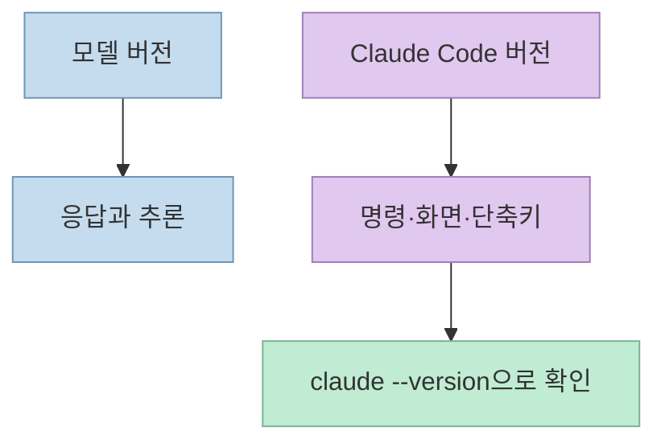
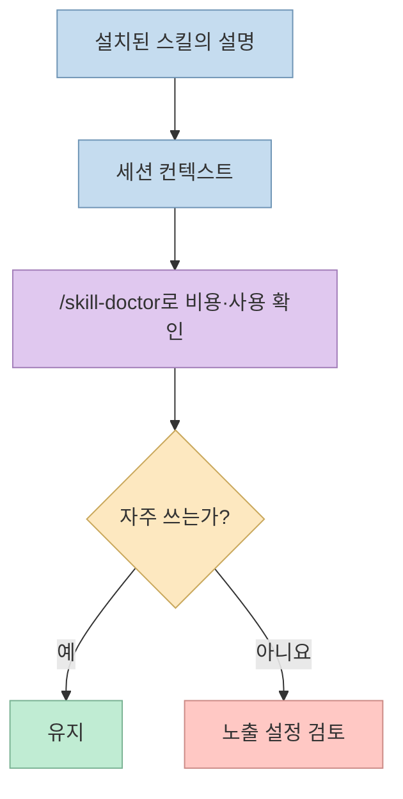
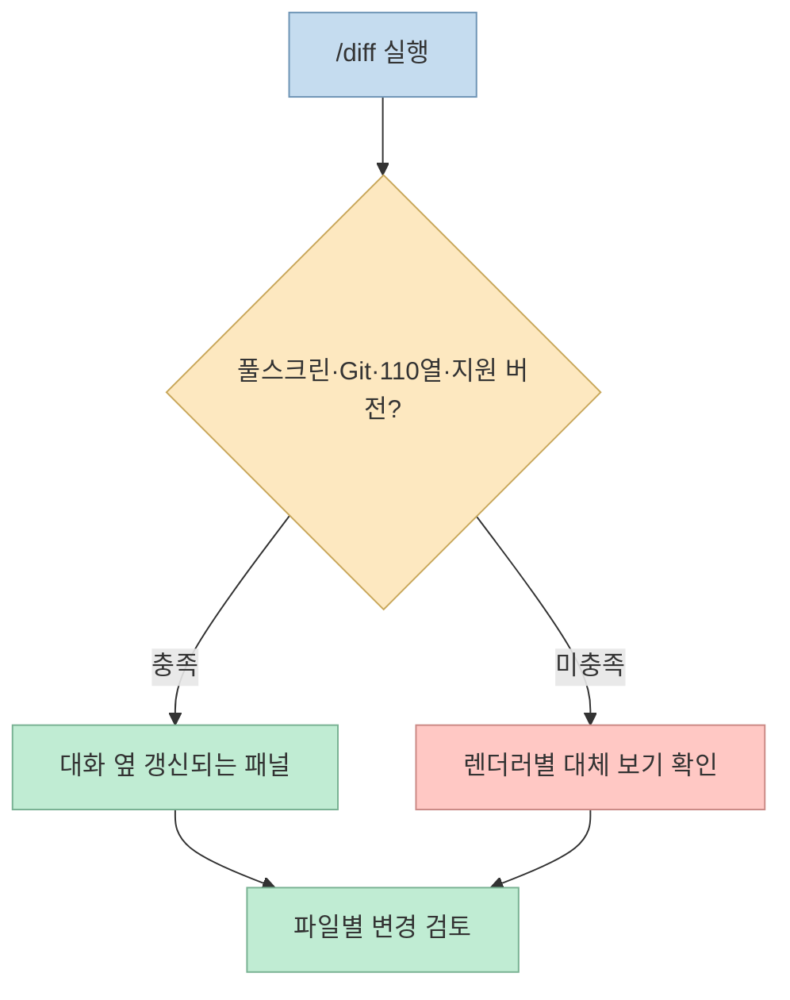
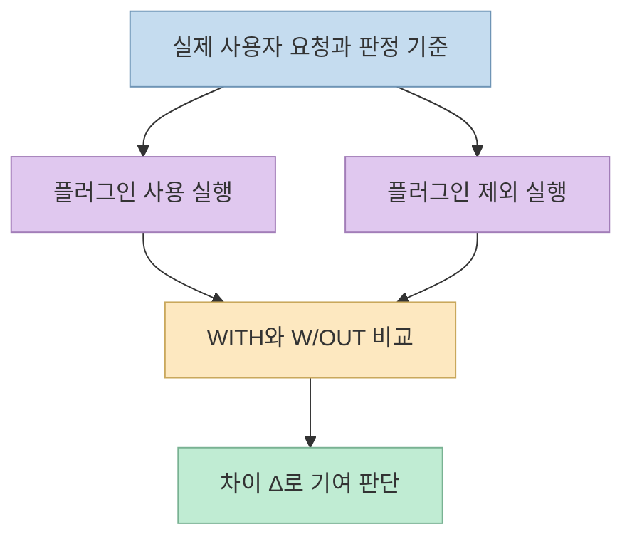
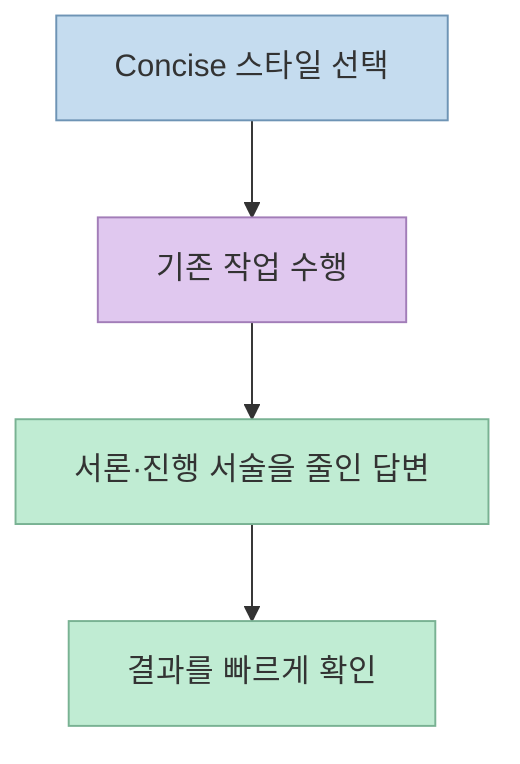
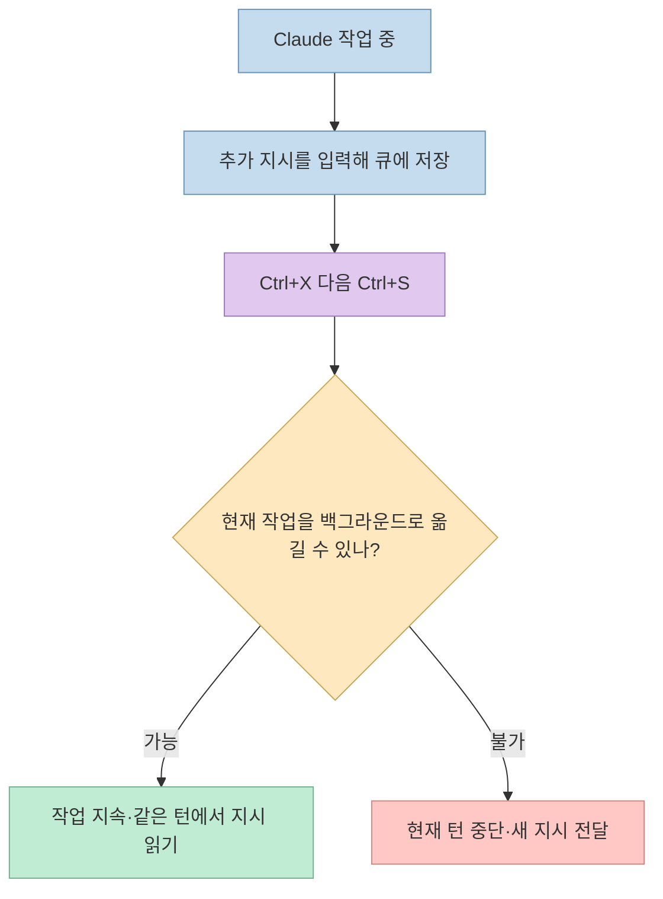

Claude Code를 오래 써도 새 기능을 모두 발견하기는 어렵다. [Solostack의 짧은 영상](https://youtu.be/6g6srrlm_cg?t=0)은 스킬 진단, 변경 사항 검토, 플러그인 평가, 간결한 응답, 실행 중 개입이라는 다섯 기능을 빠르게 소개한다. 이 글은 영상의 요점을 실제 명령과 사용 조건으로 풀어 쓴다. 영상에서 말하는 "최근 한 달 20개 넘는 기능"은 제작자의 언급이며, 이 글에서 별도로 집계한 수치는 아니다.

<!--more-->

## Sources

- [원본 YouTube Shorts](https://youtube.com/shorts/6g6srrlm_cg?si=9tRxqMb4Q-y-dlbX)
- [Claude Code 명령어 공식 문서](https://code.claude.com/docs/en/commands)
- [Claude Code 대화형 모드 공식 문서](https://code.claude.com/docs/en/interactive-mode)
- [플러그인 평가 공식 문서](https://code.claude.com/docs/en/plugin-evals)
- [출력 스타일 공식 문서](https://code.claude.com/docs/en/output-styles)

## 먼저 구분할 것: 모델과 Claude Code는 다른 버전이다

영상은 모델 버전과 이를 둘러싼 Claude Code 도구의 버전이 별도로 올라간다고 짚는다. [영상 9초](https://youtu.be/6g6srrlm_cg?t=9), [영상 16초](https://youtu.be/6g6srrlm_cg?t=16). 여기서 다루는 다섯 항목은 모델의 새 추론 능력보다는 **CLI의 명령·화면·평가 도구·입력 동작**에 관한 것이다. 따라서 모델 이름만 확인해서는 기능 사용 가능 여부를 알 수 없고, `claude --version`으로 설치된 Claude Code 버전을 확인해야 한다. 기능별 최소 버전은 아래에서 따로 적는다. [플러그인 평가 요구 사항](https://code.claude.com/docs/en/plugin-evals).

## 1. `/skill-doctor`: 스킬의 컨텍스트 비용을 보이게 하기

영상은 스킬이 많아질수록 숨은 토큰 비용을 파악하기 어렵고, `/skill-doctor`가 스킬별 컨텍스트 비용과 최근 사용 빈도를 보여준다고 설명한다. [영상 20초](https://youtu.be/6g6srrlm_cg?t=20), [영상 26초](https://youtu.be/6g6srrlm_cg?t=26). 공식 명령어 문서도 이 진단 목적을 확인하며, **Claude Code v2.1.252 이상과 feature-flag fetching**을 요구한다고 명시한다. [공식 명령어 문서](https://code.claude.com/docs/en/commands).

다만 "설치한 스킬 본문 전체가 매 턴마다 로드된다"고 이해하면 과장이다. 공식 기능 개요에 따르면 스킬 **설명**은 세션에 로드되고, 전체 내용은 그 스킬을 사용할 때 로드된다. 따라서 절감 대상은 실제 진단 결과를 보고 판단해야 한다. 쓰지 않는 스킬의 설명 노출을 줄이는 설정도 있지만, 스킬을 무조건 삭제하는 것보다 필요한 워크플로를 남기는 편이 낫다. [공식 기능 개요](https://code.claude.com/docs/en/features-overview), [영상 33초](https://youtu.be/6g6srrlm_cg?t=33).

## 2. `/diff`: 대화를 떠나지 않고 수정 결과 검토하기

영상의 두 번째 기능은 여러 파일을 수정할 때 변경 사항을 대화 옆에서 확인하는 diff 패널이다. [영상 36초](https://youtu.be/6g6srrlm_cg?t=36), [영상 42초](https://youtu.be/6g6srrlm_cg?t=42). `/diff`를 실행하면 작업 트리의 변경 사항을 Claude Code 안에서 검토할 수 있다. 풀스크린 렌더러에서는 패널이 대화 옆에 남아 수정 때마다 갱신되고, 클래식 렌더러에서는 닫을 수 있는 대화상자로 열린다. [공식 대화형 모드 문서](https://code.claude.com/docs/en/interactive-mode).

**옆에 붙는 패널**의 조건은 풀스크린 렌더링, Git 저장소, 터미널 너비 **110열 이상**, Claude Code **v2.1.287 이상**이다. 영상은 너비를 "100칸 이상"이라고 말하지만 [영상 46초](https://youtu.be/6g6srrlm_cg?t=46), 현재 공식 문서는 110열을 지정하므로 이 값을 기준으로 잡는 편이 안전하다. 조건을 만족하지 못해도 `/diff` 자체가 항상 사라지는 것은 아니다. 렌더러에 따라 대화상자 등 다른 표시 방식이 있다. [공식 diff 패널 조건](https://code.claude.com/docs/en/interactive-mode).

## 3. `claude plugin eval`: 플러그인이 실제로 도움이 되는지 평가하기

세 번째는 슬래시 명령이 아니라 **터미널에서 실행하는 명령**이다. 영상은 직접 만든 플러그인을 테스트 케이스에 적용하고, 플러그인이 없을 때와 비교해 기여를 수치로 보인다고 설명한다. [영상 51초](https://youtu.be/6g6srrlm_cg?t=51), [영상 56초](https://youtu.be/6g6srrlm_cg?t=56). 공식 문서의 `WITH`, `W/OUT`, `Δ`도 같은 취지다. **플러그인을 넣은 점수만 높아도, 빼고 실행한 점수와 같다면 그 성공을 플러그인의 효과로 돌릴 수 없다.** [공식 플러그인 평가 문서](https://code.claude.com/docs/en/plugin-evals).

플러그인 루트에서 평가 케이스를 준비한 뒤 `claude plugin eval .`을 실행한다. 케이스는 사용자가 실제로 할 법한 요청과 결과를 판정하는 grader로 구성된다. 기본적으로 케이스마다 여러 번 실행하고 플러그인 없는 기준선과 비교한다. 이 기능은 **Claude Code v2.1.269 이상**이 필요하며, 평가와 판정에 실제 모델 호출이 쓰이므로 사용량 또는 비용이 발생한다. 단순 구문·스키마 검사는 별도의 `claude plugin validate` 대상이다. [공식 플러그인 평가 가이드](https://code.claude.com/docs/en/plugin-evals).

## 4. Concise 출력 스타일: 설명을 줄이고 결과를 먼저 보기

영상은 서론과 장황한 설명을 줄이는 "Concise" 스타일을 네 번째로 소개한다. [영상 64초](https://youtu.be/6g6srrlm_cg?t=64), [영상 69초](https://youtu.be/6g6srrlm_cg?t=69). 공식 문서도 작업 자체는 그대로 꼼꼼하게 하되, 응답의 도입·진행 서술·요약을 생략하는 내장 출력 스타일로 설명한다. **추론 품질 향상이나 총 토큰 비용 절감을 보장하는 기능은 아니며, 주된 이점은 사람이 읽는 응답의 길이를 줄이는 데 있다.** [공식 출력 스타일 문서](https://code.claude.com/docs/en/output-styles).

현재 문서 기준 `Concise` 스타일은 **v2.1.237 이상**, 명령 `/output-style concise`의 직접 사용은 **v2.1.269 이상**에서 지원된다. 앞의 버전 구간에서는 `/config`에서 스타일을 선택한다. 영상에서 언급한 오픈소스 "caveman"과의 실제 비교는 다음 편에서 하겠다고만 했으므로, 이 글은 둘의 성능 차이를 단정하지 않는다. [공식 출력 스타일 문서](https://code.claude.com/docs/en/output-styles), [영상 77초](https://youtu.be/6g6srrlm_cg?t=77).

## 5. 작업 도중 끼어들기: 큐에 쌓은 메시지를 지금 보내기

마지막 기능은 Claude가 일하는 동안 입력한 메시지를 끝날 때까지 기다리지 않고 전달하는 것이다. [영상 83초](https://youtu.be/6g6srrlm_cg?t=83), [영상 89초](https://youtu.be/6g6srrlm_cg?t=89). 공식 문서에는 `Ctrl+Enter` 또는 터미널 호환성이 더 좋은 **`Ctrl+X` 다음 `Ctrl+S`**가 "큐의 메시지를 지금 보내기"로 명시돼 있다. **v2.1.275 이상**이 필요하다. `Esc`는 현재 작업을 중단하면서 큐의 메시지를 이어서 보내는 별도 동작이다. [공식 단축키 문서](https://code.claude.com/docs/en/interactive-mode).

"지금 보내기"가 언제나 현재 작업을 강제 종료한다는 뜻은 아니다. **v2.1.281 이상**에서는 실행 중인 셸 명령이나 서브에이전트처럼 백그라운드로 옮길 수 있는 작업은 계속 진행하고, Claude가 같은 턴에서 새 메시지를 읽을 수 있다. 단순 응답 작성처럼 옮길 수 없는 작업이면 턴을 중단하고 새 메시지를 보낸다. `Ctrl+Enter`가 일반 `Enter`로 전달되는 터미널이라면 `Ctrl+X Ctrl+S`를 사용한다. [공식 큐 처리 설명](https://code.claude.com/docs/en/interactive-mode).

## 실전 적용 포인트

1. **먼저 버전을 확인한다.** 다섯 기능은 서로 다른 Claude Code 최소 버전을 요구한다. 특히 `/diff`의 옆 패널은 `/diff` 명령 자체보다 조건이 까다롭다. [공식 명령어 문서](https://code.claude.com/docs/en/commands), [공식 대화형 모드 문서](https://code.claude.com/docs/en/interactive-mode).
2. **스킬은 측정한 뒤 정리한다.** `/skill-doctor`의 비용과 사용 빈도를 보고 노출을 조정한다. 스킬 설명과 전체 본문의 로딩 시점은 다르다. [공식 기능 개요](https://code.claude.com/docs/en/features-overview).
3. **변경 검토와 품질 평가는 구분한다.** `/diff`는 지금 수정된 파일을 검토하고, `claude plugin eval`은 반복 가능한 케이스로 플러그인의 기여를 평가한다. [공식 diff 설명](https://code.claude.com/docs/en/interactive-mode), [공식 평가 설명](https://code.claude.com/docs/en/plugin-evals).
4. **응답 길이와 실행 제어는 별개다.** Concise는 읽을 분량을 줄이고, 메시지 큐 단축키는 작업 중 지시를 전달하는 시점을 바꾼다. [공식 출력 스타일 문서](https://code.claude.com/docs/en/output-styles), [공식 단축키 문서](https://code.claude.com/docs/en/interactive-mode).

## 핵심 요약

- `/skill-doctor`: 스킬별 컨텍스트 비용과 사용 빈도를 보고 정리 대상을 찾는다. [영상 20초](https://youtu.be/6g6srrlm_cg?t=20).
- `/diff`: 변경 사항을 Claude Code 안에서 확인한다. 옆 패널은 풀스크린·Git·110열 이상 등 조건을 확인한다. [영상 36초](https://youtu.be/6g6srrlm_cg?t=36), [공식 문서](https://code.claude.com/docs/en/interactive-mode).
- `claude plugin eval`: 플러그인 적용·미적용 결과의 차이를 평가한다. [영상 51초](https://youtu.be/6g6srrlm_cg?t=51).
- Concise: 답변의 불필요한 서술을 줄인다. [영상 64초](https://youtu.be/6g6srrlm_cg?t=64).
- `Ctrl+X Ctrl+S`: 대기 중인 메시지를 현재 작업이 끝나기 전에 전달한다. [영상 83초](https://youtu.be/6g6srrlm_cg?t=83), [공식 문서](https://code.claude.com/docs/en/interactive-mode).

## 결론

이 영상의 핵심은 새 모델을 기다리는 것보다 **이미 쓰는 Claude Code의 진단·검토·평가·출력·개입 기능을 발견하는 것**이다. 다만 기능이 보이지 않거나 영상과 화면이 다르면 먼저 Claude Code 버전, 렌더러, 터미널 폭 같은 사용 조건을 확인하자. [영상 18초](https://youtu.be/6g6srrlm_cg?t=18), [공식 대화형 모드 문서](https://code.claude.com/docs/en/interactive-mode).
