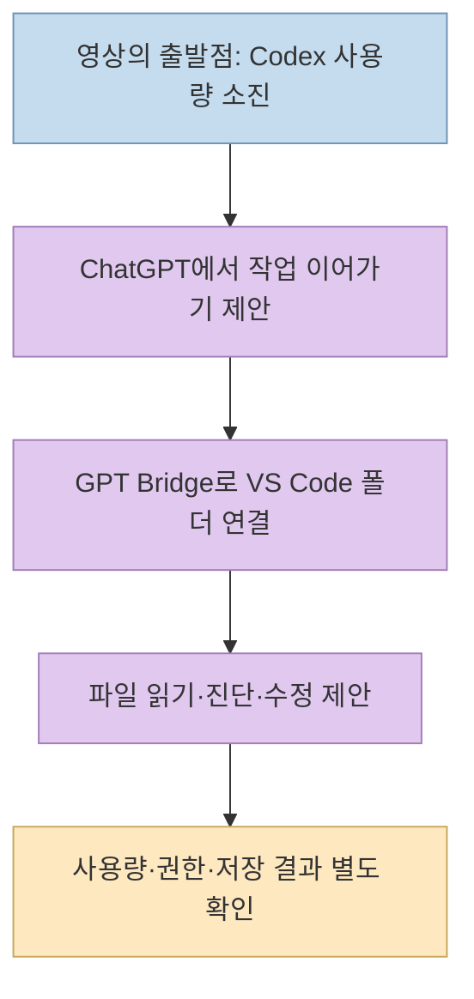
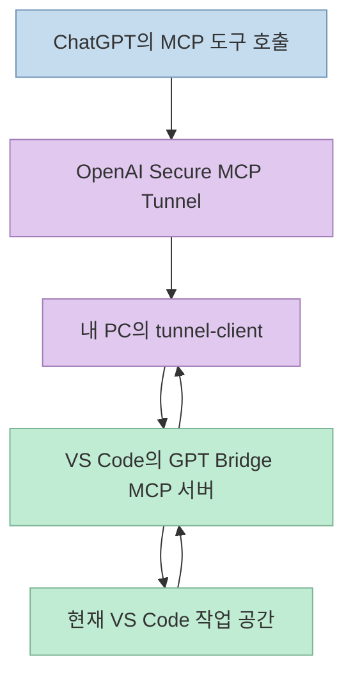
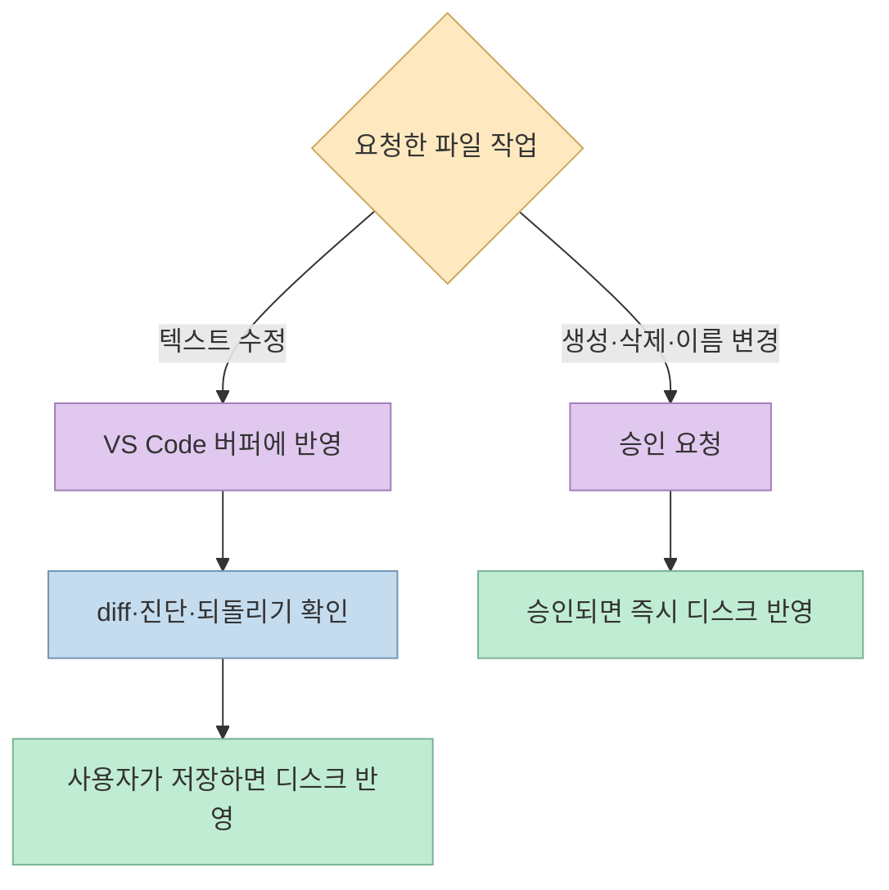

Codex 사용량이 소진됐을 때 ChatGPT의 GPT-6 Astra로 같은 프로젝트를 이어 작업할 수 있을까? [짧은 영상](https://youtube.com/shorts/kww5SayXu1A?si=YWpiWkjRrimyKBFV)은 **GPT Bridge**로 ChatGPT에 VS Code 작업 폴더를 연결하는 방법을 소개하면서, 채팅 쪽 한도가 Codex와 별도라고 말한다. 연결 도구의 기능은 공식 저장소에서 확인되지만, **한도가 별개라는 부분은 현재 OpenAI 공식 문서와 맞지 않는다.** 두 주장을 분리해서 살펴보자.

<!--more-->

## Sources

- [원본 YouTube Shorts](https://youtube.com/shorts/kww5SayXu1A?si=YWpiWkjRrimyKBFV)
- [GPT Bridge 공식 저장소](https://github.com/dreamurl/GPT-Bridge)
- [OpenAI 공식 ChatGPT Work·Codex 요금 및 사용량 안내](https://learn.chatgpt.com/docs/pricing)
- [OpenAI 공식 모델 안내](https://learn.chatgpt.com/docs/models)
- [OpenAI 공식 Secure MCP Tunnel 안내](https://developers.openai.com/api/docs/guides/secure-mcp-tunnels)

## 영상이 제안하는 흐름과 확인해야 할 전제

영상은 [0초](https://youtu.be/kww5SayXu1A?t=0)부터 "Codex 한도가 바닥나면 작업이 멈춘다"는 상황을 제시한다. 이어 [5초](https://youtu.be/kww5SayXu1A?t=5) 무렵 Pro 사용자의 Astra 한도가 남아 있고, [10초](https://youtu.be/kww5SayXu1A?t=10) 무렵 채팅의 한도와 Codex 한도가 따로 계산된다고 주장한다. 자동 생성 자막에는 모델 이름 일부가 부정확하게 전사돼 있어, 이 글은 영상 제목의 **Astra** 표기와 공식 문서를 기준으로 해석한다.

영상의 기술적 핵심은 **ChatGPT 채팅이 내 작업 폴더를 볼 수 없는 문제**를 메우는 것이다. [17초](https://youtu.be/kww5SayXu1A?t=17)부터 GPT Bridge를 소개하고, [27초](https://youtu.be/kww5SayXu1A?t=27)부터 VS Code에서 서버를 켠 다음 OpenAI 터널 클라이언트를 실행하는 순서를 말한다. [33초](https://youtu.be/kww5SayXu1A?t=33)부터는 수정이 저장 전까지 디스크에 반영되지 않고 편집 전에 확인을 받는다고 설명한다. 이는 **텍스트 편집의 기본 동작**에는 가깝지만, 모든 파일 작업에 적용되는 일반 규칙은 아니다. [GPT Bridge README](https://github.com/dreamurl/GPT-Bridge).

## 사용량 검증: 브리지가 새 한도를 만들지는 않는다

가장 중요한 팩트체크는 **"Pro의 ChatGPT Work/Astra 한도가 Codex와 따로 남는다"** 는 주장이다. [OpenAI 공식 요금 문서](https://learn.chatgpt.com/docs/pricing)는 **ChatGPT Work와 Codex가 사용량을 공유**하며, ChatGPT 안의 Work 사용도 Codex와 같은 가격·크레딧·사용량 제한을 적용받는다고 명시한다. 로컬 메시지와 클라우드 채팅도 플랜 사용량을 공유한다고 설명한다. 따라서 영상의 [10초 주장](https://youtu.be/kww5SayXu1A?t=10)을 **독립적인 추가 Astra 할당량이 보장된다**는 뜻으로 받아들이면 안 된다.

여기서 **일반 ChatGPT Chat**, **ChatGPT Work**, **Codex**, **OpenAI API**를 한데 섞으면 판단이 더 어려워진다. OpenAI의 [모델 안내](https://learn.chatgpt.com/docs/models)는 모델 이용 가능 위치가 앱·클라이언트·요금제·출시 단계에 따라 다르다고 설명한다. 영상만으로 특정 계정의 Chat 모드와 Work 모드가 어떤 사용량 풀을 쓰는지, 실제 Astra 선택이 가능한지, 그 시점의 잔여량이 얼마인지는 알 수 없다. API 키로 사용하면 별도의 API 과금 경로가 적용되지만, 그것도 **구독 안에서 공짜로 새 한도가 생긴다**는 의미가 아니다. [OpenAI 공식 요금 안내](https://learn.chatgpt.com/docs/pricing).

사용 가능량을 판단할 때는 영상의 "남아 있다"는 경험담보다 **자신의 계정에서 실제로 선택 가능한 모델과 사용량 대시보드**를 우선해야 한다. 작업을 ChatGPT로 옮기면 인터페이스와 도구가 바뀔 수는 있지만, GPT Bridge가 계정의 과금·사용량 규칙을 변경하지는 않는다. 이는 공식 사용량 규칙과 브리지의 기능 범위를 합쳐 내린 판단이다. [OpenAI 요금 문서](https://learn.chatgpt.com/docs/pricing), [GPT Bridge README](https://github.com/dreamurl/GPT-Bridge).

## GPT Bridge가 실제로 연결하는 것

[GPT Bridge 저장소](https://github.com/dreamurl/GPT-Bridge)에 따르면 이 도구는 **VS Code 확장 프로그램**이다. 현재 열어 둔 작업 공간을 로컬 MCP 서버로 노출하고, ChatGPT가 파일 목록·파일 내용·텍스트 검색·VS Code 진단 정보를 읽거나 승인된 편집 작업을 요청하게 한다. 특히 `get_diagnostics`로 타입·린트 오류를 읽어 수정 근거로 삼는 기능을 강조한다. 영상의 "채팅이 내 코드와 타입 에러를 본다"는 [21~26초 설명](https://youtu.be/kww5SayXu1A?t=21)은 이 기능과 대응한다.

ChatGPT는 내 PC의 `127.0.0.1` 서버에 인터넷에서 바로 접속할 수 없다. 프로젝트의 연결 방식은 **OpenAI Secure MCP Tunnel**을 이용한다. 내 PC의 `tunnel-client`가 바깥으로 연결을 유지하고, OpenAI 터널이 MCP 요청을 로컬 GPT Bridge 서버로 전달한다. OpenAI의 [공식 터널 문서](https://developers.openai.com/api/docs/guides/secure-mcp-tunnels)도 사설 MCP 서버를 공개 인바운드 포트 없이 연결하는 구조를 설명한다. 이 **터널 클라이언트는 OpenAI 제품**이고, **GPT Bridge 확장 자체는 제3자 프로젝트**다.

따라서 매번 "두 개를 켠다"는 영상의 [27~32초 설명](https://youtu.be/kww5SayXu1A?t=27)은 **VS Code의 GPT Bridge 서버**와 **로컬 tunnel-client**를 가리킨다. 하지만 최초 설정에는 확장 설치, 터널 생성, 인증 정보, ChatGPT 쪽 MCP 연결 등록 등이 별도로 필요하다. "두 명령이면 설치 완료"라는 뜻은 아니다. [GPT Bridge 설치·연결 절차](https://github.com/dreamurl/GPT-Bridge), [OpenAI 터널 설정](https://developers.openai.com/api/docs/guides/secure-mcp-tunnels).

## 저장 전 수정의 범위와 승인 게이트

GPT Bridge README는 일반적인 **텍스트 편집을 VS Code 편집 버퍼에 적용**한다고 설명한다. 기본 `autoSave`가 꺼져 있으면 사용자가 저장하기 전까지 그 텍스트 편집이 디스크 파일로 확정되지 않는다. 그래서 VS Code에서 되돌리기와 diff 검토가 가능하다. 쓰기 작업은 기본적으로 승인 요청을 거치고, `delete_path`는 언제나 확인을 요구한다. 이는 영상의 [33~38초 설명](https://youtu.be/kww5SayXu1A?t=33)을 뒷받침한다. [GPT Bridge README의 핵심 원칙과 설정](https://github.com/dreamurl/GPT-Bridge).

**예외가 중요하다.** 저장소는 파일 **생성·삭제·이름 변경**은 승인 후 즉시 디스크에 반영된다고 분명히 적는다. `save_file`은 명시적으로 저장하는 도구다. 그러므로 "GPT Bridge로 한 작업은 저장 전까지 디스크에 절대 쓰이지 않는다"고 일반화하면 위험하다. 또 README는 이 확장이 **터미널 명령 실행이나 Git 조작 도구를 제공하지 않는다**고 밝힌다. 작업을 맡기더라도 빌드·테스트·커밋까지 자동으로 끝낸다고 기대해서는 안 된다. [GPT Bridge README의 제한 사항](https://github.com/dreamurl/GPT-Bridge).

## 로컬 코드 연결에는 보안 검토가 먼저다

이 방식의 이익은 복사·붙여넣기 없이 코드와 진단을 채팅에 전달하는 것이지만, 그만큼 **로컬 작업 공간을 외부 AI가 읽을 수 있는 경로**를 여는 셈이다. GPT Bridge 저장소는 작업 공간 밖 경로와 일부 민감 파일을 차단하는 규칙, 쓰기 승인, 로컬 바인딩과 Bearer 토큰, 감사 로그를 설명한다. 하지만 이 방어 장치가 보안 심사를 대신하지 않는다. 테스트용 작은 저장소에서 읽기 도구부터 시험하고, 회사 코드·비밀 정보가 있는 작업 공간은 조직 정책을 확인해야 한다. [GPT Bridge 보안 설명](https://github.com/dreamurl/GPT-Bridge).

설정에는 터널 ID, 터널 클라이언트용 OpenAI API 키, 브리지 Bearer 토큰이 등장한다. 저장소는 터널 설정 파일에 API 키를 **평문으로 저장**하는 예를 제시하고 전용 키 사용을 권한다. 파일 권한·키 유출·폐기 절차를 검토하고 예제 토큰을 그대로 사용하지 않아야 한다. OpenAI의 공식 문서는 터널 클라이언트가 외부로 HTTPS 연결을 시작하며, 대상 ChatGPT 작업 공간과 Platform 조직의 권한 설정이 필요하다고 설명한다. [GPT Bridge 연결 안내](https://github.com/dreamurl/GPT-Bridge), [OpenAI Secure MCP Tunnel](https://developers.openai.com/api/docs/guides/secure-mcp-tunnels).

## 실전 적용 포인트

1. **한도부터 검증한다.** 자신의 모델 선택 화면과 사용량 대시보드를 보고 Work·Codex가 공유하는 한도를 확인한다. "Astra가 별도 무료 한도로 남는다"고 가정하지 않는다. [OpenAI 공식 요금 안내](https://learn.chatgpt.com/docs/pricing).
2. **작은 프로젝트에서 읽기만 시험한다.** GPT Bridge의 파일 목록·검색·진단 도구가 의도한 작업 공간 안에서만 동작하는지 먼저 확인한다.
3. **수정은 종류별로 구분한다.** 텍스트 편집은 버퍼·diff를 검토하고, 생성·삭제·이름 변경은 승인 즉시 디스크 반영 가능성을 염두에 둔다.
4. **터널과 키를 별도 관리한다.** 터널·브리지 토큰·API 키를 구분하고, 평문 설정 파일과 감사 로그의 보관 위치를 확인한다.
5. **품질 검증은 직접 마무리한다.** 이 브리지는 코드 접근과 편집을 돕지만 테스트 실행이나 Git 조작을 대신하지 않으므로 빌드·테스트·리뷰를 별도로 수행한다.

## 핵심 요약

- 영상의 GPT Bridge 소개는 **VS Code 작업 공간을 ChatGPT에 MCP로 연결한다**는 점에서 저장소 설명과 맞는다.
- 그러나 **ChatGPT Work와 Codex의 사용량이 별도로 남는다는 주장**은 OpenAI 공식 문서의 공유 사용량 설명과 충돌한다.
- OpenAI Secure MCP Tunnel은 공식 연결 수단이고, GPT Bridge 확장은 별도의 제3자 도구다.
- 텍스트 편집은 기본적으로 버퍼에 머물지만 파일 생성·삭제·이름 변경은 승인 후 바로 디스크에 반영될 수 있다.
- 사용량 이득을 기대하기보다 권한·비밀 정보·저장 결과를 검증한 뒤 도입해야 한다.

## 결론

GPT Bridge는 ChatGPT가 로컬 VS Code 프로젝트의 파일과 진단을 참고하도록 만드는 **실제 연결 도구**다. 그러나 영상의 "Codex를 다 써도 Astra 한도가 따로 남는다"는 말을 확정적인 우회책으로 받아들이기는 어렵다. **현재 공식 사용량 규칙을 확인하고**, 연결 대상 폴더와 쓰기 권한을 좁힌 뒤, 편집 결과를 검수하는 용도로 접근하는 편이 정확하다.
