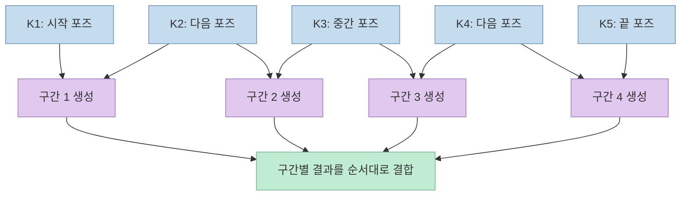
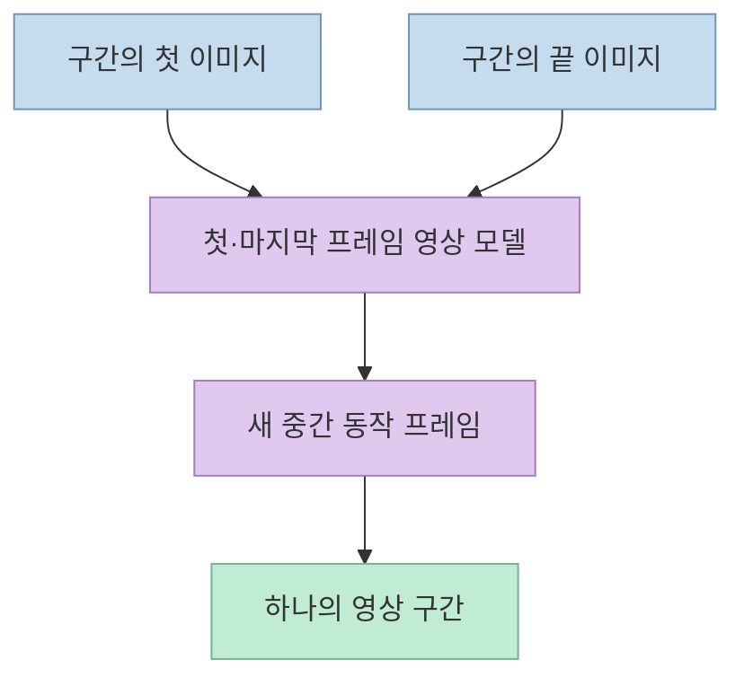
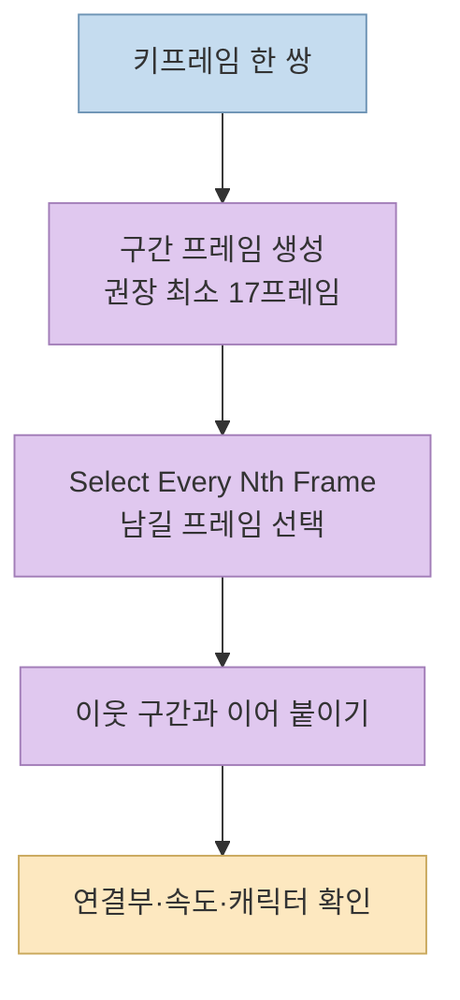

[Threads 게시물](https://www.threads.com/share/BAt_Zcvzf5/)은 몇 장의 캐릭터 포즈 이미지를 넣으면 사이 동작을 생성하고 하나의 애니메이션으로 연결하는 ComfyUI 워크플로를 소개한다. 기본 입력은 **키프레임 5장**이고, 각 구간의 해상도·생성 프레임 수·재생 속도를 조절할 수 있다는 설명이다. 핵심은 모델에 긴 영상을 한 번에 요구하는 것이 아니라 **이웃한 키프레임 두 장씩 짧은 장면을 만들고 이어 붙이는 방식**이다. [Threads 원문](https://www.threads.com/@choi.openai/post/DeM2H14gfj_), [ComfyUI 공식 소개](https://www.linkedin.com/posts/comfyui_comfyui-for-animation-keyframes-to-full-activity-7512933131734130689-BAMC).

<!--more-->

## Sources

- [원본 Threads 공유 링크](https://www.threads.com/share/BAt_Zcvzf5/) — [작성자 원문](https://www.threads.com/@choi.openai/post/DeM2H14gfj_)
- [작성자가 댓글로 공유한 Comfy Cloud 워크플로](https://cloud.comfy.org/?share=77e905e3fc4a)
- [ComfyUI 공식 키프레임 애니메이션 소개](https://www.linkedin.com/posts/comfyui_comfyui-for-animation-keyframes-to-full-activity-7512933131734130689-BAMC)
- [ComfyUI의 Wan 2.2 첫·마지막 프레임 영상 워크플로 설명](https://comfy.org/workflows/video_wan2_2_14B_flf2v-7016f027bcf1/)

## 키프레임 5장은 네 개의 생성 구간이 된다

ComfyUI의 공식 소개는 번호가 붙은 이미지 입력에 키프레임을 넣으며, 기본값이 **5장**이라고 설명한다. 다섯 장을 `K1`부터 `K5`까지 놓으면 인접한 두 장의 쌍은 `K1→K2`, `K2→K3`, `K3→K4`, `K4→K5`의 **네 구간**이다. 각 쌍마다 시작·끝 이미지를 조건으로 중간 동작을 생성하고, 생성된 구간을 순서대로 합친다. 다섯 장이 길이에 관계없이 항상 완벽한 영상 한 편을 보장한다는 뜻은 아니다. [ComfyUI 공식 소개](https://www.linkedin.com/posts/comfyui_comfyui-for-animation-keyframes-to-full-activity-7512933131734130689-BAMC), [Threads 원문](https://www.threads.com/@choi.openai/post/DeM2H14gfj_).

이 워크플로에서 키프레임은 손으로 그리거나 별도 이미지 생성 도구로 준비하는 **포즈의 기준점**이다. 공식 소개는 기본 5개 노드 그룹을 우회하거나 복제해 시퀀스 길이를 바꿀 수 있다고 말한다. 따라서 "키프레임 5장만 지원"이 아니라 **기본 5장, 그래프를 수정하면 확장 가능**이 정확한 표현이다. [ComfyUI 공식 소개](https://www.linkedin.com/posts/comfyui_comfyui-for-animation-keyframes-to-full-activity-7512933131734130689-BAMC).

## 단순 이미지 보간이 아니라 구간별 영상 생성이다

ComfyUI의 소개 영상은 인접 키프레임 한 쌍을 **Wan 2.2의 첫·마지막 프레임 영상 모델**에 넣어 구간을 만든다고 설명한다. 첫 장과 끝 장 사이를 수학적으로 선형 혼합하거나 기존 프레임을 광학 흐름만으로 늘리는 것과는 다르다. 첫·마지막 이미지를 조건으로 영상 모델이 **새 중간 프레임의 움직임과 외형**을 합성한다. ComfyUI의 별도 [Wan 2.2 FLF2V 공식 워크플로](https://comfy.org/workflows/video_wan2_2_14B_flf2v-7016f027bcf1/)도 이 생성 방식을 설명한다. 다만 그 별도 템플릿과 이번 공유 그래프의 모든 노드·설정이 같다고 단정할 근거는 없다. [ComfyUI 공식 소개](https://www.linkedin.com/posts/comfyui_comfyui-for-animation-keyframes-to-full-activity-7512933131734130689-BAMC).

이 설계의 장점은 사람이 **중요 포즈와 동작 순서**를 정하고 모델에는 상대적으로 짧은 두 포즈 사이의 변화를 맡길 수 있다는 점이다. 반대로 시작·끝 이미지의 캐릭터 의상, 시점, 배경, 팔다리 위치가 크게 충돌하면 생성기가 어떤 경로로 이어야 할지 모호해진다. 따라서 입력 이미지를 고를 때 같은 캐릭터와 장면의 일관성, 이웃 포즈 사이의 이동량을 먼저 검토하는 것이 실무적으로 유리하다. 이는 공식 워크플로의 입력 구조에서 도출한 **적용상의 판단**이며, 특정 캐릭터 일관성 수치를 보장하는 주장은 아니다. [ComfyUI 공식 소개](https://www.linkedin.com/posts/comfyui_comfyui-for-animation-keyframes-to-full-activity-7512933131734130689-BAMC), [Wan 2.2 FLF2V 설명](https://comfy.org/workflows/video_wan2_2_14B_flf2v-7016f027bcf1/).

## 길이와 속도는 구간별로 조절한다

공식 설명에 따르면 각 키프레임 쌍마다 **해상도와 생성 프레임 수**를 설정한다. ComfyUI가 제안하는 최소값은 **구간당 17프레임**이다. 그보다 짧으면 모델이 읽기 쉬운 동작을 만들 시간이 부족할 수 있다는 이유다. 이는 전체 영상의 최소 길이가 17프레임이라는 말도, 17프레임에서 언제나 좋은 결과가 나온다는 보증도 아니다. [ComfyUI 공식 소개](https://www.linkedin.com/posts/comfyui_comfyui-for-animation-keyframes-to-full-activity-7512933131734130689-BAMC).

속도 조절에는 각 구간의 생성 결과와 최종 결합 사이에 있는 **`Select Every Nth Frame`** 노드를 쓴다고 한다. 이 값이 커지면 이미 생성된 프레임을 더 듬성듬성 선택하므로, 같은 출력 프레임레이트를 유지한다는 전제에서 해당 동작이 더 짧고 빠르게 재생된다. 중요한 구분은 **모델의 생성 프레임 수**와 **완성본에 남길 프레임의 간격**이 별도 제어점이라는 것이다. 움직임이 너무 짧아 보여 생성이 어색하다면 먼저 충분한 프레임을 생성하고, 이후 선택 간격으로 리듬을 조절하라는 공식 설명을 따른다. [ComfyUI 공식 소개](https://www.linkedin.com/posts/comfyui_comfyui-for-animation-keyframes-to-full-activity-7512933131734130689-BAMC).

## 공유 링크에서 확인할 수 없는 것

작성자는 댓글에 [Comfy Cloud 공유 링크](https://cloud.comfy.org/?share=77e905e3fc4a)를 제공했다. 하지만 공개 접속 상태에서는 **로그인 화면까지만** 확인돼 이번 공유 그래프의 정확한 노드 ID, 모델 파일, 시드, 샘플러 값, GPU 사용량, 생성 비용을 직접 감사할 수 없었다. 위의 세부 원리는 **ComfyUI 공식 소개와 별도 Wan 2.2 FLF2V 설명**에 근거한다. 링크를 열 수 있는 환경이라면 실행 전 실제 그래프의 모델·노드 의존성·출력 설정을 확인해야 한다. [작성자 댓글의 공유 링크](https://www.threads.com/@choi.openai/post/DeM2JCrAbz-), [ComfyUI 공식 소개](https://www.linkedin.com/posts/comfyui_comfyui-for-animation-keyframes-to-full-activity-7512933131734130689-BAMC).

또한 "키프레임만 있으면 전체 애니메이션 완성"은 **구간 생성과 결합이 자동화된다**는 뜻으로 읽어야 한다. 컷의 접합부에서 캐릭터 얼굴·의상·팔다리 형태가 유지되는지, 동작이 튀지 않는지, 배경이 갑자기 바뀌지 않는지는 완성 영상을 보며 별도로 확인해야 한다. 특히 `Select Every Nth Frame`로 프레임을 많이 버리면 빠른 동작을 얻는 대신 중요한 중간 자세를 놓칠 수 있다. 이는 해당 워크플로 구조에서 예상되는 **검수 포인트**이지, 게시물이 보고한 특정 실패 사례는 아니다. [ComfyUI 공식 소개](https://www.linkedin.com/posts/comfyui_comfyui-for-animation-keyframes-to-full-activity-7512933131734130689-BAMC).

## 실전 적용 포인트

1. **포즈 간격부터 설계한다.** 다섯 장을 단순히 모으기보다 시작·전환·끝에서 꼭 보여야 할 자세를 시간 순서로 배치한다. 네 구간 각각이 하나의 읽기 쉬운 동작을 표현하는지 점검한다. [ComfyUI 공식 소개](https://www.linkedin.com/posts/comfyui_comfyui-for-animation-keyframes-to-full-activity-7512933131734130689-BAMC).
2. **생성 길이와 편집 속도를 따로 조절한다.** 각 쌍의 프레임 수를 충분히 확보한 뒤 `Select Every Nth Frame`로 속도를 조정한다. 처음에는 공식 권장 최소인 구간당 17프레임을 참고하되, 최종 품질은 결과로 판단한다. [ComfyUI 공식 소개](https://www.linkedin.com/posts/comfyui_comfyui-for-animation-keyframes-to-full-activity-7512933131734130689-BAMC).
3. **결합부를 가장 먼저 본다.** `K2`, `K3`, `K4`처럼 두 구간이 공유하는 포즈 주변에서 얼굴·손·배경·카메라 방향이 이어지는지 확인한다. 이는 구간 분할 방식에서 나온 실무적 검수 제안이다.
4. **공유 그래프의 의존성을 확인한다.** Comfy Cloud 링크가 로그인 후 열린다면 모델 파일, 유료·커스텀 노드, 해상도, 출력 프레임레이트를 먼저 살펴본다. 공개 화면만으로는 이 값들을 확정할 수 없다. [공유 워크플로](https://cloud.comfy.org/?share=77e905e3fc4a).

## 핵심 요약

- 기본 키프레임 **5장**을 인접한 **4개 구간**으로 나눠 영상 모델이 중간 동작을 생성한다. [ComfyUI 공식 소개](https://www.linkedin.com/posts/comfyui_comfyui-for-animation-keyframes-to-full-activity-7512933131734130689-BAMC).
- 구간당 **17프레임 이상**이 공식 권장 시작점이며, 이후 `Select Every Nth Frame`로 필요한 프레임을 골라 속도를 조절한다. [ComfyUI 공식 소개](https://www.linkedin.com/posts/comfyui_comfyui-for-animation-keyframes-to-full-activity-7512933131734130689-BAMC).
- 생성된 여러 구간은 순서대로 이어 붙이지만, 캐릭터·장면의 연속성은 최종 결과에서 검수해야 한다.
- 공유된 Comfy Cloud 그래프의 세부 설정은 로그인 없이 확인되지 않았으므로, 특정 노드 값이나 비용은 단정할 수 없다. [공유 링크](https://cloud.comfy.org/?share=77e905e3fc4a).

## 결론

이 워크플로의 핵심은 **사람이 포즈와 박자를 정하고, 영상 모델이 포즈 사이의 움직임을 맡는 분업**이다. 키프레임을 더 촘촘히 설계하면 동작의 방향을 통제하기 쉬워지고, 구간별 생성·프레임 선택·결합을 나눠 조정하면 긴 장면을 한 번에 생성하는 것보다 수정 지점을 찾기 쉽다. 다만 결과의 일관성과 공유 그래프의 실제 의존성은 직접 확인해야 한다. [ComfyUI 공식 소개](https://www.linkedin.com/posts/comfyui_comfyui-for-animation-keyframes-to-full-activity-7512933131734130689-BAMC), [작성자 공유 링크](https://cloud.comfy.org/?share=77e905e3fc4a).
