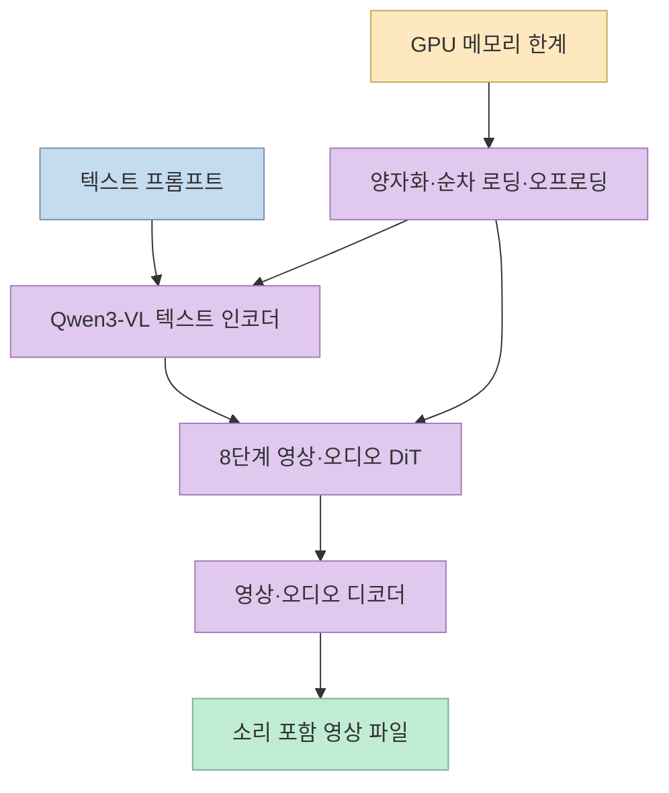
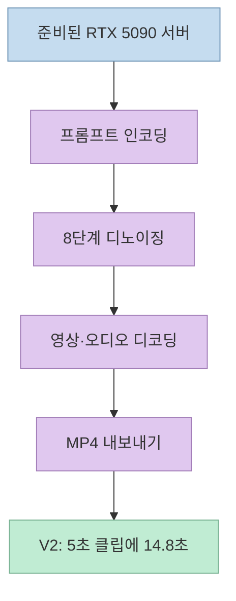
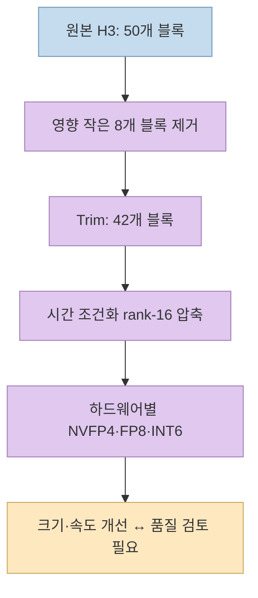

[X 게시물](https://x.com/eternityspring/status/2107635413133447631)은 FastVideo의 FastH3가 소비자용 GPU 한 대에서 작동하며, **RTX 5090에서 오디오가 포함된 5초·480p 영상을 약 15초에 만들고**, 경량형 FastH3 Trim은 **8GB VRAM에서도 실행된다**고 소개한다. 핵심 숫자는 [개발팀의 공식 발표](https://haoailab.com/blogs/fasth3-rtx/)와 맞지만, 두 문장의 **모델·정밀도·측정 장비·메모리 제한 방식**은 서로 다르다. 조건을 분리해야 자신의 PC에 적용할 수 있다.

<!--more-->

## Sources

- [원본 X 게시물](https://x.com/eternityspring/status/2107635413133447631)
- [FastVideo 공식 발표: 소비자용 하드웨어와 FastH3 Trim](https://haoailab.com/blogs/fasth3-rtx/)
- [FastVideo GitHub 저장소](https://github.com/hao-ai-lab/FastVideo)
- [FastH3 V2 모델 카드](https://huggingface.co/FastVideo/FastVideo-FastH3-8-Step-V2)
- [FastH3 Trim FP8 모델 카드](https://huggingface.co/FastVideo/FastVideo-FastH3-Trim-8-Step-FP8)

## 무엇이 새로워졌나: 원본 H3와 단일 장비 실행을 구분하기

FastH3 V2는 MiniMax H3를 기반으로 한 **8단계 증류 체크포인트**다. 텍스트에서 영상과 동기화된 오디오를 생성한다. 공식 모델 카드는 80% 희소 비디오 어텐션과 DMD2 증류를 명시하며, 원래 테스트 기본값은 **B200 GPU 4대**였다고 안내한다. 이번 발표의 변화는 V2 모델 전체를 무작정 한 GPU에 올린 것이 아니라, 양자화·계층별 전송·경량 디코더 등을 조합해 **단일 RTX, DGX Spark, Apple Silicon 경로**를 마련한 데 있다. [V2 모델 카드](https://huggingface.co/FastVideo/FastVideo-FastH3-8-Step-V2), [개발팀 발표](https://haoailab.com/blogs/fasth3-rtx/).

원본 H3의 세 구성 요소는 텍스트 인코더, 영상·오디오 잠재변수를 함께 처리하는 확산 트랜스포머, 영상·오디오를 복원하는 VAE다. 개발팀에 따르면 BF16 가중치 총량은 **137.7GiB**로, 32GB RTX 5090에 그대로 들어가지 않는다. 그래서 텍스트 인코더와 트랜스포머를 낮은 정밀도로 저장하고, 영상 VAE를 더 가벼운 디코더로 바꾸며, 일부 구성 요소를 호스트 메모리와 GPU 사이에서 이동시킨다. 이것이 "소비자용 GPU에서 실행"의 실제 의미다. [개발팀의 구성 요소·메모리 설명](https://haoailab.com/blogs/fasth3-rtx/).

## RTX 5090의 "15초"는 어떤 측정인가

공식 벤치마크에서 **FastH3 V2·NVFP4·RTX 5090 32GB** 조합은 **832×480 해상도의 5초 클립과 동기화된 오디오**를 **14.8초**에 생성했다. X 게시물의 "15초"는 이를 반올림한 것으로 읽을 수 있다. 같은 장비에서 **FastH3 Trim·NVFP4는 13.4초**였으므로, 두 모델의 값을 섞으면 안 된다. 1344×768 조건에서는 각각 **38.6초와 35.4초**로 늘어난다. [공식 측정 표](https://haoailab.com/blogs/fasth3-rtx/), [원본 X 게시물](https://x.com/eternityspring/status/2107635413133447631).

이 시간은 추론 단계만 떼어낸 숫자가 아니다. 개발팀은 **서버가 준비된 상태에서 프롬프트 입력부터 완성 MP4까지** 텍스트 인코딩, 8회 디노이징, 영상·오디오 디코딩, 내보내기를 모두 포함한 end-to-end 시간으로 정의한다. 두 프롬프트에서 각각 두 번 실행한 결과의 중앙값이다. 따라서 동일 모델이라도 콜드 스타트, 다운로드, 메모리 상황, 다른 해상도에서는 달라질 수 있다. 그리고 **5초 분량을 14.8초에 생성**한다는 말은 빠르다는 뜻이지, 생성 속도가 재생 시간보다 빠른 "실시간"을 의미하지 않는다. [공식 벤치마크 방법](https://haoailab.com/blogs/fasth3-rtx/).

## FastH3 Trim은 무엇을 줄였나

Trim은 V2의 단순한 저정밀도 파일 이름이 아니라, **별도 실험 모델**이다. 개발팀은 원본 H3 트랜스포머 50개 블록 중 영향이 작다고 측정한 **8개를 제거해 42개**로 만들고, 각 블록의 시간 단계 조건화 투영을 **공유 rank-16 기저**로 압축했다. 이어 8단계 DMD2로 학습했다. 모델 카드도 이 가지치기가 속도·크기를 줄이는 대신 품질 손실이 있을 수 있다고 명시한다. [개발팀의 Trim 설계 설명](https://haoailab.com/blogs/fasth3-rtx/), [Trim 모델 카드](https://huggingface.co/FastVideo/FastVideo-FastH3-Trim-8-Step-FP8).

공식 발표의 "**4.2배 작다**"는 비교는 **BF16 원본 H3의 전체 가중치**와 **NVFP4 구성의 Trim 전체 가중치**를 대상으로 한다. 이를 "VRAM도 정확히 4.2배 적게 쓴다"거나 "모든 모델 파일을 합쳐 8GB 이하"라고 해석하면 안 된다. 개발팀은 NVFP4 Trim 구성 요소의 총 체크포인트 크기를 **33.0GiB**로 제시한다. 8GB 실행은 필요한 계층을 그때그때 GPU로 이동시키는 방식으로 가능해지는 것이지, 가중치 전체가 8GB에 상주하기 때문이 아니다. [공식 크기·오프로딩 설명](https://haoailab.com/blogs/fasth3-rtx/).

## "8GB에서 실행"은 실제 8GB GPU 검증과 다르다

공식 표의 **8GB 행**은 **RTX 4090의 사용 가능 GPU 메모리를 8GB로 제한**해 측정한 값이다. 그 조건에서 **V2는 결과가 없고**, **Trim·FP8은 5초·832×480 클립에 82.0초**였다. 개발팀은 **실제 메모리가 더 작은 카드에서는 느려질 것**이라고 직접 주의한다. 따라서 "8GB에서 동작 가능"은 팀의 제한 환경 실험으로 뒷받침되지만, 특정 8GB 그래픽카드에서 같은 속도와 호환성이 확인됐다는 뜻은 아니다. [공식 측정 표와 한계](https://haoailab.com/blogs/fasth3-rtx/).

하드웨어별 모델 파일도 다르다. **RTX 5090 같은 Blackwell에는 NVFP4**, **RTX 4090과 더 낮은 VRAM 계층에는 FP8과 계층별 오프로딩**, **Apple Silicon에는 MLX INT6** 경로가 안내된다. Trim FP8 모델 카드의 트랜스포머 파일만도 **19.9GiB**이므로, 8GB 환경에서는 시스템 RAM·전송·오프로딩 설정까지 함께 고려해야 한다. RTX 4090의 FP8 Trim은 제한 없는 24GB에서 **43.9초**, 8GB 제한 시 **82.0초**로 차이가 난다. [공식 발표의 하드웨어별 모델 안내](https://haoailab.com/blogs/fasth3-rtx/), [Trim FP8 모델 카드](https://huggingface.co/FastVideo/FastVideo-FastH3-Trim-8-Step-FP8).

## 실전 적용 포인트

1. **속도가 우선이면 모델과 정밀도를 함께 적는다.** "FastH3 15초"가 아니라 "V2·NVFP4·RTX 5090·832×480·5초·오디오 포함·웜 서버에서 14.8초"처럼 기록해야 비교가 된다. [공식 벤치마크](https://haoailab.com/blogs/fasth3-rtx/).
2. **품질이 우선이면 V2를 먼저 비교한다.** 개발팀은 Trim을 실험 모델로 부르며 복잡한 장면의 세부 묘사가 V2보다 약할 수 있다고 설명한다. [공식 한계](https://haoailab.com/blogs/fasth3-rtx/).
3. **8GB 카드라면 성공 가능성과 운영성을 분리한다.** 팀의 8GB 수치는 메모리 제한 RTX 4090 실험이다. 자신의 카드에서는 가용 RAM, 오프로딩, 실제 생성 시간, 해상도별 품질을 직접 측정해야 한다. [공식 메모리 실험 설명](https://haoailab.com/blogs/fasth3-rtx/).
4. **모델 카드의 사용 범위와 라이선스를 확인한다.** V2 카드가 명시하는 범위는 텍스트→오디오·영상이며, FL2VA·Ref2VA는 증류되지 않았다. FastVideo 코드 저장소의 Apache-2.0과 모델 가중치에 적용되는 MiniMax H3 Community License도 구별해야 한다. [V2 모델 카드](https://huggingface.co/FastVideo/FastVideo-FastH3-8-Step-V2), [FastVideo 저장소](https://github.com/hao-ai-lab/FastVideo).

## 핵심 요약

- **14.8초**: RTX 5090에서 FastH3 V2·NVFP4가 5초·832×480 오디오 포함 영상을 완성한 팀의 end-to-end 측정값이다. [공식 발표](https://haoailab.com/blogs/fasth3-rtx/).
- **13.4초**: 같은 조건의 FastH3 Trim 값이다. V2와 혼동하지 않는다. [공식 발표](https://haoailab.com/blogs/fasth3-rtx/).
- **8GB·82.0초**: 실제 8GB 카드가 아니라 RTX 4090을 8GB로 제한한 Trim·FP8 실험값이다. [공식 발표](https://haoailab.com/blogs/fasth3-rtx/).
- Trim은 8개 블록을 제거하고 시간 조건화를 압축한 실험형 모델로, 속도와 품질 사이의 선택이 필요하다. [Trim 모델 카드](https://huggingface.co/FastVideo/FastVideo-FastH3-Trim-8-Step-FP8).

## 결론

X 게시물의 방향은 맞다. FastH3는 이제 소비자용 장비에서도 실행 경로가 있고, RTX 5090에서는 소리 포함 5초 영상을 약 15초에 만들었다. 다만 **15초와 8GB는 서로 다른 설정의 결과**다. 모델 이름, 정밀도, 해상도, 측정 장비, 오프로딩 조건을 함께 적어야 이 숫자를 자신의 작업 환경에 의미 있게 적용할 수 있다. [원본 X 게시물](https://x.com/eternityspring/status/2107635413133447631), [개발팀 발표](https://haoailab.com/blogs/fasth3-rtx/).
