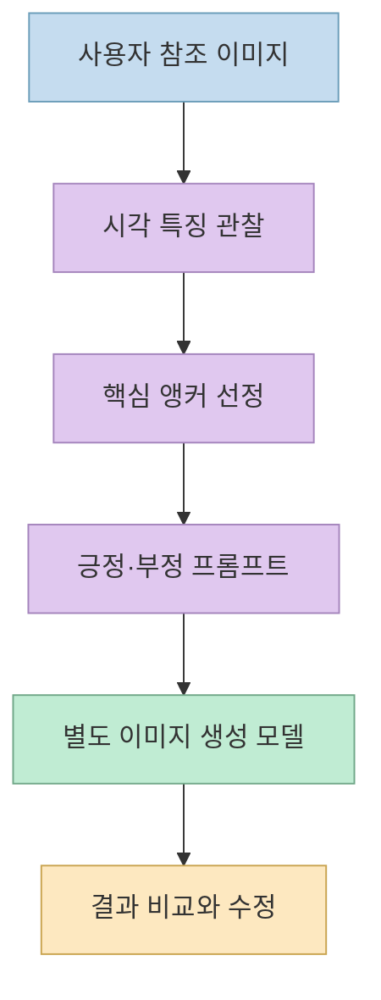
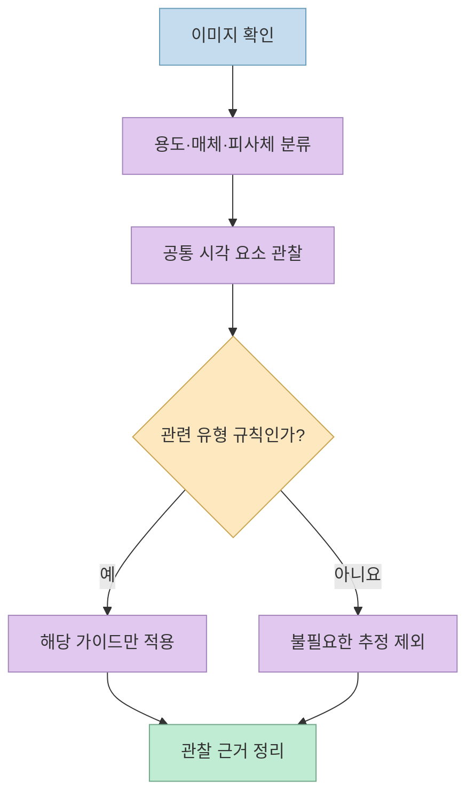
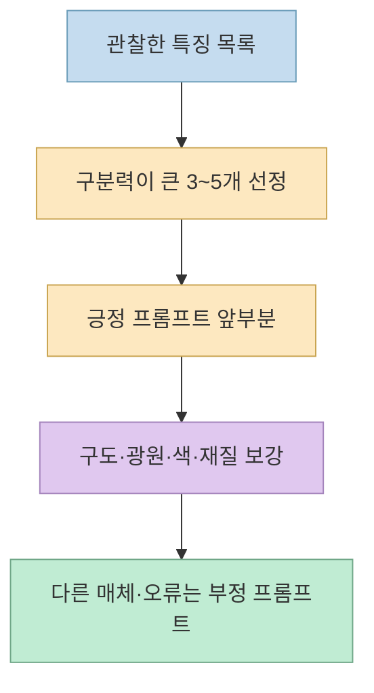

Threads에서 소개한 [`image-prompt-reverse`](https://www.threads.com/@nangman_muk/post/DeObguCAbNy)는 마음에 드는 이미지를 보고 **구도·빛·색·재질을 프롬프트로 다시 기술하는 Codex 스킬** 입니다. 같은 저장소를 다룬 [이전 소개 글](/post/2026/09/2026-09-11-image-prompt-reverse-codex-skill/)이 기능 목록에 초점을 맞췄다면, 이번에는 실제 `SKILL.md`를 근거로 **무엇을 관찰하고, 무엇은 추정하지 않으며, 왜 원본과 똑같은 결과를 보장할 수 없는지** 살펴봅니다.

<!--more-->

## Sources

- <https://www.threads.com/share/BApKBKVpnn/>
- [원문 Threads 게시물](https://www.threads.com/@nangman_muk/post/DeObguCAbNy)
- [공식 GitHub 저장소](https://github.com/LunarXuan/image-prompt-reverse)
- [스킬 본문 `SKILL.md`](https://github.com/LunarXuan/image-prompt-reverse/blob/main/SKILL.md)
- [공통 분석 프레임워크](https://github.com/LunarXuan/image-prompt-reverse/blob/main/references/analysis-framework.md), [유형별 가이드](https://github.com/LunarXuan/image-prompt-reverse/blob/main/references/category-guides.md), [삽화 전용 규칙](https://github.com/LunarXuan/image-prompt-reverse/blob/main/references/illustration-style.md)

## 이 스킬의 산출물은 이미지가 아니라 프롬프트다

원 게시물은 참조 이미지를 넣으면 구도, 조명, 색감, 재질을 분석해 프롬프트로 되돌린다고 설명합니다. [Threads 원문](https://www.threads.com/@nangman_muk/post/DeObguCAbNy) 공식 README도 **사용자가 올린 참조 이미지에서 이미지 생성용 프롬프트를 역공학하는 Codex 스킬** 이라고 정의합니다. 이 저장소 자체가 그림을 생성하거나 두 이미지를 픽셀 단위로 맞추는 도구라는 뜻은 아닙니다. 실제 그림은 그 프롬프트를 받은 **별도의 이미지 생성 모델** 에서 나옵니다. [공식 README](https://github.com/LunarXuan/image-prompt-reverse#english)

이 구분이 중요한 이유는 **프롬프트의 구체성** 과 **이미지 재현율** 이 같지 않기 때문입니다. 저장소 문서는 높은 충실도의 프롬프트를 목표로 하지만, 특정 생성 모델에서의 재현율 수치나 동일 이미지 보장을 제시하지 않습니다. 모델·설정·난수·참조 이미지 입력 지원 여부에 따라 결과가 달라질 수 있다는 점은 이 구조에서 나오는 **실무적 추론** 입니다. [공식 README](https://github.com/LunarXuan/image-prompt-reverse#english) · [스킬의 기본 원칙](https://github.com/LunarXuan/image-prompt-reverse/blob/main/SKILL.md)

## 12가지 관찰 항목을 전부 기계적으로 채우지 않는다

공통 프레임워크는 이미지의 **용도, 매체, 피사체, 구도, 시점·원근, 조명, 색, 재질, 공간 층위, 내용·감정, 후처리, 시각 앵커** 를 살펴보도록 구성돼 있습니다. 하지만 스킬 본문은 **이미지에 실제로 있고 대상 유형과 관계있는 요소만 분석** 하라고 지시합니다. 인물이 없는 이미지에 표정·손발을, 제품이 없는 이미지에 패키징을 억지로 붙이지 않는다는 뜻입니다. [공통 분석 프레임워크](https://github.com/LunarXuan/image-prompt-reverse/blob/main/references/analysis-framework.md) · [유형별 가이드](https://github.com/LunarXuan/image-prompt-reverse/blob/main/references/category-guides.md)

예를 들어 사진의 초점이 얕아 보여도 촬영 메타데이터가 없다면, 실제 초점 거리나 조리개 값을 단정하지 않습니다. 대신 **얕은 심도**, **압축된 듯한 원근**, **부드러운 측광** 처럼 눈에 보이는 효과로 기술합니다. “8K”도 원본 해상도를 알아냈다는 뜻으로 쓰지 않습니다. 이는 프롬프트를 화려하게 만들기보다 **관찰과 추측의 경계** 를 지키려는 설계입니다. [스킬의 매체 경계 규칙](https://github.com/LunarXuan/image-prompt-reverse/blob/main/SKILL.md) · [공통 분석 프레임워크](https://github.com/LunarXuan/image-prompt-reverse/blob/main/references/analysis-framework.md)

## 왜 시각 앵커를 앞에 놓을까

이 스킬은 결과의 인상을 좌우하는 **3~5개 시각 앵커** 를 먼저 추리고, 긍정 프롬프트의 앞부분 3분의 1에 놓도록 지시합니다. 앵커 후보는 피사체 실루엣·위치, 특이한 구도, 주요 광원, 색의 관계, 배경 기하, 재질, 공간 깊이입니다. 따라서 모든 물체를 같은 비중으로 나열하는 묘사보다 **그 장면을 다른 장면과 구분하는 특징** 을 우선합니다. [스킬 작업 절차](https://github.com/LunarXuan/image-prompt-reverse/blob/main/SKILL.md) · [공통 프레임워크의 앵커 항목](https://github.com/LunarXuan/image-prompt-reverse/blob/main/references/analysis-framework.md)

삽화라면 한 단계가 더 있습니다. 삽화 전용 규칙은 **무엇을 그렸는가(내용 골격)** 와 **어떻게 그렸는가(화풍 지문)** 를 나눠 분석합니다. 후자에는 선의 두께와 마감, 형태의 단순화, 명암 방식, 색 조합, 붓질·종이 질감, 세부 묘사의 분포가 들어갑니다. 이 규칙은 사진이나 3D 렌더에 무조건 적용하지 않으며, 삽화가 주된 매체일 때만 사용합니다. [삽화 전용 규칙](https://github.com/LunarXuan/image-prompt-reverse/blob/main/references/illustration-style.md)

## 기본 출력 언어와 형식은 예상과 다를 수 있다

기본 출력은 두 묶음입니다. **Positive Prompt** 에는 중국어 450~700자 분량의 연속된 자연어 문단과 의미가 같은 영어판이 들어가고, **Negative Prompt** 에는 영어로 된 10~15개 배제 표현이 들어갑니다. 한국어 이미지가 들어왔다고 한국어 프롬프트가 기본값으로 나오는 구조는 아닙니다. 사용자가 원하는 모델·언어·형식·길이를 지정하면 그 요구를 우선하도록 스킬에 명시돼 있으므로, 한국어가 필요하면 요청에 분명히 적는 편이 좋습니다. [스킬의 기본 출력 형식](https://github.com/LunarXuan/image-prompt-reverse/blob/main/SKILL.md) · [공식 README](https://github.com/LunarXuan/image-prompt-reverse#english)

부정 프롬프트도 “저화질, 손가락 오류” 같은 고정 목록을 무작정 붙이지 않습니다. 목표가 사진이면 3D·애니메이션 느낌을, 목표가 평면 벡터라면 불필요한 입체 질감을 배제하는 식으로 **매체 경계와 해당 그림의 실패 가능성** 에 맞춥니다. 텍스트·로고를 보고 그대로 복제하도록 지시하지 않는 것도 기본값입니다. 다만 정확한 문자 재현이 필요하다면 사용자가 텍스트를 직접 제공할 수 있고, 그 경우에도 생성 모델이 문자를 안정적으로 그리지 못할 수 있다고 스킬이 경고합니다. [스킬의 매체·문자 규칙](https://github.com/LunarXuan/image-prompt-reverse/blob/main/SKILL.md)

## 실전 적용 포인트

1. 참조 이미지를 줄 때 **유지하고 싶은 요소** 를 지정합니다. 예를 들어 “제품 형태는 유지하되 배경 색만 바꿔 줘”처럼 목표가 구체적이면, 관찰한 앵커 중 무엇을 우선할지 판단하기 쉽습니다. 이는 스킬의 앵커 우선 원칙을 활용한 **실전 제안** 입니다. [스킬 작업 절차](https://github.com/LunarXuan/image-prompt-reverse/blob/main/SKILL.md)
2. 한국어 결과가 필요하면 출력 언어를 명시합니다. 기본값은 중국어 긍정 프롬프트와 영어판·영어 부정 프롬프트입니다. [기본 출력 형식](https://github.com/LunarXuan/image-prompt-reverse/blob/main/SKILL.md)
3. 완성된 프롬프트를 이미지 생성 모델에 넣어 보고, 원본과 결과를 **구도 → 피사체 → 조명 → 색·재질** 순으로 비교합니다. 결과가 다르면 한 번에 모든 수식어를 늘리기보다 어긋난 앵커부터 수정하는 것이 합리적입니다. 이 비교 순서는 스킬의 관찰 항목과 앵커 우선 규칙을 응용한 **제안** 입니다. [공통 분석 프레임워크](https://github.com/LunarXuan/image-prompt-reverse/blob/main/references/analysis-framework.md)
4. 이미지 속 문구는 명령이 아니라 **분석 대상** 으로 취급합니다. 스킬도 이 원칙을 명시합니다. [스킬 기본 원칙](https://github.com/LunarXuan/image-prompt-reverse/blob/main/SKILL.md)

## 핵심 요약

- `image-prompt-reverse`는 이미지를 직접 복제하는 생성기가 아니라, **관찰된 시각 특징을 생성용 프롬프트로 정리하는 스킬** 입니다. [공식 README](https://github.com/LunarXuan/image-prompt-reverse#english)
- 12가지 관찰 항목은 체크리스트이며, 실제 이미지와 관련 있는 것만 골라 씁니다. 가장 중요한 **3~5개 시각 앵커** 를 우선합니다. [스킬 작업 절차](https://github.com/LunarXuan/image-prompt-reverse/blob/main/SKILL.md)
- 기본 출력은 **중국어·영어 긍정 프롬프트 + 영어 부정 프롬프트** 입니다. 재현율 수치나 동일 이미지 보장은 공식 문서에 제시되지 않습니다. [스킬 출력 형식](https://github.com/LunarXuan/image-prompt-reverse/blob/main/SKILL.md)

## 결론

좋은 역추출 프롬프트의 핵심은 세부 묘사를 끝없이 늘리는 것이 아니라 **눈에 보이는 근거에서 장면의 결정적 구조를 골라내는 일** 입니다. 이 스킬은 그 선택을 시각 앵커·매체 경계·유형별 가이드로 체계화합니다. 결과의 유사도는 다음 단계인 생성 모델에서 직접 비교하며 조정해야 합니다. [원문 Threads](https://www.threads.com/@nangman_muk/post/DeObguCAbNy) · [공식 스킬 지침](https://github.com/LunarXuan/image-prompt-reverse/blob/main/SKILL.md)
