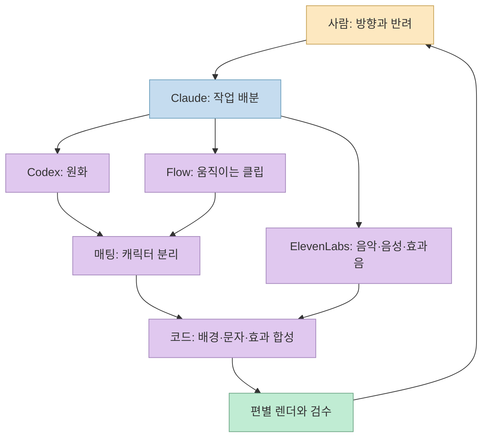
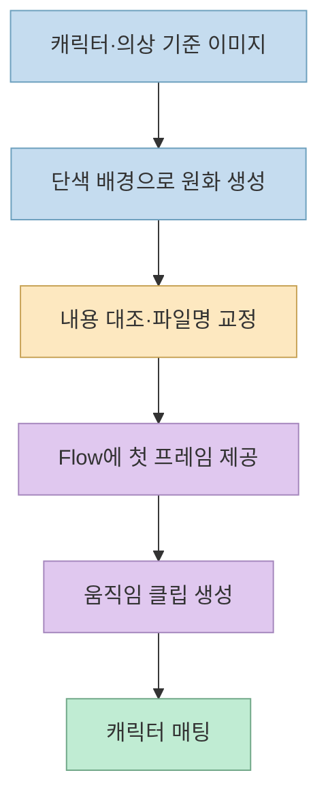
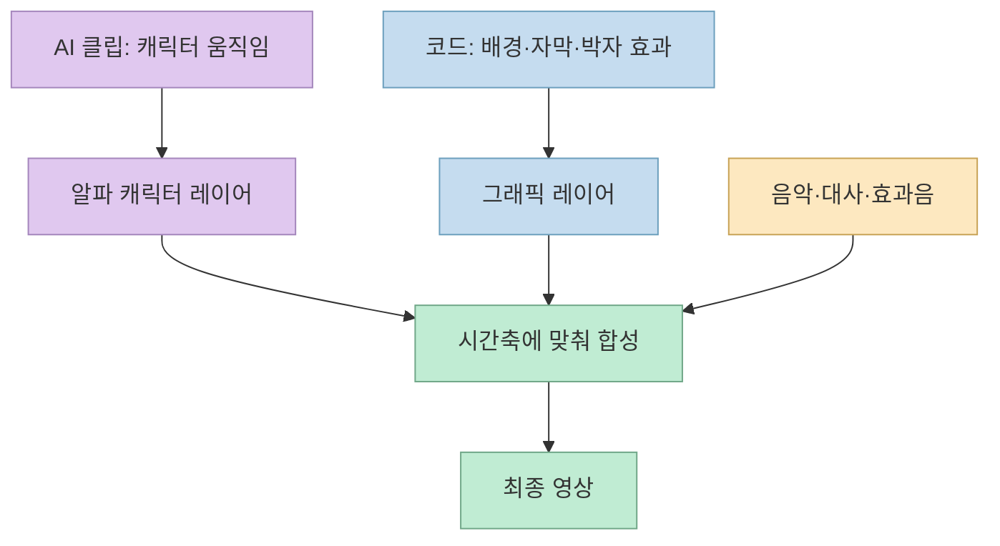
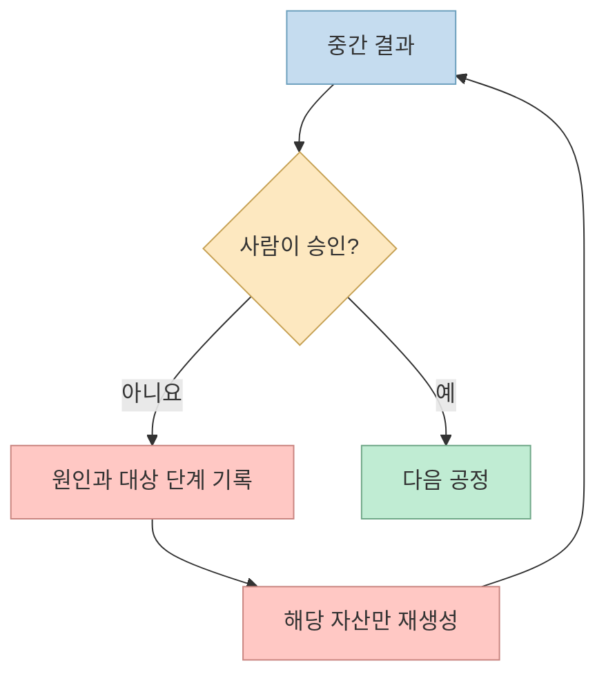

한 제작자가 「악역영애 말포이」 밈을 소재로 AI 영상 다섯 편을 만들고, **프롬프트·에이전트 배선·제작 기록** 을 공개했습니다. [원 Threads 글](https://www.threads.com/@specal1849/post/DeODwnYERYd)의 흥미로운 지점은 “AI가 영상을 전부 만들었다”가 아닙니다. **AI에는 캐릭터와 움직임을, 코드에는 정확한 글자·배경·박자를 맡기고, 사람이 반려하며 방향을 고친 구조** 에 있습니다. 제작 과정의 수치와 성과는 제작자의 기록이므로, 재현 가능한 설계와 개인 사례를 구분해 읽겠습니다.

<!--more-->

## Sources

- <https://www.threads.com/share/BAVyaVYYgf/>
- [원문 Threads 게시물](https://www.threads.com/@specal1849/post/DeODwnYERYd)과 [도구·병렬 작업 설명](https://www.threads.com/@specal1849/post/DeOEeoHlBlT)
- [제작기·다섯 편 결과물·자료 모음](https://malfoy-meme-making.vercel.app/)
- [공개 제작 키트 README](https://malfoy-meme-making.vercel.app/download/kit/README.md)와 [프롬프트 목록](https://malfoy-meme-making.vercel.app/download/kit/prompts/README.md)
- [Google Flow 공식 사용 도움말](https://support.google.com/flow/answer/16353334?hl=en), [ElevenLabs 효과음 API 문서](https://elevenlabs.io/docs/api-reference/text-to-sound-effects/convert)

## 다섯 편은 어떻게 분업했나

제작자는 한 소재로 **가챠 연출, 캐릭터 쇼케이스, 한국어 로판 오프닝, 고속 편집 영상, 영어판 오프닝** 의 다섯 결과물을 만들었다고 설명합니다. 이어지는 Threads 글에는 음악·효과음·대사는 ElevenLabs, 영상 클립은 Google Flow, 전체 지휘와 편집은 Claude Opus 5.5를 썼다고 적었습니다. 제작 사이트의 상세 기록에는 이미지 생성에 Codex도 참여했다고 나옵니다. 즉 결과물 다섯 개를 각자 처음부터 끝까지 만드는 방식이 아니라, **공통 자산을 준비하고 편별로 다시 조합** 한 작업입니다. [제작 사이트](https://malfoy-meme-making.vercel.app/) · [도구 설명](https://www.threads.com/@specal1849/post/DeOEeoHlBlT)

게시물은 병렬 작업의 이유를 “누가 무엇을 만들었는지 추적하고 수정하기 쉽게 하기 위해서”라고 설명합니다. [제작자 설명](https://www.threads.com/@specal1849/post/DeOEeoHlBlT) 이 사례에서 병렬화의 핵심은 무작정 많은 에이전트를 켜는 것이 아니라, **산출물과 책임을 분리하는 것** 입니다. 공개 키트도 이미지 프롬프트, Flow 작업, 오디오, 합성 스크립트, 파이프라인 상태를 각각 다른 파일로 남겼습니다. [키트 README](https://malfoy-meme-making.vercel.app/download/kit/README.md)

## 이미지 생성과 영상 생성을 왜 분리했나

제작기는 캐릭터 이미지를 먼저 만든 뒤, 그 이미지를 Flow의 **첫 프레임** 으로 주는 원칙을 강조합니다. 텍스트만으로 영상부터 만들면 캐릭터의 얼굴·의상이 컷마다 달라질 수 있으므로, 출발 이미지를 고정해 일관성을 높이려는 선택입니다. Google의 공식 Flow 도움말도 시작·끝 프레임을 넣는 방식과 캐릭터 참조 방식을 별도로 안내합니다. 다만 어느 방식이 항상 더 낫다는 보장은 없고, 공개 제작기에서는 단색 배경 유지에 첫 프레임 방식이 유리했다고 보고합니다. [제작기](https://malfoy-meme-making.vercel.app/) · [Flow 도움말](https://support.google.com/flow/answer/16353334?hl=en)

여기서 **매팅** 은 영상 속 캐릭터를 배경에서 떼어 내 투명한 레이어로 만드는 단계입니다. 이 제작자는 원화 배경을 파란 단색으로 만들고, 색차 키와 AI 마스크를 조합했다고 기록했습니다. 이렇게 분리해야 캐릭터 뒤에 코드로 만든 그래픽을 자유롭게 배치할 수 있습니다. 반대로 머리카락, 의상 안감, 원본 배경에 파란색이 섞여 있으면 경계가 깨질 수 있으므로 최종 프레임 확인이 필요합니다. 마지막 문장은 이 처리 방식에서 도출되는 **일반적인 검수 포인트** 입니다. [제작기](https://malfoy-meme-making.vercel.app/) · [키트의 단계별 재실행 순서](https://malfoy-meme-making.vercel.app/download/kit/README.md)

제작자의 기록에는 병렬 이미지 생성 후 **파일명과 실제 이미지 내용이 어긋난 사고** 도 있습니다. 그래서 `final_file`처럼 최종 채택 파일을 명시하고, 이미지 내용을 확인해 이름을 교정한 흔적을 공개 프롬프트 목록에 남겼습니다. 에이전트에게 파일을 넘길 때 경로가 존재하는지만 확인해서는 부족합니다. **그 경로의 이미지가 의도한 캐릭터·의상·장면인지** 검증해야 합니다. [프롬프트 목록의 파일명 교정 설명](https://malfoy-meme-making.vercel.app/download/kit/prompts/README.md)

## 뒤에서 움직이는 글자는 왜 코드로 만들었나

원 Threads 글은 특히 캐릭터 뒤로 올라오는 모션 그래픽을 강조합니다. [원 게시물](https://www.threads.com/@specal1849/post/DeODwnYERYd) 제작 사이트를 보면 캐릭터·장소 같은 **그림 자산** 과, 문자·띠·플래시·카메라 이동 같은 **시간에 민감한 연출** 을 분리했습니다. 제작자는 후자를 코드로 구현했다고 설명합니다. 이는 생성 모델에 모든 프레임의 글자 위치와 음악 박자까지 맡기기보다, 재생 시각과 좌표를 명시할 수 있는 렌더링 단계로 넘긴 설계입니다. [제작기](https://malfoy-meme-making.vercel.app/)

제작기는 빠른 편집 영상에 많은 컷과 화면 확대·속도 변화·색 분리 효과를 넣었다고 보고합니다. 이 수치는 **제작자의 자기 보고** 로 읽어야 합니다. 재현에 더 중요한 원리는 효과 개수가 아니라 **각 효과의 시작 시각·지속 시간·레이어가 데이터로 관리되었는지** 입니다. 그래야 컷 하나를 고쳐도 전체를 다시 손으로 맞추지 않아도 됩니다. [제작기](https://malfoy-meme-making.vercel.app/) · [키트의 파이프라인 정의](https://malfoy-meme-making.vercel.app/download/kit/README.md)

## 공개된 하네스는 무엇을 재현하고, 무엇을 재현하지 못하나

공개 키트에는 `pipeline.yaml`, 상태 스키마, LangGraph 골격, 이미지·Flow·오디오 프롬프트, 검증 스크립트와 합성 도구가 들어 있다고 안내합니다. 프롬프트 목록은 **최종 결과물에 채택된 항목** 위주이며, 탈락한 후보와 테스트 작업은 일부 제외했다고 명시합니다. 따라서 키트는 제작 결과를 추적하고 구조를 배우기 좋은 자료지만, 당시의 모든 시행착오를 그대로 담은 완전한 실행 기록은 아닙니다. [키트 README](https://malfoy-meme-making.vercel.app/download/kit/README.md) · [프롬프트 포함·제외 기준](https://malfoy-meme-making.vercel.app/download/kit/prompts/README.md)

재실행에도 조건이 있습니다. 키트는 Codex 로그인, Google Flow 계정과 크레딧, ElevenLabs 계정·키, 브라우저 자동화, FFmpeg, Python 의존성 등을 열거합니다. 특히 제작자가 Threads에서 “사용된 API”라고 부른 Flow 경로는 키트 설명상 **별도 Flow API 호출이 아니라 Aside 브라우저로 웹 UI를 조작** 한 방식입니다. 키트에는 일부 하드코딩된 작업 경로가 남았고 원본 이미지·영상·음원 파일은 포함되지 않았다고 하므로, 압축 파일을 내려받는 것만으로 같은 영상이 즉시 재생성되지는 않습니다. [Threads의 도구 설명](https://www.threads.com/@specal1849/post/DeOEeoHlBlT) · [키트의 필요 계정·도구 및 주의](https://malfoy-meme-making.vercel.app/download/kit/README.md)

음성·효과음은 ElevenLabs를 썼다고 기록돼 있습니다. [ElevenLabs 공식 API 문서](https://elevenlabs.io/docs/api-reference/text-to-sound-effects/convert)는 효과음 생성에 텍스트와 길이 등 매개변수를 제공하지만, **생성된 소리가 원하는 박자와 발음을 항상 만족한다는 뜻은 아닙니다**. 실제 제작기도 음성 인식으로 발음이 어긋난 테이크를 거르고, 한국어 보컬이 마음에 들지 않아 영어판을 별도로 만들었다고 적었습니다. 이는 자동 측정과 사람의 청감 판단이 다른 역할을 한다는 사례입니다. [제작기](https://malfoy-meme-making.vercel.app/)

## 빠르게 만든 비결보다 중요한 실패 복구

제작자는 사람의 반려가 이미지 기반 영상 강제, 의상 다양화, 보컬 언어 변경 같은 방향 전환을 만들었다고 설명합니다. 즉 “손으로 프레임을 편집하지 않았다”는 말은 **사람의 판단이 없었다** 는 뜻이 아닙니다. 공개 파이프라인은 승인·반려가 들어오면 관련 단계로 되돌아가는 상태 전이를 기록합니다. [제작기](https://malfoy-meme-making.vercel.app/) · [키트 README](https://malfoy-meme-making.vercel.app/download/kit/README.md)

병렬화에도 한계가 드러났습니다. 제작기는 무거운 FFmpeg 작업을 과하게 동시에 실행해 환경이 불안정해졌고, 이후 동시 실행 수를 제한했다고 적습니다. 합성 도구가 투명 알파 영상을 처리하지 못할 때는 배경 렌더와 캐릭터 합성을 별도 경로로 나눴습니다. **자산 생성은 병렬화하되, 메모리·GPU를 많이 쓰는 렌더와 매팅은 제한** 하는 편이 합리적이라는 교훈입니다. 이는 제작자 환경의 사례이지, 모든 PC에서 동일한 성능 수치가 나온다는 뜻은 아닙니다. [제작기](https://malfoy-meme-making.vercel.app/)

## 실전 적용 포인트

1. 한 편의 목표 형식·길이·화면 비율·음성 언어를 먼저 고정하고, **이미지 → 영상 클립 → 캐릭터 분리 → 코드 합성 → 오디오 → 검수** 순서로 자산 계약을 정합니다. [키트의 재실행 순서](https://malfoy-meme-making.vercel.app/download/kit/README.md)
2. 생성된 파일마다 `프롬프트 ID`, `실제 내용`, `최종 파일 경로`, `채택 여부`를 남깁니다. 파일명 오류가 생겨도 잘못된 그림이 다음 단계로 넘어가지 않게 하기 위해서입니다. [프롬프트 목록](https://malfoy-meme-making.vercel.app/download/kit/prompts/README.md)
3. AI에는 표정·몸짓처럼 생성이 필요한 부분을 맡기고, 정확한 글자·박자·위치는 코드 합성으로 제어할지 결정합니다. 이는 **이번 사례에서 작동한 역할 분리** 이며 다른 장르에는 조정이 필요합니다. [제작기](https://malfoy-meme-making.vercel.app/)
4. 공개 키트를 활용하더라도 계정·크레딧·경로·원본 자산 누락을 먼저 확인합니다. 또한 특정 작품의 명칭을 프롬프트에서 빼는 것만으로 **2차 창작물의 권리 문제가 해결되지는 않습니다**. 키트 자체도 상업 이용을 권장하지 않는다고 명시합니다. [키트의 필요 도구와 권리 주의](https://malfoy-meme-making.vercel.app/download/kit/README.md)

## 핵심 요약

- 이 사례의 중심은 “영상 AI 하나”가 아니라 **원화·움직임·매팅·코드 그래픽·오디오를 분리한 제작 파이프라인** 입니다. [제작기](https://malfoy-meme-making.vercel.app/)
- 병렬 작업은 속도뿐 아니라 **어느 자산을 다시 만들어야 하는지 추적할 수 있게 하는 구조** 로 쓰였습니다. [Threads의 작업 설명](https://www.threads.com/@specal1849/post/DeOEeoHlBlT)
- 공개 키트는 프롬프트와 하네스 구조를 보여 주지만, 유료 계정·크레딧·누락된 원본 자산·환경 설정까지 해결해 주지는 않습니다. [키트 README](https://malfoy-meme-making.vercel.app/download/kit/README.md)

## 결론

이 제작 사례의 재사용 가능한 아이디어는 “하룻밤에 다섯 편”이라는 숫자보다 **생성 가능한 것과 정확히 제어해야 하는 것을 다른 공정으로 나눈 것** 입니다. 사람은 방향을 정하고 반려했으며, 에이전트는 그 결정을 이미지·클립·소리·합성 단계로 전달했습니다. 같은 방식으로 실험한다면 공개 프롬프트를 그대로 복사하기보다, 먼저 자신의 자산 계약과 검수·반려 경로부터 설계하는 것이 출발점입니다. [원문 Threads](https://www.threads.com/@specal1849/post/DeODwnYERYd) · [공개 제작기](https://malfoy-meme-making.vercel.app/)
