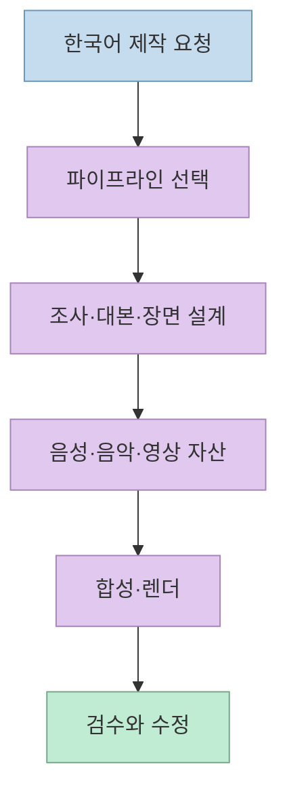
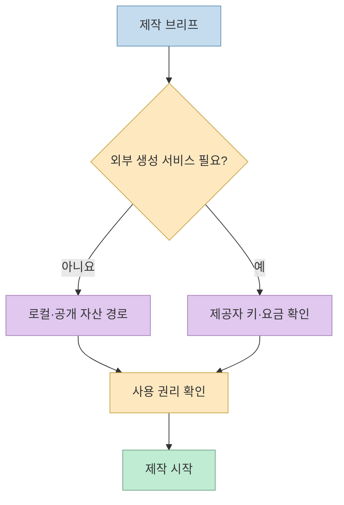
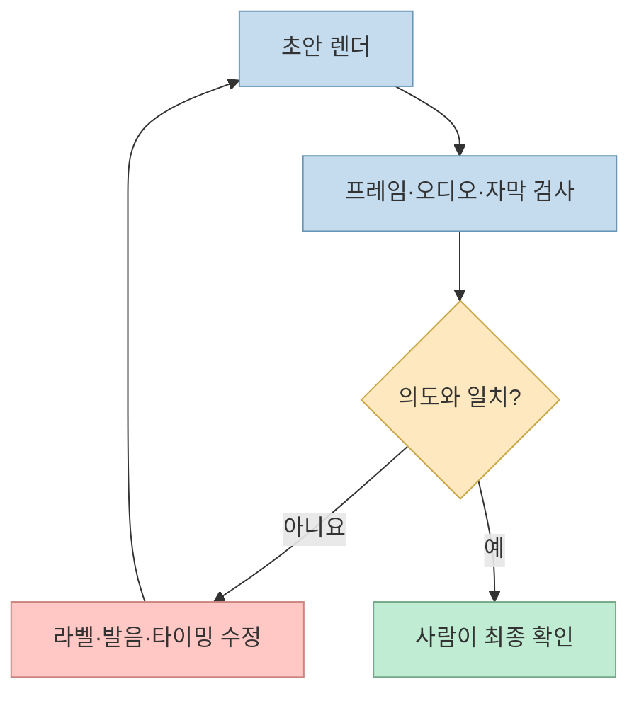

“깃 브랜치를 30초 애니메이션 영상으로 설명해 줘. 한국어로.” 짧은 요청 뒤에 내레이션과 자막을 갖춘 영상이 나온다는 [OpenMontage 쇼츠](https://youtu.be/zjYCZYkUIXU?t=22)는 매력적입니다. 다만 **한 줄 요청이 가능한 것** 과 **설치·비용·품질이 언제나 한 번에 해결되는 것** 은 다른 이야기입니다. 이 글은 기존의 [OpenMontage 구조 소개 글](/post/2026/06/2026-06-25-openmontage-agentic-video-production-system/)과 달리, 이번 시연의 재현 조건과 확인 지점을 중심으로 살펴봅니다.

<!--more-->

## Sources

- <https://youtube.com/shorts/zjYCZYkUIXU?si=RlRV3cCzs-lOTogT>
- [OpenMontage 공식 저장소 및 README](https://github.com/calesthio/OpenMontage)
- [OpenMontage 에이전트 작업 지침](https://github.com/calesthio/OpenMontage/blob/main/AGENT_GUIDE.md)

## 영상이 보여 준 것과 실제 제작 단계

쇼츠는 한국어 요청으로 만든 모션 그래픽을 보여 주면서, 대본·녹음·편집을 따로 처리하는 대신 Claude Code가 자료 조사, 대본, 장면 구성을 차례로 진행한다고 설명합니다. [영상 0~18초](https://youtu.be/zjYCZYkUIXU?t=0)에서 말하는 “설계도”는 이해를 돕는 비유입니다. 공식 저장소 기준으로는 **파이프라인 정의, 에이전트 지침, 도구, 렌더링 구성 요소를 묶은 오픈소스 제작 시스템** 에 더 가깝습니다. Claude Code뿐 아니라 Cursor·Copilot·Windsurf·Codex도 지원 대상으로 명시되어 있습니다. [공식 README](https://github.com/calesthio/OpenMontage#quick-start)



즉 “프롬프트 한 줄”은 **제작 지시의 입구** 입니다. 조사할 주제, 원하는 영상 길이, 세로형 여부, 나레이션 언어, 자막, 사용할 자산의 출처까지 브리프에 명시할수록 결과를 검토하기 쉽습니다. 공식 지침은 파이프라인 선택과 단계별 실행을 요구하며, 승인 지점도 둘 수 있습니다. 따라서 한 번 입력하면 언제나 무인으로 완성된다는 뜻은 아닙니다. [공식 에이전트 지침](https://github.com/calesthio/OpenMontage/blob/main/AGENT_GUIDE.md)

## “설치는 한 줄”과 “API 키 없이”의 정확한 범위

영상은 설치 명령이 고정 댓글에 한 줄이라고 말하지만, 이 글에서는 확인되지 않은 댓글 명령 대신 공식 README의 설치 절차를 기준으로 삼습니다. [영상 19초](https://youtu.be/zjYCZYkUIXU?t=19) · [공식 Quick Start](https://github.com/calesthio/OpenMontage#quick-start)

```bash
git clone https://github.com/calesthio/OpenMontage.git
cd OpenMontage
make setup
```

실행 전에는 **Python 3.10 이상, FFmpeg, Node.js 18 이상, AI 코딩 어시스턴트** 가 필요합니다. 설치 후 저장소를 코딩 어시스턴트에서 열고 제작 요청을 전달하는 방식입니다. 이 준비 단계까지 합치면 “요청 한 줄”과 “환경 구성 한 줄”은 같지 않습니다. [공식 Quick Start](https://github.com/calesthio/OpenMontage#quick-start)

공식 README는 외부 제공자의 API 키를 **선택 사항** 으로 설명하고, 키 없이 사용할 수 있는 Piper TTS, 공개 아카이브 영상, Remotion·HyperFrames 합성, FFmpeg 후반 작업, 내장 자막 기능을 열거합니다. [영상 25초](https://youtu.be/zjYCZYkUIXU?t=25) · [공식 무료 도구 설명](https://github.com/calesthio/OpenMontage#what-you-get-with-zero-api-keys) 다만 이는 **모든 구성과 사용량이 무료** 라는 말이 아닙니다. 사용 중인 코딩 어시스턴트의 이용 조건, 로컬 장비 자원, 선택한 유료 이미지·영상·음성 제공자에 따라 비용과 속도가 달라집니다.



저장소 코드의 AGPL-3.0 라이선스와 영상에 쓰는 음악·푸티지·이미지의 이용 조건도 별개입니다. 공개 아카이브 자료라고 해서 모든 자산이 같은 라이선스를 갖는 것은 아니므로, 배포 전에는 **각 자산의 출처와 사용 조건을 따로 확인** 해야 합니다. [공식 저장소 라이선스](https://github.com/calesthio/OpenMontage#license) · [README의 자산 경로](https://github.com/calesthio/OpenMontage#what-you-get-with-zero-api-keys)

## “15분 안팎”과 자동 검수는 보장이 아니다

쇼츠는 API 키 없이 약 15분에 30초짜리 한국어 영상이 나온다고 소개합니다. 이것은 **영상이 제시한 사례** 이지, 동일한 길이·품질·제작 시간이 모든 환경에서 보장된다는 벤치마크는 아닙니다. 장비 성능, 선택한 파이프라인과 소재, 음성 생성, 다운로드, 렌더링 및 재시도 여부가 결과를 바꿀 수 있습니다. [영상 25~30초](https://youtu.be/zjYCZYkUIXU?t=25) · [공식 파이프라인 안내](https://github.com/calesthio/OpenMontage#pipelines)

영상은 렌더 전에 장면을 캡처해 어긋난 라벨까지 고친다고 설명합니다. [영상 30초](https://youtu.be/zjYCZYkUIXU?t=30) README에도 **ffprobe 검사, 프레임 샘플링, 오디오 레벨 분석, 전달 요건 및 자막 검사** 가 명시되어 있습니다. 다만 검수 절차가 있다는 사실과 모든 한국어 오탈자·레이블 위치·발음을 자동으로 정확히 고친다는 보장은 구분해야 합니다. 최종 장면과 소리를 사람이 보는 편이 안전합니다. [공식 Quick Start의 self-review 설명](https://github.com/calesthio/OpenMontage#quick-start)



## 한국어 자막과 12가지 방식, 어디까지 확인됐나

쇼츠는 한국어 내레이션·음악·자막이 붙은 결과를 보여 주고, 설명 영상 외에 다큐멘터리와 토킹 헤드를 포함한 **12가지 제작 방식** 을 언급합니다. [영상 27~38초](https://youtu.be/zjYCZYkUIXU?t=27) 공식 저장소 소개도 12개 파이프라인을 표기합니다. 다만 **이 시연에서 사용한 정확한 파이프라인, 음성 모델, 글꼴, 자막 설정은 영상만으로 확정할 수 없습니다.** [공식 저장소](https://github.com/calesthio/OpenMontage)

특히 한국어 결과물을 재현할 때는 자막이 만들어졌는지만 보지 말고, **고유명사 표기·줄바꿈·화면 밖 잘림·발음·배경음과 음성의 균형** 을 확인해야 합니다. 이는 영상이 증명한 자동 기능 목록이 아니라, [영상의 한국어 결과 사례](https://youtu.be/zjYCZYkUIXU?t=33)를 실제 배포물로 바꿀 때 필요한 검수 기준입니다.

## 실전 적용 포인트

1. 공식 README의 선행 조건을 설치하고 `make setup`으로 시작합니다. 고정 댓글의 명령은 별도로 검증하기 전까지 공식 절차를 대신하지 않게 합니다. [공식 Quick Start](https://github.com/calesthio/OpenMontage#quick-start)
2. 첫 시도는 영상의 예시처럼 **깃 브랜치 설명·30초·한국어** 로 범위를 작게 잡되, 세로형 비율과 자막 요구까지 명시합니다. [영상의 요청 예시](https://youtu.be/zjYCZYkUIXU?t=22)
3. 외부 API 키를 넣기 전에 무료/로컬 경로에서 가능한 자산과 TTS를 확인하고, 선택한 제공자의 과금 조건을 점검합니다. [공식 무료 도구 설명](https://github.com/calesthio/OpenMontage#what-you-get-with-zero-api-keys)
4. 자동 검수 뒤에도 결과를 끝까지 재생해 한국어 라벨, 자막 타이밍, 음량, 자산 이용 조건을 확인합니다. [공식 self-review 설명](https://github.com/calesthio/OpenMontage#quick-start)

## 핵심 요약

- 영상의 “한 줄 요청”은 복잡한 제작 과정을 에이전트에 **위임하는 인터페이스** 를 뜻합니다. 설치와 최종 검토가 없어지는 것은 아닙니다. [영상 11~25초](https://youtu.be/zjYCZYkUIXU?t=11)
- 외부 API 키 없는 경로는 공식적으로 안내되지만, 이를 무조건 **총비용 0원** 이나 **항상 15분 완성** 으로 읽으면 안 됩니다. [공식 무료 도구 설명](https://github.com/calesthio/OpenMontage#what-you-get-with-zero-api-keys) · [영상 25초](https://youtu.be/zjYCZYkUIXU?t=25)
- 자동 품질 검사는 유용하지만 한국어 발음·자막·저작권의 최종 책임을 대체하지는 않습니다. [공식 self-review 설명](https://github.com/calesthio/OpenMontage#quick-start)

## 결론

OpenMontage의 장점은 영상 편집 단계를 마술처럼 지우는 데 있지 않습니다. **브리프에서 조사·대본·자산·렌더·검수로 이어지는 절차를 코딩 어시스턴트가 실행 가능하게 만든 것** 이 핵심입니다. 이번 쇼츠는 그 가능성을 짧게 보여 주지만, 직접 써 볼 때는 공식 설치 절차와 비용 경로를 확인하고 한국어 결과물은 사람이 마지막으로 검토해야 합니다. [영상 전체](https://youtu.be/zjYCZYkUIXU?t=0) · [공식 README](https://github.com/calesthio/OpenMontage)
