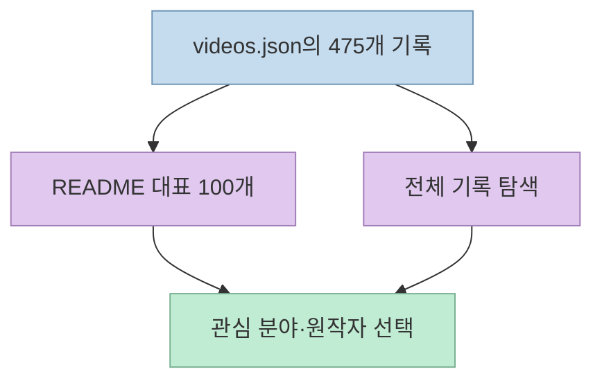
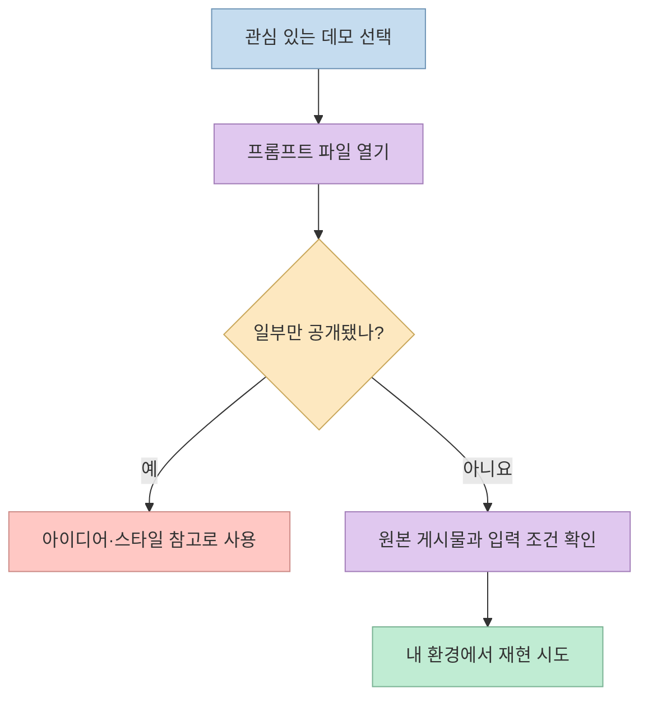
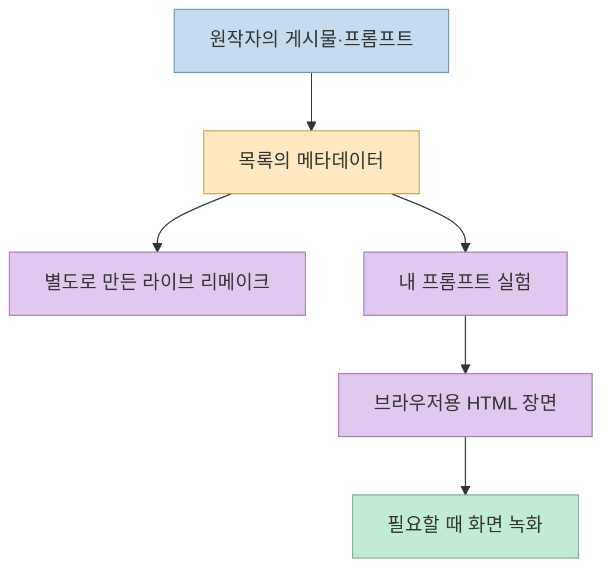

[X 게시물](https://x.com/RoundtableSpace/status/2107746500243599550)은 Claude Opus 5.5로 만든 3D 장면·모션그래픽·게임 등 **475개 이상의 데모와 프롬프트**를 한 GitHub 저장소에서 볼 수 있다고 소개한다. 실제 저장소는 좋은 영감 목록이지만, 숫자만 보고 "475개의 완전한 제작 지침과 원본 소스가 제공된다"고 이해하면 곤란하다. 이 글은 이전의 [Opus 5.5 영상·게임 저장소 비교 글](/post/2026/10/2026-10-02-opus-5-5-code-generated-video-games-repos/)에서 한 걸음 더 들어가, 이 **한 저장소의 데이터 구성과 재현 가능성**만 살펴본다.

<!--more-->

## Sources

- [원본 X 게시물](https://x.com/RoundtableSpace/status/2107746500243599550)
- [awesome-opus5-5-videos 저장소](https://github.com/yihui-dev/awesome-opus5-5-videos)
- [목록 원자료 `data/videos.json`](https://github.com/yihui-dev/awesome-opus5-5-videos/blob/main/data/videos.json)
- [프롬프트 예시: 전체 입력이 제시된 항목](https://github.com/yihui-dev/awesome-opus5-5-videos/blob/main/prompts/himanshutwtxs-882858.md)
- [프롬프트 예시: 일부만 공개된 항목](https://github.com/yihui-dev/awesome-opus5-5-videos/blob/main/prompts/gautam-mer1-530003.md)

## 475는 무엇의 개수인가

저장소 README는 **475개의 항목**을 `prompts/`와 `data/videos.json`에 싣고, README 본문에서는 그중 **서로 다른 프롬프트를 대표하는 100개**만 강조한다고 설명한다. 강조 목록은 모션그래픽 58개, 설명 영상 16개, 3D 장면 14개, 게임·인터랙티브 12개로 구성된다. 이것은 전체 475개의 분야별 분포가 아니다. [공식 README](https://github.com/yihui-dev/awesome-opus5-5-videos).

2026년 10월 8일 `data/videos.json`을 직접 읽어 집계한 스냅샷은 **475행**이다. 데이터의 `category` 기준으로는 모션 288개, 인터랙티브 70개, 설명형 62개, 3D 55개다. 같은 데이터에서 `post_url`과 `slug`도 각각 475개로 중복이 없었다. 다만 이 수치는 저장소 파일의 항목 수이지, 모든 영상이 독립적으로 제작 과정을 검증받았다는 뜻은 아니다. 저장소는 계속 갱신될 수 있으므로 장기 불변 통계로 취급하지 않는다. [원자료](https://github.com/yihui-dev/awesome-opus5-5-videos/blob/main/data/videos.json), [공식 README](https://github.com/yihui-dev/awesome-opus5-5-videos).

## "프롬프트 포함"과 "완전한 재현 레시피"는 다르다

README는 각 항목에 제작자가 공유한 프롬프트를 싣되, 공개되지 않은 경우에는 **원본 게시물의 설명**을 대신 넣는다고 밝힌다. 일부 제작자는 입력의 일부만 공유했다고도 명시한다. 실제 데이터에서 `prompt_partial: true`로 표시된 기록은 **196개**, `false`는 **279개**였다. 따라서 "475개 프롬프트"라는 소개는 파일·기록의 개수로는 맞지만, **475개의 완전한 원문 프롬프트**가 있다는 주장으로 확장할 수 없다. [공식 README](https://github.com/yihui-dev/awesome-opus5-5-videos), [원자료](https://github.com/yihui-dev/awesome-opus5-5-videos/blob/main/data/videos.json).

예를 들어 [모션그래픽 항목](https://github.com/yihui-dev/awesome-opus5-5-videos/blob/main/prompts/himanshutwtxs-882858.md)은 짧은 제작 요청을 `Prompt` 아래에 제시한다. 반면 [다른 항목](https://github.com/yihui-dev/awesome-opus5-5-videos/blob/main/prompts/gautam-mer1-530003.md)은 작성자가 프롬프트의 일부만 공유했다고 직접 표시한다. `prompt_partial: false`도 **저장소가 부분 공개로 표시하지 않았다는 뜻**이지, 숨은 시스템 지침·참조 이미지·에이전트의 중간 수정·모델 설정까지 모두 공개됐다는 보증은 아니다. 재현 수준을 평가할 때는 원본 게시물과 결과물을 함께 봐야 한다. [두 프롬프트 파일](https://github.com/yihui-dev/awesome-opus5-5-videos/blob/main/prompts/himanshutwtxs-882858.md), [부분 공개 사례](https://github.com/yihui-dev/awesome-opus5-5-videos/blob/main/prompts/gautam-mer1-530003.md).

## 원본·리메이크·기술 태그를 섞어 읽지 않기

각 데이터 기록에는 원작자, 원본 게시물 URL, 프롬프트 문구와 부분 공개 여부, 기술 태그, Skillry 리메이크 링크가 들어 있다. README는 **원본 영상과 라이브 리메이크를 나란히 볼 수 있다**고 안내한다. 대표 항목의 `Remake built with: Canvas` 같은 표시는 리메이크에 사용한 기술을 설명한다. 이를 원작자가 정확히 같은 도구·라이브러리·작업 환경을 썼다는 증거로 해석하면 안 된다. [원자료](https://github.com/yihui-dev/awesome-opus5-5-videos/blob/main/data/videos.json), [공식 README](https://github.com/yihui-dev/awesome-opus5-5-videos), [대표 프롬프트 파일](https://github.com/yihui-dev/awesome-opus5-5-videos/blob/main/prompts/himanshutwtxs-882858.md).

저장소의 재현 안내는 프롬프트를 복사해 Opus 5.5를 사용하는 에이전트에 넣고, **단일 HTML 파일로 결과를 렌더링하도록 요청한 뒤 필요하면 화면을 녹화**하는 흐름이다. 이 말은 MP4가 모델에서 직접 출력된다는 뜻이 아니다. 코드가 장면을 그리는 단계와, 그것을 영상 파일로 기록하는 단계를 나눠 생각해야 한다. 또한 저장소가 각 원본의 전체 제작 세션·최종 코드·렌더링 환경을 모두 보관한다는 주장도 아니다. [공식 README의 사용법](https://github.com/yihui-dev/awesome-opus5-5-videos).

## 실전 적용 포인트

1. **먼저 목적에 맞는 사례를 고른다.** README의 대표 100개로 빠르게 훑고, 더 넓게 찾을 때 전체 `videos.json`의 카테고리와 원본 링크를 이용한다. [공식 README](https://github.com/yihui-dev/awesome-opus5-5-videos), [원자료](https://github.com/yihui-dev/awesome-opus5-5-videos/blob/main/data/videos.json).
2. **부분 공개 여부를 확인한다.** `prompt_partial`이 참이거나 파일에 일부 공개 안내가 있으면 정확한 복제 레시피가 아니라 아이디어 카드로 취급한다. 거짓이어도 자산·설정·중간 수정이 빠졌는지 원문을 확인한다. [원자료](https://github.com/yihui-dev/awesome-opus5-5-videos/blob/main/data/videos.json), [부분 공개 사례](https://github.com/yihui-dev/awesome-opus5-5-videos/blob/main/prompts/gautam-mer1-530003.md).
3. **원작과 리메이크를 따로 평가한다.** 프롬프트가 같은 방향의 결과를 만드는지, 실제로 같은 동작·길이·품질을 재현하는지는 별개의 질문이다. 기술 태그도 리메이크의 구현 정보와 원작의 제작 정보를 혼동하지 않는다. [공식 README](https://github.com/yihui-dev/awesome-opus5-5-videos).
4. **공개 전에 권리를 확인한다.** 저장소 README는 영상과 프롬프트가 각 제작자에게 속한다고 안내한다. 저장소의 MIT 라이선스가 원작 영상·음원·이미지에 자동으로 확장된다고 가정하지 않는다. [공식 README의 크레딧](https://github.com/yihui-dev/awesome-opus5-5-videos), [저장소 라이선스](https://github.com/yihui-dev/awesome-opus5-5-videos/blob/main/LICENSE).

## 핵심 요약

- **475개**는 이 저장소의 기록 수다. README 본문에는 그중 대표 **100개**가 강조된다. [공식 README](https://github.com/yihui-dev/awesome-opus5-5-videos).
- 원자료를 집계하면 **196개 항목이 부분 공개 프롬프트**로 표시된다. "475개의 완전한 입력"과 같지 않다. [원자료](https://github.com/yihui-dev/awesome-opus5-5-videos/blob/main/data/videos.json).
- 원본 게시물, 저장소의 프롬프트, Skillry의 리메이크는 출처와 제작 단계가 다르다. [공식 README](https://github.com/yihui-dev/awesome-opus5-5-videos).
- 가장 유용한 활용법은 복제 보장 목록이 아니라 **스타일 탐색과 소규모 재현 실험의 출발점**으로 쓰는 것이다.

## 결론

이 저장소의 가치는 "프롬프트 하나로 475개 영상을 그대로 만들 수 있다"는 약속이 아니라, 다양한 제작자가 공개한 결과와 입력의 흔적을 한곳에서 비교할 수 있다는 데 있다. 먼저 부분 공개 여부와 원본 게시물을 확인하고, 관심 사례 하나를 자신의 환경에서 재현해 보면 **영감과 재현 가능한 워크플로 사이의 간격**이 드러난다. [공식 저장소](https://github.com/yihui-dev/awesome-opus5-5-videos), [원본 X 게시물](https://x.com/RoundtableSpace/status/2107746500243599550).
