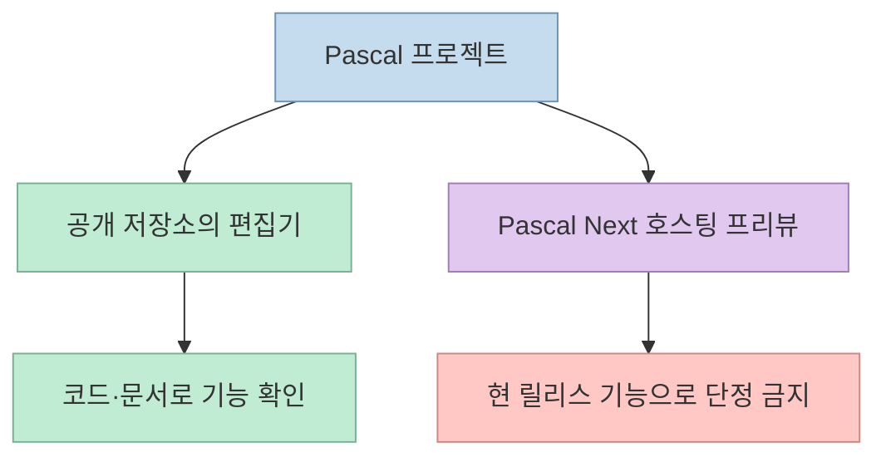
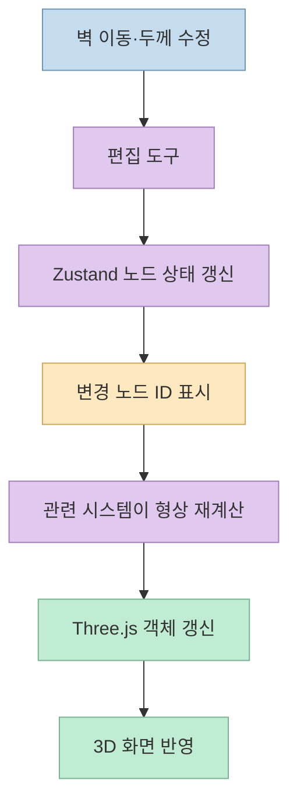
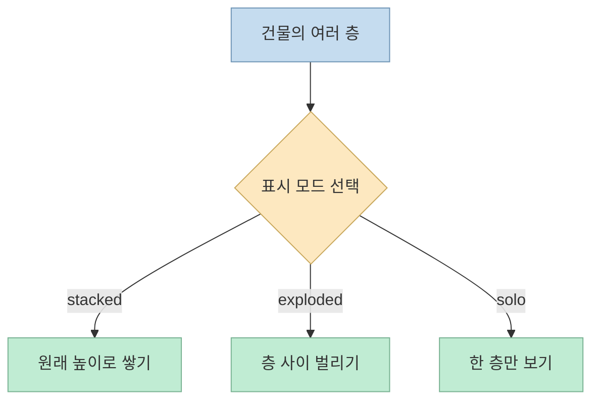

[X 게시물](https://x.com/alextalksai/status/2107347598923190550)은 Pascal Editor를 AutoCAD나 Revit 없이 브라우저에서 건물을 편집할 수 있는 오픈소스 도구로 소개한다. 건물·층·벽을 3D로 다루는 데모는 눈길을 끌지만, "모든 객체가 GPU 가속 시스템으로 업데이트된다"거나 "고가 BIM 소프트웨어를 대체한다"는 문구는 별도 검증이 필요하다. 이 글은 작성자가 [후속 게시물](https://x.com/alextalksai/status/2107355129871560727)에서 직접 연결한 공식 저장소를 기준으로 **구현된 구조**, **가능한 사용법**, **증명되지 않은 성능·비용 주장**을 나눈다.

<!--more-->

## Sources

- [원본 X 게시물](https://x.com/alextalksai/status/2107347598923190550)
- [작성자가 연결한 Pascal Editor 저장소](https://github.com/pascalorg/editor)
- [작성자의 저장소 링크 게시물](https://x.com/alextalksai/status/2107355129871560727)

## 실제 제품의 범위: 브라우저 편집기와 별도 프리뷰를 구분해야 한다

Pascal Editor 저장소는 자신을 **local-first 3D building editor**로 소개하며, React Three Fiber와 Three.js의 WebGPU 렌더러를 사용한다고 명시한다. 독립 실행 앱은 Next.js를 호스트로 쓰고, 재사용 가능한 코어·뷰어·편집기·노드 패키지로 나뉜다. 브라우저에서 사용할 수 있지만, 공식 문서는 로컬 CLI로 지속적인 설치와 데이터 보관을 하는 경로도 안내한다. 따라서 "브라우저로 실행할 수 있다"는 맞지만 "데스크톱 설치나 로컬 실행 선택지가 전혀 없다"는 설명은 부정확하다. [공식 README](https://github.com/pascalorg/editor).

더 중요한 구분은 저장소 상단의 **Pascal Next 라이브 프리뷰**다. 프로젝트 측은 그 프리뷰가 다음 편집기의 방향을 보여주며, 현재 오픈소스 릴리스에는 아직 포함되지 않는다고 명시한다. 프리뷰에서 보이는 세밀한 집 모델·컷 뷰·워크스루를 지금 공개된 편집기의 보장된 기능으로 간주하면 안 된다. [공식 README의 프리뷰 설명](https://github.com/pascalorg/editor).

## 건물 데이터는 어떻게 편집되고 그려지는가

게시물의 건물·층·벽·구역 계층 설명은 저장소 문서와 대체로 일치한다. 공식 모델은 `Site → Building → Level` 아래에 `Wall`, `Slab`, `Ceiling`, `Roof`, `Zone` 등을 둔다. 다만 실제 저장 방식은 중첩 객체 트리 하나가 아니라 **ID를 키로 한 평면 노드 사전**이고, `parentId`와 자식 ID 배열이 관계를 나타낸다. 이 차이는 선택·이동·삭제할 때 관련 노드를 어떻게 찾는지 이해하는 데 중요하다. [원본 X 게시물](https://x.com/alextalksai/status/2107347598923190550), [공식 README의 노드 모델](https://github.com/pascalorg/editor).

사용자가 벽을 편집하면 도구가 Zustand 기반 `useScene` 저장소의 노드를 갱신한다. 변경된 노드 ID는 `dirtyNodes`에 들어가고, 렌더 루프에서 관련 시스템이 해당 노드의 형상이나 변환을 다시 계산한다. Three.js 객체는 별도 레지스트리에서 ID로 찾는다. 즉, 문서에서 확인되는 최적화는 **모든 형상을 매번 새로 만드는 대신 변경된 노드의 계산을 선택적으로 수행하는 방식**이다. Undo/redo는 Zundo를 통한 이력으로 제공되고, 장면 데이터는 IndexedDB에 저장된다. [공식 README의 상태·시스템 설명](https://github.com/pascalorg/editor).

이 설계는 **노드와 시스템을 분리했다**는 점에서 ECS 스타일로 설명할 여지는 있다. 그러나 저장소 문서는 이를 범용 ECS 엔진이라고 선언하지 않는다. 시스템은 React 컴포넌트가 `useFrame` 렌더 루프에서 변경 노드를 처리하는 구조로 기술되어 있다. 따라서 게시물의 "모든 객체가 GPU 가속 시스템을 통해 업데이트"라는 표현은 코드 설명보다 강하다. **WebGPU 렌더링**과 **노드·형상 업데이트 로직 전체의 GPU 실행**은 서로 다른 주장이다. [원본 X 게시물](https://x.com/alextalksai/status/2107347598923190550), [공식 README의 시스템·기술 스택](https://github.com/pascalorg/editor).

## 층을 쌓고, 펼치고, 따로 보기

게시물이 강조한 층별 표시 방식도 공식 문서에 근거가 있다. 뷰어 상태에는 `stacked`, `exploded`, `solo` 모드가 있고, `LevelSystem`이 층의 가시성과 수직 위치를 담당한다. 벽·구역·바닥판을 다루는 편집 도구, 선택 관리, 카메라 포커스도 README에 기록되어 있다. 다만 "원하는 모든 건축 요소를 자유롭게 수정할 수 있다"는 뜻은 아니다. 공식 문서가 명시한 도구와 노드 유형을 먼저 확인하고, 자신이 필요한 작업이 실제 UI나 API에서 가능한지 테스트해야 한다. [공식 README의 뷰어·도구 구조](https://github.com/pascalorg/editor), [원본 X 게시물](https://x.com/alextalksai/status/2107347598923190550).

## "무료 BIM 대체"와 "네이티브급 성능"은 별도 검증 문제다

원본 게시물은 연간 5,000달러짜리 라이선스가 필요 없고, 건축 사무소는 비슷한 BIM 흐름에 5만 달러 이상을 지불하며, 이 도구는 "100% 오픈소스"라고 주장한다. [원본 X 게시물](https://x.com/alextalksai/status/2107347598923190550). 저장소가 **MIT 라이선스의 공개 코드**인 것은 확인되지만, 게시물의 두 가격 수치에는 비교 대상 제품·계약 형태·좌석 수·기간의 근거가 없다. 공개 코드라는 사실만으로 특정 상용 BIM 제품과 기능·협업·납품·지원 범위가 동등하다고 결론 내릴 수도 없다. [공식 저장소와 라이선스](https://github.com/pascalorg/editor).

"GPU에서 거의 네이티브 성능" 역시 공식 README의 **WebGPU 렌더러 사용**으로부터 자동으로 따라오지 않는다. 그런 결론에는 같은 장면, 같은 하드웨어, 브라우저와 비교 제품의 동일한 작업을 대상으로 한 벤치마크가 필요하다. README는 변경 노드만 재계산하는 구조를 설명하지만, 이는 성능을 높이기 위한 설계 근거이지 실측 프레임 시간이나 대규모 모델 성능의 증명은 아니다. [원본 X 게시물](https://x.com/alextalksai/status/2107347598923190550), [공식 README의 렌더링·변경 노드 설명](https://github.com/pascalorg/editor).

## 실전 적용 포인트

1. **프로토타입 용도로 먼저 판단한다.** 브라우저에서 건물의 노드·층·벽을 편집하고 3D로 검토하는 흐름은 저장소 문서로 확인된다. [공식 README](https://github.com/pascalorg/editor).
2. **도입 전 필요한 업무를 체크한다.** 필요한 형상, 교환 포맷, 팀 협업, 검토·납품 절차를 적어 실제 공개 버전에서 각각 시험한다. 이는 상용 BIM 대체 여부를 판단하기 위한 실무적 제안이지, Pascal이 해당 기능을 모두 제공한다는 뜻이 아니다.
3. **로컬 저장과 MCP를 구분한다.** 공식 CLI는 로컬 편집기와 인증된 MCP 서비스를 실행하고 데이터를 로컬 경로에 보관한다고 설명한다. 에이전트 연결이 필요 없다면 브라우저 편집 기능만 먼저 평가해도 된다. [공식 README의 로컬 실행 안내](https://github.com/pascalorg/editor).
4. **데모와 릴리스를 혼동하지 않는다.** Pascal Next 프리뷰는 현 오픈소스 편집기 릴리스에 아직 포함되지 않는다고 프로젝트가 명시한다. [공식 README](https://github.com/pascalorg/editor).

## 핵심 요약

- Pascal Editor는 React Three Fiber·Three.js WebGPU 렌더러·Zustand를 사용하는 공개 3D 건축 편집기다. [공식 저장소](https://github.com/pascalorg/editor).
- 노드 변경을 `dirtyNodes`로 추적해 관련 시스템이 형상을 갱신한다. 이것을 "모든 계산이 GPU에서 실행된다"로 확대하면 안 된다. [공식 아키텍처](https://github.com/pascalorg/editor).
- 층별 `stacked`·`exploded`·`solo` 보기는 문서화돼 있다. [공식 뷰어 상태](https://github.com/pascalorg/editor).
- 가격 절감액, 상용 BIM과의 동등성, 네이티브급 성능은 원본 게시물만으로 입증되지 않는다. [원본 X 게시물](https://x.com/alextalksai/status/2107347598923190550).

## 결론

Pascal Editor의 흥미로운 점은 "무료 Revit"이라는 자극적인 비교보다, **웹 기반 편집기에서 건물 계층·상태 저장·변경 노드 처리·3D 렌더링을 연결한 공개 구현**에 있다. 기능 범위와 성능을 실제 프로젝트에 적용하려면 현재 릴리스를 직접 시험하고, Pascal Next 프리뷰나 SNS의 가격·속도 문구를 검증된 제품 사양처럼 받아들이지 않는 것이 좋다. [공식 저장소](https://github.com/pascalorg/editor), [원본 X 게시물](https://x.com/alextalksai/status/2107347598923190550).
