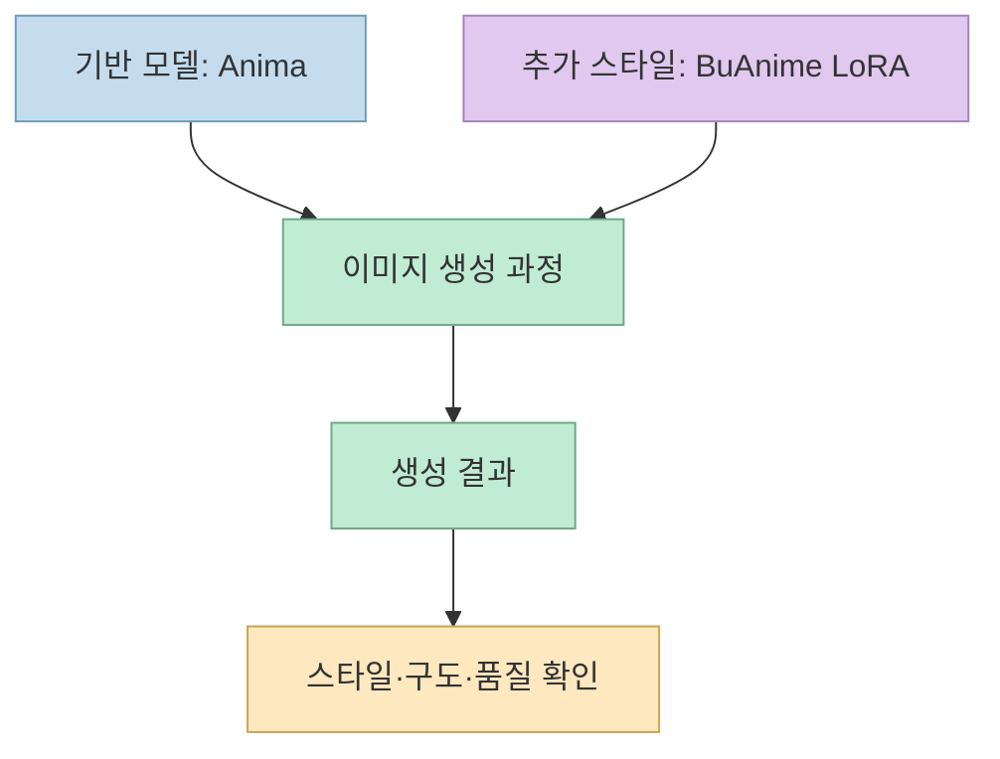
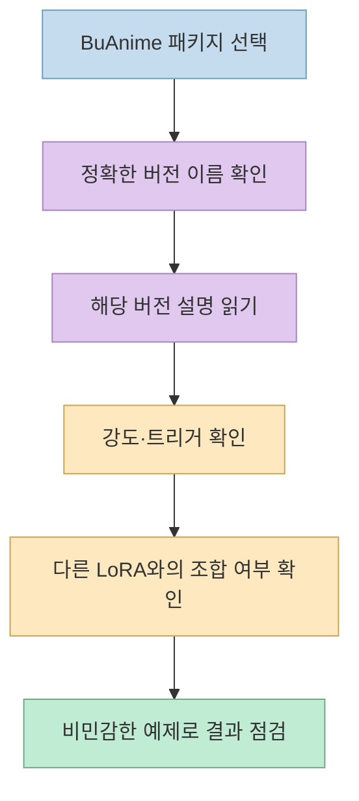
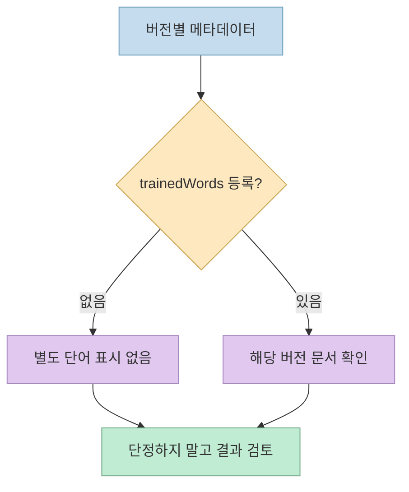

[Nobin의 X 게시물](https://x.com/NobinLOG/status/2108347463933567277)은 Anima 기반 **BuAnime NSFW Style Pack Anima** LoRA를 소개하며 적용 강도와 그림의 특징을 설명합니다. 이 게시물은 시각 스타일을 살펴볼 단서가 되지만, **LoRA 패키지 안의 버전마다 권장 강도와 트리거 단어가 달라질 수 있다** 는 점을 먼저 확인해야 합니다. 이 글은 성인 이미지나 노골적인 프롬프트를 제공하지 않고, 공식 모델 정보를 읽는 방법에 집중합니다.

<!--more-->

## Sources

- <https://x.com/NobinLOG/status/2108347463933567277>
- [Civitai의 BuAnime NSFW Style Pack Anima 모델 페이지](https://civitai.com/models/2645819)
- [Civitai 모델 메타데이터 API](https://civitai.com/api/v1/models/2645819)
- [BuAnime V2 버전 메타데이터](https://civitai.com/api/v1/model-versions/3301514), [BuAnime 버전 메타데이터](https://civitai.com/api/v1/model-versions/3244816), [Soft V2 버전 메타데이터](https://civitai.com/api/v1/model-versions/3046660)

## LoRA는 독립 생성 모델이 아니라 스타일 보조 파일이다

공식 Civitai 메타데이터는 이 항목을 **`LORA`** 로 분류하고, 공개된 여러 버전의 기본 모델을 **`Anima`** 로 표시합니다. 즉 BuAnime라는 파일 하나가 실행 환경이나 기반 이미지 모델을 대체하는 것은 아닙니다. 기반 모델에 스타일 효과를 얹는 추가 구성 요소로 이해해야 합니다. [Civitai 모델 메타데이터](https://civitai.com/api/v1/models/2645819)

게시물은 얇고 깔끔한 선, 선명한 색, 높은 대비, 광택 하이라이트, 셀 셰이딩, 인물과 배경의 분리 등을 특징으로 나열합니다. 이는 모델 제작자가 Civitai 설명에 적은 시각 방향과 대체로 일치합니다. 다만 **학습 데이터의 품질이나 모든 구도에서의 일관성을 독립적으로 측정한 결과는 아닙니다.** 사례의 설명과 객관적 벤치마크를 혼동하지 않는 편이 좋습니다. [원 X 게시물](https://x.com/NobinLOG/status/2108347463933567277) · [Civitai 모델 설명](https://civitai.com/models/2645819)

## “0.7~0.8”과 “0.8~1.0”이 함께 나오는 이유

X 게시물 첫머리는 **0.7~0.8**을 권장하지만, 뒤쪽에는 **0.8을 기본으로 하고 강한 스타일에 최대 1.0**이라는 설명도 나옵니다. [원 게시물](https://x.com/NobinLOG/status/2108347463933567277) 이는 단일한 만능 설정이라기보다, 모델 페이지의 **여러 변형에 적힌 지침이 한 게시물에서 섞인 것** 으로 읽을 여지가 있습니다. 실제 Civitai 설명에서 0.7~0.8은 강한 스타일 변형에, 0.8~1.0은 기본 BuAnime 변형에 각각 연결되어 있습니다. 따라서 수치를 따라 하기 전에 **선택한 버전 이름과 버전별 설명** 을 확인해야 합니다. [Civitai 모델 메타데이터](https://civitai.com/api/v1/models/2645819) · [BuAnime 버전 메타데이터](https://civitai.com/api/v1/model-versions/3244816)

게시물은 다른 LoRA와 결합할 때 강도를 더 낮게 잡는 편이 좋을 수 있다고 말합니다. 이것은 **작성자의 경험적 제안** 이며, 모든 기반 모델과 조합에서 최적인 숫자로 검증된 값은 아닙니다. 버전과 조합이 달라지면 스타일의 영향도 달라질 수 있다는 해석은 LoRA를 덧씌우는 구조에서 나온 **실무적 추론** 입니다. [원 X 게시물](https://x.com/NobinLOG/status/2108347463933567277) · [Civitai 버전 목록](https://civitai.com/api/v1/models/2645819)

## “트리거 단어 불필요”도 모든 변형에 적용되지 않는다

원 게시물은 트리거 단어가 필요 없다고 설명합니다. [원 X 게시물](https://x.com/NobinLOG/status/2108347463933567277) 기본 BuAnime와 BuAnime V2의 버전 메타데이터에는 별도 `trainedWords`가 기재되지 않아 이 설명과 맞아 보입니다. 그러나 **Soft V2** 버전에는 `@BuSoft`가 `trainedWords`로 등록돼 있습니다. 그래서 **패키지 전체에 트리거 단어가 없다** 고 일반화하면 안 됩니다. [BuAnime V2](https://civitai.com/api/v1/model-versions/3301514) · [BuAnime](https://civitai.com/api/v1/model-versions/3244816) · [Soft V2](https://civitai.com/api/v1/model-versions/3046660)

`trainedWords`가 비어 있다는 것은 **등록된 단어가 없다는 뜻** 이지, 모든 프롬프트에서 같은 결과가 나온다는 품질 보장은 아닙니다. 반대로 단어가 등록돼 있다고 해서 아무 문맥에서나 원하는 스타일이 정확히 재현된다는 뜻도 아닙니다. 이 차이는 **메타데이터와 성능 평가의 역할을 구분한 해석** 입니다. [Civitai 버전 메타데이터](https://civitai.com/api/v1/model-versions/3244816) · [Soft V2 메타데이터](https://civitai.com/api/v1/model-versions/3046660)

## 순위와 성인용 가능성은 별도로 검증해야 한다

게시물은 해당 LoRA가 당시 **Anima 주간 순위 1위** 라고 소개합니다. 그러나 순위는 시점과 집계 조건에 따라 변하고, 모델 API의 정적 정보만으로 **그 시점의 정확한 순위** 를 재확인할 수는 없습니다. 따라서 이 표현은 **게시자의 당시 주장** 으로 남겨 두는 것이 정확합니다. [원 X 게시물](https://x.com/NobinLOG/status/2108347463933567277) · [Civitai 모델 페이지](https://civitai.com/models/2645819)

작성자는 이름과 설명을 근거로 성인용 소재에 효과가 있을 *가능성* 을 언급하지만, 스스로도 추정의 표현을 씁니다. 모델 제작 설명에도 일부 변형은 성인용 결과가 많다고 적혀 있습니다. 그렇다고 **정확도 향상 수치나 학습 데이터 구성 전체가 확인된 것은 아닙니다.** 생성 가능 여부, 배포 허용 범위, 플랫폼 노출 정책은 각각 따로 확인해야 합니다. [원 X 게시물](https://x.com/NobinLOG/status/2108347463933567277) · [Civitai 모델 정보](https://civitai.com/api/v1/models/2645819)

## 실전 적용 포인트

1. 링크에서 **정확한 버전과 기반 모델 `Anima`** 를 먼저 확인합니다. 같은 패키지의 Soft·Ultra·기본 변형은 동일한 지침으로 묶지 않습니다. [모델 메타데이터](https://civitai.com/api/v1/models/2645819)
2. 강도 수치는 게시물 한 줄보다 **선택한 버전 설명** 을 우선합니다. 서로 다른 변형의 권장값을 그대로 섞지 않습니다. [BuAnime 버전](https://civitai.com/api/v1/model-versions/3244816) · [모델 설명](https://civitai.com/models/2645819)
3. 트리거 단어는 버전별 `trainedWords`를 확인합니다. “없음”이라는 소개가 모든 변형에 적용되는 것은 아닙니다. [Soft V2 버전](https://civitai.com/api/v1/model-versions/3046660)
4. 권리·연령 제한·플랫폼 규정을 확인하고 **비민감한 예제** 로 기능을 점검합니다. 미성년자 성적 이미지나 비동의 성적 합성물은 만들거나 공유해서는 안 됩니다. 모델의 공개 여부가 이런 행위를 허용하지는 않습니다.

## 핵심 요약

- BuAnime NSFW Style Pack Anima는 **Anima 기반 이미지 생성 과정에 얹는 LoRA** 이며, 단독 실행 앱이 아닙니다. [Civitai 메타데이터](https://civitai.com/api/v1/models/2645819)
- 게시물의 **0.7~0.8**과 **0.8~1.0**은 버전별 설명이 섞여 나타난 값으로 읽어야 합니다. [원 게시물](https://x.com/NobinLOG/status/2108347463933567277) · [모델 설명](https://civitai.com/models/2645819)
- 기본 버전에 등록된 트리거가 없어도 **Soft V2에는 등록된 단어가 있습니다.** [기본 버전](https://civitai.com/api/v1/model-versions/3244816) · [Soft V2](https://civitai.com/api/v1/model-versions/3046660)

## 결론

이 게시물은 스타일 LoRA를 발견하는 출발점으로는 유용합니다. 그러나 **인기 순위, 추천 강도, 트리거 유무, 성인용 적합성** 을 패키지 전체의 확정된 특성으로 옮겨 적으면 정확성이 떨어집니다. 선택한 버전의 공식 메타데이터와 이용 조건을 먼저 확인하고, 시각 품질 평가는 별도로 해야 합니다. [원 X 게시물](https://x.com/NobinLOG/status/2108347463933567277) · [Civitai 모델 정보](https://civitai.com/api/v1/models/2645819)
