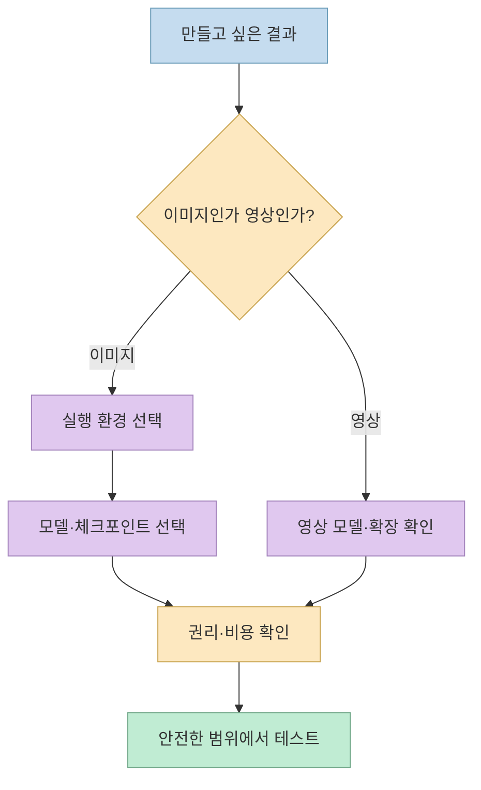
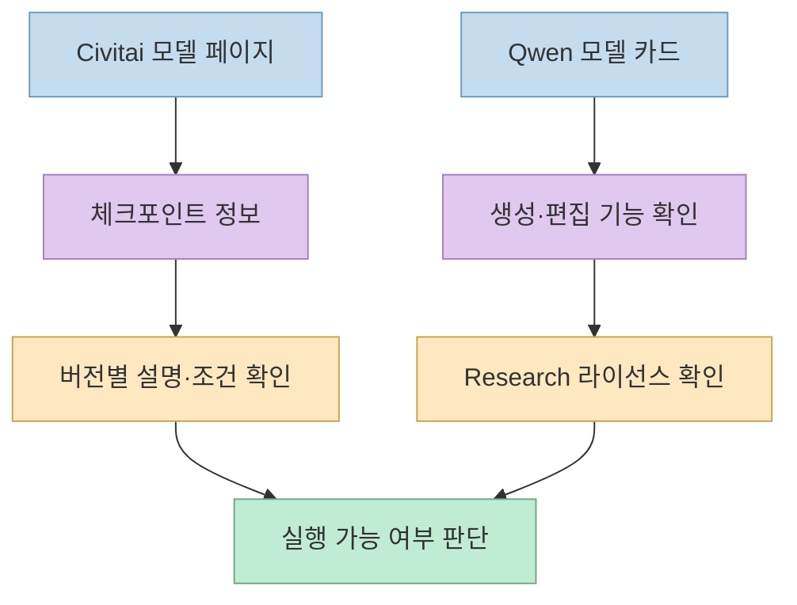
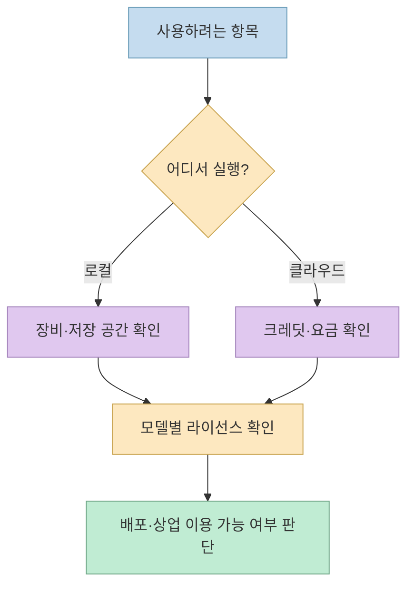

한 [X 게시물](https://x.com/denziideng/status/2108200213592895491)이 성인 이미지 생성과 관련된 **무료 진입점 9개** 를 소개합니다. 그러나 목록에는 **로컬 실행기, 모델 공유 사이트, 이미지 생성 모델, 클라우드 서비스, 영상 모델, ComfyUI 확장** 이 함께 들어 있습니다. 따라서 “9개를 열면 모두 무료로 같은 작업을 할 수 있다”는 식으로 읽으면 곤란합니다. 이 글은 생성 기법이나 노골적인 프롬프트가 아니라, **각 항목의 역할과 사용 전 확인할 조건** 을 정리합니다.

<!--more-->

## Sources

- <https://x.com/denziideng/status/2108200213592895491>
- [ComfyUI 공식 저장소](https://github.com/Comfy-Org/ComfyUI)
- [Civitai](https://civitai.com/), [Civitai의 Buzz 설명](https://github.com/civitai/civitai/blob/main/docs/features/buzz-accounts.md)
- [Juggernaut XL](https://civitai.com/models/133005), [Pony Diffusion V6 XL](https://civitai.com/models/257749), [Illustrious-XL](https://civitai.com/models/795765)
- [Qwen-Image-2.1 모델 카드](https://huggingface.co/Qwen/Qwen-Image-2.1)와 [라이선스](https://huggingface.co/Qwen/Qwen-Image-2.1/blob/main/LICENSE)
- [Wan2.2 공식 저장소](https://github.com/Wan-Video/Wan2.2), [ComfyUI-AnimateDiff-Evolved 공식 저장소](https://github.com/Kosinkadink/ComfyUI-AnimateDiff-Evolved)

## 9개 목록은 동일한 종류의 서비스가 아니다

게시물의 목록은 **ComfyUI, Civitai, Juggernaut XL, Pony Diffusion V6 XL, Illustrious-XL, Civitai Generator, Qwen-Image-2.1, Wan2.2, AnimateDiff-Evolved** 입니다. X의 공개 임베드에서는 장문 게시물 앞부분만 보였고, 나머지 항목은 공개 검색 색인에서 확인한 뒤 각각의 공식 저장소·모델 페이지와 대조했습니다. 따라서 원문에 적힌 개별 성능·비용 표현을 검증된 보장으로 취급하지 않습니다. [원 X 게시물](https://x.com/denziideng/status/2108200213592895491) · [ComfyUI](https://github.com/Comfy-Org/ComfyUI) · [Qwen-Image-2.1](https://huggingface.co/Qwen/Qwen-Image-2.1)

이를 **역할** 로 다시 묶으면 다음과 같습니다.

- **실행 환경:** ComfyUI는 모델과 처리 단계를 노드 그래프로 연결하는 제작 환경입니다. [공식 저장소](https://github.com/Comfy-Org/ComfyUI)
- **탐색·생성 플랫폼:** Civitai는 모델을 찾는 곳이고, Civitai Generator는 온라인에서 생성하는 별도 경로입니다. 생성에는 사이트의 Buzz 크레딧 체계가 관여합니다. [Civitai](https://civitai.com/) · [Buzz 문서](https://github.com/civitai/civitai/blob/main/docs/features/buzz-accounts.md)
- **이미지 모델:** Juggernaut XL, Pony Diffusion V6 XL, Illustrious-XL은 Civitai에 등록된 *체크포인트*이고, Qwen-Image-2.1은 Hugging Face에 공개된 이미지 생성·편집 모델입니다. 이름 자체가 실행 앱은 아닙니다. [Juggernaut XL](https://civitai.com/models/133005) · [Pony Diffusion V6 XL](https://civitai.com/models/257749) · [Illustrious-XL](https://civitai.com/models/795765) · [Qwen 모델 카드](https://huggingface.co/Qwen/Qwen-Image-2.1)
- **영상 경로:** Wan2.2는 영상 생성 모델·코드 저장소이고, AnimateDiff-Evolved는 ComfyUI에서 AnimateDiff 계열 모션 기능을 쓰게 하는 확장입니다. 둘 다 독립적인 “이미지 생성 사이트”는 아닙니다. [Wan2.2](https://github.com/Wan-Video/Wan2.2) · [AnimateDiff-Evolved](https://github.com/Kosinkadink/ComfyUI-AnimateDiff-Evolved)

이 차이를 알면 “모델을 다운로드했는데 실행 화면이 없다”, “사이트 계정은 무료인데 생성에 크레딧이 든다”, “정지 이미지 자료를 찾았는데 영상용 확장이다” 같은 혼동을 줄일 수 있습니다. 이는 각 프로젝트가 공식 문서에서 설명하는 역할을 비교한 **실무적 해석** 입니다. [ComfyUI](https://github.com/Comfy-Org/ComfyUI) · [Civitai Buzz](https://github.com/civitai/civitai/blob/main/docs/features/buzz-accounts.md) · [Wan2.2](https://github.com/Wan-Video/Wan2.2)

## 세 체크포인트와 Qwen 모델은 무엇이 다른가

Civitai의 공식 모델 메타데이터에서 **Juggernaut XL, Pony Diffusion V6 XL, Illustrious-XL은 모두 체크포인트** 로 분류됩니다. 각 페이지의 제작 설명은 대체로 Juggernaut XL을 사실적인 시각 표현, Pony Diffusion V6 XL을 캐릭터 중심의 SDXL 파인튜닝, Illustrious-XL을 삽화·애니메이션 작업에 연결합니다. 이것은 **용도·학습 방향에 대한 소개** 이지, 어느 모델이든 특정 콘텐츠를 항상 생성한다는 보증은 아닙니다. 모델 버전마다 사용 조건도 달라질 수 있으니 개별 버전의 설명과 라이선스를 확인해야 합니다. [Juggernaut XL](https://civitai.com/models/133005) · [Pony Diffusion V6 XL](https://civitai.com/models/257749) · [Illustrious-XL](https://civitai.com/models/795765)

Qwen-Image-2.1은 공식 모델 카드에서 **텍스트→이미지 생성과 이미지 편집** 을 지원한다고 안내합니다. 그러나 이 모델 카드가 “성인 이미지 전용 모델”이라고 소개하는 것은 아닙니다. 게시물의 성인 콘텐츠 목록에 포함됐다는 이유만으로 공식 모델의 목적이나 허용 사용 범위를 바꿔 해석해서는 안 됩니다. [Qwen 공식 모델 카드](https://huggingface.co/Qwen/Qwen-Image-2.1)

## “무료”는 비용과 라이선스가 모두 없다는 뜻이 아니다

ComfyUI의 **로컬 실행** 은 자체 장비의 저장 공간·메모리·연산 능력을 사용합니다. 동시에 공식 문서에는 별도의 **유료 Comfy Cloud** 와 외부 서비스에 연결되는 노드도 안내돼 있습니다. 따라서 “ComfyUI를 쓸 수 있다”와 “어떤 모델·설정·클라우드 경로든 비용 없이 쓴다”는 다릅니다. [ComfyUI 공식 저장소](https://github.com/Comfy-Org/ComfyUI)

Civitai의 Buzz는 공식 문서상 **생성 크레딧 등에 쓰이는 가상 통화** 입니다. Civitai Generator를 브라우저에서 이용한다고 해서 생성 자원이 무제한 무료라는 뜻은 아닙니다. 계정·콘텐츠 접근·크레딧 정책은 바뀔 수 있으므로 이용 시점에 사이트의 최신 조건을 확인해야 합니다. [Civitai Buzz 문서](https://github.com/civitai/civitai/blob/main/docs/features/buzz-accounts.md) · [Civitai](https://civitai.com/)

특히 Qwen-Image-2.1의 모델 카드에는 **`qwen-research` 라이선스** 가 표시됩니다. 원문은 비상업적 **연구·평가 목적** 에 허용 범위를 두고, 상업 이용에는 별도 라이선스를 요구합니다. 따라서 공개 가중치를 내려받을 수 있다는 사실만으로 상업 프로젝트에 자유롭게 쓸 수 있다고 가정하면 안 됩니다. 이는 라이선스 문구를 요약한 것이며 개별 사용 사례의 법률 판단은 아닙니다. [Qwen 모델 카드](https://huggingface.co/Qwen/Qwen-Image-2.1) · [라이선스 원문](https://huggingface.co/Qwen/Qwen-Image-2.1/blob/main/LICENSE)

## 영상용 두 항목은 별도 계획이 필요하다

Wan2.2는 텍스트 또는 이미지에서 영상을 생성하는 모델군이며, 공식 저장소에는 모델 가중치와 추론 코드, ComfyUI 연동 안내가 있습니다. AnimateDiff-Evolved는 ComfyUI에서 모션 모델을 활용하는 확장입니다. 따라서 이 둘은 이미지 한 장을 만드는 단계의 대체재라기보다 **움직임이 필요한 다음 공정** 으로 보아야 합니다. 영상은 여러 프레임을 처리하므로, 정지 이미지 모델과 동일한 하드웨어·시간 요구를 가정하지 않는 편이 안전합니다. [Wan2.2 공식 저장소](https://github.com/Wan-Video/Wan2.2) · [AnimateDiff-Evolved 공식 저장소](https://github.com/Kosinkadink/ComfyUI-AnimateDiff-Evolved)

## 실전 적용 포인트

1. 목록에서 하나를 고르기 전에 **실행 환경, 모델 파일, 커뮤니티, 클라우드 서비스, 영상 확장 중 무엇이 필요한지** 분류합니다. 이 글의 9개는 서로 대체 가능한 앱 9개가 아닙니다. [ComfyUI](https://github.com/Comfy-Org/ComfyUI) · [Wan2.2](https://github.com/Wan-Video/Wan2.2)
2. 모델 페이지나 저장소에서 **버전·라이선스·필요 장비·요금** 을 확인합니다. 특히 Qwen-Image-2.1의 공개 가중치는 상업 자유 이용 라이선스가 아닙니다. [Qwen 라이선스](https://huggingface.co/Qwen/Qwen-Image-2.1/blob/main/LICENSE)
3. 사람의 사진이나 신원을 다루는 경우에는 **당사자의 동의와 권리**, 플랫폼 정책을 먼저 확인합니다. 미성년자 성적 이미지나 비동의 성적 합성물은 만들거나 공유해서는 안 됩니다. 이 항목은 도구 성능 주장이 아니라, 성인 콘텐츠를 다루는 워크플로에 필요한 안전 기준입니다.
4. 기능을 익힐 때는 **비민감한 테스트 이미지** 로 먼저 확인하고, 출력·업로드·공유 범위가 어디까지인지 점검합니다. 로컬 실행과 클라우드 업로드는 데이터 노출 방식이 다릅니다. [ComfyUI 로컬·클라우드 안내](https://github.com/Comfy-Org/ComfyUI)

## 핵심 요약

- 게시물의 9개 항목은 **실행기 1개, 플랫폼·클라우드 경로, 여러 이미지 모델, 영상 모델·확장** 이 섞인 목록입니다. [원 X 게시물](https://x.com/denziideng/status/2108200213592895491) · [각 공식 출처](https://github.com/Comfy-Org/ComfyUI)
- **무료 접근** 은 클라우드 생성 비용이나 모델 라이선스 제한이 없다는 뜻이 아닙니다. [Civitai Buzz](https://github.com/civitai/civitai/blob/main/docs/features/buzz-accounts.md) · [Qwen 라이선스](https://huggingface.co/Qwen/Qwen-Image-2.1/blob/main/LICENSE)
- Wan2.2와 AnimateDiff-Evolved는 **영상 공정** 에 해당하며, 성인 이미지 생성 전용 도구로 소개된 공식 자료는 확인되지 않았습니다. [Wan2.2](https://github.com/Wan-Video/Wan2.2) · [AnimateDiff-Evolved](https://github.com/Kosinkadink/ComfyUI-AnimateDiff-Evolved)

## 결론

이 목록의 가치는 이름 9개를 한 번에 모았다는 데 있습니다. 다만 **무엇을 실행하는 도구인지, 어떤 모델이 필요한지, 어디에서 연산하는지, 어떤 이용 조건이 붙는지** 를 분리해야 실제 선택에 도움이 됩니다. 특히 성인 콘텐츠를 다룰 때는 기술적 가능성보다 동의·권리·플랫폼 정책을 먼저 확인해야 합니다. [원 X 게시물](https://x.com/denziideng/status/2108200213592895491) · [ComfyUI](https://github.com/Comfy-Org/ComfyUI) · [Qwen 라이선스](https://huggingface.co/Qwen/Qwen-Image-2.1/blob/main/LICENSE)
