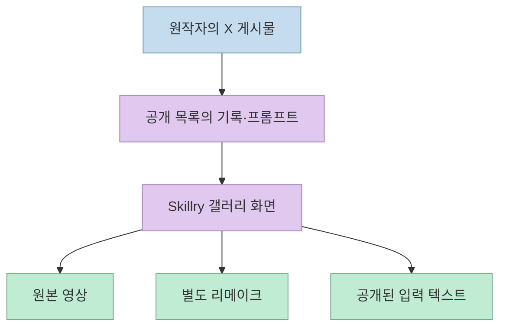
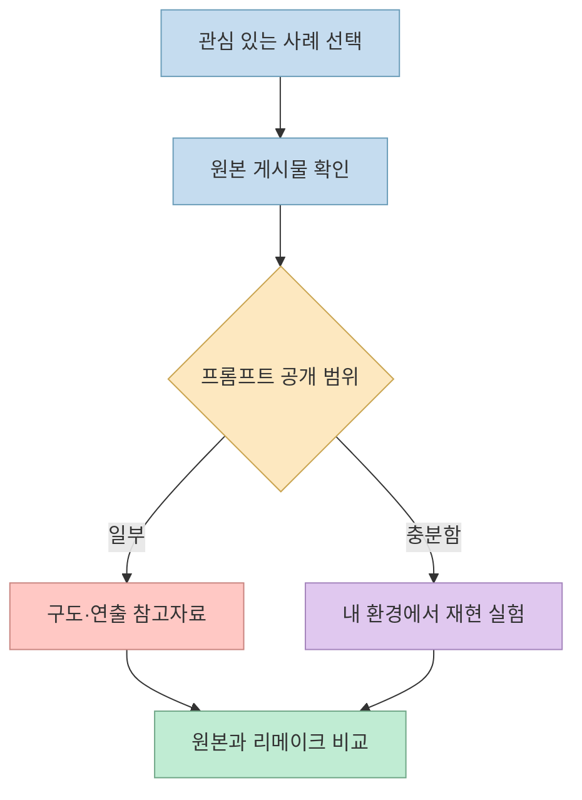
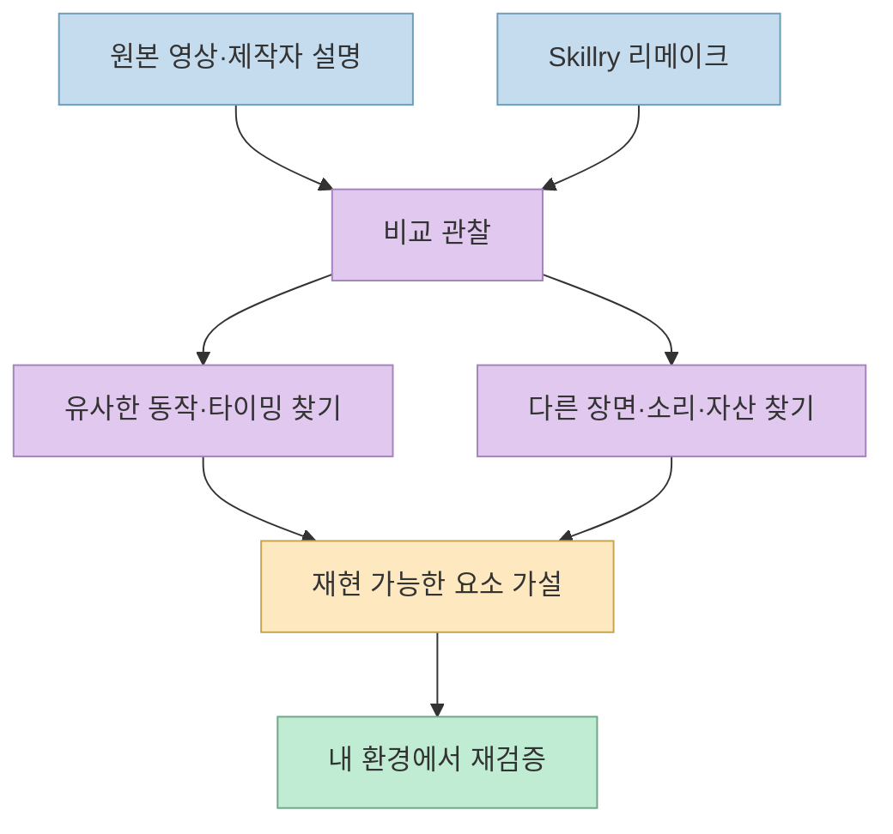

[Deborah Folloni의 X 게시물](https://x.com/dfolloni/status/2107944267562074281)은 Claude Opus 5.5로 만든 영상과 그 뒤의 프롬프트를 모은 사이트를 소개합니다. 연결된 곳은 [Skillry의 Opus 영상 갤러리](https://skillry.dev/ai-videos/opus-5-5)입니다. 이 갤러리는 아이디어를 찾기 좋지만, **원작 영상·사이트의 리메이크·공개된 프롬프트 텍스트** 를 같은 수준의 증거로 취급하면 재현 가능성을 과대평가하기 쉽습니다. 이미 발행한 [GitHub 데이터 분석 글](/post/2026/10/2026-10-08-opus-5-5-video-prompt-gallery-reproducibility/)과 중복을 줄이고, 여기서는 **웹사이트의 실제 사용법** 에 집중합니다.

<!--more-->

## Sources

- <https://x.com/dfolloni/status/2107944267562074281>
- [Skillry Opus 5.5 영상 갤러리](https://skillry.dev/ai-videos/opus-5-5)
- [Skillry 개별 사례: 부분 공개 프롬프트](https://skillry.dev/ai-videos/opus-5-5/dheepanratnam-706454)
- [Skillry 개별 사례: 제작자가 공개한 입력과 제작 조건](https://skillry.dev/ai-videos/opus-5-5/tankazunori0914-156748)
- [연결된 공개 저장소](https://github.com/yihui-dev/awesome-opus5-5-videos)

## “거의 500개”는 언제 확인한 숫자인가

X 게시물은 **거의 500개** 라고 소개합니다. [원 게시물](https://x.com/dfolloni/status/2107944267562074281) 2026년 10월 9일 확인한 Skillry 화면에는 **513개** 가 표시되며, 모션그래픽 317개·설명 영상 67개·3D 장면 59개·게임 70개로 나뉩니다. 연결된 GitHub 저장소도 같은 시점에 513개를 안내하고, 최근 38개가 추가됐다고 설명합니다. 그러므로 두 숫자는 서로 모순이라기보다 **갱신 시점이 다른 스냅샷** 으로 읽는 편이 맞습니다. 이 값은 계속 바뀔 수 있습니다. [Skillry 갤러리](https://skillry.dev/ai-videos/opus-5-5) · [공개 저장소 README](https://github.com/yihui-dev/awesome-opus5-5-videos)

또한 **Skillry의 513개와 GitHub의 513개를 합쳐 1,026개로 세면 안 됩니다.** 공개 저장소는 같은 컬렉션의 프롬프트·메타데이터를 제공하고, Skillry는 원본 영상과 리메이크를 나란히 보는 웹 화면을 제공합니다. 이는 저장소 README가 Skillry를 전체 항목의 비교 화면으로 연결한 데 근거한 설명입니다. [공개 저장소 README](https://github.com/yihui-dev/awesome-opus5-5-videos) · [Skillry 갤러리](https://skillry.dev/ai-videos/opus-5-5)

## 개별 페이지에서 무엇을 확인할 수 있나

개별 사례 페이지에는 원작자와 원본 게시물 링크, **Original** 및 **Remake** 재생 영역, 길이, 프롬프트 복사 영역이 있습니다. 예를 들어 [@Dheepanratnam 사례](https://skillry.dev/ai-videos/opus-5-5/dheepanratnam-706454)는 원본과 리메이크를 각각 58초로 표시하고, 원작자가 **프롬프트의 일부만 공유했다** 고 명시합니다. 여기에 있는 텍스트는 제작 도구와 결과에 관한 설명을 담지만, 해당 영상의 전체 입력·에셋·중간 수정이 모두 제공됐다는 뜻은 아닙니다. [개별 사례 페이지](https://skillry.dev/ai-videos/opus-5-5/dheepanratnam-706454)

다른 [@tankazunori0914 사례](https://skillry.dev/ai-videos/opus-5-5/tankazunori0914-156748)는 짧은 일본어 요청과 모델·영상 도구·음악 제작 방법·제작 시간에 관한 작성자 설명을 보여 줍니다. 이 페이지에도 **일부 공개** 안내가 붙어 있습니다. 요청 문장 하나가 보인다는 사실과, 그 문장만으로 도구 설치·참조 자료·환경 설정까지 동일하게 재현할 수 있다는 주장은 다릅니다. 제작 시간 역시 해당 작성자가 보고한 사례이지 전체 항목의 평균이나 보장 시간이 아닙니다. [개별 사례 페이지](https://skillry.dev/ai-videos/opus-5-5/tankazunori0914-156748)

## 리메이크가 보여 주는 것과 보여 주지 않는 것

Skillry는 제작자가 공유한 입력으로 Opus 5.5에서 각 영상을 다시 만들었다고 설명하고, **원본과 리메이크를 나란히 보게** 합니다. 이는 프롬프트가 어느 정도 방향을 전달하는지 살펴보기에 좋습니다. 하지만 나란히 놓인 결과만으로 **원작의 정확한 코드, 숨은 지침, 수정 횟수, 사용한 자산과 렌더링 환경** 을 모두 알 수는 없습니다. 이 구분은 원작과 별도 제작된 리메이크라는 사이트의 설명에서 나온 **해석상의 주의점** 입니다. [Skillry FAQ](https://skillry.dev/ai-videos/opus-5-5) · [개별 사례](https://skillry.dev/ai-videos/opus-5-5/dheepanratnam-706454)

갤러리에는 Canvas·SVG·GSAP·Three.js 같은 태그도 보입니다. 다만 이 표지만으로 원작자가 정확히 그 조합을 사용했다고 단정하지 말고, **원본 게시물의 제작 설명과 개별 사례를 대조** 해야 합니다. 같은 시각적 결과도 여러 렌더링 경로로 만들 수 있기 때문입니다. 사이트가 보여 주는 사례 중에는 Remotion이나 HyperFrames를 썼다고 원작자가 직접 밝힌 것도 있고, 기술 설명이 제한적인 것도 있습니다. [Skillry 갤러리](https://skillry.dev/ai-videos/opus-5-5) · [개별 사례](https://skillry.dev/ai-videos/opus-5-5/dheepanratnam-706454)

## 무료 프롬프트와 유료 스킬을 구분하기

Skillry FAQ는 제작자가 공유한 프롬프트를 **계정 없이 읽고 복사할 수 있다** 고 안내합니다. 동시에 페이지에는 별도로 설치할 수 있는 무료·유료 영상 제작 스킬과 유료 구독 안내가 함께 배치돼 있습니다. 따라서 **프롬프트 열람** 과 **사이트의 프리미엄 스킬 이용** 을 같은 상품으로 이해하면 안 됩니다. 가격과 제공 범위는 바뀔 수 있으므로 실제 설치·결제 전 사이트의 최신 안내를 확인해야 합니다. [Skillry FAQ와 요금 안내](https://skillry.dev/ai-videos/opus-5-5)

## 실전 적용 포인트

1. 먼저 모션그래픽·설명 영상·3D 장면·게임 중 **원하는 결과 형식** 을 고릅니다. 항목 수는 계속 달라질 수 있으니 총량보다 적합한 사례를 찾는 것이 중요합니다. [Skillry 갤러리](https://skillry.dev/ai-videos/opus-5-5)
2. 개별 페이지에서 **원본 게시물 → 프롬프트 공개 범위 → 리메이크** 순으로 확인합니다. 일부 공개인 경우에는 완전한 레시피가 아니라 참고 입력으로 봅니다. [부분 공개 사례](https://skillry.dev/ai-videos/opus-5-5/dheepanratnam-706454)
3. 따라 만들어 볼 때는 원본과 리메이크의 **장면 전환, 타이밍, 글자 배치, 음악** 을 따로 비교합니다. 이 비교 항목은 사이트의 원본·리메이크 구조를 활용한 **실무 제안** 입니다. [Skillry 개별 사례](https://skillry.dev/ai-videos/opus-5-5/tankazunori0914-156748)
4. 프롬프트만 읽으려는지, 별도 스킬을 설치하려는지 먼저 정합니다. 무료 프롬프트 열람과 프리미엄 스킬 결제는 다른 선택입니다. [Skillry FAQ](https://skillry.dev/ai-videos/opus-5-5)

## 핵심 요약

- X 게시물의 “거의 500개”는 게시 시점 표현이며, 확인한 갤러리와 GitHub 목록은 **513개** 를 표시했습니다. 이 숫자는 갱신될 수 있습니다. [X 게시물](https://x.com/dfolloni/status/2107944267562074281) · [Skillry 갤러리](https://skillry.dev/ai-videos/opus-5-5)
- Skillry 화면과 연결된 GitHub 데이터는 **같은 컬렉션의 다른 표현** 입니다. [공개 저장소 README](https://github.com/yihui-dev/awesome-opus5-5-videos)
- 개별 페이지의 **부분 공개 프롬프트** 는 원작 전체 제작 과정을 보증하지 않습니다. 원본과 리메이크도 별개의 결과입니다. [개별 사례](https://skillry.dev/ai-videos/opus-5-5/dheepanratnam-706454)

## 결론

Skillry 갤러리의 가치는 “프롬프트를 복사하면 영상이 그대로 나온다”는 약속이 아니라, **제작자가 공개한 입력과 두 결과물을 한 자리에서 대조할 수 있다는 점** 입니다. 흥미로운 사례를 찾았다면 먼저 공개 범위를 확인하고, 원본과 리메이크의 차이를 본 뒤 자신의 제작 환경에서 작게 검증해 보는 것이 좋습니다. [Skillry 갤러리](https://skillry.dev/ai-videos/opus-5-5) · [원 X 게시물](https://x.com/dfolloni/status/2107944267562074281)
