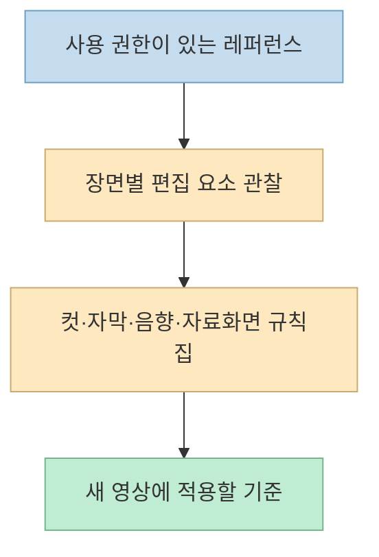
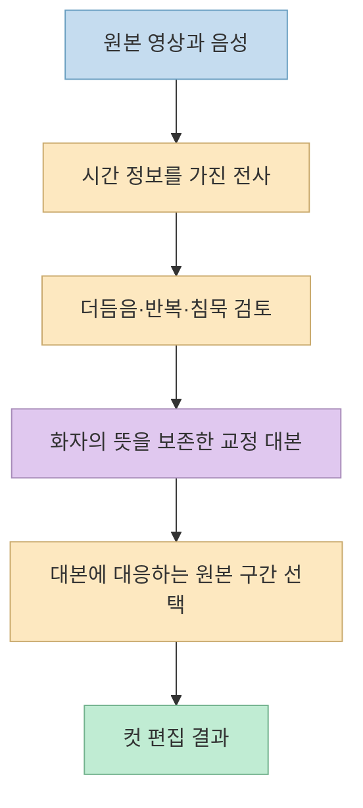
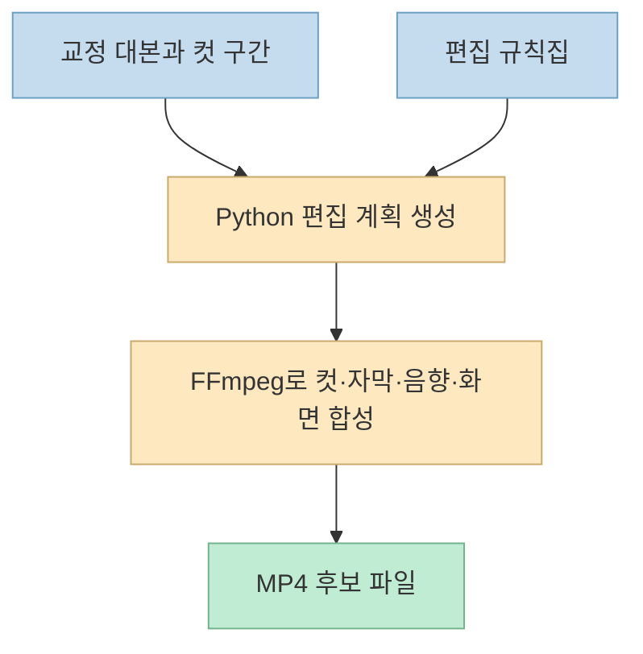
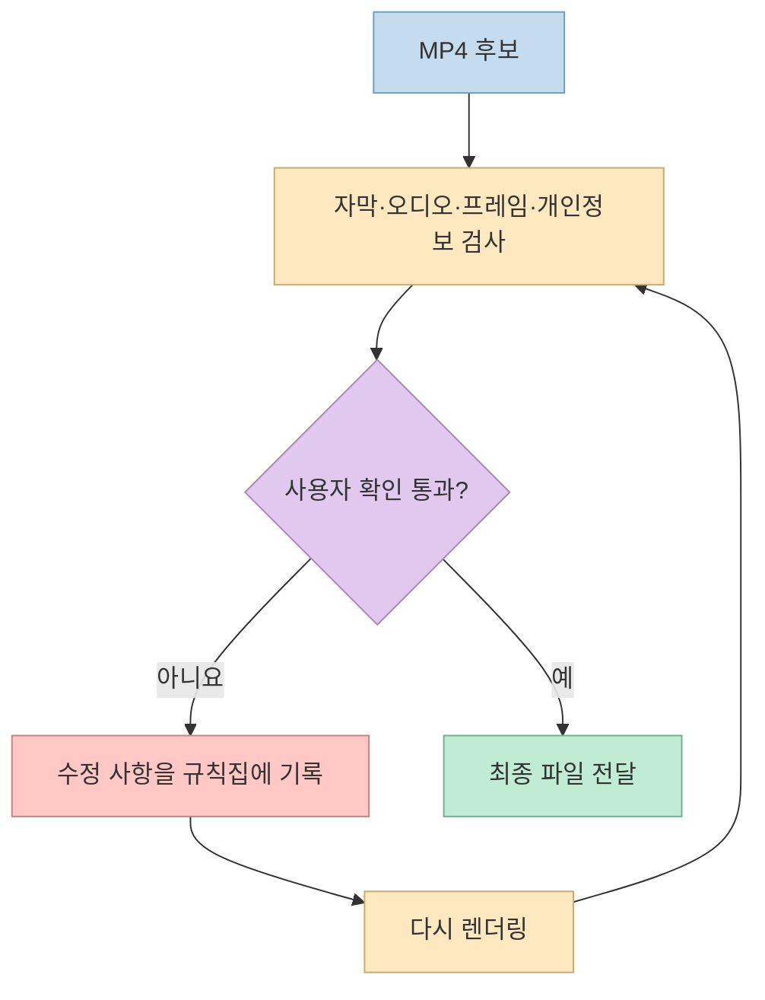

[한 Threads 게시물](https://www.threads.com/share/BAQfXuXClm/)은 편집을 모르는 유튜버가 Claude Code로 영상을 만들었다며 제작 방법을 공개했다. 본문만 읽으면 "딸깍 한 번"처럼 보이지만, 작성자가 남긴 [후속 설명](https://www.threads.com/@jachung__/post/DeG1x1IE1ve)을 따라가면 핵심은 **기존 영상에서 편집 규칙을 추출하고, 그 규칙을 실행하는 프로그램을 만든 뒤, 결과를 반복 검수하는 작업 흐름**이다.

<!--more-->

이 글은 게시물과 작성자 댓글에 공개된 절차를 재구성한 것이다. 실제 코드·원본 영상·완성 파일은 제공되지 않았으므로 특정 편집 품질이나 성능을 독립적으로 검증했다는 뜻은 아니다.

## Sources

- [원문 Threads 공유 링크](https://www.threads.com/share/BAQfXuXClm/) · [원문 게시물](https://www.threads.com/@jachung__/post/DeG10fBk6NM)
- [작성자의 결과 설명](https://www.threads.com/@jachung__/post/DeG1yNvk4ps)
- [작성자의 편집 규칙집·프로그램 설명](https://www.threads.com/@jachung__/post/DeG1x1IE1ve)
- [작성자의 편집 순서 설명](https://www.threads.com/@jachung__/post/DeG1x3IkwT9)
- [작성자의 검수·피드백·재사용 설명](https://www.threads.com/@jachung__/post/DeG1x4wE9uT)
- [작성자의 레퍼런스 강조](https://www.threads.com/@jachung__/post/DeG1x6hEyiz)
- [Claude Code 공식 스킬 문서](https://code.claude.com/docs/en/skills)
- [FFmpeg 공식 문서](https://www.ffmpeg.org/ffmpeg.html) · [필터 문서](https://www.ffmpeg.org/ffmpeg-filters.html)

## 1. 먼저 '좋은 편집'을 규칙으로 바꾼다

작성자는 참고할 유튜브 영상 **3~4개**를 제공하고, 컷 간격·자막의 글꼴과 위치·강조 순간·효과음과 배경음의 타이밍·자료화면·화면 확대·인트로와 아웃트로를 장면 단위로 분석해 **편집 규칙집**을 만들라고 제안한다. 마지막 댓글에서도 가장 중요한 입력으로 레퍼런스 영상을 꼽았다. 이는 모델에게 막연히 "멋지게 편집해"라고 말하는 것보다, 어떤 결과를 원하는지 관찰 가능한 기준으로 지정하는 방식이다. 다만 레퍼런스의 편집 스타일을 분석하는 것과 영상·음원·그래픽을 무단으로 재사용하는 것은 구분해야 한다. [편집 규칙 요청](https://www.threads.com/@jachung__/post/DeG1x1IE1ve) · [레퍼런스 강조](https://www.threads.com/@jachung__/post/DeG1x6hEyiz)

규칙집은 예컨대 "강조 자막을 언제 쓰는가", "말 없는 구간을 어느 정도까지 자르는가", "자료화면의 출처를 어떻게 표시하는가"처럼 판단 가능한 항목으로 나눠야 한다. **정확한 숫자나 디자인 값은 원문에 공개되지 않았다.** 따라서 다른 사람이 같은 결과를 재현하려면 자신의 레퍼런스를 직접 측정해 규칙을 채워야 한다.

## 2. 전사와 교정 대본을 컷 편집의 기준으로 삼는다

작성자가 제시한 순서는 **원본 음성 전사 → 더듬음·반복·긴 침묵을 뺀 교정 대본 → 교정 대본에 남은 말만 컷 편집**이다. 중요한 제약은 화자의 내용과 말투를 바꾸지 않는 것이다. 이는 생성 모델이 새로운 문장을 써서 영상을 바꾸는 작업이 아니라, 원래 녹화분 중 사용할 구간을 선택하는 작업으로 읽어야 한다. [작성자의 편집 순서](https://www.threads.com/@jachung__/post/DeG1x3IkwT9)

실제로 구현한다면 각 문장에 원본 영상의 시작·끝 시간을 연결하고, 제거할 구간이 문장 일부를 잘라 의미를 왜곡하지 않는지 사람이 확인해야 한다. **어떤 전사 모델이나 시간 정렬 도구를 사용했는지는 원문에 나오지 않는다.** 그러므로 특정 모델을 썼다고 단정하거나, 자동 전사가 항상 컷 편집에 충분할 만큼 정확하다고 가정해서는 안 된다.

## 3. Python과 FFmpeg는 '편집 규칙을 실행하는 도구'다

작성자의 프롬프트는 규칙집대로 편집하는 **Python + FFmpeg 프로그램**을 만들고, 다음부터 한 문장으로 부를 수 있게 스킬로 저장하라고 요청한다. 이어 컷 편집 후 자막·강조 자막·효과음·배경음, 내용에 맞는 자료화면과 출처 표기를 넣고 MP4로 저장하도록 지시한다. [프로그램 요청](https://www.threads.com/@jachung__/post/DeG1x1IE1ve) · [렌더링 순서](https://www.threads.com/@jachung__/post/DeG1x3IkwT9)

[FFmpeg 공식 문서](https://www.ffmpeg.org/ffmpeg.html)는 입력 스트림을 선택·변환·인코딩하는 명령행 도구를 설명하고, [필터 문서](https://www.ffmpeg.org/ffmpeg-filters.html)는 영상 합성, 자막, 오디오 처리를 위한 기능을 문서화한다. 다만 FFmpeg 자체가 "좋은 컷"을 판단해 주지는 않는다. 컷 구간과 스타일은 앞 단계의 규칙집·전사·편집 계획이 결정해야 한다. [Claude Code의 스킬](https://code.claude.com/docs/en/skills)은 반복 작업의 지침과 리소스를 묶는 방식이지, 스킬 파일만 저장하면 영상 편집기가 저절로 완성된다는 뜻도 아니다.

또한 원문 프롬프트의 "필요한 도구를 직접 설치"나 "자료화면을 찾아 넣기"는 편리하지만, 실제 운영에서는 **설치 명령 확인**, **자료화면·음원 사용 권한 확인**, **출처 검증**이 선행되어야 한다. 출처를 작게 표시하는 것만으로 이용 허락을 대신할 수는 없다.

## 4. 렌더링 뒤에도 검수와 피드백이 남는다

작성자는 완성 파일에서 **자막 오타, 소리 끊김, 화면 멈춤, 개인정보 노출**을 스스로 확인·수정하고 결과를 보고하도록 요청한다. 사용자가 아쉬운 점을 지적하면 규칙집에 추가해 다음 영상에 반영한다. "구글 드라이브에 영상 올렸어, 편집해줘"라는 재사용 명령도 제안하지만, 드라이브 연결이 없으면 연결 방법부터 안내하라는 조건을 붙였다. 즉, 단발성 생성보다 **규칙집 → 실행 → 검수 → 규칙집 갱신**의 반복이 핵심이다. [작성자의 검수·재사용 설명](https://www.threads.com/@jachung__/post/DeG1x4wE9uT)

자동 검사는 실수를 줄일 수 있지만, 자막의 의미·자료화면의 적절성·개인정보 노출처럼 맥락이 중요한 항목은 **게시 전 사람이 최종 재생하며 확인**하는 편이 안전하다. 이는 원문에 나온 자기 검수 조건을 실제 게시 절차에 적용할 때의 권장 사항이다.

## 5. 사례의 결과를 보편적 성능으로 읽지 않는다

작성자는 녹화 화면·원본·음성 등을 제공하고 편집점은 지정하지 않았으며, 첫 결과에서 수정할 부분이 없었다고 말한다. 또 게시한 영상이 자신의 최근 10개 영상 중 순위 2위였다고 덧붙인다. 이는 **작성자의 자기 보고 사례**이지, 모든 채널에서 한 번에 완성된다거나 자동 편집이 조회 성과를 높인다는 독립적 검증은 아니다. 결과에 영향을 준 레퍼런스 품질, 원본 상태, 수작업 개입 정도도 공개 자료만으로는 확정할 수 없다. [작성자의 결과 설명](https://www.threads.com/@jachung__/post/DeG1yNvk4ps)

## 실전 적용 포인트

1. **작게 시작한다.** 사용 권한이 있는 짧은 원본과 레퍼런스 몇 개로 컷 편집·자막부터 시험한다.
2. **규칙을 문서화한다.** 취향을 추상적인 말 대신 관찰·측정 가능한 기준으로 적는다.
3. **중간 산출물을 남긴다.** 전사, 교정 대본, 컷 시간표, 자료화면 출처, 렌더링 설정을 분리해 검토한다.
4. **권한을 확인한다.** 외부 영상·음악·이미지와 클라우드 저장소의 접근 범위, 새 도구 설치 명령을 검토한다.
5. **최종 재생을 생략하지 않는다.** 자동 검수 후에도 사람이 자막, 소리, 화면, 개인정보를 확인한다.

## 핵심 요약

- 사례의 핵심은 단일 프롬프트보다 **레퍼런스 규칙집 → 전사·교정 → 컷 편집 → 효과·자료화면 → 검수**의 파이프라인이다.
- Python과 FFmpeg는 정해진 편집 계획을 실행하고, Claude Code 스킬은 그 절차를 재사용하도록 돕는다.
- "수정 없이 완성"과 게시 성과는 작성자의 사례로만 받아들여야 한다.

## 결론

이 사례가 보여 주는 가능성은 편집 감각 전체를 AI에 맡기는 것이 아니라, **편집자의 암묵적 기준을 규칙집으로 만들고 반복 가능한 도구로 실행하는 것**이다. 좋은 레퍼런스와 원본, 검증 가능한 중간 산출물, 사람의 최종 판단이 있어야 "딸깍"에 가까운 경험도 재현 가능해진다.
