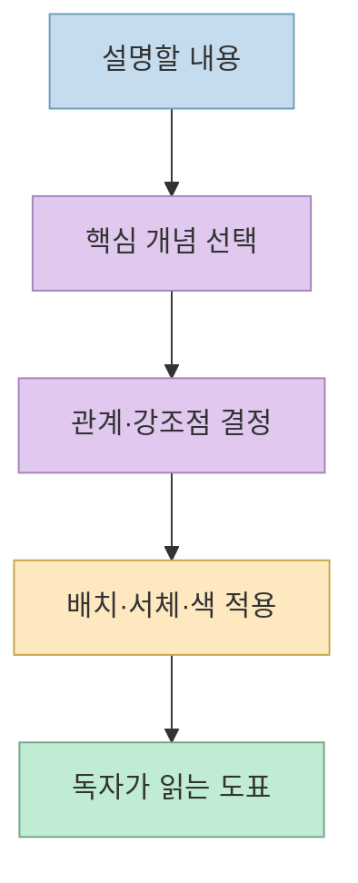
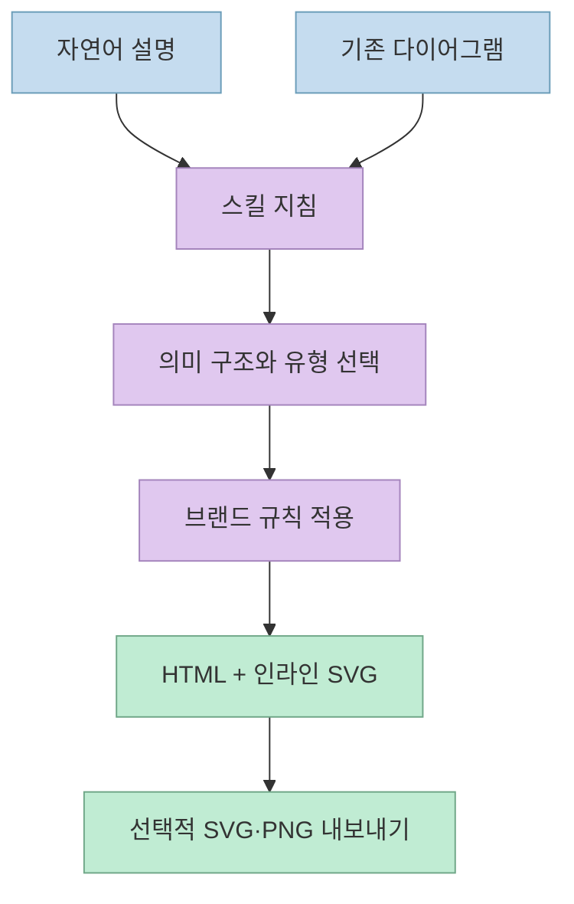
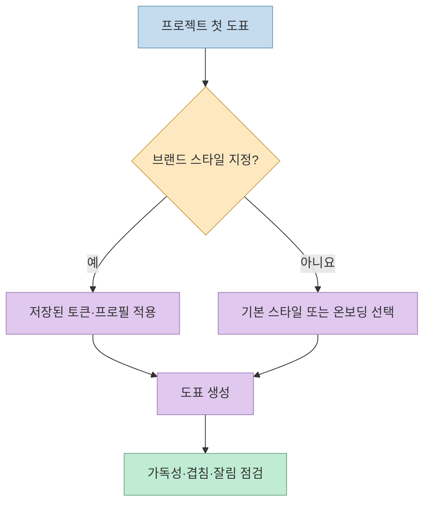
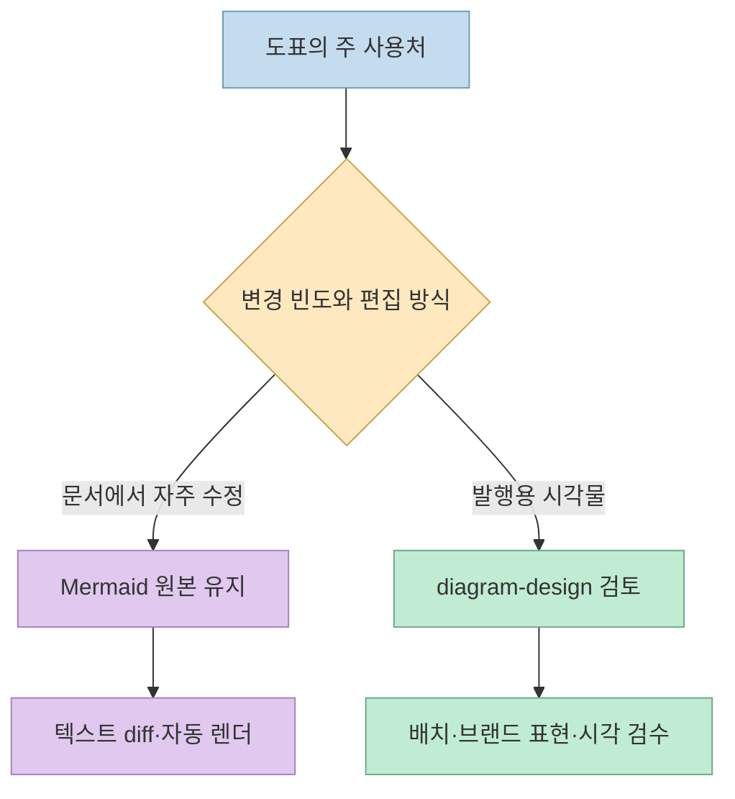

[lxfater의 X 게시물](https://x.com/lxfater/status/2108369386079662191)은 Claude가 그린 다이어그램이 평범한 둥근 상자에 머물러 Figma에서 다시 손보게 되는 문제를 소개합니다. 해결책으로 언급한 `diagram-design`은 배색·서체·배치 기준을 에이전트 스킬에 담은 오픈소스 프로젝트입니다. 이 글은 게시물의 짧은 소개를 [프로젝트 공식 저장소](https://github.com/cathrynlavery/diagram-design)와 대조해, 무엇이 달라지고 언제 쓰는 것이 적합한지 살펴봅니다.

<!--more-->

## Sources

- <https://x.com/lxfater/status/2108369386079662191>
- [diagram-design 공식 저장소](https://github.com/cathrynlavery/diagram-design)
- [diagram-design의 스킬 지침](https://github.com/cathrynlavery/diagram-design/blob/main/skills/diagram-design/SKILL.md)
- [diagram-design 사용 가이드](https://github.com/cathrynlavery/diagram-design/blob/main/docs/cookbook.md)

## 문제는 그릴 수 있느냐보다 무엇을 덜 그릴지다

게시물은 "AI가 그린 흐름도가 너무 못생겼다"는 문제에서 출발합니다. 제작자 역시 공식 README에서 Claude에 다이어그램을 요청할 때 사이트 디자인과 맞지 않는 일반적인 둥근 상자 결과를 받고, 이를 Figma에서 고치거나 아예 그림을 포기했다고 설명합니다. 해결 방향은 새로운 이미지 생성 모델이 아니라 **다이어그램 제작 기준을 명시적인 스킬로 만드는 것** 입니다. [원 게시물](https://x.com/lxfater/status/2108369386079662191) · [공식 README](https://github.com/cathrynlavery/diagram-design)

공식 스킬 지침은 우선 각 노드가 다른 개념을 나타내는지, 연결선이 실제 정보를 더하는지 따져 보라고 합니다. 강조색은 모든 상자에 칠하는 장식이 아니라 독자가 먼저 볼 한두 곳에 제한합니다. 이것은 "더 화려하게"보다 **정보 위계와 불필요한 요소 제거** 에 무게를 둔 설계입니다. [공식 스킬 지침의 디자인 철학](https://github.com/cathrynlavery/diagram-design/blob/main/skills/diagram-design/SKILL.md)



이 Mermaid 그림은 **이 글의 설명용 도표** 입니다. `diagram-design`이 실제로 만들어 내는 결과물의 예시는 아닙니다. 두 출력 방식을 혼동하지 않도록 구분해야 합니다.

## 입력은 자연어, 결과는 독립 HTML과 SVG다

공식 README에 따르면 사용자는 아키텍처, 흐름도, 시퀀스, 사분면 등 원하는 정보를 자연어로 요청합니다. 에이전트가 유형과 구성을 정한 뒤 **인라인 SVG가 들어 있는 독립 HTML 파일** 을 작성하는 방식입니다. 필요하면 SVG나 PNG로 내보낼 수 있고, 기존 Mermaid·draw.io·Excalidraw 자료를 가져와 새 디자인으로 다시 그리는 경로도 제공합니다. 이는 원본 문법을 그대로 예쁘게 렌더링한다는 뜻이 아니라, 관계와 묶음을 읽어 **재구성** 한다는 뜻에 가깝습니다. [공식 README의 출력·가져오기 설명](https://github.com/cathrynlavery/diagram-design)



지침은 도식의 의미가 행동·상태·위험에 걸려 있다면 먼저 **의미 패턴** 을 고르고, 그다음 화면에 나타낼 **시각 유형** 을 선택하도록 안내합니다. 예를 들어 순서가 핵심인 상호작용은 시퀀스, 조건 분기가 핵심인 설명은 흐름도, 계층 관계는 트리와 같이 다른 문법이 필요합니다. 먼저 예쁜 색을 고르는 것이 아니라, 관계를 표현할 방식을 정한다는 점이 이 스킬의 핵심입니다. [공식 스킬 지침의 선택 절차](https://github.com/cathrynlavery/diagram-design/blob/main/skills/diagram-design/SKILL.md)

## 스타일 가이드는 결과의 일관성을 위한 제약이다

공식 README는 강조색을 한두 초점에만 쓰고, 얇은 선, 그림자 없는 외관, 일정한 간격 격자 등을 디자인 원칙으로 제시합니다. 또한 프로젝트의 첫 도표에서 기본 스타일을 그대로 브랜드 작업에 적용하지 않도록, 기존 스타일 가이드나 저장된 프로필을 확인하고 필요하면 온보딩하도록 스킬 지침을 둡니다. 따라서 "한 번 설치하면 모든 브랜드에 자동으로 잘 맞는다"는 주장보다 **디자인 토큰을 정하고 재사용하도록 유도한다** 는 설명이 정확합니다. [공식 README의 디자인 시스템·첫 실행 안내](https://github.com/cathrynlavery/diagram-design) · [스킬 지침](https://github.com/cathrynlavery/diagram-design/blob/main/skills/diagram-design/SKILL.md)



공식 README는 결과 검증을 위해 `self_check.py` 실행 예시도 제공합니다. 다만 이런 검사만으로 **정보의 정확성이나 미적 품질이 객관적으로 보증되는 것은 아닙니다.** 겹침·잘림 같은 형식 문제를 자동 점검하고, 내용의 누락·강조의 타당성은 사람이 살펴보는 식으로 역할을 나누는 편이 합리적입니다. 마지막 문장은 공식 검증 범위를 바탕으로 한 실무적 해석입니다. [공식 README의 확인 절차](https://github.com/cathrynlavery/diagram-design)

## Mermaid를 버리는 도구인가

아닙니다. 프로젝트 README도 **Git에서 자주 바뀌는 기술 문서에는 Mermaid가 더 적합하다** 고 분명히 말합니다. Mermaid는 텍스트 차이를 검토하기 쉽고 GitHub에서 렌더링할 수 있습니다. 반면 이 스킬은 출판·발표처럼 완성된 시각 표현이 중요한 도표에 초점을 둡니다. HTML·SVG 결과는 직접 수정할 수 있지만, 다이어그램 전용 선언형 원본이나 드래그 가능한 캔버스와 동일하지 않습니다. 같은 요청을 다시 실행했을 때 배치가 달라질 수도 있다는 한계도 README가 명시합니다. [공식 README의 비교와 한계](https://github.com/cathrynlavery/diagram-design)



여기서 두 경로는 **위아래의 분기** 로 읽어야 합니다. 디자인 스킬이 Mermaid를 완전히 대체한다는 비교가 아니라, 최종 매체와 유지보수 방식에 따라 선택한다는 뜻입니다. 이 블로그 본문은 Hugo의 Mermaid 렌더링 규칙을 따르므로 설명용 그림을 Mermaid로 유지합니다.

## 설치 전에 알아둘 점

공식 저장소는 Agent Skills 호환 도구에서 `npx skills add cathrynlavery/diagram-design` 설치 경로를 안내합니다. Claude Code용 플러그인 마켓플레이스 설치 경로도 별도로 제공합니다. 두 방식은 업데이트와 제공 명령의 범위가 다르므로, **어떤 호스트에서 어떤 기능을 쓸지** 먼저 확인해야 합니다. 이 글에서는 명령을 실행하거나 사용자 환경에 스킬을 설치하지 않았습니다. [공식 README의 설치 설명](https://github.com/cathrynlavery/diagram-design)

```bash
npx skills add cathrynlavery/diagram-design
```

사용할 때는 "아키텍처를 그려 줘"에서 멈추지 말고 **독자, 크기, 핵심 관계, 강조할 한두 지점, 브랜드 토큰** 을 함께 지정하는 편이 좋습니다. 생성 후에는 요소 간 의미 관계, 글자 크기, 겹침, 내보낸 이미지의 가독성을 확인해야 합니다. 이는 공식 스킬이 의미 패턴과 스타일을 분리하고 검증 단계를 둔 이유에서 도출한 실무 지침입니다. [공식 스킬 지침](https://github.com/cathrynlavery/diagram-design/blob/main/skills/diagram-design/SKILL.md)

## 실전 적용 포인트

1. **문서 안에서 계속 고칠 도표** 라면 Mermaid를 원본으로 유지하고, **발표·출판용 최종 도표** 에만 디자인 스킬을 검토합니다. [공식 README](https://github.com/cathrynlavery/diagram-design)
2. 스킬이 기존 Mermaid 자료를 가져올 수 있더라도, 변환 후에는 노드의 의미와 관계가 보존됐는지 원본과 대조합니다. [가져오기 설명](https://github.com/cathrynlavery/diagram-design)
3. 결과가 좋지 않으면 색상만 늘리기보다 정보량과 강조점을 먼저 줄입니다. [스킬의 디자인 철학](https://github.com/cathrynlavery/diagram-design/blob/main/skills/diagram-design/SKILL.md)

## 핵심 요약

- X 게시물의 "AI용 그림 매뉴얼"이라는 비유는 프로젝트가 **명시적인 디자인 규칙을 스킬로 제공한다** 는 점을 잘 짚습니다.
- `diagram-design`의 주 출력은 독립 HTML과 인라인 SVG이며, 기존 도표를 시각적으로 재구성하는 기능도 있습니다.
- Mermaid의 텍스트 편집성과 Git diff는 여전히 장점입니다. 완성된 시각물과 자주 수정되는 문서는 목적이 다릅니다.

## 결론

이 스킬의 가치는 다이어그램을 자동으로 "예쁘게" 만드는 약속보다, **무엇을 보여 주고 무엇을 빼야 하는지** 를 에이전트에 반복 가능한 기준으로 전달하는 데 있습니다. 목적이 분명한 도표부터 시험하고, 결과의 의미와 가독성은 마지막에 직접 검토하는 것이 좋습니다.
