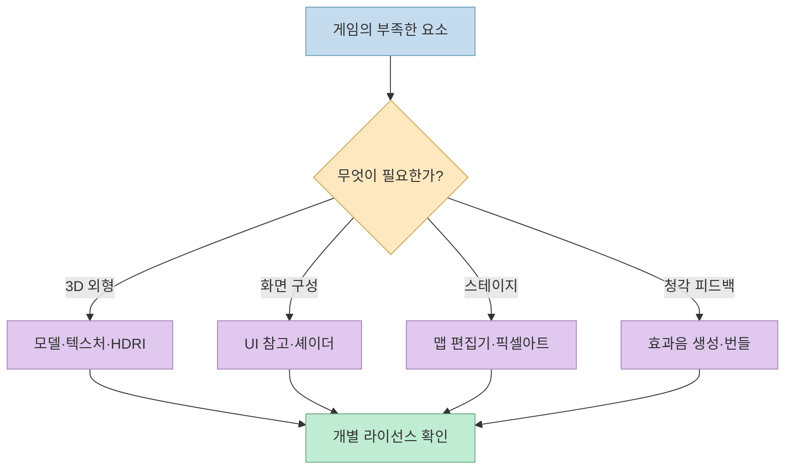
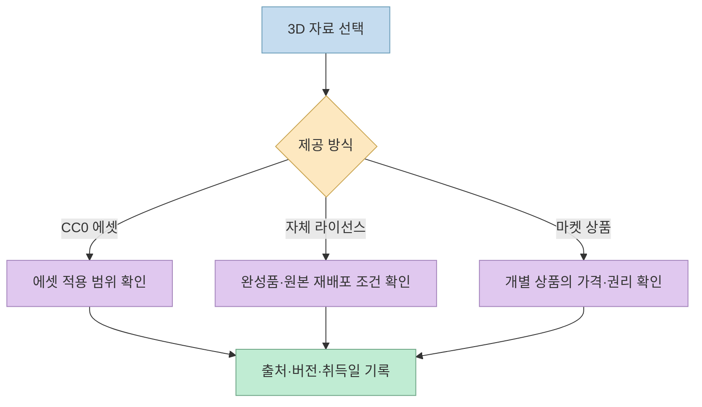
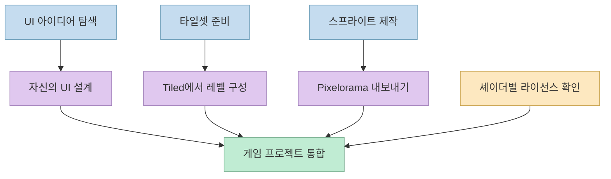
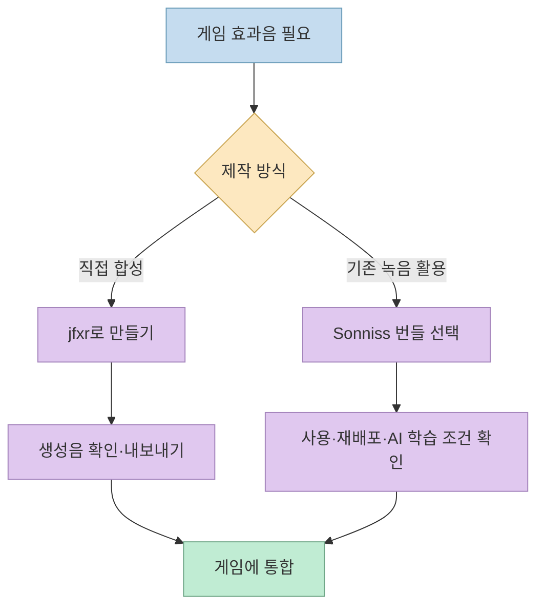
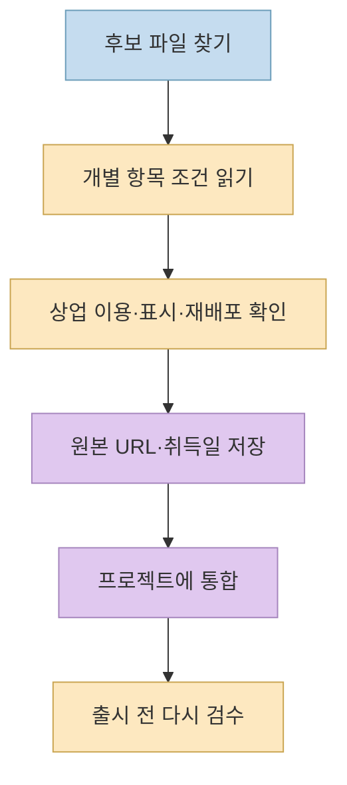

[바이브잇지의 Threads 게시물](https://www.threads.com/share/BAPGyg-hJK/)은 게임 제작자가 북마크할 **11개 리소스**를 소개합니다. 3D 모델과 재질, UI 참고 자료, 맵 편집기, 셰이더, 픽셀아트 도구, 효과음까지 범위가 넓습니다. 유용한 목록이지만 **무료 다운로드, 상업적 사용 허용, 에셋 자체의 재배포 허용은 서로 다른 조건** 입니다. 이 글은 각 사이트의 역할을 구분하고, 현재 확인되는 공식 사용 조건을 함께 적었습니다.

<!--more-->

## Sources

- <https://www.threads.com/share/BAPGyg-hJK/>
- [Poly Haven 에셋 라이선스](https://polyhaven.com/license)
- [Quaternius Asset License](https://quaternius.com/license.html)
- [Fab Standard License](https://www.fab.com/eula)
- [Godot Shaders 라이선스](https://godotshaders.com/license/)
- [jfxr 공식 FAQ](https://github.com/ttencate/jfxr)
- [Sonniss GDC 번들 라이선스](https://sonniss.com/gdc-bundle-license/)

## 먼저 필요한 자산의 종류를 나누자

원문 목록은 한눈에 보이지만, **에셋을 내려받는 곳** 과 **새 콘텐츠를 만드는 도구**, **디자인을 참고하는 갤러리** 가 섞여 있습니다. 같은 "무료 사이트"로 묶으면 사용권을 잘못 해석하기 쉽습니다. 실무에서는 먼저 게임의 빈자리가 모델인지, 표면 재질인지, UI 패턴인지, 레벨 데이터인지, 효과음인지 구분하는 편이 빠릅니다. [원문 Threads 게시물](https://www.threads.com/share/BAPGyg-hJK/)

## 3D 모델·재질: 비슷해 보여도 권리가 다르다

1. [Poly Haven](https://polyhaven.com)은 **HDRI, 텍스처, 3D 모델**을 제공합니다. 사이트의 공식 라이선스 페이지는 에셋을 **CC0**로 설명하며 상업적 사용과 저작자 표시 없는 사용도 허용합니다. 다만 사이트의 로고·글·이용자 제출 이미지까지 모두 CC0라는 뜻은 아닙니다. **에셋 라이선스의 범위** 를 구분해야 합니다. [Poly Haven 공식 라이선스](https://polyhaven.com/license)
2. [ambientCG](https://ambientcg.com)은 주로 PBR 재질과 텍스처, HDRI 등을 찾을 때 유용합니다. 공식 사이트의 공개 설명은 제공 에셋을 **CC0**라고 안내합니다. 다만 이 글을 작성할 때 라이선스 상세 페이지는 도구에서 직접 열리지 않아, 개별 에셋을 실제 프로젝트에 넣기 전에는 해당 다운로드 화면의 최신 조건을 다시 확인하는 것이 안전합니다. [ambientCG 공식 에셋 설명](https://ambientcg.com/view?id=WoodSiding006)
3. [Quaternius](https://quaternius.com)은 캐릭터, 건물, 몬스터 등을 포함한 게임용 3D 팩을 제공합니다. **주의할 점은 현재 라이선스 페이지가 CC0가 아니라 `Quaternius Asset License (QAL) v1.0`을 게시한다는 것** 입니다. 2026년 8월 28일 갱신된 이 문서는 게임·영상 등 완성 프로젝트에 무료로 사용하고 저작자 표시 없이 배포할 수 있게 하지만, 모델 파일 자체를 별도 에셋 팩처럼 다시 배포·판매하는 일은 제한합니다. 오래된 FAQ나 과거 팩 페이지의 CC0 표기와 **현재 라이선스가 일치하지 않으므로 다운로드 시점과 팩별 조건을 확인** 해야 합니다. [Quaternius 현재 라이선스](https://quaternius.com/license.html) · [과거 CC0 표기가 남은 FAQ](https://quaternius.com/faq.html)
4. [Fab](https://www.fab.com)은 3D 모델, 환경, 애니메이션 등을 찾는 **마켓플레이스** 입니다. 전부 무료인 저장소가 아닙니다. Fab Standard License는 에셋을 프로젝트에 포함해 상업적으로 배포하는 경로를 설명하면서, 에셋 파일을 단독으로 재판매·재배포하는 것은 허용하지 않습니다. 일부 목록은 CC BY처럼 **다른 라이선스** 일 수 있으므로 상품 페이지를 기준으로 확인해야 합니다. [Fab 공식 라이선스](https://www.fab.com/eula)
5. [Unity Asset Store](https://assetstore.unity.com)은 Unity용 캐릭터, 애니메이션, GUI, 도구, 오디오 등 다양한 상품을 모은 마켓입니다. 무료·유료 항목이 섞여 있고, 특정 에셋의 사용 범위는 **해당 상품과 Asset Store EULA** 를 확인해야 합니다. 따라서 원문의 "무료 에셋"이라는 머리말을 목록 전체에 적용해서는 안 됩니다. [Unity Asset Store](https://assetstore.unity.com/) · [Asset Store EULA 안내](https://unity.com/legal/as-terms)

## 화면과 레벨: 참고 자료와 제작 도구를 구분한다

6. [Interface In Game](https://interfaceingame.com)은 실제 게임의 인벤토리, 메뉴, HUD 같은 **UI 스크린샷·영상 사례를 살펴보는 자료실** 입니다. 이를 제품에 바로 넣는 에셋 저장소로 취급해서는 안 됩니다. 게임 UI의 정보 위계와 상호작용을 관찰한 뒤 자신의 디자인으로 다시 설계하는 용도가 적절합니다. 특히 기존 게임 화면을 그대로 복제하거나 추출해 배포하는 권리가 이 사이트 방문만으로 생기지는 않습니다. [Interface In Game 공식 사이트](https://interfaceingame.com/)
7. [Tiled](https://www.mapeditor.org)은 2D 타일맵과 레벨을 편집하는 **무료 오픈소스 도구** 입니다. 사각형·다각형 객체 레이어, 직교·등각·육각형 맵, JSON 등 다양한 내보내기를 지원합니다. **편집기 사용권** 과 맵에 넣은 **타일셋 그림의 사용권** 은 별개이므로, 외부 타일셋을 가져왔다면 그 라이선스를 따로 확인해야 합니다. [Tiled 공식 사이트](https://www.mapeditor.org/) · [Tiled 포럼의 관련 설명](https://discourse.mapeditor.org/t/license-of-maps-created-with-tiled/7887)
8. [Godot Shaders](https://godotshaders.com)은 Godot용 셰이더를 공유하는 커뮤니티 라이브러리입니다. 사이트의 라이선스 안내에 따르면 **게시자가 셰이더 코드에 적용할 라이선스** 를 선택하며 CC0, MIT, GPLv3 등이 가능합니다. 따라서 사이트 전체를 "자유롭게 복사해 써도 되는 동일 라이선스"로 보면 안 됩니다. 더구나 셰이더 코드의 라이선스는 게시물의 **스크린샷·영상·별도 에셋** 에 자동 적용되지 않습니다. [Godot Shaders 공식 라이선스](https://godotshaders.com/license/)
9. [Pixelorama](https://orama-interactive.itch.io/pixelorama)는 픽셀아트 스프라이트와 애니메이션을 **직접 만드는 편집기** 입니다. 공식 배포 페이지는 레이어·프레임 타임라인, 타일맵 레이어, 스프라이트시트 내보내기 등을 소개하고 프로그램을 MIT 라이선스의 오픈소스로 표시합니다. 프로그램의 라이선스와 함께 가져온 이미지·팔레트의 권리는 별도로 관리해야 합니다. [Pixelorama 공식 배포 페이지](https://orama-interactive.itch.io/pixelorama)

## 효과음: 직접 만든 소리와 라이브러리의 조건이 다르다

10. [jfxr](https://jfxr.frozenfractal.com)은 브라우저에서 게임용 효과음을 **직접 합성하는 도구** 입니다. 개발자 공식 FAQ는 jfxr로 만든 소리를 상업 프로젝트에도 자유롭게 사용할 수 있고 출처 표시는 필수가 아니라고 설명합니다. 도구의 코드 라이선스와 **생성한 소리의 사용권** 을 구분한다는 점도 명확합니다. [jfxr 공식 저장소 FAQ](https://github.com/ttencate/jfxr)
11. [Sonniss GameAudioGDC](https://sonniss.com/gameaudiogdc/)는 제작자가 녹음·제작한 효과음의 **무료 번들 아카이브** 입니다. 현행 번들 라이선스는 개인·상업 프로젝트에서 사용하고 수정하는 것을 허용하지만, 음원 파일 자체를 효과음 팩으로 재배포하는 것은 제한합니다. 특히 **AI/ML 학습 목적으로 사용하는 것은 금지** 합니다. 라이선스는 다운로드 당시 적용된 버전이 기준이라고 명시하므로 번들과 함께 해당 시점의 라이선스 기록을 보관하는 편이 안전합니다. [Sonniss 공식 번들 라이선스](https://sonniss.com/gdc-bundle-license/)

## 실전 적용 포인트

게임에 외부 자료를 넣을 때는 **도구 이름만 기록하지 말고, 실제 사용한 파일 단위로** 출처 URL, 제작자, 라이선스 이름과 버전, 다운로드 날짜, 수정 여부, 저작자 표시 요구를 남기는 것이 좋습니다. 특히 마켓플레이스 상품이나 커뮤니티 기여 자료는 사이트 전체의 소개 문구보다 **개별 항목의 조건** 이 중요합니다. 이는 [Quaternius의 현재 QAL](https://quaternius.com/license.html), [Fab의 복수 라이선스](https://www.fab.com/eula), [Godot Shaders의 게시물별 선택](https://godotshaders.com/license/)에서 도출한 실무 절차입니다.

## 핵심 요약

- 원문의 11곳은 **에셋 제공처, 마켓, 참고 갤러리, 제작 도구** 로 나누어 읽어야 합니다.
- Poly Haven과 ambientCG는 CC0 자료를 안내하지만, Fab·Unity Asset Store는 개별 상품을 확인해야 합니다.
- Quaternius의 **현재 공식 페이지는 QAL** 을 게시하며, 오래된 CC0 설명과 차이가 있습니다.
- Godot Shaders는 게시물마다 코드 라이선스가 다르고, Sonniss 번들은 AI 학습을 금지합니다.

## 결론

외부 에셋을 쓰는 목적은 제작 시간을 **게임 플레이와 재미** 에 더 많이 투자하는 것입니다. 다만 바로 내려받기보다 "어떤 종류의 자료인가, 실제 파일의 조건은 무엇인가, 완성 게임과 원본 파일을 각각 어떻게 배포할 수 있는가"를 먼저 확인해야 안전하게 재사용할 수 있습니다.
