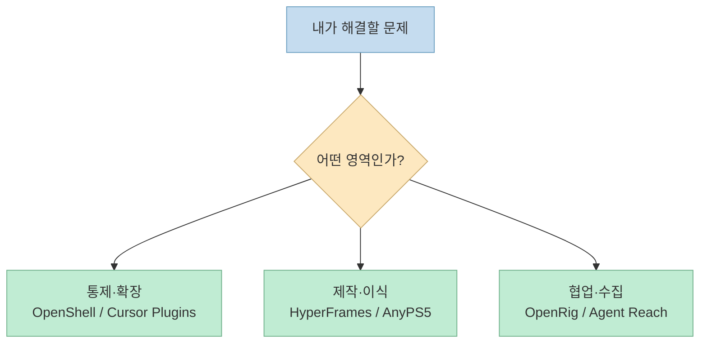
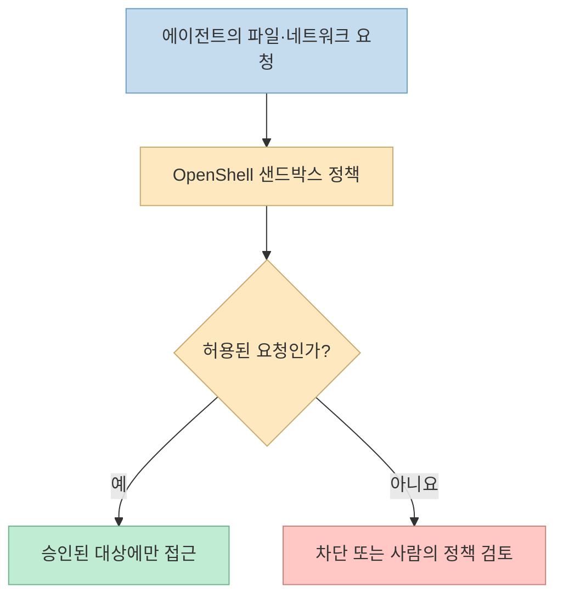
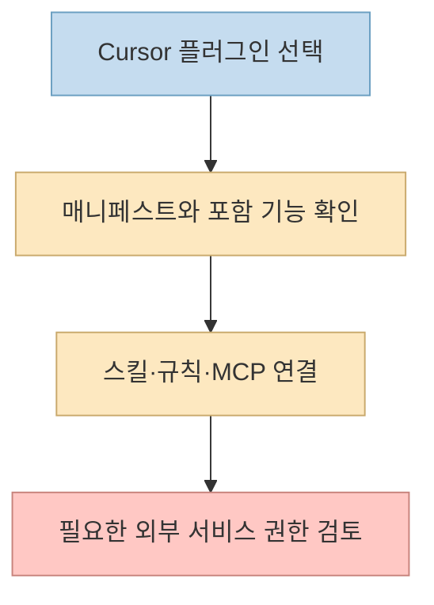
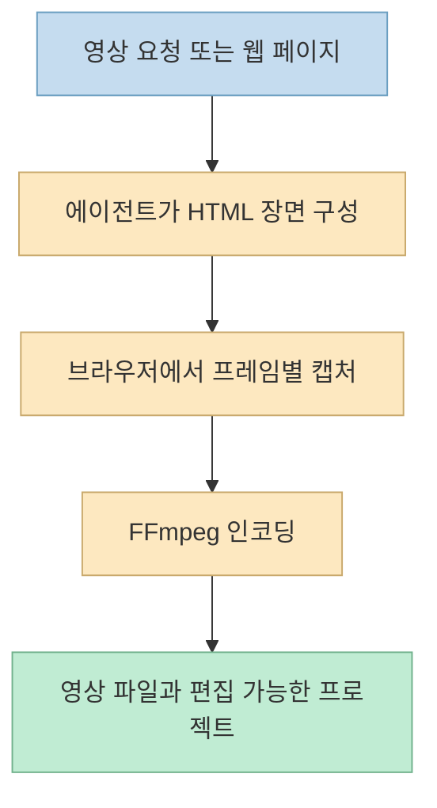
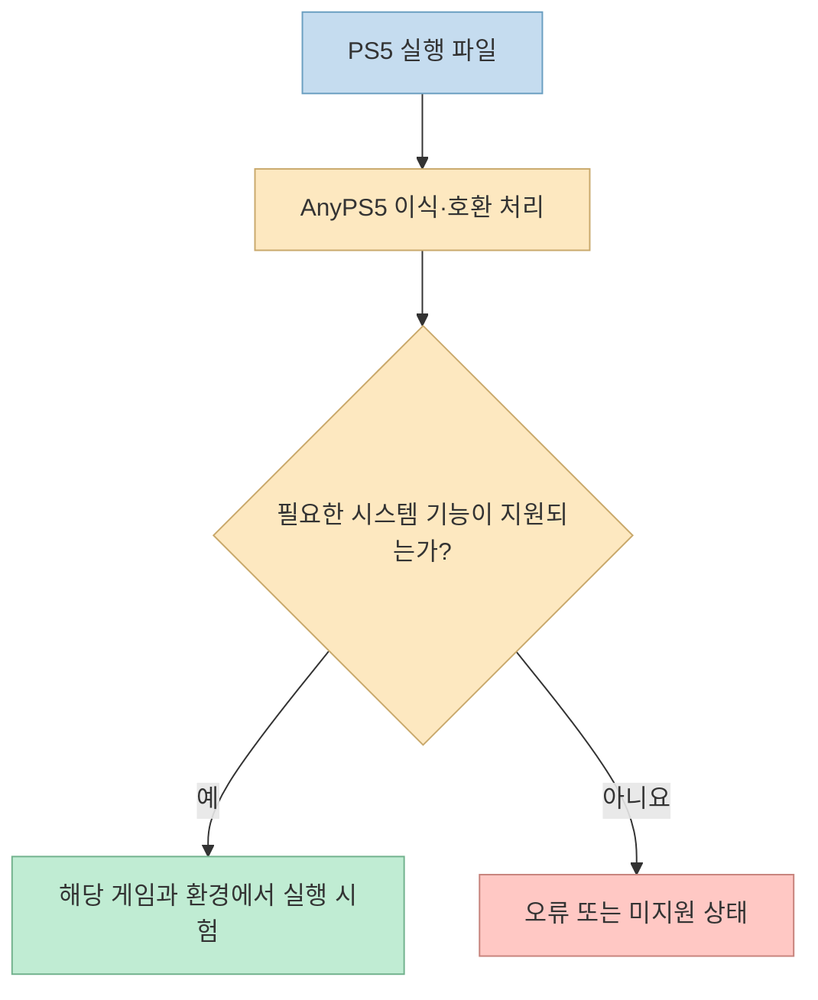
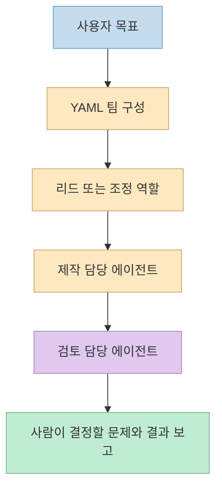
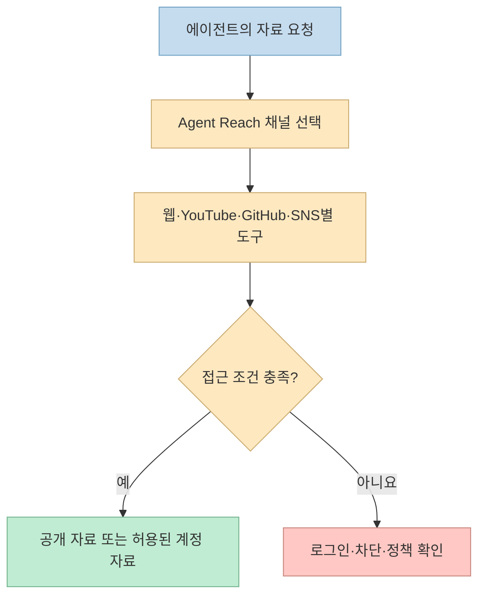

[문외인 Layperson의 10월 2주차 GitHub 트렌딩 Shorts](https://youtube.com/shorts/uDcOZEmemqU?si=71MhBzu29yHQeWwt)는 다섯 프로젝트와 보너스 하나를 빠르게 소개한다. 자동 자막에는 고유명사 오류가 있으므로, 이 글에서는 영상의 소개 순서를 유지하되 **프로젝트 이름과 기능 범위는 각 공식 저장소로 교차 확인**했다. 별점과 주간 증가량은 시점에 따라 달라지는 수치라 설치·채택의 근거로 삼지 않는다.

<!--more-->

## Sources

- [원본 YouTube Shorts](https://youtube.com/shorts/uDcOZEmemqU?si=71MhBzu29yHQeWwt)
- [OpenShell 공식 저장소](https://github.com/NVIDIA/OpenShell)
- [Cursor Plugins 공식 저장소](https://github.com/cursor/plugins)
- [HyperFrames 공식 저장소](https://github.com/heygen-com/hyperframes)
- [AnyPS5 공식 저장소](https://github.com/boykopovar/AnyPS5)
- [OpenRig 공식 저장소](https://github.com/mvschwarz/openrig)
- [Agent Reach 공식 저장소](https://github.com/Panniantong/Agent-Reach)

## 먼저 순위보다 용도를 본다

영상은 [5위 OpenShell](https://youtu.be/uDcOZEmemqU?t=17), [4위 Cursor Plugins](https://youtu.be/uDcOZEmemqU?t=39), [3위 HyperFrames](https://youtu.be/uDcOZEmemqU?t=63), [2위 AnyPS5](https://youtu.be/uDcOZEmemqU?t=87), [1위 OpenRig](https://youtu.be/uDcOZEmemqU?t=110), [보너스 Agent Reach](https://youtu.be/uDcOZEmemqU?t=136) 순으로 설명한다. 이 순서는 영상의 **특정 주간 소개 순위**이지 기술 우수성의 객관적인 등급이 아니다. 실제 선택은 보안·편집기 확장·영상 제작·실험적 호환성·에이전트 협업·웹 자료 수집 가운데 어떤 문제를 풀려는지에 달려 있다.

## 5위 OpenShell: 에이전트의 권한을 실행 환경 밖에서 제한

[영상 17초](https://youtu.be/uDcOZEmemqU?t=17)는 OpenShell을 에이전트의 파일·네트워크 접근과 비밀 키를 통제하는 실행 환경으로 소개한다. [NVIDIA 공식 README](https://github.com/NVIDIA/OpenShell)는 에이전트를 격리된 샌드박스에서 실행하고, 파일 접근·시스템 호출·네트워크 연결에 정책을 적용한다고 설명한다. 자격 증명은 에이전트에게 원문으로 보여 주는 대신 승인된 대상 요청에만 붙이며, 정책 변경이 넓은 접근 권한을 만들면 검토 대상으로 올린다. 이는 **프롬프트로 "안전하게 행동하라"고 부탁하는 것과 다른 실행 시점의 통제**다.

다만 샌드박스가 모든 위험을 없애지는 않는다. 어떤 파일·네트워크가 허용되는지는 정책에 달렸고, [공식 안내](https://github.com/NVIDIA/OpenShell)는 Linux, Apple Silicon macOS, 실험적 WSL 2 환경과 Docker·Podman 또는 가상화 요구사항을 제시한다. 설치 전 자신의 실행 환경과 정책 범위를 확인해야 한다.

## 4위 Cursor Plugins: 편집기의 확장 기능을 패키지로 관리

[영상 39초](https://youtu.be/uDcOZEmemqU?t=39)는 Cursor에서 외부 기능을 연결하는 공식 플러그인 모음을 소개한다. [공식 저장소](https://github.com/cursor/plugins)는 각 플러그인을 독립 디렉터리와 `.cursor-plugin/plugin.json` 매니페스트로 구성하며, 스킬·규칙·MCP 서버 정의 같은 확장 요소를 포함할 수 있다. 영상의 "89개"는 당시 목록에 대한 설명으로 읽어야 하며, 현재 설치 가능 항목은 [저장소와 Cursor 문서](https://prod.cursor.com/docs/plugins)에서 다시 확인해야 한다.

플러그인 저장소가 공개되어 있다는 사실과 Gmail·GitHub 등 외부 계정이 이미 연결되어 있다는 사실은 다르다. 어떤 권한을 승인할지는 설치하려는 플러그인별로 살펴봐야 한다.

## 3위 HyperFrames: HTML 프로젝트를 영상 프레임으로 렌더링

[영상 63초](https://youtu.be/uDcOZEmemqU?t=63)는 코딩 에이전트가 HTML로 장면을 만들어 영상으로 렌더링하는 도구라고 설명한다. [HeyGen의 HyperFrames 저장소](https://github.com/heygen-com/hyperframes)에 따르면 결과물은 HTML·CSS·JavaScript로 편집 가능한 프로젝트이며, 렌더러는 정해진 시각의 프레임을 브라우저에서 캡처해 FFmpeg로 인코딩한다. [공식 시작 안내](https://github.com/heygen-com/hyperframes/blob/main/docs/quickstart.mdx)는 스킬 설치, 미리보기, 렌더링 흐름을 설명한다.

영상에서 언급한 웹사이트 소개 영상·PR 설명 영상은 가능한 **활용 사례**이지 URL 하나만 입력하면 검수 없는 최종본이 나온다는 보장은 아니다. [공식 문서](https://github.com/heygen-com/hyperframes/blob/main/docs/quickstart.mdx)도 첫 결과의 사실관계·읽기 쉬운 텍스트·소리를 확인하라고 안내한다. 로컬 렌더링 자체와 선택적 호스팅·음성 서비스의 비용도 구분해야 한다.

## 2위 AnyPS5: PS5 실행 파일의 PC 이식 실험

[영상 87초](https://youtu.be/uDcOZEmemqU?t=87)는 AnyPS5를 PS5 실행 파일을 Windows·Linux용으로 변환하려는 도구로 소개한다. [공식 저장소](https://github.com/boykopovar/AnyPS5)는 자동 이식을 목표로 설명하지만, 이것을 **모든 PS5 게임이 PC에서 동작한다**는 주장으로 확대하면 안 된다. 저장소가 명시한 검증 사례는 2D 게임 *Dreaming Sarah*가 GTX 1050 Ti와 i5-7500 환경에서 안정적 60fps로 실행된다는 프로젝트 측 보고다. [영상 95초](https://youtu.be/uDcOZEmemqU?t=95)의 사례와 일치하지만, 다른 게임·하드웨어의 호환성을 보증하지 않는다.

[README](https://github.com/boykopovar/AnyPS5)는 예상하지 못한 상태에서 오류를 발생시키고 프로세스를 종료한다고 명시한다. 또한 실행 파일과 게임 자산은 사용 권한이 있는 것만 다뤄야 한다. 관심이 있다면 홍보 문구보다 공식 호환성 목록과 지원되지 않는 기능을 먼저 확인하는 편이 좋다.

## 1위 OpenRig: 여러 코딩 에이전트를 하나의 팀으로 운영

[영상 110초](https://youtu.be/uDcOZEmemqU?t=110)는 Claude Code와 Codex를 한 팀으로 묶어 역할을 나누는 도구로 소개한다. [OpenRig 공식 README](https://github.com/mvschwarz/openrig)는 YAML 설정으로 팀 구성·역할·연결·지속성 정책을 정의하고, `rig up`으로 tmux 세션과 에이전트를 시작하는 방식을 설명한다. 여기서 가치가 생기는 지점은 모델 하나의 지능 향상보다 **누가 무엇을 맡고, 결과를 어디로 넘기며, 어떤 상태를 유지하는지**를 명시하는 데 있다.

영상의 "명령 한 줄"은 시작의 간편함을 말할 뿐, 좋은 역할 분담·검토 기준까지 자동 보장한다는 뜻은 아니다. 여러 에이전트가 같은 파일을 동시에 바꾸는 작업이라면 소유권과 승인 지점을 먼저 설계해야 한다.

## 보너스 Agent Reach: 채널별 웹 자료 수집 경로를 묶기

[영상 136초](https://youtu.be/uDcOZEmemqU?t=136)는 유튜브 자막과 X·Reddit 등을 에이전트가 읽고 검색하도록 돕는 도구로 Agent Reach를 소개한다. [공식 저장소](https://github.com/Panniantong/Agent-Reach)는 채널별로 Jina Reader, yt-dlp, GitHub CLI, 로그인 세션 기반 도구 등을 조합한다. "API 요금 0원"은 **공식 유료 API 구독 없이 접근하는 경로를 제공한다는 프로젝트의 설명**이지 모든 플랫폼에서 로그인·차단·운영 비용이 없다는 뜻은 아니다.

[공식 README](https://github.com/Panniantong/Agent-Reach)는 일부 사이트에서 쿠키·로그인 상태가 필요하고, 자동화 사용에 계정 제한 위험이 있음을 직접 경고한다. 따라서 민감한 주 계정의 쿠키를 무심코 연결하지 말고, 플랫폼 이용 조건과 자격 증명 보관 방식을 확인해야 한다.

## 실전 적용 포인트

1. **문제부터 고른다.** 보안 격리, 편집기 확장, 영상 제작, 게임 호환성 실험, 팀 조정, 자료 수집은 서로 대체재가 아니다.
2. **공식 저장소의 현재 상태를 확인한다.** 영상의 순위·별점·플러그인 개수는 시간에 따라 바뀐다.
3. **권한을 먼저 본다.** OpenShell 정책, Cursor 플러그인의 외부 계정 권한, Agent Reach의 로그인 세션은 특히 신중하게 다룬다.
4. **시범 사례를 일반화하지 않는다.** AnyPS5의 특정 게임 실행과 HyperFrames의 예시 영상은 모든 입력의 성공 보증이 아니다.

## 핵심 요약

- **OpenShell**은 에이전트의 실행 권한을 정책으로 제한하고, **Cursor Plugins**는 편집기 확장을 패키지로 관리한다.
- **HyperFrames**는 HTML 기반 영상을 렌더링하고, **AnyPS5**는 제한된 검증 사례를 가진 PS5 실행 파일 이식 실험이다.
- **OpenRig**는 코딩 에이전트 팀을 구성하고, **Agent Reach**는 여러 웹 채널의 수집 경로를 연결한다.
- 영상의 주간 순위와 성장 수치는 선택 기준보다 **관심을 끄는 스냅샷**으로 보는 편이 정확하다.

## 결론

이 여섯 프로젝트는 모두 "AI가 더 많은 일을 한다"는 흐름에 있지만 서로 다른 층을 맡는다. **무엇을 할 수 있는가**뿐 아니라 **어디까지 검증됐고, 어떤 권한을 요구하며, 실패하면 어떻게 되는가**를 공식 문서에서 확인한 뒤 자신의 작업에 맞는 하나부터 시험하는 것이 좋다.
