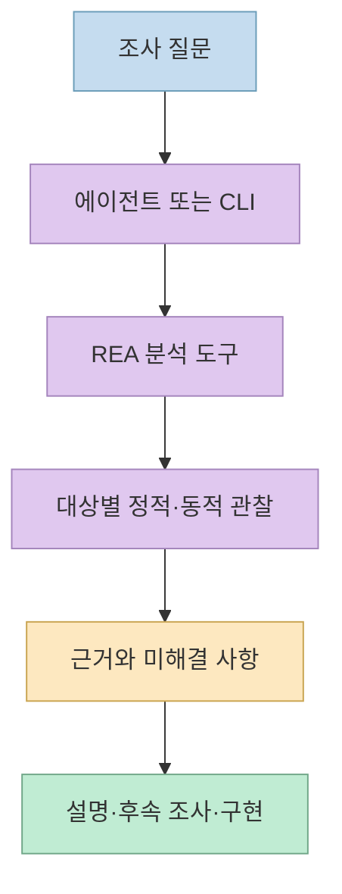
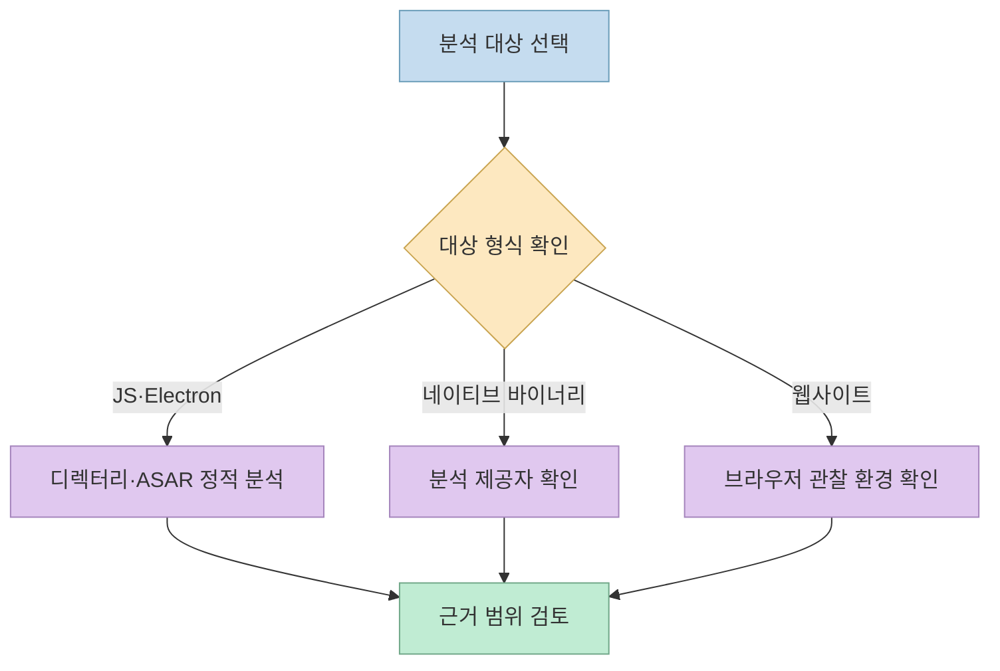
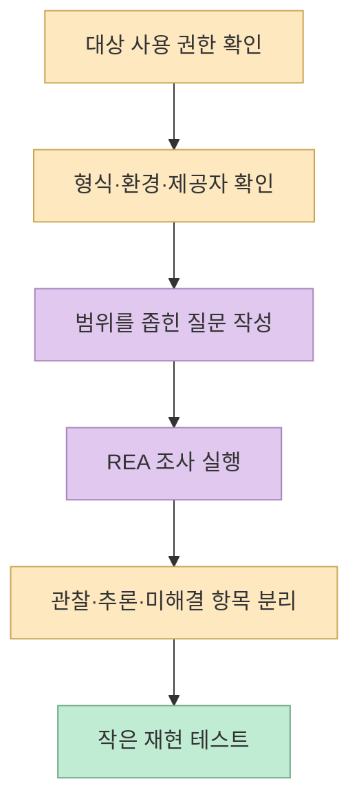

[CV.YH의 X 게시물](https://x.com/0xCVYH/status/2108262476026397040)은 포르투갈어로 "무엇이든 리버스 엔지니어링"이라고 소개하며 [REA 저장소](https://github.com/morluto/rea)를 연결합니다. 여기서 *무엇이든*은 문자 그대로 모든 대상을 자동으로 해독한다는 뜻보다, 서로 다른 종류의 분석을 한 에이전트 워크플로로 묶겠다는 프로젝트의 방향으로 읽는 편이 정확합니다. 실제로 지원 범위와 선행 도구는 대상마다 다릅니다.

<!--more-->

## Sources

- <https://x.com/0xCVYH/status/2108262476026397040>
- [REA 공식 저장소](https://github.com/morluto/rea)
- [REA 한국어 README](https://github.com/morluto/rea/blob/main/README_ko.md)
- [REA CLI 및 Evidence 가이드](https://github.com/morluto/rea/blob/main/docs/cli.md)
- [REA 설치 가이드](https://github.com/morluto/rea/blob/main/docs/installation.md)

## REA는 무엇을 연결하나

REA는 에이전트가 **MCP 서버** 를 통해 분석 도구를 호출하고, 같은 조사 흐름을 **CLI** 에서도 실행할 수 있게 하는 프로젝트입니다. 공식 README는 네이티브 바이너리, JavaScript·Electron 애플리케이션, .NET 어셈블리, 웹사이트를 주요 예시로 듭니다. 결과는 단순 설명만이 아니라 관찰 근거와 한계를 함께 제시하도록 설계됐다고 명시합니다. 이는 소스 코드가 없는 앱의 기능을 조사해 유사한 기능을 구현하려는 상황에 맞춰져 있습니다. [공식 README](https://github.com/morluto/rea)



이 흐름에서 중요한 구분은 **관찰** 과 **추론** 입니다. 예를 들어 어떤 문자열이나 함수 호출이 발견됐다는 사실은 관찰이고, 그것이 특정 사용자 기능의 핵심이라는 주장은 추론입니다. REA의 Evidence 가이드는 아티팩트 식별, 소스 위치, 관찰, 추론, 미해결 항목을 기록한다고 설명합니다. 그러므로 결과를 읽을 때는 결론만 복사하기보다 어떤 대상·위치에서 얻은 증거인지 확인해야 합니다. [CLI 및 Evidence 가이드](https://github.com/morluto/rea/blob/main/docs/cli.md)

## 분석 대상마다 필요한 도구가 다르다

공식 문서의 지원 목록을 한 문장으로 압축하면 오해하기 쉽습니다. JavaScript·Electron의 정적 분석은 압축을 푼 앱 디렉터리나 ASAR를 입력으로 받을 수 있고, 네이티브 심층 분석에는 Hopper·Ghidra·IDA 중 적합한 제공자가 필요합니다. 웹사이트 관찰에는 Chrome 계열 브라우저가, Android APK 조사에는 문서에 명시된 플랫폼에서 JADX와 JDK가 필요합니다. 즉 **지원 대상** 과 **현재 내 환경에서 즉시 분석 가능한 대상** 은 다릅니다. [한국어 README의 대상별 요구 사항](https://github.com/morluto/rea/blob/main/README_ko.md)



정적 분석은 파일에 남은 구조를 보여 주지만 실제 실행 경로 전체를 자동으로 증명하지는 않습니다. 반대로 런타임 관찰은 선택한 시나리오에서 일어난 일을 기록하므로, 관찰하지 않은 입력이나 환경까지 일반화해서는 안 됩니다. 이 문장은 도구의 결과 범위를 해석하기 위한 **실무적 추론** 이며, 공식 문서도 정적 분석과 런타임 캡처의 동작 및 효과를 분리해 설명합니다. [한국어 README](https://github.com/morluto/rea/blob/main/README_ko.md) · [CLI 가이드](https://github.com/morluto/rea/blob/main/docs/cli.md)

## 설치와 첫 조사: 명령보다 범위 확인이 먼저다

공식 빠른 시작은 Node.js와 npm이 있는 환경에서 `npx rea-agents setup`을 제시합니다. 설정은 지원 에이전트에 MCP 서버와 워크플로 지침을 등록하며, 변경 예정 사항의 검토·승인이 포함됩니다. 프로젝트 문서는 Node.js 지원 버전을 **22.x(22.19 이상), 24.x(24.11 이상), 또는 26 이상** 으로 표기합니다. 네이티브 분석 엔진은 별도 조건이므로 설치 명령 하나만으로 모든 분석 기능이 완성된다고 볼 수 없습니다. [공식 README](https://github.com/morluto/rea) · [설치 가이드](https://github.com/morluto/rea/blob/main/docs/installation.md)

```bash
npx rea-agents setup
```

에이전트 설정 없이 CLI의 정적 JavaScript 분석을 살펴보는 예시도 공식 문서에 있습니다. 아래 명령은 **실제 보유하고 분석 권한이 있는** 추출된 앱 디렉터리나 ASAR 경로로 바꿔 실행해야 합니다. 이 글은 명령을 실행해 성능이나 결과 품질을 독립 검증한 실험 보고서가 아닙니다. [CLI 및 Evidence 가이드](https://github.com/morluto/rea/blob/main/docs/cli.md)

```bash
npx -y rea-agents@latest analyze-javascript-application /absolute/path/to/app --json
```



## Evidence가 있어도 완성된 재구현을 보증하지는 않는다

공식 사례에는 게임의 사운드 패닝 계산 복원과 Electron 클립보드 경로 추적 등이 있습니다. 이는 프로젝트가 어떤 종류의 질문을 다루려는지 보여 주는 **사례** 이지, 임의의 앱·펌웨어·바이너리에서 같은 수준의 복원이 보장된다는 벤치마크는 아닙니다. 특히 CLI 문서는 명령의 종료 코드 `0`도 결과에 부분 근거, 경고, 미해결 질문이 포함될 수 있다고 설명합니다. [공식 README 사례](https://github.com/morluto/rea) · [CLI 출력 및 종료 상태](https://github.com/morluto/rea/blob/main/docs/cli.md)

또한 프로젝트는 분석이 로컬에서 수행된다고 설명하지만, 에이전트가 도구 결과를 받아 처리하며 모델 제공자의 데이터 정책은 별개라고 명시합니다. 기밀 바이너리나 내부 앱을 조사한다면 **로컬 분석 여부만으로 외부 전송 가능성이 전부 사라진다고 가정하면 안 됩니다.** 사용 권한, 에이전트 연결 방식, 결과 보관·전송 정책을 별도로 검토해야 합니다. [한국어 README의 데이터 관련 FAQ](https://github.com/morluto/rea/blob/main/README_ko.md)

## 실전 적용 포인트

1. "앱 전체를 분석해 줘"보다 "검색 버튼 입력 후 어떤 모듈과 IPC 경계를 거치는지 근거와 함께 보여 줘"처럼 **검증 가능한 질문** 을 지정합니다. 이는 공식 README의 기능 조사 예시와 Evidence 구조를 바탕으로 한 권장 방식입니다. [한국어 README](https://github.com/morluto/rea/blob/main/README_ko.md) · [Evidence 가이드](https://github.com/morluto/rea/blob/main/docs/cli.md)
2. 대상 형식과 운영체제, 필요한 분석 제공자를 먼저 확인합니다. 지원 목록에 있다는 사실과 내 환경에서 실행할 수 있다는 사실은 다릅니다. [대상별 요구 사항](https://github.com/morluto/rea/blob/main/README_ko.md)
3. 결과에서 **확인된 관찰**, **도구나 에이전트의 추론**, **아직 확인되지 않은 부분** 을 나눠 기록하고, 중요한 기능은 직접 재현 테스트합니다. [Evidence 가이드](https://github.com/morluto/rea/blob/main/docs/cli.md)
4. 허가받지 않은 대상 분석이나 사용 조건 위반을 피합니다. 프로젝트도 적법한 연구·분석을 전제로 책임과 제한을 명시합니다. [공식 면책 조항](https://github.com/morluto/rea)

## 핵심 요약

- X 게시물은 REA를 짧게 소개하고 저장소를 연결하지만, **세부 기능과 제약은 공식 문서에서 확인** 해야 합니다.
- REA는 에이전트와 CLI가 여러 유형의 대상을 조사할 때 쓰는 도구 모음이며, 결과에는 근거와 한계가 중요합니다.
- 대상별 선행 도구와 지원 환경이 다르고, 성공 종료 코드도 모든 추론의 검증을 뜻하지 않습니다.

## 결론

REA의 핵심 가치는 "무엇이든 자동 복원"이라는 구호보다 **조사 질문을 분석 도구와 연결하고 결과의 근거를 추적할 수 있게 하는 워크플로** 에 있습니다. 작은 기능 하나를 골라 대상·환경·증거·미해결 사항을 확인하며 적용하는 것이 안전한 출발점입니다.
