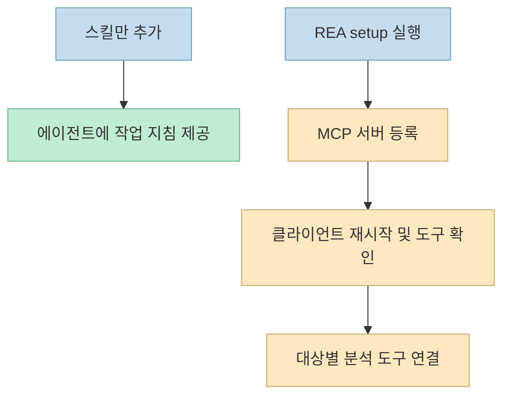
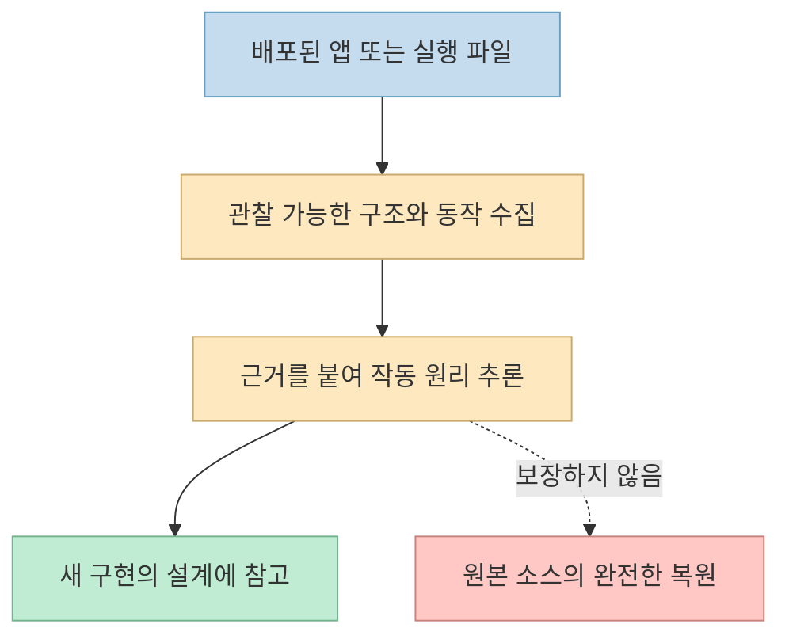
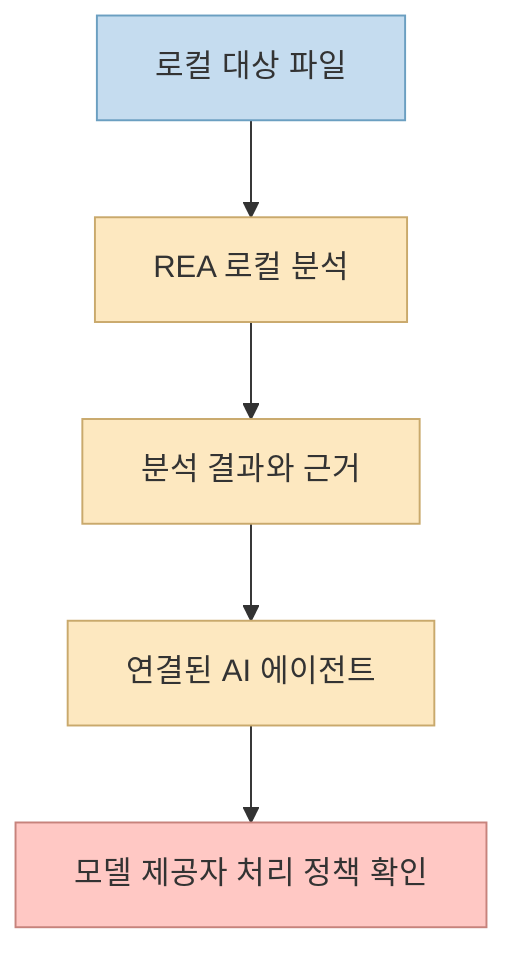

"소스코드 없이 앱의 작동 원리를 조사할 수 있는 사기 스킬"이라는 [Threads 게시물](https://www.threads.com/@vibe.itji/post/DeSB_wkj1mP)이 [Reverse Engineer Anything(REA)](https://github.com/morluto/rea)를 소개했다. `npx rea-agents setup`이라는 설치 명령도 함께 제시한다. 흥미로운 도구이지만, **스킬 설치**, **분석 도구 연결**, **원본 코드 복원**, **데이터의 로컬 처리**는 서로 다른 이야기다.

<!--more-->

이 글은 REA의 전체 사용법을 반복하기보다 소셜 게시물의 핵심 표현을 공식 문서와 대조한다. 구조와 증거 기반 분석 흐름은 앞서 작성한 [REA 소개 글](/post/2026/10/2026-10-10-rea-agent-reverse-engineering-evidence-workflow/)에서 자세히 다뤘다.

## Sources

- [원문 Threads 게시물](https://www.threads.com/@vibe.itji/post/DeSB_wkj1mP) · [공유 링크](https://www.threads.com/share/_l2U6xzvI/)
- [REA GitHub 저장소 및 README](https://github.com/morluto/rea)
- [REA 공식 설치 문서](https://github.com/morluto/rea/blob/main/docs/installation.md)
- [REA CLI와 증거 확인 문서](https://github.com/morluto/rea/blob/main/docs/cli.md)
- [REA 라이선스](https://github.com/morluto/rea/blob/main/LICENSE)

## 1. '스킬'을 설치하는 것과 분석 서버를 연결하는 것은 다르다

게시물의 설치 명령 `npx rea-agents setup`은 REA의 **안내형 설정 절차**를 실행한다. [공식 설치 문서](https://github.com/morluto/rea/blob/main/docs/installation.md)에 따르면 이 절차는 지원되는 에이전트 클라이언트에 MCP 서버와 워크플로 지침을 등록한다. 반면 `npx skills add morluto/rea --skill reverse-engineer-anything`는 **지침만 설치**하며 MCP 서버나 분석 엔진을 설치하지 않는다. 따라서 "스킬을 추가했다"는 사실만으로 REA 분석 도구를 호출할 수 있다고 판단하면 안 된다.

설정 전에는 [지원 Node.js 버전과 클라이언트별 절차](https://github.com/morluto/rea/blob/main/docs/installation.md)를 확인해야 한다. 공식 문서는 Node.js 22.19+, 24.11+, 26+를 안내하고, 설정이 기존 구성을 백업하며 확인 단계를 거친다고 설명한다. Telegram에서 이 명령을 무작정 원격 실행하기보다, 사용자가 작업할 컴퓨터에서 변경 내용을 확인하며 진행하는 편이 적절하다.

## 2. '소스 없이 조사'는 '원본 소스 복원'이 아니다

REA는 웹사이트·Electron 앱·네이티브 실행 파일의 **관찰 가능한 단서**를 수집해 구조와 동작을 추론한다. [README](https://github.com/morluto/rea)는 JavaScript/Electron 분석에서 모듈과 임포트, 경계를 파악하고 네이티브 분석에서는 의사코드와 어셈블리를 근거로 삼는다고 설명한다. 이것은 원본 개발자의 소스 저장소, 변수명, 의도까지 그대로 되살린다는 뜻이 아니다.

특히 네이티브 실행 파일의 심층 분석에는 [Ghidra·Hopper·IDA 같은 별도 공급자 도구](https://github.com/morluto/rea)가 필요하다. 게시물에도 Ghidra·Hopper가 별도로 필요하다는 단서가 있다. 분석 결과는 출발점이지 정답지가 아니므로, [CLI 문서](https://github.com/morluto/rea/blob/main/docs/cli.md)가 강조하는 근거와 재현 가능성을 확인해야 한다.

## 3. '로컬 분석'과 '데이터가 외부로 나가지 않음'은 다르다

[README](https://github.com/morluto/rea)는 REA가 로컬에서 분석 작업을 수행한다고 설명한다. 그러나 분석 결과를 Claude Code·Codex·Cursor 같은 에이전트에 전달하면 해당 에이전트의 모델 제공자에게 그 내용이 전송될 수 있다. 따라서 **로컬에서 파일을 처리한다**는 사실만으로 **분석 데이터가 끝까지 내 컴퓨터에만 남는다**고 결론 내릴 수 없다. 민감한 파일을 다룬다면 REA뿐 아니라 연결된 에이전트의 데이터 처리 정책도 따로 확인해야 한다.

## 4. 별점과 지원 범위는 사용 시점에 다시 확인한다

Threads 게시물은 GitHub 별점 **3.86만**을 언급한다. 이는 게시물이 작성된 시점의 수치로 읽어야 한다. 저장소의 별점은 계속 변하고, 인기도가 특정 대상 앱의 분석 성공률을 보장하지도 않는다. 실제 적용 여부를 판단할 때는 [현재 저장소와 설치 문서](https://github.com/morluto/rea/blob/main/docs/installation.md)에서 지원 클라이언트, 런타임, 필요한 분석 공급자를 다시 확인하는 편이 정확하다.

## 실전 적용 포인트

1. **설치 범위를 정한다.** 지침만 필요한지, MCP 서버와 분석 도구까지 필요한지 구분한다.
2. **대상 유형을 확인한다.** 웹·Electron·네이티브 중 무엇을 분석할지 정하고 필요한 공급자 도구를 준비한다.
3. **결과의 근거를 검토한다.** 추론과 관찰 사실을 섞지 않고, 재현 가능한 증거로 중요한 결론을 검증한다.
4. **권한과 데이터 흐름을 확인한다.** 분석 대상에 대한 권한, [MIT 라이선스와 저장소의 법적 고지](https://github.com/morluto/rea/blob/main/LICENSE), 연결된 AI 서비스의 데이터 정책을 살핀다.

## 핵심 요약

- REA의 **스킬만 설치**하면 지침을 얻지만 MCP 분석 도구가 자동으로 생기지는 않는다.
- **소스 없이 조사**할 수 있어도 원본 소스를 완전히 복원하는 도구는 아니다.
- **로컬 분석**은 연결된 AI 모델까지 포함한 완전한 로컬 처리를 뜻하지 않는다.
- 별점과 지원 범위는 최신 문서에서 다시 확인해야 한다.

## 결론

REA의 가치는 "아무 앱이나 원본 코드로 되돌리는 마법"보다, 접근 가능한 단서에서 **검증 가능한 설명을 만드는 조사 흐름**에 있다. 소셜 게시물의 인상적인 표현을 설치 범위·증거 수준·데이터 흐름으로 나눠 보면, 이 도구를 언제 안전하고 유용하게 쓸지 더 명확해진다.
