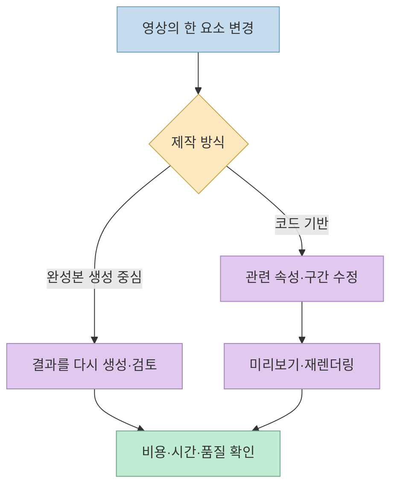
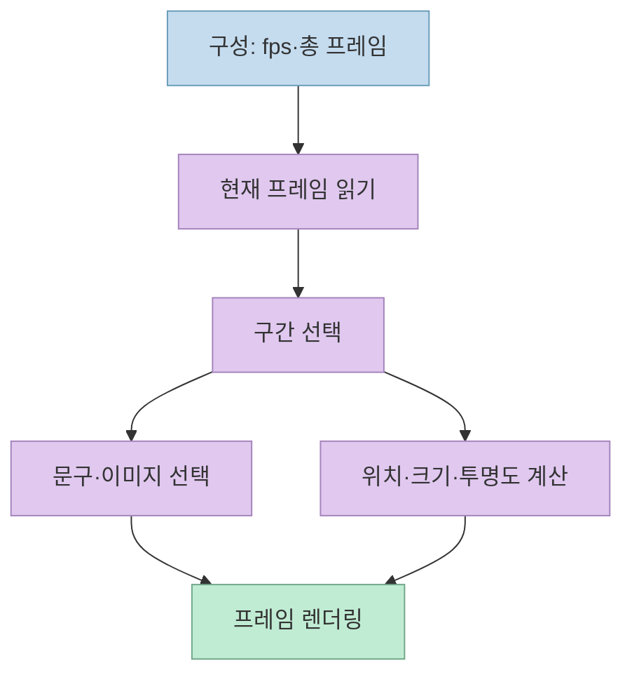
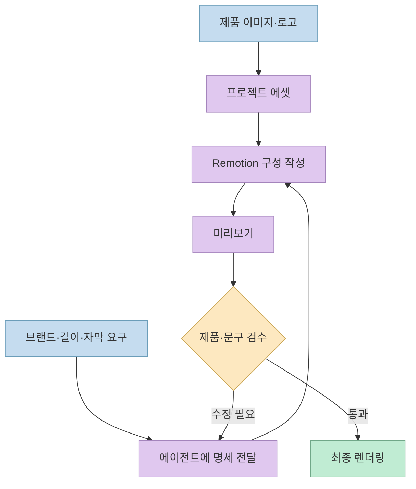
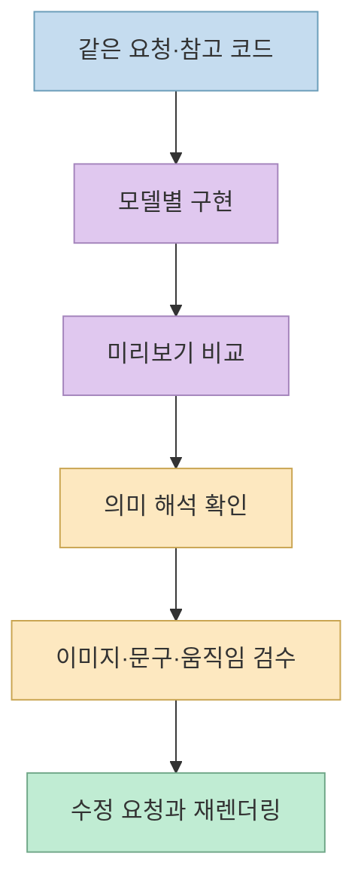

[CONNECT AI LAB 영상](https://youtu.be/7NBu5IW_2Xw)은 제품 광고와 3D 모션 그래픽을 **코드로 만들고 AI 에이전트에게 수정시키는** 과정을 보여 줍니다. 핵심은 "한 번에 완벽한 영상을 생성"하는 것이 아닙니다. 글자, 타이밍, 자산, 움직임을 코드의 요소로 나눠서 **필요한 부분을 바꾸고 다시 렌더링** 하는 작업 방식입니다. 다만 영상 속 비용·라이선스·모델 성능 평가는 시연자의 설명과 공식 문서의 조건을 구분해 읽어야 합니다.

<!--more-->

## Sources

- <https://youtu.be/7NBu5IW_2Xw?si=C3KosyiCGuL860U_>
- [Remotion 시작하기](https://www.remotion.dev/docs/)
- [Remotion `Sequence` 문서](https://www.remotion.dev/docs/sequence)
- [Remotion `interpolate()` 문서](https://www.remotion.dev/docs/interpolate)
- [Remotion 3D 문서](https://www.remotion.dev/docs/three)
- [Remotion 라이선스 FAQ](https://www.remotion.dev/docs/license/faq)

## 한 프레임만 고치고 싶다는 문제에서 출발한다

진행자는 연속된 정지 이미지가 재생될 때 움직임으로 보인다는 설명을 통해, 생성형 영상에서 **중간의 일부 장면만 원하는 대로 고치기 어렵다** 는 불편을 제기합니다. 이어 문구가 양옆에서 들어오는 대신 아래에서 위로 올라오게 하려면, 코드 기반 영상에서는 해당 동작의 코드만 바꿀 수 있다고 설명합니다. 여기서 영상에 나온 "1초에 60장"은 **60fps라는 예시** 로 읽어야 합니다. 모든 영상이 항상 60fps인 것은 아닙니다. [도입 설명 00:45](https://youtu.be/7NBu5IW_2Xw?t=45) · [부분 수정 예시 02:31](https://youtu.be/7NBu5IW_2Xw?t=151)

진행자는 이미지·영상 생성 서비스에서 여러 번 실패하면 비용이 쌓인다고 말하며 소규모 사업자나 개인 제작자를 염두에 둡니다. **코드 방식도 무료 제작을 보장하지는 않습니다.** 에이전트 사용료, 렌더링에 쓰는 컴퓨팅 자원, 음원·이미지 자산 비용은 별도일 수 있습니다. 영상은 실패 비용을 줄일 수 있다는 **제작자의 경험적 주장** 을 제시하지만, 같은 결과물을 두 방식으로 제작해 비교한 비용 실험은 아닙니다. [비용 문제 제기 03:32](https://youtu.be/7NBu5IW_2Xw?t=212) · [코드 방식 소개 04:28](https://youtu.be/7NBu5IW_2Xw?t=268)

## Remotion에서 시간은 코드의 입력값이 된다

영상은 텍스트·도형·로고·아이콘·그래프를 움직이는 모션 그래픽 도구로 **Remotion**을 소개합니다. 시연에서는 첫 프레임부터 30번째 프레임까지 한 문구를, 그다음 구간에 다른 문구를 보여 주는 식으로 시간에 따라 내용을 구분합니다. 색, 문구, 길이를 바꾸는 장면도 보여 줍니다. [Remotion 소개 04:33](https://youtu.be/7NBu5IW_2Xw?t=273) · [문구와 프레임 구간 예시 07:33](https://youtu.be/7NBu5IW_2Xw?t=453)

공식 문서 기준으로 Remotion의 `Sequence`는 자식 콘텐츠를 타임라인의 특정 시작 프레임에 배치하고, `durationInFrames`로 구간 길이를 제한할 수 있습니다. `useCurrentFrame()`으로 현재 프레임을 읽고 `interpolate()`로 프레임 범위를 위치·투명도 같은 값에 대응시키면, "아래에서 올라오기" 같은 움직임을 프레임 값으로 표현할 수 있습니다. 다음 흐름은 영상의 시연을 **공식 API 개념으로 설명한 도식** 이며, 실제 영상에서 공개된 코드를 그대로 복원한 것은 아닙니다. [시연 02:37](https://youtu.be/7NBu5IW_2Xw?t=157) · [공식 `Sequence`](https://www.remotion.dev/docs/sequence) · [공식 `interpolate()`](https://www.remotion.dev/docs/interpolate)

따라서 "부분 수정"은 렌더링된 MP4 파일 안의 그림 몇 장을 마법처럼 고친다는 뜻이 아닙니다. **소스 코드의 관련 요소를 고친 뒤 결과를 다시 렌더링한다** 는 의미입니다. 시연에서도 브랜드 문구를 다른 글자로 바꿔 다시 렌더링합니다. 한 차례는 원한 표기가 아닌 오타가 남았는데, 이것은 코드 기반이라도 **최종 검수는 필요하다** 는 좋은 사례입니다. [문구 수정 15:40](https://youtu.be/7NBu5IW_2Xw?t=940) · [수정 결과 확인 16:19](https://youtu.be/7NBu5IW_2Xw?t=979)

## 제품 이미지와 3D를 결합하는 방법

진행자는 제품 이미지나 직접 만든 이미지, 로고 등을 폴더 또는 링크로 제공하고, AI에 20초 분량 홍보 영상을 요청합니다. 요구에는 제품 특징 자막과 브랜드명 교체가 포함됩니다. 시연에서는 에이전트가 이미지를 잘라내거나 텍스트를 얹는 결과를 보여 주지만, **원본 이미지의 배경 제거가 항상 정확히 수행된다는 보장은 아닙니다.** 입력 에셋의 품질과 생성된 코드·미리보기 검토가 중요합니다. [에셋 사용 설명 08:08](https://youtu.be/7NBu5IW_2Xw?t=488) · [20초 광고 요청 20:16](https://youtu.be/7NBu5IW_2Xw?t=1216) · [결과 검토 21:37](https://youtu.be/7NBu5IW_2Xw?t=1297)

영상 중반에는 심장 모양의 3D 예시와 Three.js 생태계를 소개합니다. Remotion은 3D 장면용 `@remotion/three` 문서를 제공하지만, 그렇다고 모든 Three.js 코드를 **그대로** 붙여 넣으면 영상으로 완성된다는 뜻은 아닙니다. 프레임에 따른 애니메이션, 렌더러, 에셋 로딩을 맞춰야 합니다. 또 영상의 "심장" 요청은 **상징적인 하트** 와 **해부학적 심장** 으로 해석이 갈렸습니다. 결과 평가 전에 기대 형태를 지정해야 한다는 시사점이 더 큽니다. [3D 소개 10:21](https://youtu.be/7NBu5IW_2Xw?t=621) · [세 모델의 하트 결과 16:32](https://youtu.be/7NBu5IW_2Xw?t=992) · [Remotion 3D 문서](https://www.remotion.dev/docs/three)

## 세 모델 비교는 흥미로운 시연이지 성능 순위가 아니다

후반부에서는 진행자가 동일한 요청과 참고 코드를 세 AI 환경에 넣어 하트 애니메이션과 제품 광고를 만들어 봅니다. 하트 예시에서는 어떤 결과는 귀여운 하트에, 어떤 결과는 실제 심장에 가깝게 보였고, 제품 광고에서는 이미지 처리와 슬라이드형 구성에 차이가 있었습니다. 진행자는 최종적으로 한 결과를 더 마음에 들어 하지만, 이는 **한두 개의 프롬프트에 대한 주관적 시연** 입니다. 일반적인 생성 속도나 품질의 우열로 확대하면 안 됩니다. [비교 설정 13:22](https://youtu.be/7NBu5IW_2Xw?t=802) · [하트 결과 15:36](https://youtu.be/7NBu5IW_2Xw?t=936) · [광고 결과 21:37](https://youtu.be/7NBu5IW_2Xw?t=1297) · [최종 평가 24:10](https://youtu.be/7NBu5IW_2Xw?t=1450)

영상의 더 유용한 결론은 특정 모델의 1위가 아니라, **영상 구조를 이해하고 요청에 자산·프레임·수정 범위를 적으면 결과를 더 통제하기 쉽다** 는 제작 방식입니다. 이는 진행자의 시연에서 얻는 실무적 해석이며, 모든 모델이 같은 품질로 수렴한다는 객관적 증거는 아닙니다. [구조 이해의 중요성 08:58](https://youtu.be/7NBu5IW_2Xw?t=538) · [마무리 25:34](https://youtu.be/7NBu5IW_2Xw?t=1534)

## 라이선스: 영상 속 "5인 미만 무료"는 그대로 따르지 말자

영상 말미에는 Remotion이 1인 기업이나 **5인 미만** 조직에 무료라고 설명합니다. 그러나 현재 [Remotion 공식 라이선스 FAQ](https://www.remotion.dev/docs/license/faq)는 무료 사용 대상을 **개인, 인원 3명 이하 조직·팀, 비영리 조직, 비상업 평가자** 등으로 적고 있습니다. 조직이 4명 이상이라면 조건을 별도로 확인해야 합니다. 이 차이는 사용 여부를 결정할 때 중요한 부분이므로 **영상 설명보다 현행 공식 라이선스 문서를 우선** 해야 합니다. [영상 발언 26:13](https://youtu.be/7NBu5IW_2Xw?t=1613) · [Remotion 공식 FAQ](https://www.remotion.dev/docs/license/faq)

공식 FAQ는 Remotion을 일반적인 OSI 정의의 오픈소스가 아니라 **소스가 공개된 소프트웨어(source-available)** 로 설명합니다. 영상에서는 "오픈 소스"라고 부르지만, 코드 공개와 무제한 사용 허가는 같은 뜻이 아닙니다. 자동 영상 서비스나 조직 사용은 별도 조건이 있으므로 실제 배포 전에는 최신 FAQ와 약관을 확인해야 합니다. [영상의 오픈소스 설명 05:05](https://youtu.be/7NBu5IW_2Xw?t=305) · [Remotion 공식 FAQ](https://www.remotion.dev/docs/license/faq)

## 실전 적용 포인트

1. 먼저 **문구, 시작·종료 프레임, 이동 방향, 자산 경로** 를 분리해서 적습니다. "알아서 광고 영상"보다 수정 위치가 분명해집니다. [영상의 부분 수정 예시 02:37](https://youtu.be/7NBu5IW_2Xw?t=157) · [프레임별 문구 예시 07:45](https://youtu.be/7NBu5IW_2Xw?t=465)
2. 심장 같은 모호한 형상은 **상징 아이콘인지 실제 물체인지** 지정합니다. [모델 결과 비교 16:32](https://youtu.be/7NBu5IW_2Xw?t=992)
3. 최종 렌더 전에 미리보기에서 **브랜드명 오타, 제품 이미지 잘림, 자막 가독성** 을 확인합니다. [브랜드명 수정 15:40](https://youtu.be/7NBu5IW_2Xw?t=940) · [제품 광고 결과 21:37](https://youtu.be/7NBu5IW_2Xw?t=1297)
4. 프로젝트가 실제 조직 업무라면 공식 라이선스의 **인원·자동화·상업 이용 조건** 을 먼저 확인합니다. [공식 라이선스 FAQ](https://www.remotion.dev/docs/license/faq)

## 핵심 요약

- 영상의 핵심은 생성형 영상의 재시도보다 **코드 요소를 수정하고 다시 렌더링하는 제어력** 입니다.
- Remotion의 프레임·구간·보간 개념을 이해하면 AI에게 더 구체적인 제작 요청을 할 수 있습니다.
- 세 모델 비교는 한 번의 시연입니다. 보편적인 순위나 비용 우위로 해석해서는 안 됩니다.
- 무료 사용 범위와 오픈소스 여부는 영상 설명과 공식 문서가 다릅니다. 현재 공식 조건을 우선하세요.

## 결론

제품 소개나 정보성 모션 그래픽에서 반복적으로 문구·타이밍·에셋을 고쳐야 한다면 코드 기반 영상 제작은 유용한 선택지입니다. 하지만 **에이전트가 만든 코드와 최종 영상의 검수**, 자산 권리, 렌더링 비용, 라이선스 확인까지 포함해야 실제 제작 워크플로가 됩니다.
