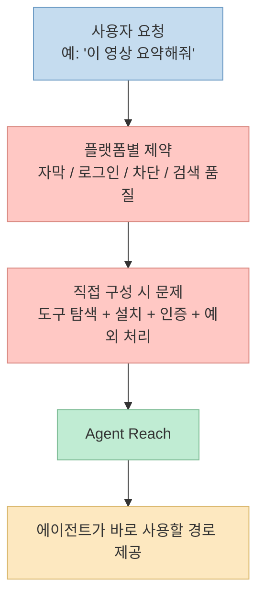
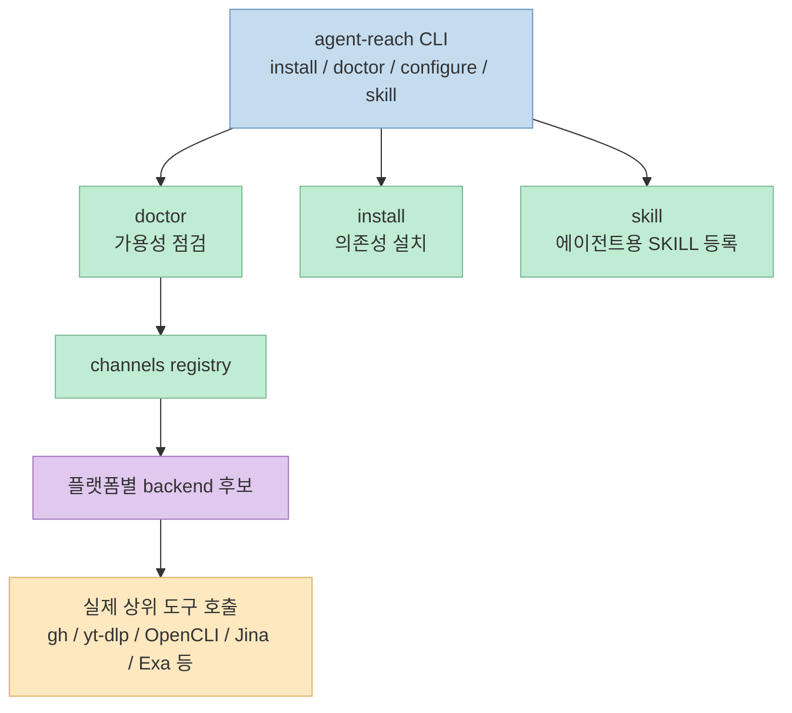
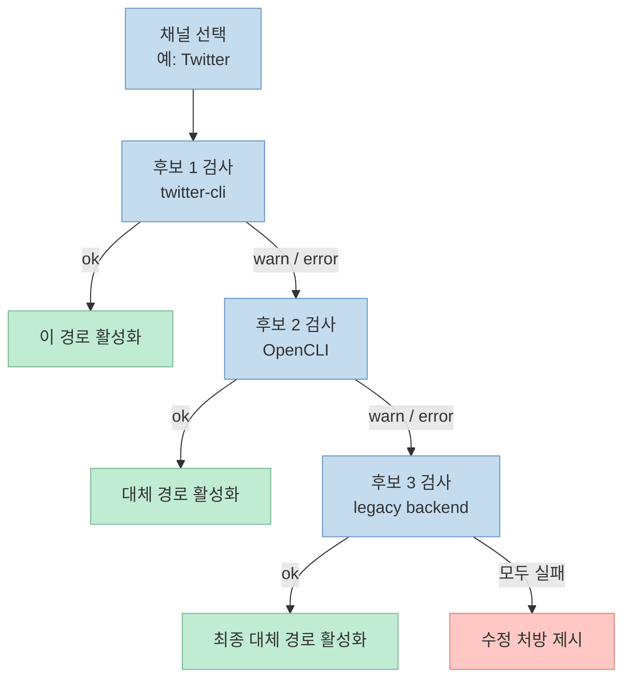

AI 에이전트에게 "인터넷을 읽는 능력"을 붙인다고 하면 보통 두 가지를 떠올리게 됩니다. 
하나는 범용 브라우저 자동화이고, 다른 하나는 플랫폼별 전용 API 또는 스크래퍼입니다. 
그런데 [Agent Reach](https://github.com/Panniantong/Agent-Reach) 는 이 둘 중 하나를 단순히 더 잘 포장한 프로젝트라기보다, **에이전트가 실제로 인터넷 작업을 할 때 어떤 도구 조합을 써야 하는지를 대신 결정해 주는 상위 계층** 으로 설계되어 있습니다.

저장소 설명도 이 성격을 아주 직접적으로 드러냅니다. 
프로젝트는 자신을 "Read & search Twitter, Reddit, YouTube, GitHub, Bilibili, XiaoHongShu — one CLI, zero API fees" 라고 소개하고, README에서는 더 나아가 **"capability layer"** 라는 표현을 씁니다. 
즉 핵심은 "새 리더 하나"가 아니라, **플랫폼별로 가장 현실적인 읽기 경로를 골라 설치하고, 상태를 점검하고, 깨지면 다음 후보로 넘기는 라우터** 라는 점입니다.

<!--more-->

## Sources

- <https://github.com/Panniantong/Agent-Reach>

## 왜 이런 계층이 필요한가

README가 전제로 두는 문제 정의는 꽤 현실적입니다. 
AI 에이전트는 코드를 쓰고 문서를 고치는 일은 잘하지만, 막상 외부 웹으로 나가면 플랫폼마다 서로 다른 제약을 만납니다.

- YouTube는 자막을 뽑아야 하고
- X/Twitter는 검색과 읽기에 인증이나 별도 도구가 필요하고
- Reddit는 익명 접근이 막혀 있고
- Xiaohongshu, Facebook, Instagram은 로그인 상태 재활용이 중요하고
- GitHub는 읽기 자체보다 인증과 설정이 더 귀찮고
- 일반 웹 페이지는 HTML이 아니라 읽을 만한 텍스트 표면으로 정리해야 합니다.

README는 이 문제를 "구현 자체가 어려운 것은 아니지만, 매번 도구를 찾고 설치하고 설정하는 마찰이 크다"는 식으로 설명합니다. 
이 프로젝트가 노리는 지점은 바로 여기입니다. 
각 플랫폼을 통합 API로 추상화하는 대신, **현재 시점에서 가장 잘 동작하는 상위 도구를 골라 에이전트가 바로 쓰게 만든다** 는 것입니다.

## Agent Reach가 실제로 하는 일

이 프로젝트의 설명을 보면, Agent Reach는 직접 모든 플랫폼을 자체 구현으로 읽는 도구가 아닙니다. 
오히려 다음 네 가지를 맡는 쪽에 가깝습니다.

1. **선정**: 플랫폼별로 현재 가장 안정적인 백엔드를 정함
2. **설치**: `agent-reach install --env=auto` 같은 흐름으로 의존성을 깔아 줌
3. **진단**: `agent-reach doctor` 로 어떤 채널이 실제로 되는지 확인함
4. **라우팅**: 한 플랫폼에 후보가 여러 개 있으면 순서대로 점검해 가장 먼저 쓸 수 있는 경로를 활성화함

이 점은 README의 "Agent Reach is a capability layer, not another tool"이라는 설명과 실제 코드 구조가 서로 맞물려 있습니다. 
`pyproject.toml` 기준 패키지 버전은 2026년 6월 29일 현재 `1.5.0` 이고, CLI 엔트리포인트는 `agent_reach.cli:main` 입니다. 
또 `agent_reach/channels/` 아래에 플랫폼별 파일이 나뉘어 있고, `agent_reach/channels/__init__.py` 에서는 GitHub, Twitter, YouTube, Reddit, Facebook, Instagram, Bilibili, Xiaohongshu, LinkedIn, Xiaoyuzhou, V2EX, Xueqiu, RSS, Exa search, Web 채널을 등록하고 있습니다.

즉 이 프로젝트는 "하나의 슈퍼 스크래퍼"라기보다, **플랫폼별 어댑터 묶음을 가진 오케스트레이터** 라고 보는 편이 정확합니다.

## 핵심 구조: 플랫폼마다 "하나의 구현"이 아니라 "후보 목록"을 둔다

이 프로젝트에서 가장 중요한 설계는 각 플랫폼을 단일 구현으로 고정하지 않는다는 점입니다. 
README는 각 채널을 **"preferred + fallback ordered backend list"** 로 설명하고, 실제 코드도 그 철학을 따릅니다.

예를 들어 README의 현재 선택 표는 이런 식입니다.

- 웹 읽기: Jina Reader
- Twitter/X: `twitter-cli` 우선, `OpenCLI` 백업
- Reddit: `OpenCLI` 또는 `rdt-cli`, 단 로그인은 필수
- YouTube: `yt-dlp`
- Bilibili: `bili-cli` 우선, `OpenCLI` 및 검색 API 백업
- GitHub: `gh CLI`
- 전역 웹 검색: Exa via `mcporter`
- Xiaohongshu: `OpenCLI` 우선, `xiaohongshu-mcp`, `xhs-cli` 백업
- LinkedIn: `linkedin-scraper-mcp`, 필요 시 Jina Reader

코드도 같은 메시지를 줍니다. 
예를 들어 `twitter.py` 에서는 `twitter-cli`, `OpenCLI`, `bird CLI (legacy)` 순으로 후보를 두고, 각 후보를 실제로 검사한 뒤 **처음으로 완전 사용 가능한 백엔드** 를 선택합니다. 
`reddit.py` 는 더 노골적입니다. 
모듈 주석에서 **익명 `.json` 경로는 막혔고, 공식 API도 셀프 서비스 방식이 사실상 닫혀 있어서, 실질적으로는 로그인 세션 기반 경로만 남았다** 고 설명합니다. 
즉 Agent Reach는 "Reddit는 읽을 수 있다"가 아니라, **지금 시점에 어떤 방식으로만 읽을 수 있는지** 를 정직하게 모델링합니다.

이 방식의 장점은 단순합니다. 
플랫폼 정책이 바뀌거나 특정 스크래퍼가 막혀도, 에이전트 쪽 사용법을 전면 교체하지 않고 **후보 리스트의 우선순위만 바꾸거나 새 백엔드를 추가** 하면 됩니다. 
README가 Bilibili 사례를 들며 "`yt-dlp` 가 B站에서 막혀 `bili-cli` 로 갈아탔다"고 설명하는 것도 이 설계를 뒷받침합니다.

## 설치와 실행 흐름은 "도구 자체"보다 "에이전트 사용성"에 맞춰져 있다

`cli.py` 를 보면 이 프로젝트의 주 명령은 `install`, `doctor`, `configure`, `skill`, `transcribe`, `uninstall` 등입니다. 
여기서 중요한 점은 **읽기 명령 자체보다 준비 작업과 운영 작업이 더 큰 비중** 을 차지한다는 것입니다.

- `install`: 환경 자동 감지, 시스템 의존성 설치, optional channel 설치
- `configure`: 토큰, 쿠키, 브라우저 쿠키 추출 같은 설정
- `doctor`: 현재 채널별 가용성과 활성 백엔드 확인
- `skill`: Claude Code, OpenClaw, Cursor 같은 에이전트용 스킬 문서 등록

README 역시 설치 문구를 "도구 문서"처럼 쓰지 않고, 아예 **사용자가 에이전트에게 복붙할 한 문장** 으로 제공합니다. 
예를 들면 설치는 `docs/install.md` URL을 붙여 "Help me install Agent Reach" 식으로 던지도록 하고, 업데이트도 같은 패턴으로 설계해 두었습니다. 
이건 일반 CLI 문서보다, **에이전트가 에이전트를 위한 능력 계층을 설치하는 자기부트스트랩 경험** 에 더 가깝습니다.

또 `agent_reach/skill/SKILL.md` 는 이 프로젝트가 단순한 CLI를 넘어서, 에이전트가 플랫폼별 검색/읽기 작업을 할 때 **무슨 채널을 먼저 써야 하는지까지 가이드하는 규칙 파일** 을 함께 제공한다는 점을 보여 줍니다. 
즉 Agent Reach의 출력은 텍스트 결과만이 아니라, **에이전트의 도구 선택 습관 자체** 입니다.

## 이 프로젝트가 강한 지점

Agent Reach의 장점은 "모든 플랫폼을 완벽히 읽는다"가 아닙니다. 
오히려 다음 세 가지를 현실적으로 잘 묶는 데 있습니다.

### 1) 무료 경로 우선

저장소 설명과 FAQ는 반복해서 **유료 API 없이** 동작하는 경로를 우선한다고 말합니다. 
README의 표에도 Exa, Jina Reader, `yt-dlp`, `gh`, `bili-cli`, `feedparser`, `OpenCLI`, `twitter-cli` 같은 오픈소스 도구가 나열됩니다. 
`.env.example` 를 보면 Exa, GitHub token, Groq/OpenAI Whisper 키 같은 선택적 설정이 있지만, 기본 서사는 어디까지나 **"zero API fees"** 입니다.

### 2) 로그인 상태를 현실적인 자산으로 본다

특히 Reddit, Twitter, Facebook, Instagram, Xiaohongshu 같은 플랫폼은 공개 API보다 **브라우저 로그인 상태 재사용** 이 더 실용적이라는 판단을 내립니다. 
README는 OpenCLI가 Chrome 로그인 상태를 재활용하는 경로를 자주 권장하고, `reddit.py` 역시 익명 경로가 사실상 막혔다고 명시합니다. 
이건 이상론보다 **지금 실제로 되는 방법** 에 무게를 둔 선택입니다.

### 3) 진단을 1급 기능으로 둔다

많은 통합 도구는 "설치 후 왜 안 되는지"가 더 어렵습니다. 
Agent Reach는 여기서 `doctor` 를 전면에 둡니다. 
README가 "`agent-reach doctor` 한 줄로 현재 어느 백엔드를 타는지 확인할 수 있다"고 강조하는 이유도, 실제 문제의 절반이 **기능 구현** 이 아니라 **현재 경로의 생존 여부 확인** 이기 때문입니다.

## 하지만 이 프로젝트의 한계도 분명하다

README는 이 프로젝트의 경계를 숨기지 않습니다. 
특히 "read content vs operate web" 구분이 명확합니다. 
즉 Agent Reach는 읽기, 검색, 자막 추출, 피드 파싱 같은 **콘텐츠 접근 경로** 에 강하지만, 로그인 후 UI 조작, 폼 제출, 다중 브라우저 세션, 사람 개입이 필요한 고마찰 자동화까지 직접 책임지지는 않습니다. 
그래서 README는 이런 경우 BrowserAct 같은 브라우저 자동화 도구와의 조합을 별도로 언급합니다.

또 보안 관점에서도 꽤 현실적입니다. 
README는 쿠키 기반 로그인 플랫폼에서 **본계정 대신 전용 소계정을 쓰라** 고 권하고, 스크립트/API 경로 사용 시 계정 제재 위험이 있음을 분명히 경고합니다. 
즉 이 프로젝트는 "무조건 안전하다"가 아니라, **리스크를 줄이는 운영 가이드까지 capability layer의 일부로 본다** 고 할 수 있습니다.

## 실전 적용 포인트

이 저장소를 실제로 읽고 나면, Agent Reach를 다음처럼 이해하는 게 가장 정확합니다.

1. **브라우저 자체의 대체재가 아니다.** 
   브라우저 자동화보다 한 단계 위에서, 어떤 읽기 백엔드를 쓸지 정하는 계층입니다.

2. **플랫폼별 MCP/CLI/Reader를 묶는 조정자다.** 
   Jina Reader, Exa, `gh`, `yt-dlp`, OpenCLI, `twitter-cli`, `bili-cli` 같은 상위 도구를 직접 호출하게 만들어 줍니다.

3. **에이전트 온보딩 비용을 줄이는 도구다.** 
   새 에이전트 환경마다 트위터는 뭐로 보고, Reddit는 어떻게 로그인하고, Bilibili는 무엇으로 읽는지 다시 정하는 비용을 줄여 줍니다.

4. **"지금 되는 경로"를 운영하는 프로젝트다.** 
   README와 changelog 모두 플랫폼 차단, 경로 교체, 백엔드 변경을 지속적으로 추적하는 운영 성격을 강하게 드러냅니다.

## 핵심 요약

- Agent Reach는 개별 플랫폼을 직접 읽는 단일 도구가 아니라, **AI 에이전트용 인터넷 capability layer** 에 가깝다.
- 핵심 역할은 **선정, 설치, 진단, 라우팅** 이다.
- 채널마다 하나의 구현을 고정하지 않고, **우선 후보 + 대체 후보** 목록을 두는 구조가 핵심 설계다.
- Reddit, Twitter, Facebook, Instagram, Xiaohongshu 같이 까다로운 플랫폼은 **로그인 상태 재사용** 을 현실적인 기본 전략으로 본다.
- `doctor` 와 `skill` 을 전면에 둔 점 때문에, 이 프로젝트는 단순 CLI보다 **에이전트 운영 환경 부트스트래퍼** 라는 성격이 더 강하다.

## 결론

Agent Reach가 흥미로운 이유는 "인터넷을 읽는 또 하나의 도구"이기 때문이 아닙니다. 
오히려 **인터넷 읽기 능력을 에이전트에 안정적으로 장착하는 운영 계층** 이기 때문입니다. 
플랫폼별 API나 스크래퍼는 계속 바뀌지만, 어떤 후보를 먼저 쓰고 어떻게 진단하고 무엇으로 대체할지를 중앙에서 정리해 두면, 에이전트는 훨씬 덜 깨지고 훨씬 빨리 실전에 투입됩니다. 
그 점에서 Agent Reach는 단순한 유틸리티보다, **에이전트 시대의 "도구 라우팅 인프라"** 에 더 가까운 프로젝트입니다.
