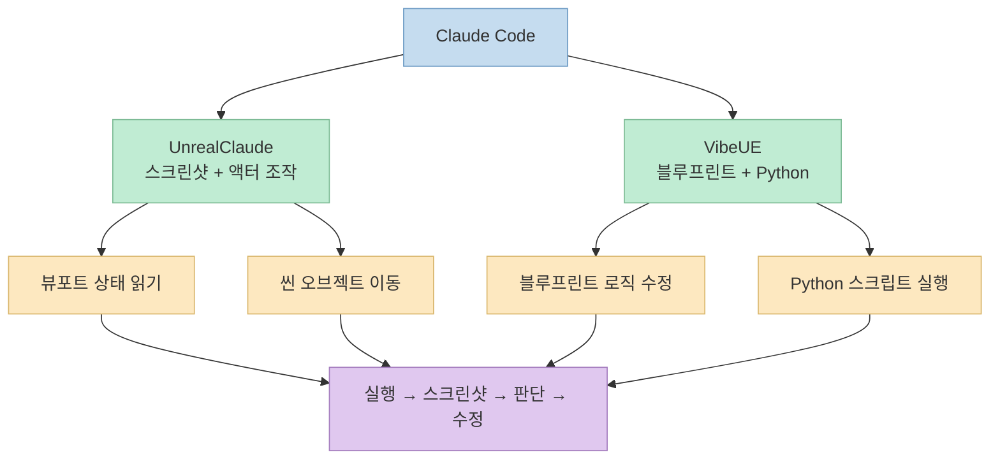
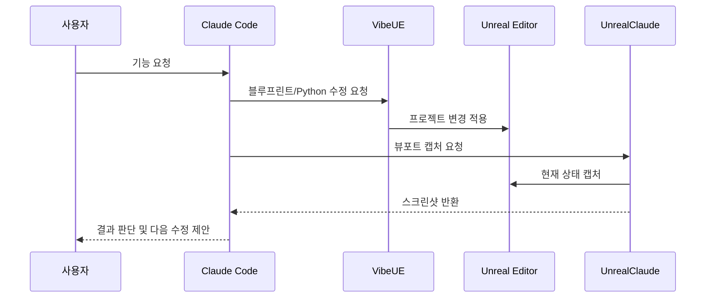
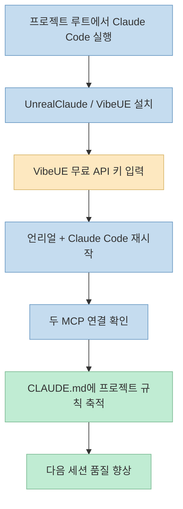

Claude Code를 Unreal Engine 5에 연결하는 이야기는 종종 과장되기 쉽습니다. 
"AI가 언리얼 프로젝트를 직접 만들고 수정하고 테스트한다"는 말은 매력적이지만, 실제로는 어떤 브리지로 무엇을 할 수 있는지가 훨씬 더 중요합니다. 
[Top3D의 이 글](https://www.top3d.ai/ko/learn/claude-code-unreal-engine) 이 흥미로운 이유는, 막연한 가능성을 말하는 대신 **어떤 플러그인이 무엇을 맡고, 어디까지는 잘 되고, 어디서부터는 사람이 감독해야 하는지** 를 비교적 솔직하게 보여주기 때문입니다.

핵심 결론은 단순합니다. 
Claude Code를 언리얼에 붙이는 가장 실전적인 무료 조합은 **UnrealClaude + VibeUE** 의 2플러그인 구성이고, 이 둘이 맡는 역할은 뚜렷하게 나뉩니다. 
하나는 **보고 움직이는 브리지** 에 가깝고, 다른 하나는 **블루프린트와 Python을 만지는 브리지** 에 가깝습니다.

<!--more-->

## Sources

- <https://www.top3d.ai/ko/learn/claude-code-unreal-engine>

## 왜 플러그인 하나가 아니라 2개가 필요한가

원문은 한 달 동안 여러 언리얼용 AI 커넥터와 플러그인을 테스트한 결과, 실제로 쓸 만한 조합이 **두 개의 무료 오픈소스 플러그인을 함께 쓰는 방식** 이었다고 정리합니다. 
그 이유는 두 도구가 같은 일을 하지 않기 때문입니다.

- **UnrealClaude**: 뷰포트 스크린샷, 액터 이동, 에디터 도구 접근
- **VibeUE**: 블루프린트 편집, Python 실행, 에셋/머티리얼 작업

즉 이 조합은 "Claude가 언리얼을 안다"기보다, **Claude가 언리얼을 다룰 수 있도록 서로 다른 종류의 팔과 눈을 따로 공급받는 구조** 입니다. 
원문도 이 점을 아주 명확하게 말합니다. 
진짜 유용한 구성은 "스크린샷 + 액터 조작"을 맡는 UnrealClaude와 "블루프린트 + Python"을 맡는 VibeUE를 함께 쓰는 것이며, 둘 다 MCP 서버를 노출하고 나머지는 Claude가 담당한다는 식입니다.

이 구조를 이해하면 왜 "언리얼용 단일 AI 플러그인"보다 이 조합이 더 설득력 있는지가 보입니다. 
언리얼 작업은 크게 두 층으로 나뉩니다.

1. 지금 씬이 어떻게 보이는지 확인하는 문제
2. 실제 프로젝트 내부 로직과 자산을 바꾸는 문제

UnrealClaude는 1번에 강하고, VibeUE는 2번에 강합니다. 
둘을 같이 써야 Claude가 **눈으로 확인하면서 손으로 수정하는 루프** 에 가까워집니다.

## 각 플러그인의 역할은 어떻게 나뉘는가

### UnrealClaude: "자가 검토 루프"를 열어 주는 도구

원문에서 가장 높게 평가하는 기능은 UnrealClaude의 **뷰포트 캡처** 입니다. 
이 기능 덕분에 Claude는 자기가 방금 만든 결과를 스크린샷으로 확인하고, 잘못된 점을 다시 수정하는 식의 루프를 만들 수 있습니다. 
글은 이 부분을 전체 구성에서 가장 유용한 단일 기능이라고까지 말합니다.

즉 UnrealClaude의 핵심 가치는 단순 오브젝트 이동이 아닙니다. 
오히려 **에이전트가 결과를 눈으로 피드백 받을 수 있게 만드는 것** 에 있습니다. 
게임 엔진 작업은 "코드만 맞으면 끝"이 아니라 배치, 충돌, 시야, 레이아웃 같은 시각적 검증이 매우 큰 비중을 차지하므로, 이 피드백 루프가 없으면 AI는 실제로는 반쯤 눈가린 상태로 일하게 됩니다.

### VibeUE: 실제 프로젝트를 바꾸는 실행 계층

반면 VibeUE는 프로젝트를 실제로 바꾸는 쪽입니다. 
원문 설명에 따르면 이 플러그인은 무료 API 키가 필요하지만, 유료 에이전트 기능이 아니라 **MCP 도구 접근** 만 쓰면 됩니다. 
여기서 중요한 점은, VibeUE가 단순한 "보조 툴"이 아니라 **블루프린트 편집과 Python 실행의 중심** 이라는 것입니다.

이 말은 곧 Claude Code가 언리얼에서 무언가를 바꾼다고 할 때, 실제로는 이런 흐름이라는 뜻입니다.

- Claude가 변경 계획을 세운다
- VibeUE를 통해 Python 스크립트나 블루프린트 편집 도구를 호출한다
- UnrealClaude로 다시 스크린샷을 본다
- 결과를 읽고 다음 수정으로 이어간다

이 조합은 결국 **"수정은 VibeUE, 검증은 UnrealClaude"** 라는 분업 구조입니다.

## 설치 흐름에서 중요한 포인트

원문은 설치를 완전 자동화된 마법처럼 설명하지 않습니다. 
오히려 Claude Code를 **언리얼 프로젝트 폴더에서 열어야 한다** 는 점, 설치 중 Node.js나 일부 C++ 런타임이 추가로 필요할 수 있다는 점, 그리고 플러그인 로드와 MCP 반영을 위해 **언리얼과 Claude Code를 재시작해야 할 때가 있다** 는 점을 분명히 적습니다.

설치 과정에서 특히 중요한 포인트는 다음입니다.

### 1) VibeUE는 무료지만 API 키가 필요하다

이 부분은 종종 "무료 플러그인 2개"라는 표현 때문에 놓치기 쉽습니다. 
VibeUE는 유료 구독이 필수는 아니지만, **무료 계정 키를 발급받아 에디터 설정에 넣어야** 응답합니다. 
즉 완전 무설정은 아닙니다.

### 2) MCP 연결 확인은 별도 단계다

원문은 두 브리지가 살아 있는지 확인하는 간단한 방법도 제공합니다.

- `curl http://localhost:3000/mcp/status` → UnrealClaude
- `curl http://127.0.0.1:8088/mcp` → VibeUE

또는 Claude Code에 그냥 `"check both mcp connections"` 라고 시킬 수 있다고 설명합니다. 
이건 중요한 실무 포인트입니다. 
플러그인 설치와 **MCP 연결 정상화는 같은 단계가 아니기 때문** 입니다.

### 3) `CLAUDE.md`를 프로젝트 플레이북으로 키우는 방식

원문에서 특히 좋은 부분은 `CLAUDE.md` 활용법입니다. 
작성자는 언리얼 프로젝트 루트에 `CLAUDE.md` 를 두고, 세션마다 새로 발견한 함정과 해결책을 거기에 계속 추가하라고 권합니다. 
예시로는 Play 중 블루프린트 편집 잠금, FBX 임포트 크래시 우회, `OnClicked` 버튼이 조용히 안 먹는 문제 같은 UE 5.7 실전 함정들이 언급됩니다.

이건 단순한 메모 습관 이상의 의미가 있습니다. 
Claude Code를 엔진 작업에 쓸 때 진짜 생산성은 "첫 프롬프트"보다 **누적된 프로젝트 규칙** 에서 나오기 때문입니다.

## 실전 스트레스 테스트가 보여주는 것

이 글의 가장 가치 있는 부분은 단순 설치법이 아니라, 실제로 **엔들리스 러너를 하나 만드는 스트레스 테스트** 를 끝까지 보여준다는 점입니다.

원문 흐름은 대략 이렇습니다.

1. 액세서리를 제거하고 캐릭터만 남긴다
2. 무한 생성/삭제되는 러너 타일을 만든다
3. 자동 달리기 + 탑다운 카메라 + 3개 레인을 구현한다
4. 장애물, 코인, 속도 증가 로직을 넣는다
5. 점수/코인/게임오버/재시도 UI를 만든다
6. 그레이박스를 3D 에셋으로 교체한다
7. 충돌, 틈, 레이아웃 문제를 스크린샷 기반으로 수정한다

이 과정에서 글이 반복해서 보여주는 패턴은 **설명 → 생성 → 실행 → 스크린샷 → 수정** 입니다. 
특히 코인 기능 라운드에 약 15분, Opus 4.8 기준 약 1만 4천 토큰이 들었다는 비용 감각도 제시합니다. 
이 수치는 "AI가 다 해 준다"는 환상을 깨고, **어느 정도의 비용과 반복이 드는지** 를 감 잡게 해 줍니다.

또 중요한 건, 여기서 Claude가 강한 부분과 약한 부분이 명확하게 갈린다는 점입니다.

### 잘하는 것

- 명확한 로직 설명을 바탕으로 기능을 조립하는 일
- 블루프린트/Python 수정과 반복 테스트
- 스크린샷을 보고 오류를 좁혀 가는 일
- 문제를 단계별로 나누어 진행하는 일

### 못하는 것

- 블루프린트 그래프를 사람이 보기 좋게 정리하는 일
- 자산 생성 자체
- 정밀한 미적 배치와 최종 아트 디렉션
- 모호한 프롬프트에서 장기적으로 좋은 아키텍처를 고르는 일

원문은 특히 블루프린트 레이아웃을 "스파게티"라고 표현합니다. 
즉 로직은 돌아가도 그래프가 아름답거나 유지보수 친화적으로 정리되지는 않는다는 뜻입니다. 
이건 꽤 중요한 현실적 평가입니다. 
에이전트는 **돌아가는 것** 에는 강하지만, **사람이 나중에 읽기 좋은 모양새** 까지 자동으로 책임지지는 않습니다.

## 3D 에셋 단계에서 드러나는 역할 분담

글에서 특히 설득력 있는 대목은, "Claude는 3D 생성기가 아니다"라고 선을 그은 부분입니다. 
작성자는 콘셉트 이미지는 ChatGPT에서 만들고, 필요한 장애물/코인/다리 요소를 거기서 추출한 뒤, 3D 환경과 자산 준비는 별도 파이프라인에서 처리합니다. 
그 다음 Claude에게 맡기는 것은 **준비된 자산을 프로젝트에 연결하고 로직에 맞게 정리하는 일** 입니다.

이건 많은 사람이 AI 게임 제작에서 놓치기 쉬운 포인트입니다. 
Claude Code를 언리얼에 붙였다고 해서, 그것이 곧 "3D 게임 전체를 혼자 만든다"는 뜻은 아닙니다. 
오히려 가장 좋은 분업은 다음과 같습니다.

- 사람: 자산 방향, 콘셉트, 준비물, 아트 선택
- Claude: 연결, 교체, 배치 로직, 문제 수정, 반복 검증

원문에서 난간 충돌 문제를 고칠 때 Claude가 **라인 트레이스를 여러 번 쏴서 실제 지오메트리를 측정하고 장애물을 밀어냈다** 는 예시는, 이 역할이 단순 문자열 자동완성이 아니라 **엔진 내부 피드백을 활용한 도구형 에이전트** 에 가깝다는 점을 잘 보여줍니다.

## 한계와 운영 팁

### 1) 좋은 프롬프트 없이는 좋은 결과도 없다

원문 결론은 상당히 직설적입니다. 
상세한 로직과 아키텍처를 주면 놀라운 결과를 얻을 수 있지만, **모호하고 피상적인 프롬프트** 를 주면 가장 빠른 경로로만 가고, 나중에 쌓아 올리기 어려운 구조가 나온다고 말합니다.

즉 이 워크플로는 초보자를 완전히 대체하는 지름길이 아니라, **무엇을 만들고 싶은지 비교적 선명하게 말할 수 있는 사람에게 강한 증폭기** 입니다.

### 2) Git 커밋을 마일스톤마다 끊어야 한다

언리얼 프로젝트는 코드와 에셋이 뒤섞인 큰 작업물이라, 원문은 시작 전에 Git을 꼭 붙이라고 권합니다. 
이건 AI 에이전트와 특히 잘 맞는 습관입니다. 
기능이 한 단계씩 완성될 때마다 커밋해 두면, 실험이 망가졌을 때 바로 되돌아갈 수 있습니다.

### 3) 컨텍스트 윈도우 관리가 중요하다

원문은 긴 언리얼 세션이 Claude Code의 컨텍스트를 빠르게 채운다고 경고합니다. 
비슷한 작업을 계속할 때는 `/compact` 를 쓰고, 새 작업이라면 **새 채팅으로 갈아타는 편이 낫다** 고 조언합니다. 
오래된 잡음을 함께 끌고 가지 않는 것이 중요하다는 뜻입니다.

## 실전 적용 포인트

이 글을 기준으로 보면, Claude Code + Unreal 워크플로를 가장 실용적으로 쓰는 방식은 다음처럼 정리됩니다.

1. **두 브리지의 역할을 혼동하지 말 것** 
   UnrealClaude는 검증과 조작, VibeUE는 편집과 실행이라는 분업을 이해해야 합니다.

2. **처음부터 예쁜 결과보다 반복 가능한 피드백 루프를 만들 것** 
   실행 → 스크린샷 → 수정 루프가 먼저 안정돼야 이후 생산성이 붙습니다.

3. **`CLAUDE.md` 를 프로젝트 로컬 운영 매뉴얼로 키울 것** 
   언리얼 함정은 누적 지식이 중요하므로, 세션별 해결책을 계속 저장해 두는 편이 좋습니다.

4. **에셋 생성과 게임 로직 연결을 분리할 것** 
   3D 자산과 미감은 사람이 주도하고, Claude는 연결과 조립에 집중시키는 편이 효율적입니다.

5. **블루프린트 정리 품질은 사람이 감독할 것** 
   로직이 돌아간다는 것과, 사람이 읽고 확장하기 좋다는 것은 다릅니다.

## 핵심 요약

- Claude Code를 Unreal Engine 5에 붙이는 무료 실전 조합으로는 **UnrealClaude + VibeUE** 가 가장 설득력 있다.
- UnrealClaude는 **스크린샷과 액터 조작**, VibeUE는 **블루프린트와 Python 편집** 을 맡는다.
- 이 조합의 핵심 가치는 Claude가 **실행 결과를 스크린샷으로 보고 다시 수정하는 자가 검토 루프** 에 있다.
- 실제 엔들리스 러너 제작 테스트는 가능성을 보여 주지만, 동시에 **모호한 프롬프트, 스파게티 블루프린트, 자산 생성 한계** 같은 현실적 제약도 드러낸다.
- 가장 좋은 활용법은 Claude를 "게임 전체를 다 만드는 존재"로 보는 것이 아니라, **사람이 준비한 자산과 명확한 로직을 빠르게 조립하는 엔진 작업 에이전트** 로 보는 것이다.

## 결론

이 글이 보여주는 핵심은 Claude Code가 언리얼을 "완전히 이해하는 마법사"라는 것이 아닙니다. 
오히려 적절한 MCP 브리지 두 개를 붙이면, Claude가 **언리얼 프로젝트 안에서 보고, 바꾸고, 테스트하고, 다시 고치는 루프** 에 꽤 현실적으로 들어올 수 있다는 점입니다. 
다만 그 효과는 도구 선택보다도 **명확한 지시, 준비된 자산, 꾸준한 Git 관리, 그리고 사람의 감독** 에 달려 있습니다. 
결국 이 워크플로의 진짜 가치는 "AI가 다 만든다"가 아니라, **언리얼 반복 작업의 상당 부분을 에이전트에게 넘기되, 설계와 판단은 여전히 사람이 쥐는 방식** 을 실용적으로 보여 준다는 데 있습니다.
