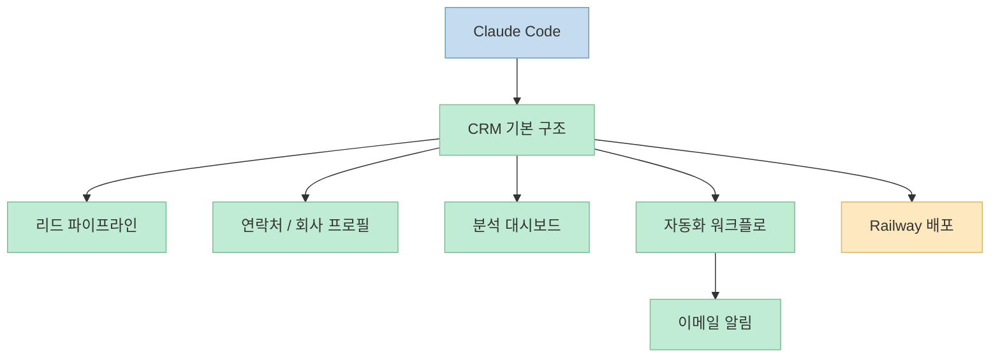
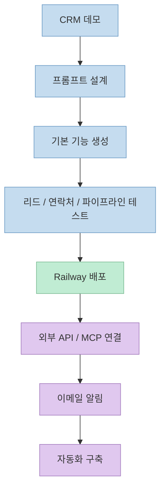
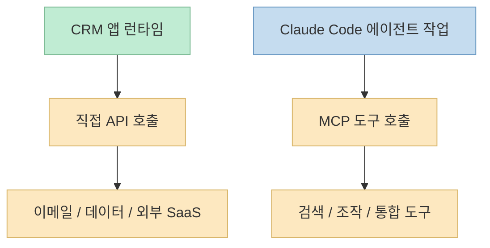

Claude Code로 SaaS형 업무 앱을 만드는 영상은 많지만, 실제로 도움이 되는 영상은 몇 가지 공통점이 있습니다. 
무엇을 만들었는지 보여주는 데서 끝나지 않고, **어떤 순서로 만들었는지**, **배포는 어떻게 처리했는지**, 그리고 **어디까지가 AI가 잘하는 일이고 어디부터 사람이 구조를 잡아야 하는지** 를 보여줘야 합니다. 
[Brendan Jowett의 이 영상](https://www.youtube.com/watch?v=nVLal5ihzbw) 은 바로 그 점에서 실전성이 있습니다.

영상 제목은 *"Building a CRM From Scratch With Claude Code (Start to Finish)"* 이고, 설명란에서는 이 영상이 **Claude Code로 완전 커스텀 CRM을 만들고 Railway에 배포하는 흐름** 을 단계별로 다룬다고 소개합니다. 
또 설명란 타임스탬프를 보면 단순 CRUD 데모가 아니라, **CRM 데모 → 프롬프트 설계 → 호스팅 → 기능 테스트 → 배포 → 외부 API/MCP 연결 → 이메일 알림 → 자동화 구축** 이라는 순서로 진행됩니다.

<!--more-->

## Sources

- <https://www.youtube.com/watch?v=nVLal5ihzbw>

## 이 영상이 다루는 범위: "CRM을 만든다"가 아니라 "작동하는 업무 앱을 끝까지 잇는다"

영상 메타데이터 기준 이 영상은 2026년 6월 22일 업로드됐고, 길이는 약 898초, 즉 15분 내외입니다. 
설명란에는 이 영상이 **HubSpot이나 Go High Level을 대체할 수 있는 커스텀 CRM 웹 애플리케이션** 을 만드는 흐름을 보여준다고 적혀 있습니다. 
또 직접 언급된 기능 범위는 다음과 같습니다.

- lead pipeline
- contact profile
- company profile
- analytics dashboard
- automated workflow

즉 이것은 단순히 "테이블 몇 개 만들기"가 아니라, **영업 파이프라인과 연락처/회사 엔터티, 시각화, 자동화까지 포함한 운영형 앱** 을 만드는 예시입니다. 
설명란과 챕터 정보를 합치면, 작성자는 이걸 "Claude Code로 빠르게 조립 가능한 커스텀 비즈니스 앱"의 사례로 보여주고 있다고 볼 수 있습니다.

영상 설명란에 나온 "cancel HubSpot or Go High Level and replace them with your own custom built web application"이라는 문장은 이 영상의 관점을 잘 보여줍니다. 
핵심은 기존 SaaS를 그대로 재현하는 것이 아니라, **자기 업무에 맞는 CRM을 필요한 수준만큼 직접 구성하는 것** 입니다.

## 챕터 흐름이 말해주는 실제 제작 순서

이 영상에서 가장 유용한 정보는 설명란에 공개된 챕터입니다. 
챕터 순서는 다음과 같습니다.

- 0:00 - 다룰 내용
- 0:29 - CRM 데모
- 3:19 - Claude 프롬프트 설정
- 4:30 - 호스팅
- 5:41 - CRM 첫인상
- 7:07 - 리드, 연락처 및 파이프라인 테스트
- 8:39 - Railway 배포 개요
- 9:07 - 외부 시스템 통합 API/MCP
- 9:59 - 재전송 기능이 있는 이메일 알림
- 11:54 - 이메일 자동화 테스트
- 12:27 - API와 MCP 비교
- 12:40 - 자동화 구축

이 순서를 보면, 작성자는 "먼저 코드부터 치는 방식"보다 **작동 그림을 먼저 보여주고, 그 다음에 구조를 설명하는 방식** 을 택하고 있습니다. 
특히 중간 이후의 흐름이 중요합니다.

1. CRM 화면/기능을 먼저 보여준다
2. Claude에게 어떤 식으로 요청했는지 이야기한다
3. 호스팅/배포를 붙인다
4. 외부 연동을 API 또는 MCP로 연결한다
5. 이메일과 자동화까지 붙인다

이건 실전 SaaS 앱 제작 흐름과 꽤 닮아 있습니다. 
즉 "앱이 돌아간다"와 "업무에 쓸 수 있다" 사이의 차이를, **배포와 자동화 연동** 이 메운다는 뜻입니다.

## 이 영상에서 진짜 중요한 부분: 프롬프트가 아니라 "프롬프트의 구조"

챕터 중 3:19에 **"Prompting Claude"** 가 따로 잡혀 있다는 것은 의미가 큽니다. 
작성자는 이 영상을 단순히 "Claude가 만들어줬다"는 시연으로 처리하지 않고, **Claude에게 무엇을 어떻게 요청해야 하는지** 를 하나의 별도 단계로 다룹니다.

이건 매우 중요합니다. 
CRM처럼 엔터티가 많고 화면도 많고 워크플로도 있는 앱은, AI에게 "CRM 만들어줘"라고만 던졌을 때 금방 깨지기 쉽습니다. 
반대로 다음처럼 구조를 나눠 주면 Claude Code가 상대적으로 강해집니다.

- 어떤 데이터 모델이 필요한지
- 어떤 화면이 필요한지
- 어떤 흐름을 자동화할지
- 어떤 외부 서비스와 연결할지
- 배포는 어디로 할지

즉 이 영상의 시사점은 "Claude Code가 CRM을 만든다"보다, **Claude Code가 복잡한 비즈니스 앱을 만들려면 프롬프트도 기능 단위와 운영 단위로 분해해야 한다** 는 쪽에 있습니다.

여기서 한 가지 주의할 점은, 현재 작성 시점에 전체 세부 전사를 완전히 추출하지는 못했다는 것입니다. 
유튜브 공개 페이지의 챕터와 설명란, 메타데이터는 확보했지만, 자막 API가 제한되어 **세부 프롬프트 문장 하나하나까지는 이 글에서 직접 인용하지 않습니다.** 
따라서 이 섹션의 해석은 **영상이 공개한 구조와 설명란에 근거한 고신뢰 요약** 이지만, 세부 문장 수준의 직인용은 아닙니다.

## 배포가 초반에 등장하는 이유: Claude Code 앱 제작에서 "로컬 완성"은 절반짜리 성공이다

챕터를 보면 4:30에 호스팅, 8:39에 Railway 배포 개요가 따로 등장합니다. 
이 순서는 매우 실전적입니다. 
많은 AI 코딩 데모가 로컬에서 화면이 뜨는 것까지는 보여주지만, **실제 서비스로 노출하는 단계** 에서는 금방 흐려집니다.

이 영상은 그 점을 분리해서 다룹니다.

- 앱 기능 생성
- 로컬 동작 확인
- Railway 같은 호스팅 환경으로 배포

이렇게 나누면 Claude Code로 만드는 앱이 단순 데모가 아니라 **실제로 접근 가능한 운영형 앱** 으로 바뀝니다. 
Railway가 등장하는 이유도 여기에 있습니다. 
프런트엔드/백엔드/DB 조합을 상대적으로 빠르게 올릴 수 있는 호스팅 경로를 붙이면, Claude가 만든 결과를 **업무 맥락에서 검증** 할 수 있게 됩니다.

실무적으로 보면 이건 매우 중요합니다. 
CRM은 혼자 보는 장난감이 아니라, 결국 팀원이 보거나 실제 리드 데이터가 들어오는 앱이기 때문입니다. 
그래서 이 영상이 단순히 "만드는 법"보다 **배포까지 이어지는 법** 을 강조하는 점은 꽤 가치가 있습니다.

## API와 MCP를 나눠서 보는 시각이 중요하다

영상 후반에는 9:07의 "Integrating external APIs/MCPs" 와 12:27의 "API vs MCP"가 별도 챕터로 잡혀 있습니다. 
이건 단순한 용어 비교가 아니라, **Claude Code 기반 앱 개발에서 외부 연동을 어떤 계층으로 붙일지** 와 연결됩니다.

이 영상의 챕터만으로도 다음 정도는 확실히 읽을 수 있습니다.

- 외부 시스템 연결이 중요한 앱 예시로 CRM을 사용한다
- 이 연결은 API 또는 MCP 둘 다 후보가 될 수 있다
- 둘의 차이를 따로 설명할 만큼, 연동 계층 선택이 실전적으로 중요하다

여기서 일반화하면:

- **API** 는 앱 런타임에서 직접 비즈니스 기능을 호출하기 좋습니다
- **MCP** 는 Claude 같은 에이전트가 외부 기능을 도구처럼 다루게 하는 데 유리합니다

따라서 CRM 구축 맥락에서는 보통 두 층을 구분해서 생각하는 편이 좋습니다.

물론 이 해석은 영상 챕터 공개 정보와 설명란에 근거한 구조적 요약입니다. 
전문 전체가 확보되지 않았기 때문에, 발표자가 API와 MCP를 어떤 철학으로 더 강하게 구분했는지까지는 이 글에서 과도하게 단정하지 않겠습니다. 
다만 최소한 **외부 연동 계층을 독립된 설계 문제로 본다** 는 점은 분명합니다.

## 이메일 알림과 자동화가 붙는 순간, 이건 단순 CRUD 튜토리얼이 아니다

9:59의 **이메일 알림**, 11:54의 **이메일 자동화 테스트**, 12:40의 **자동화 구축** 챕터는 이 영상의 성격을 바꿉니다. 
여기서부터는 단순 데이터 관리 UI가 아니라, **이벤트가 발생했을 때 후속 액션이 나가는 운영 워크플로** 로 넘어갑니다.

CRM에서 이건 결정적입니다. 
리드를 저장하는 것보다 중요한 건:

- 특정 상태 변화가 생겼을 때
- 누가 무엇을 받는지
- 어떤 타이밍에 어떤 작업이 자동으로 이어지는지

를 앱 안에 심는 일입니다. 
설명란에 Resend 기반 이메일 알림이 언급된 점을 보면, 작성자는 최소한 **실제 알림 채널 하나를 붙여 자동화까지 검증** 하는 흐름을 보여주려는 것입니다.

즉 이 영상의 실전성은 여기서 더 커집니다. 
Claude Code가 강한 부분은 단순 페이지 생성보다, **명시된 규칙과 이벤트를 코드와 연동 로직으로 빠르게 조립하는 것** 이기 때문입니다.

## 이 영상을 어떻게 봐야 하나: "Claude가 다 만든 CRM"이 아니라 "에이전트 조립식 업무 앱 파이프라인"

이 영상을 너무 낙관적으로 보면 "이제 CRM은 다 AI가 대신 만들 수 있다"는 결론으로 흐르기 쉽습니다. 
하지만 더 정확한 해석은 이렇습니다.

1. Claude Code는 **정형화된 비즈니스 앱 조립** 에 강하다
2. 특히 CRUD + 파이프라인 + 알림 + 자동화처럼 패턴이 있는 문제에 강하다
3. 그러나 좋은 결과를 위해서는
   - 데이터 구조
   - 기능 범위
   - 배포 경로
   - 외부 연동 방식
   - 자동화 이벤트
   를 사람이 먼저 나눠서 제시해야 한다

즉 이 영상은 "프롬프트 한 줄로 SaaS를 끝낸다"가 아니라, **Claude Code를 업무 앱 생성기처럼 쓰되, 사람이 제품 구조를 감독하는 흐름** 에 가깝습니다.

이 점에서 CRM은 좋은 예시입니다. 
왜냐하면 CRM은:

- 도메인이 익숙하고
- 필요한 기능이 비교적 반복 가능하며
- 자동화 가치가 크고
- 결과를 데모하기 쉽기 때문입니다.

그래서 Claude Code 데모용으로도 좋고, 실제 소규모 운영툴 대체 사례로도 설득력이 있습니다.

## 실전 적용 포인트

이 영상을 실무 관점에서 가져오면 다음 포인트가 남습니다.

1. **앱 종류를 잘 고를 것** 
   Claude Code는 CRM처럼 구조가 익숙하고 반복 가능한 업무 앱에서 특히 강합니다.

2. **프롬프트를 기능 묶음으로 나눌 것** 
   리드 관리, 연락처, 회사 프로필, 대시보드, 알림, 자동화를 한 번에 던지기보다 단계적으로 분해하는 편이 낫습니다.

3. **배포를 초반부터 설계할 것** 
   로컬 데모가 아니라 Railway 같은 실제 호스팅 경로까지 함께 생각해야 실전 도구가 됩니다.

4. **API와 MCP의 자리를 구분할 것** 
   앱 자체의 런타임 통합과, 에이전트의 도구 통합은 같은 문제가 아닙니다.

5. **자동화를 꼭 마지막까지 검증할 것** 
   이메일 알림 같은 실제 후속 액션이 붙어야 CRM은 비로소 운영도구가 됩니다.

6. **근거가 빈약한 구간은 과신하지 말 것** 
   이번 글처럼 자막이 완전 확보되지 않은 경우, 챕터와 설명란 기반 구조 요약은 가능하지만 세부 구현 디테일은 과장하지 않는 편이 안전합니다.

## 핵심 요약

- 이 영상은 Claude Code로 **커스텀 CRM을 만들고 Railway에 배포하며 자동화까지 붙이는 흐름** 을 보여준다.
- 핵심 기능 범위는 리드 파이프라인, 연락처/회사 프로필, 분석 대시보드, 자동화 워크플로다.
- 챕터 구성을 보면 진짜 포인트는 코드 작성보다 **프롬프트 구조, 배포, 외부 연동, 이메일 자동화** 에 있다.
- API와 MCP를 별도 연동 계층으로 보는 시각은, Claude Code 기반 업무 앱 설계에서 꽤 중요하다.
- 이 영상은 "AI가 다 만든다"보다, **사람이 구조를 잡고 Claude가 반복적인 앱 조립을 가속하는 방식** 을 보여주는 데 의미가 있다.

## 결론

이 영상의 가치는 CRM을 하나 더 만드는 데 있지 않습니다. 
오히려 Claude Code를 사용해 **반복 가능한 업무 앱을 어떤 순서로 조립하고, 언제 배포하고, 어느 지점에서 자동화를 붙여야 하는지** 를 짧은 시간 안에 보여준다는 데 있습니다. 
특히 비즈니스 앱을 만드는 사람에게 중요한 건 "생성" 자체보다 **운영 가능한 구조로 끝까지 연결하는 것** 인데, 이 영상은 그 흐름을 비교적 선명하게 드러냅니다. 
결국 핵심은 Claude Code가 모든 걸 대신한다는 환상이 아니라, **명확한 구조와 경계를 가진 문제에서 매우 빠른 조립자 역할을 할 수 있다** 는 점입니다.
