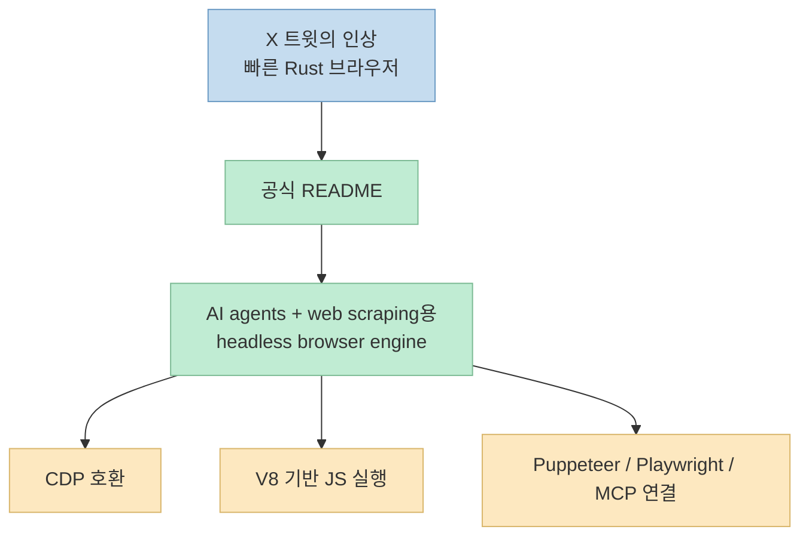
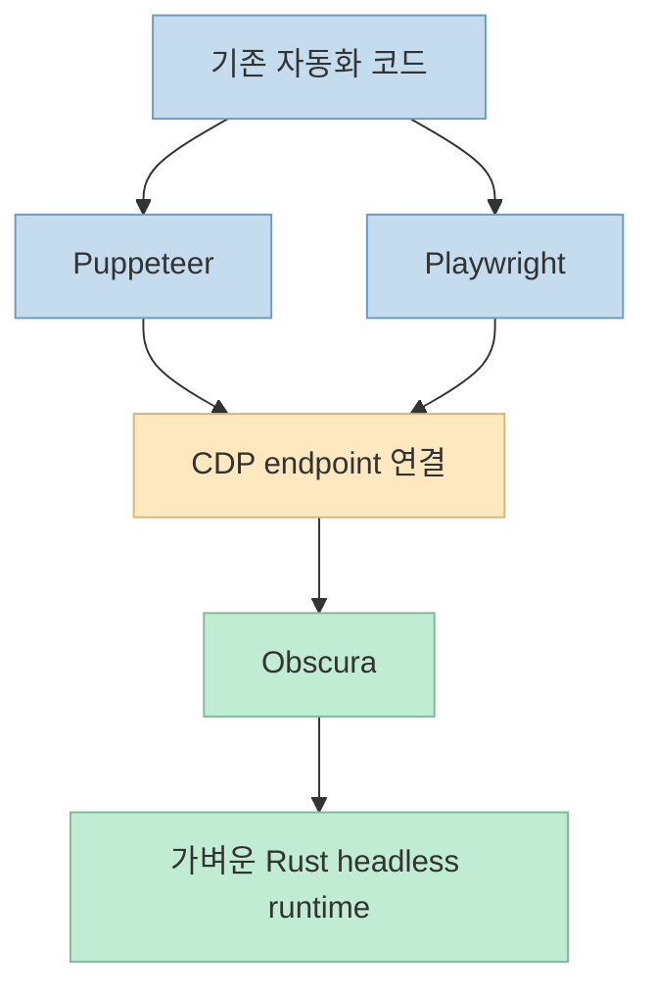
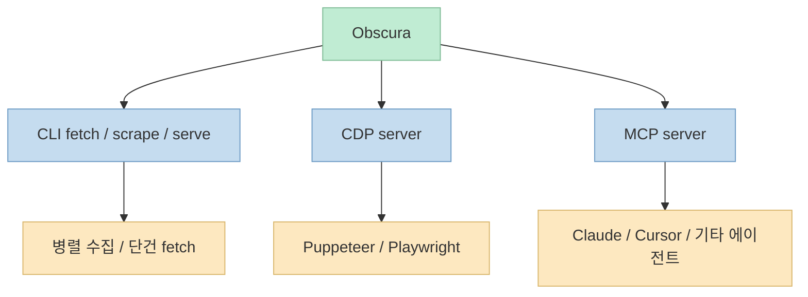

X에서 가끔씩 "왜 아무도 이걸 안 만들었지?" 싶은 프로젝트가 바이럴을 탑니다. 
이번에 눈에 띈 것은 Rust로 만든 headless browser **Obscura** 입니다. 
트윗은 꽤 자극적으로 말합니다. 
"Google이 수년째 무시한 일을 어떤 개발자가 해냈다", "AI 에이전트와 웹 스크래핑용으로 특별히 설계된 브라우저", "RAM 30MB", "페이지 85ms", "3,500개 이상의 트래커를 자동 차단" 같은 문구로 관심을 끕니다.

하지만 이런 종류의 글은 언제나 한 번 더 봐야 합니다. 
실제로 중요한 건 트윗의 과장된 문장보다, **공식 저장소가 자신을 무엇으로 정의하고 있는지**, 그리고 **기존 headless Chrome 생태계와 무엇이 다른지** 입니다. 
Obscura는 그 점에서 단순한 "빠른 브라우저"보다, **AI 에이전트와 자동화 런타임에 맞춘 headless browser engine** 으로 읽는 편이 더 정확합니다.

<!--more-->

## Sources

- <https://x.com/i/status/2071608210209874083>
- <https://github.com/h4ckf0r0day/obscura>

## 트윗이 던진 메시지: "브라우저"보다 "에이전트용 실행기"

수집된 트윗 본문은 스페인어로 작성돼 있고, 핵심 요지는 이렇습니다.

- Google이 오랫동안 무시한 문제를 풀었다
- AI 에이전트, 웹 스크래핑, 자동화 작업을 위해 Rust 브라우저를 만들었다
- RAM 30MB 수준으로 작다
- 페이지는 85ms에 로드된다
- 3,500개 이상의 트래커를 자동 차단한다

이 요약은 꽤 공격적이지만, 완전히 근거 없는 과장은 아닙니다. 
공식 README도 Obscura를 **"The open-source headless browser for AI agents and web scraping"** 이라고 소개하고 있고, Rust로 작성된 headless browser engine이며, **real JavaScript via V8**, **Chrome DevTools Protocol 지원**, **Puppeteer/Playwright와 연결 가능한 headless Chrome 대체재** 라고 설명합니다.

즉 트윗은 이 프로젝트를 "Rust 브라우저"로 소개했지만, 더 정확한 표현은:

- 일반 사용자용 브라우저가 아니라
- **자동화용 headless 브라우저 엔진**
- 특히 **AI agent runtime** 에 맞춘 브라우저 계층

이라는 쪽입니다.

## Obscura가 내세우는 차별점은 무엇인가

README의 비교표는 아주 직접적입니다. 
프로젝트는 스스로를 headless Chrome과 비교하면서 다음 지점을 강조합니다.

- 메모리: **30MB** vs Chrome의 200MB+
- 바이너리 크기: **70MB** vs 300MB+
- anti-detect: **built-in**
- 페이지 로드: **85ms**
- startup: **instant**
- Puppeteer: 지원
- Playwright: 지원

이 표가 말하는 핵심은 단순 속도 자랑이 아닙니다. 
Obscura는 애초에 브라우징 UX를 위한 소프트웨어가 아니라, **대량 자동화와 스크래핑에 필요한 비용 구조** 를 바꾸겠다는 쪽입니다. 
즉 페이지를 예쁘게 보여주는 것보다:

- 더 적은 메모리
- 더 짧은 시작 시간
- 더 쉬운 병렬 실행
- 더 낮은 탐지 확률

이 중요하다는 전제를 깔고 있습니다.

이건 AI 에이전트 맥락에서 특히 중요합니다. 
에이전트 워크플로는 "브라우저를 하나 띄운다"보다 **짧은 작업을 많이 반복** 하는 경향이 강하기 때문입니다. 
매 작업마다 200MB 이상짜리 Chrome 프로세스를 여럿 띄우는 구조와, 훨씬 가벼운 런타임을 병렬로 돌리는 구조는 운영비와 밀도에서 큰 차이를 만듭니다.

## 이 프로젝트를 진짜 다르게 만드는 것: CDP 호환성과 headless Chrome 대체 전략

Obscura의 가장 큰 강점은 "완전히 새로운 자동화 인터페이스"를 강요하지 않는다는 데 있습니다. 
README는 Obscura가 **Chrome DevTools Protocol** 을 구현해, Puppeteer와 Playwright에 호환되는 방식으로 붙을 수 있다고 설명합니다.

즉 사용자는 다음 둘 중 하나만 선택하면 됩니다.

1. Obscura 자체 CLI를 직접 쓴다
2. 기존 Puppeteer/Playwright 코드를 **CDP endpoint만 바꿔서** 연결한다

README 예시도 그렇습니다.

- `obscura serve --port 9222`
- Puppeteer는 `browserWSEndpoint: 'ws://127.0.0.1:9222/devtools/browser'`
- Playwright는 `chromium.connectOverCDP({ endpointURL: 'ws://127.0.0.1:9222' })`

이게 중요한 이유는, Obscura가 headless Chrome을 완전히 대체하려면 **새 DSL을 배우게 만드는 것보다, 기존 코드와 습관을 최대한 유지** 시켜야 하기 때문입니다. 
Obscura는 정확히 그 경로를 택하고 있습니다.

이 관점에서 보면 Obscura는 브라우저 그 자체보다, **browser automation substrate** 에 더 가깝습니다.

## CLI, 병렬 스크래핑, MCP까지 한 패키지로 묶여 있다

README를 읽어보면 Obscura는 단순 렌더 엔진이 아니라, 실제 운영에 필요한 층을 제법 넓게 갖추고 있습니다.

### 1) CLI

가장 기본적인 사용법은 `obscura fetch` 입니다.

- `--eval "document.title"`
- `--dump html`
- `--dump text`
- `--dump links`
- `--dump markdown`
- `--wait-until networkidle0`
- `--selector`

즉 단순히 페이지를 열고 DOM을 읽는 기본 수집기는 이미 내장돼 있습니다.

### 2) 병렬 scrape

`obscura scrape` 명령은 여러 URL을 병렬 worker로 수집할 수 있게 설계돼 있습니다. 
이건 "브라우저 하나 열기"보다 **스크래핑 파이프라인용 도구** 라는 성격을 더 강하게 보여 줍니다.

### 3) MCP 서버

AI 에이전트 맥락에서는 MCP 지원이 특히 눈에 띕니다. 
README는 `obscura mcp` 로 stdio 기반 MCP 서버를 띄우거나, `obscura mcp --http --port 8080` 으로 HTTP endpoint를 열 수 있다고 설명합니다. 
또 Claude Desktop 설정 예시도 함께 제공합니다.

노출되는 도구 목록 역시 에이전트 친화적입니다.

- `browser_navigate`
- `browser_snapshot`
- `browser_click`
- `browser_fill`
- `browser_type`
- `browser_press_key`
- `browser_select_option`
- `browser_evaluate`
- `browser_wait_for`
- `browser_network_requests`
- `browser_console_messages`
- `browser_close`

즉 이 프로젝트는 단순히 "브라우저를 띄우는 바이너리"가 아니라, **에이전트가 웹을 조작하는 도구 집합** 을 이미 한 번 래핑해 놓은 셈입니다.

## stealth 모드는 단순 옵션이 아니라 제품 정체성이다

트윗이 특히 강조한 것 중 하나가 "3,500개 이상의 트래커 자동 차단"입니다. 
README를 보면 이 주장은 **stealth mode** 와 연결돼 있습니다.

stealth 모드에서 README가 내세우는 요소는 다음과 같습니다.

- 세션별 fingerprint randomization
- realistic `navigator.userAgentData`
- `event.isTrusted = true`
- hidden internal properties
- native function masking
- `navigator.webdriver = undefined`

그리고 tracker blocking 쪽 설명으로는:

- **3,520 domains blocked**
- analytics, ads, telemetry, fingerprinting scripts 차단
- `--stealth` 에서 자동 활성화

즉 트윗의 "3,500 trackers" 표현은 과장이라기보다, README의 **3,520 domains blocked** 설명을 압축한 것으로 보입니다. 
다만 이 부분은 정확히 말하면 "모든 사이트에서 완전 무결하게 탐지를 피한다"는 뜻은 아닙니다. 
Obscura가 제공하는 것은 **anti-detect / anti-fingerprinting을 제품 기능으로 전면 배치한 headless runtime** 이고, 그 결과가 어떤 사이트에서 어느 정도 통하는지는 별도의 검증 영역입니다.

그래서 이 프로젝트를 볼 때는 "탐지 회피 만능 브라우저"보다, **탐지 저항성을 제품의 1급 목표로 삼은 automation runtime** 으로 읽는 편이 안전합니다.

## 왜 Rust인가: 성능 미학보다 운영 밀도

Obscura가 Rust로 구현된 점은 기술적으로 흥미롭지만, 더 중요한 건 **왜 그 언어 선택이 제품 메시지와 맞물리는가** 입니다. 
README가 보여주는 수치를 보면 핵심은:

- 메모리 절감
- 빠른 startup
- 작은 바이너리
- 병렬 자동화에 유리한 운영비

입니다. 
즉 Rust 선택은 "시스템 언어 취향"이라기보다, **headless automation runtime을 더 작고 빠르게 만들려는 설계 목표** 와 더 직접적으로 연결돼 있습니다.

특히 AI agent, scraping, batch automation 같은 워크로드는 인간용 브라우저보다:

- 짧은 실행 수명
- 높은 동시성
- 많은 프로세스 수
- 예측 가능한 자원 사용량

을 더 중요하게 봅니다. 
그 점에서 Obscura는 "웹 브라우저"보다 **브라우저 기반 자동화 인프라** 를 만들고 있다고 볼 수 있습니다.

## 실전 적용 포인트

이 프로젝트를 실전 관점에서 보면 다음처럼 해석하는 것이 좋습니다.

1. **Chrome 대체재라기보다 Chrome 비용 절감 계층으로 볼 것** 
   기존 Playwright/Puppeteer 워크플로를 버리는 게 아니라, 더 가벼운 런타임으로 바꾸는 접근입니다.

2. **스크래핑/에이전트용 워크로드에서 특히 의미가 큼** 
   메모리, startup, 병렬 scrape, stealth 기능이 모두 그 용도에 맞춰져 있습니다.

3. **MCP 지원이 있다는 점이 AI 에이전트 맥락에서 중요함** 
   Obscura는 브라우저 엔진이면서 동시에 에이전트용 tool surface도 제공합니다.

4. **트윗의 바이럴 문구와 README의 정확한 표현을 구분해야 함** 
   "Google이 무시한 문제를 풀었다"는 문구는 마케팅에 가깝고, 실제 가치는 CDP 호환 + 경량화 + stealth 제품화에 있습니다.

5. **anti-detect를 과신하면 안 됨** 
   README가 built-in anti-detect를 강조하지만, 실제 회피 성능은 대상 사이트와 운영 방식에 따라 달라질 수 있습니다.

## 핵심 요약

- X에서 화제가 된 Obscura는 **Rust로 만든 headless browser engine** 이며, AI 에이전트와 웹 스크래핑을 핵심 사용처로 내세운다.
- 트윗의 30MB RAM, 85ms page load, 3,500+ tracker blocking 같은 주장은 공식 README의 비교표와 stealth 설명에 상당 부분 대응한다.
- Obscura의 진짜 강점은 단순 속도보다 **CDP 호환성, Puppeteer/Playwright 연결, 병렬 scrape, MCP 도구 제공** 을 한 패키지로 묶었다는 점이다.
- 이 프로젝트는 일반 사용자 브라우저라기보다, **browser automation runtime / agent substrate** 로 보는 편이 정확하다.
- 가장 중요한 질문은 "빠르냐"보다, **Chrome 기반 자동화 스택의 비용 구조를 얼마나 바꿀 수 있느냐** 에 있다.

## 결론

Obscura가 흥미로운 이유는 Rust로 브라우저를 만들었다는 사실 자체가 아닙니다. 
오히려 **AI 에이전트와 웹 자동화 시대에 브라우저를 어떤 형태의 런타임으로 다시 설계해야 하는가** 라는 질문에 꽤 일관된 답을 내놓고 있기 때문입니다. 
headless Chrome을 더 빠르고 더 작고 더 은밀하게 만들고, 거기에 CDP와 MCP를 함께 얹어 에이전트 워크플로에 바로 연결하려는 방향성은 분명합니다. 
그래서 Obscura는 "새 브라우저"보다, **에이전트 시대의 경량 browser infrastructure** 라는 표현이 더 잘 어울리는 프로젝트입니다.
