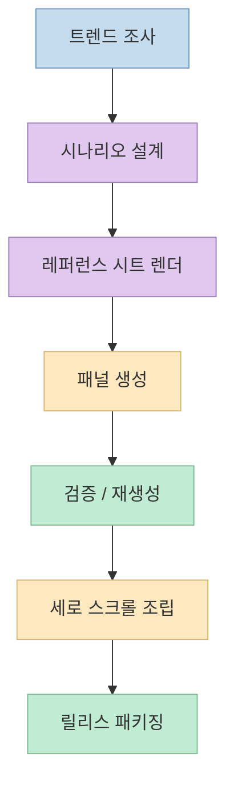
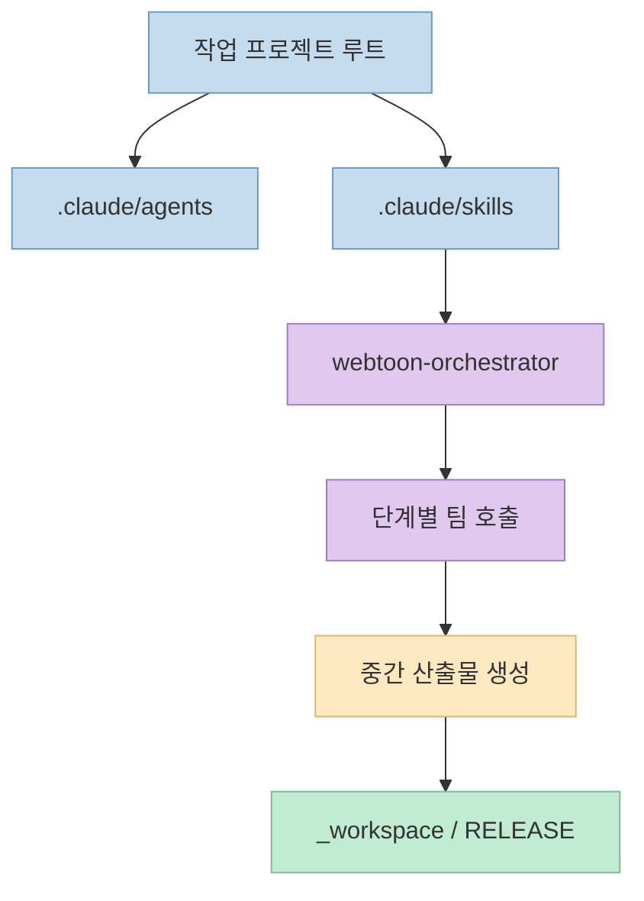
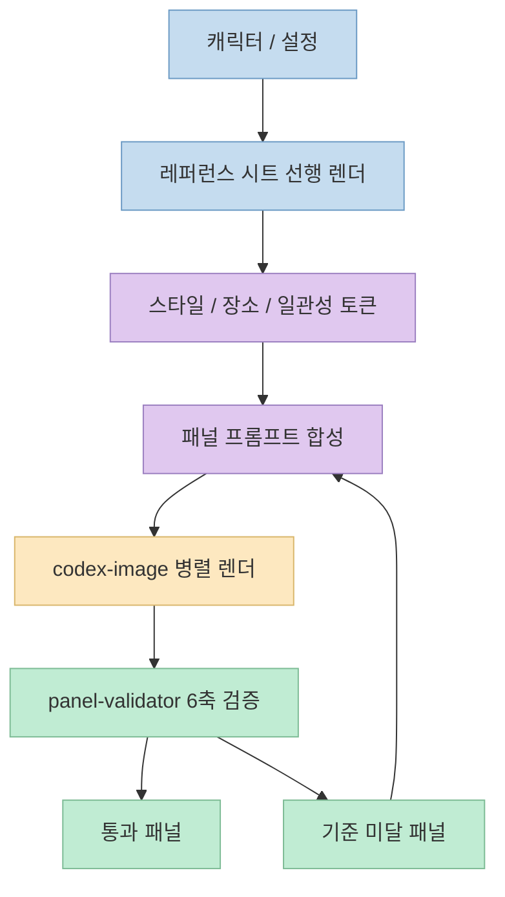

웹툰 제작을 AI로 자동화한다는 말은 이제 낯설지 않습니다. 
하지만 실제로는 "이미지 몇 장 생성" 수준에서 끝나는 경우가 많고, **회차 단위 제작 파이프라인** 으로 올라가면 갑자기 난도가 높아집니다. 
트렌드 조사, 콘셉트 설정, 캐릭터 일관성, 긴장감 있는 대사 설계, 수십 장 패널 렌더, 검수, 세로 스크롤 조립까지 이어져야 하기 때문입니다. 
`revfactory/webtoon-harness` 는 바로 이 지점을 겨냥합니다. 
저장소는 자신을 **"트렌드 조사부터 세로 스크롤 뷰어 완성까지, 웹툰 한 회차를 AI 에이전트 팀이 단계별로 만들어내는 Claude Code 하네스"** 로 설명합니다.

이 프로젝트가 흥미로운 이유는 "AI로 웹툰 만든다"는 선언보다, **그 일을 Claude Code용 하네스 구조로 어떻게 쪼개고 연결했는가** 에 있습니다. 
README 기준으로 이 저장소는 **27개 전문 에이전트**, **6개 스킬**, **4개 팀**, 그리고 **리서치 → 시나리오 → 비주얼 → 조립검수** 로 이어지는 파이프라인을 명시적으로 설계합니다.

<!--more-->

## Sources

- <https://github.com/revfactory/webtoon-harness>

## 이 저장소가 해결하려는 문제: "이미지 생성"이 아니라 "회차 생산 시스템"

README가 가장 먼저 강조하는 것은 범위입니다. 
이 하네스는 단순히 한 장의 웹툰 이미지를 뽑는 도구가 아니라, 다음 흐름 전체를 자동화 대상으로 둡니다.

- 인기 웹툰 트렌드 조사
- 대사 위주·고긴장·매 회차 반전 시나리오 작성
- 캐릭터 레퍼런스 시트 선행 렌더
- 회차당 50+ 패널 생성
- 말풍선과 한글 대사의 **in-image 베이크**
- 생성-검증 루프 기반 재생성
- 세로 스크롤 뷰어 조립

즉 이 프로젝트의 핵심은 생성 모델 하나의 품질보다, **여러 산출물을 순서와 규칙에 따라 연결하는 운영 체계** 입니다. 
웹툰 제작에서 가장 자주 무너지는 부분은 장면 간 일관성, 긴장감 유지, 대사 톤 유지, 패널 누락, 후반 조립 품질인데, 이 저장소는 그 문제를 "하나의 거대한 프롬프트"로 해결하려 하지 않습니다. 
대신 역할을 분리하고, 중간 산출물을 남기고, 검증 루프를 두는 식으로 접근합니다.

이 그림에서 중요한 포인트는 비주얼 생성이 중간 단계라는 점입니다. 
프로젝트는 이미지 모델을 중심에 두지 않고, **스토리와 참조 체계가 먼저 나오고 이미지 생성은 그 뒤를 따르는 구조** 로 잡고 있습니다.

## 27개 에이전트를 4개 팀으로 묶은 구조

README는 에이전트를 다음 네 팀으로 나눕니다.

- 리서치팀
- 시나리오팀
- 비주얼팀
- 조립검수팀

그리고 각 팀 안에 세부 역할이 매우 분명하게 쪼개져 있습니다. 
예를 들어 리서치팀은 `trend-scout`, `platform-ranker`, `audience-analyst`, `hook-analyst`, `trend-synthesizer` 로 구성됩니다. 
즉 조사도 한 명이 다 하는 게 아니라, **트렌드 / 랭킹 / 독자 반응 / 후킹 포인트 / 최종 종합** 으로 분업합니다.

시나리오팀은 더 촘촘합니다.

- `concept-architect`
- `worldbuilder`
- `character-designer`
- `series-plotter`
- `twist-master`
- `tension-engineer`
- `episode-outliner`
- `dialogue-writer`
- `script-editor`

이 구성은 저장소가 웹툰을 "그림"보다 **긴장감 있는 연재 서사 포맷** 으로 본다는 뜻에 가깝습니다. 
반전, 긴장 곡선, 비트시트, 대사 교정이 독립 역할로 빠져 있기 때문입니다.

```mermaid
flowchart TD
    R["리서치팀"] --> R1["트렌드 / 랭킹 / 독자 반응"]
    R --> R2["후킹 포인트 분석"]
    R --> R3["기획 브리프 종합"]

    S["시나리오팀"] --> S1["콘셉트 / 세계관 / 캐릭터"]
    S --> S2["시리즈 아크 / 반전 / 긴장 곡선"]
    S --> S3["비트시트 / 대사 / 최종 대본"]

    V["비주얼팀"] --> V1["스타일 바이블"]
    V --> V2["레퍼런스 시트"]
    V --> V3["패널 렌더 / 검증"]

    Q["조립검수팀"] --> Q1["세로 스크롤 조립"]
    Q --> Q2["QA / 연속성 관리"]
    Q --> Q3["최종 사인오프"]

    classDef researchTone fill:#c5dcef,color:#333,stroke:#6b9ac4,stroke-width:1px;
    classDef storyTone fill:#e0c8ef,color:#333,stroke:#9b7fc0,stroke-width:1px;
    classDef visualTone fill:#fde8c0,color:#333,stroke:#d9b66b,stroke-width:1px;
    classDef qaTone fill:#c0ecd3,color:#333,stroke:#7dbb95,stroke-width:1px;

    class R,R1,R2,R3 researchTone
    class S,S1,S2,S3 storyTone
    class V,V1,V2,V3 visualTone
    class Q,Q1,Q2,Q3 qaTone
```

이 팀 구조는 단순히 보기 좋은 도식이 아닙니다. 
Claude Code 하네스라는 맥락에서는, 각 역할이 **다른 프롬프트와 다른 산출물 계약** 을 가진다는 뜻입니다. 
즉 프로젝트의 핵심 자산은 최종 패널 PNG만이 아니라, 각 단계가 어떤 입력을 받아 어떤 출력 파일을 남기는지에 대한 **작업 계약** 입니다.

## `.claude` 기반 하네스 설계가 의미하는 것

저장소 구조는 매우 직설적입니다.

- `.claude/agents/` 에 27개 전문 에이전트 정의
- `.claude/skills/` 에 6개 방법론 스킬
- 그중 `webtoon-orchestrator` 가 메인 진입점

이 구성은 이 프로젝트가 독립 앱이라기보다, **다른 프로젝트 루트에 복사해서 쓰는 운영 레이어** 임을 보여 줍니다. 
README도 실제 사용법을 "저장소를 클론한 뒤 `.claude` 디렉토리를 작업 프로젝트 루트에 복사하고 Claude Code를 실행하라"는 식으로 설명합니다.

즉 사용자는 웹툰 생성 웹앱을 여는 것이 아니라, **Claude Code 세션에 도메인 특화 팀과 스킬 세트를 주입** 하는 형태로 이 하네스를 씁니다. 
이 패턴은 최근 에이전트 개발 흐름에서 자주 보이는 방향과 맞닿아 있습니다.

- 앱을 새로 만드는 대신
- 에이전트가 일하는 작업 환경을 구조화하고
- 역할, 순서, 검증 규칙을 묶어서
- 재사용 가능한 하네스로 만드는 방식입니다

여기서 특히 중요한 것은 `webtoon-orchestrator` 입니다. 
README는 이것을 메인 오케스트레이터이자 진입점으로 설명합니다. 
즉 사용자는 "웹툰 1화 만들어줘", "다음 화 만들어", "패널 23번 다시 그려" 같은 자연어 요청을 던지고, 오케스트레이터가 필요한 팀과 단계를 재조합하는 구조입니다. 
이건 단순 배치 스크립트보다 훨씬 유연합니다. 
전체 파이프라인 실행과 부분 재실행을 모두 허용하기 때문입니다.

## 이 저장소의 진짜 핵심: 레퍼런스 시트 선행과 생성-검증 루프

README에서 가장 눈에 띄는 설계는 두 가지입니다.

- **레퍼런스 시트 선행 렌더**
- **생성-검증 루프**

첫 번째는 캐릭터 다각도·표정 레퍼런스를 먼저 렌더해서, 회차 간 외형 일관성의 단일 진실원천을 확보하는 방식입니다. 
웹툰 자동 생성에서 가장 흔한 실패는 주인공 얼굴, 헤어스타일, 의상 디테일, 표정 톤이 컷마다 흔들리는 것입니다. 
이 저장소는 이를 프롬프트 개선의 문제만으로 보지 않고, **참조 자산을 먼저 고정하는 문제** 로 봅니다.

두 번째는 비주얼팀이 패널을 생성한 뒤 `panel-validator` 가 6축 검증을 수행하고, 기준 미달 패널만 재생성한다는 점입니다. 
즉 "한 번 생성하고 끝"이 아니라, **부분 실패를 개별적으로 되감는 구조** 입니다. 
이 접근은 비용은 들지만, 전체 회차를 통째로 다시 만드는 비효율을 줄일 수 있습니다.

README는 여기에 **in-image 말풍선 베이크** 도 함께 둡니다. 
즉 말풍선과 한글 대사를 생성 시점에 이미지 안에 같이 그려서, 조립 단계에서 별도 텍스트 오버레이를 쓰지 않겠다는 전략입니다. 
이 선택은 장단점이 분명합니다.

좋은 점은:

- 조립기가 단순해집니다
- 이미지와 말풍선 배치가 한 번에 맞춰집니다
- 연출과 타이포 배치가 패널 수준에서 결정됩니다

반대로 어려운 점은:

- 한글 가독성 실패가 곧 재생성 사유가 됩니다
- 대사 수정이 생기면 텍스트만 바꾸는 것이 아니라 패널 재생성이 필요할 수 있습니다

즉 이 저장소는 후처리 단순화와 생성 단계 복잡화를 맞바꿉니다. 
그리고 그 선택을 가능하게 하는 전제가 바로 검증 루프입니다.

## 워크플로우를 보면 왜 "하네스"라는 표현이 맞는지 보인다

README의 워크플로우는 다음 순서로 제시됩니다.

- `trend-brief.md`
- `concept`
- `world`
- `characters`
- `series-arc`
- `twist-plan`, `tension-curve`
- `beatsheet`
- `script`
- `script_final`
- `style-bible`, `character-sheets`
- `refs/*.png`
- `shotlist`, `lettering`
- `prompts`
- `panel_*.png`
- `validation.md`
- `index.html`
- `qa_report`
- `RELEASE/ep{NN}/`

이 흐름을 보면 프로젝트는 생성형 AI를 블랙박스로 두지 않습니다. 
오히려 **각 단계마다 사람이 읽을 수 있는 중간 산출물** 을 남기게 설계돼 있습니다. 
그래서 README는 "모든 중간 산출물을 `_workspace/` 에 보존한다"고 설명하고, 이를 감사 추적의 일부로 봅니다.

이 점은 실무적으로 중요합니다. 
문제가 생겼을 때 "모델이 이상하게 만들었다"에서 끝나지 않고, 어느 단계에서 어떤 산출물이 무너졌는지 되짚을 수 있기 때문입니다.

## 실전 적용 포인트

이 저장소는 완성형 서비스라기보다, **도메인 특화 제작 파이프라인을 Claude Code 하네스로 옮기는 예시** 로 보는 편이 좋습니다. 
그래서 웹툰 외 작업에도 다음 패턴을 그대로 가져갈 수 있습니다.

첫째, 생성 전에 **참조 자산을 먼저 확정** 하는 방식입니다. 
캐릭터 시트 대신 제품 카탈로그, 브랜드 가이드, UI 토큰, 아바타 기준 이미지 같은 것으로 바꿔도 동일한 원리가 적용됩니다.

둘째, 대형 작업을 **역할 기반 팀** 으로 쪼개는 방식입니다. 
한 명의 만능 에이전트보다, 조사 / 구조화 / 생성 / 검증 / 릴리스 역할을 분리하면 실패 지점을 찾기 쉬워집니다.

셋째, 생성 이후에 **검증-재생성 루프** 를 명시적으로 두는 방식입니다. 
이 패턴은 웹툰뿐 아니라 문서 생성, 코드 생성, UI 생성, 데이터 파이프라인 설계에도 그대로 확장 가능합니다.

다만 README만 기준으로 보면 한계도 분명합니다.

- 실제 비용 추적이나 토큰 사용량 자료는 제공되지 않습니다
- 6축 검증의 세부 기준은 README 수준에서는 요약돼 있습니다
- 50+ 패널 회차를 반복 생성할 때의 운영 안정성은 추가 실험이 필요합니다

즉 지금 단계에서 이 저장소를 보는 가장 좋은 시선은 "바로 프로덕션 투입할 제품"보다는, **에이전트 하네스를 도메인 파이프라인에 어떻게 매핑하는지 보여 주는 강한 사례** 입니다.

## 핵심 요약

- `webtoon-harness` 는 웹툰 한 회차 제작을 **리서치 → 시나리오 → 비주얼 → 조립검수** 로 분해한 Claude Code 하네스입니다. 
- 공식 README 기준으로 **27개 전문 에이전트** 와 **6개 스킬** 을 사용하며, `.claude/agents` 와 `.claude/skills` 가 핵심 구조입니다. 
- `webtoon-orchestrator` 가 자연어 요청을 받아 필요한 팀과 단계를 조율하는 메인 진입점 역할을 합니다. 
- 설계의 핵심은 **레퍼런스 시트 선행 렌더**, **in-image 말풍선 베이크**, **생성-검증 재생성 루프**, **중간 산출물 보존** 입니다. 
- 이 저장소의 진짜 가치는 웹툰 결과물 자체보다, **복잡한 창작 워크플로를 에이전트 하네스로 구조화하는 방법** 을 보여 준다는 데 있습니다.

## 결론

`revfactory/webtoon-harness` 는 "AI가 웹툰을 그린다"는 데서 한 걸음 더 나아가, **웹툰 제작 공정을 어떻게 에이전트 팀 시스템으로 바꿀 수 있는가** 를 보여 주는 저장소입니다. 
특히 `.claude` 디렉토리 기반 하네스, 역할 분리, 참조 자산 우선 전략, 검증 루프 중심 운영은 웹툰 밖의 다른 제작 자동화에도 충분히 응용 가능합니다. 
2026년 6월 30일 기준 GitHub 저장소 메타데이터상 이 프로젝트는 공개 저장소이며 star 141개, fork 57개를 기록하고 있는데, 숫자보다 더 중요한 것은 **도메인 지식을 "에이전트가 실행 가능한 작업 계약"으로 바꿔 놓았다는 점** 입니다.
